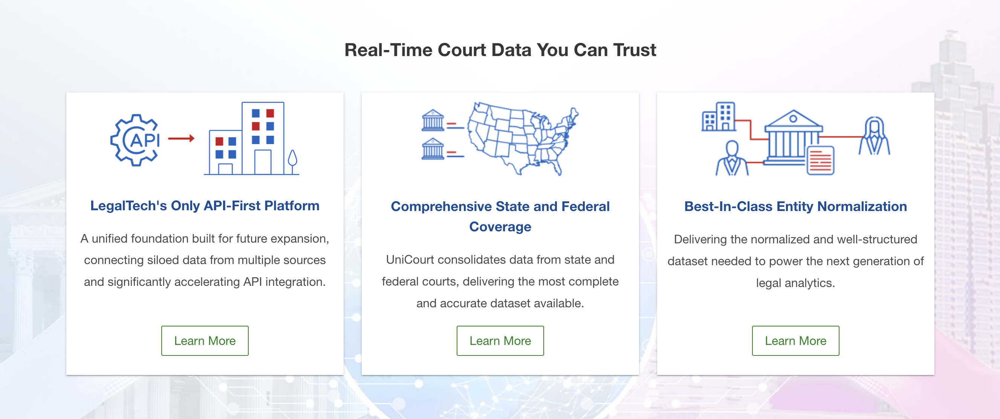

<div align="left">

[](https://unicourt.com)

# [Unicourt](https://unicourt.com)<a id="unicourt"></a>

<button><a href="/enterpriseapi/download/UniCourt-Enterprise-API-Spec.yaml" >Download UniCourt Enterprise APIs Specification</a></button>


</div>

## Table of Contents<a id="table-of-contents"></a>

<!-- toc -->

- [Installation](#installation)
- [Getting Started](#getting-started)
- [Reference](#reference)
  * [`unicourt.attorneyAnalyticsApi.getAssociatedLawFirms`](#unicourtattorneyanalyticsapigetassociatedlawfirms)
- [Terms and Connectors](#terms-and-connectors)
- [Example Query](#example-query)
  * [`unicourt.attorneyAnalyticsApi.getJudgesAssociatedWithAttorney`](#unicourtattorneyanalyticsapigetjudgesassociatedwithattorney)
- [Terms and Connectors](#terms-and-connectors-1)
- [Example Query](#example-query-1)
  * [`unicourt.attorneyAnalyticsApi.getNormAttorneyById`](#unicourtattorneyanalyticsapigetnormattorneybyid)
  * [`unicourt.attorneyAnalyticsApi.getNormAttorneySearchResults`](#unicourtattorneyanalyticsapigetnormattorneysearchresults)
  * [All query parameters supported for this API can be found in below schema section. Schema --> NormAttorneySearchQueryObject](#all-query-parameters-supported-for-this-api-can-be-found-in-below-schema-section-schema----normattorneysearchqueryobject)
  * [`unicourt.attorneyAnalyticsApi.listAssociatedNormParties`](#unicourtattorneyanalyticsapilistassociatednormparties)
- [Terms and Connectors](#terms-and-connectors-2)
- [Example Query](#example-query-2)
  * [`unicourt.attorneyAnalyticsApi.searchAttorneyInfo`](#unicourtattorneyanalyticsapisearchattorneyinfo)
  * [This endpoint retrieves information, including the normAttorneyId, on all attorneys in our normalized attorney database which match the request parameters. All query parameters supported by this API can be found in the schema section below.](#this-endpoint-retrieves-information-including-the-normattorneyid-on-all-attorneys-in-our-normalized-attorney-database-which-match-the-request-parameters-all-query-parameters-supported-by-this-api-can-be-found-in-the-schema-section-below)
  * [`unicourt.authenticationApi.generateNewToken`](#unicourtauthenticationapigeneratenewtoken)
  * [`unicourt.authenticationApi.getAllTokenIds`](#unicourtauthenticationapigetalltokenids)
  * [`unicourt.authenticationApi.invalidateAccessToken`](#unicourtauthenticationapiinvalidateaccesstoken)
  * [`unicourt.authenticationApi.invalidateAllTokens`](#unicourtauthenticationapiinvalidatealltokens)
  * [`unicourt.callbackApi.listCallbacksWithCount`](#unicourtcallbackapilistcallbackswithcount)
  * [`unicourt.caseAnalyticsApi.getCaseCountAnalyticsByCaseClass`](#unicourtcaseanalyticsapigetcasecountanalyticsbycaseclass)
- [Terms and Connectors](#terms-and-connectors-3)
- [Example Query](#example-query-3)
  * [`unicourt.caseAnalyticsApi.getCaseCountAnalyticsByCaseFiledDate`](#unicourtcaseanalyticsapigetcasecountanalyticsbycasefileddate)
- [Terms and Connectors](#terms-and-connectors-4)
- [Example Query](#example-query-4)
  * [`unicourt.caseAnalyticsApi.getCaseCountAnalyticsByCaseTypeGroup`](#unicourtcaseanalyticsapigetcasecountanalyticsbycasetypegroup)
- [Terms and Connectors](#terms-and-connectors-5)
- [Example Query](#example-query-5)
  * [`unicourt.caseAnalyticsApi.getCaseCountAnalyticsByCourt`](#unicourtcaseanalyticsapigetcasecountanalyticsbycourt)
- [Terms and Connectors](#terms-and-connectors-6)
- [Example Query](#example-query-6)
  * [`unicourt.caseAnalyticsApi.getCaseCountAnalyticsByCourtLocation`](#unicourtcaseanalyticsapigetcasecountanalyticsbycourtlocation)
- [Terms and Connectors](#terms-and-connectors-7)
- [Example Query](#example-query-7)
  * [`unicourt.caseAnalyticsApi.getCaseCountAnalyticsByCourtSystem`](#unicourtcaseanalyticsapigetcasecountanalyticsbycourtsystem)
- [Terms and Connectors](#terms-and-connectors-8)
- [Example Query](#example-query-8)
  * [`unicourt.caseAnalyticsApi.getCaseCountAnalyticsByCourtType`](#unicourtcaseanalyticsapigetcasecountanalyticsbycourttype)
- [Terms and Connectors](#terms-and-connectors-9)
- [Example Query](#example-query-9)
  * [`unicourt.caseAnalyticsApi.getCaseCountAnalyticsByJurisdictionGeo`](#unicourtcaseanalyticsapigetcasecountanalyticsbyjurisdictiongeo)
- [Terms and Connectors](#terms-and-connectors-10)
- [Example Query](#example-query-10)
  * [`unicourt.caseAnalyticsApi.getCaseCountAnalyticsByNormAttorney`](#unicourtcaseanalyticsapigetcasecountanalyticsbynormattorney)
- [Terms and Connectors](#terms-and-connectors-11)
- [Example Query](#example-query-11)
  * [`unicourt.caseAnalyticsApi.getCaseCountAnalyticsByNormJudge`](#unicourtcaseanalyticsapigetcasecountanalyticsbynormjudge)
- [Terms and Connectors](#terms-and-connectors-12)
- [Example Query](#example-query-12)
  * [`unicourt.caseAnalyticsApi.getCaseCountAnalyticsByNormLawFirm`](#unicourtcaseanalyticsapigetcasecountanalyticsbynormlawfirm)
- [Terms and Connectors](#terms-and-connectors-13)
- [Example Query](#example-query-13)
  * [`unicourt.caseAnalyticsApi.getCaseCountAnalyticsByNormParty`](#unicourtcaseanalyticsapigetcasecountanalyticsbynormparty)
- [Terms and Connectors](#terms-and-connectors-14)
- [Example Query](#example-query-14)
  * [`unicourt.caseAnalyticsApi.getCaseCountAnalyticsByOpposingNormAttorneyForNormAttorney`](#unicourtcaseanalyticsapigetcasecountanalyticsbyopposingnormattorneyfornormattorney)
- [Terms and Connectors](#terms-and-connectors-15)
- [Example Query](#example-query-15)
  * [`unicourt.caseAnalyticsApi.getCaseCountAnalyticsByOpposingNormLawFirmForANormLawFirm`](#unicourtcaseanalyticsapigetcasecountanalyticsbyopposingnormlawfirmforanormlawfirm)
- [Terms and Connectors](#terms-and-connectors-16)
- [Example Query](#example-query-16)
  * [`unicourt.caseAnalyticsApi.getCaseCountAnalyticsByOpposingNormPartyForANormParty`](#unicourtcaseanalyticsapigetcasecountanalyticsbyopposingnormpartyforanormparty)
- [Terms and Connectors](#terms-and-connectors-17)
- [Example Query](#example-query-17)
  * [`unicourt.caseAnalyticsApi.getCaseCountAnalyticsByPartyRole`](#unicourtcaseanalyticsapigetcasecountanalyticsbypartyrole)
- [Terms and Connectors](#terms-and-connectors-18)
- [Example Query](#example-query-18)
  * [`unicourt.caseAnalyticsApi.getCaseCountAnalyticsByPartyRoleGroup`](#unicourtcaseanalyticsapigetcasecountanalyticsbypartyrolegroup)
- [Terms and Connectors](#terms-and-connectors-19)
- [Example Query](#example-query-19)
  * [`unicourt.caseAnalyticsApi.getCaseCountByAreaOfLaw`](#unicourtcaseanalyticsapigetcasecountbyareaoflaw)
- [Terms and Connectors](#terms-and-connectors-20)
- [Example Query](#example-query-20)
  * [`unicourt.caseAnalyticsApi.getCaseCountByCaseType`](#unicourtcaseanalyticsapigetcasecountbycasetype)
- [Terms and Connectors](#terms-and-connectors-21)
- [Example Query](#example-query-21)
  * [`unicourt.caseDocketApi.getAssociatedAttorneyDetails`](#unicourtcasedocketapigetassociatedattorneydetails)
  * [`unicourt.caseDocketApi.getAssociatedParties`](#unicourtcasedocketapigetassociatedparties)
  * [`unicourt.caseDocketApi.getAttorneyDetails`](#unicourtcasedocketapigetattorneydetails)
  * [`unicourt.caseDocketApi.getAttorneysByCaseId`](#unicourtcasedocketapigetattorneysbycaseid)
  * [`unicourt.caseDocketApi.getCaseInfo`](#unicourtcasedocketapigetcaseinfo)
  * [`unicourt.caseDocketApi.getCaseParties`](#unicourtcasedocketapigetcaseparties)
  * [`unicourt.caseDocketApi.getDocketEntries`](#unicourtcasedocketapigetdocketentries)
  * [`unicourt.caseDocketApi.getHearingsForCase`](#unicourtcasedocketapigethearingsforcase)
  * [`unicourt.caseDocketApi.getJudgeDetails`](#unicourtcasedocketapigetjudgedetails)
  * [`unicourt.caseDocketApi.getJudgesForCase`](#unicourtcasedocketapigetjudgesforcase)
  * [`unicourt.caseDocketApi.getPartyDetails`](#unicourtcasedocketapigetpartydetails)
  * [`unicourt.caseDocketApi.getPrimaryDocuments`](#unicourtcasedocketapigetprimarydocuments)
  * [`unicourt.caseDocketApi.getRelatedCases`](#unicourtcasedocketapigetrelatedcases)
  * [`unicourt.caseDocketApi.getSecondaryDocumentsForDocketEntries`](#unicourtcasedocketapigetsecondarydocumentsfordocketentries)
  * [`unicourt.caseDocumentsApi.addDocumentOrder`](#unicourtcasedocumentsapiadddocumentorder)
  * [`unicourt.caseDocumentsApi.getCallbackById`](#unicourtcasedocumentsapigetcallbackbyid)
  * [`unicourt.caseDocumentsApi.getDocumentDetailsByDocumentId`](#unicourtcasedocumentsapigetdocumentdetailsbydocumentid)
  * [`unicourt.caseDocumentsApi.getDocumentsForCase`](#unicourtcasedocumentsapigetdocumentsforcase)
  * [`unicourt.caseDocumentsApi.getDownloadableUrlForDocument`](#unicourtcasedocumentsapigetdownloadableurlfordocument)
  * [`unicourt.caseDocumentsApi.listDocumentOrderCallbacks`](#unicourtcasedocumentsapilistdocumentordercallbacks)
  * [`unicourt.caseExportApi.getCallbackById`](#unicourtcaseexportapigetcallbackbyid)
  * [`unicourt.caseExportApi.getCallbackListForRequestedDate`](#unicourtcaseexportapigetcallbacklistforrequesteddate)
  * [`unicourt.caseExportApi.getCaseExportByCaseId`](#unicourtcaseexportapigetcaseexportbycaseid)
  * [`unicourt.caseSearchApi.getSearchResultsByCaseSearchId`](#unicourtcasesearchapigetsearchresultsbycasesearchid)
  * [`unicourt.caseSearchApi.searchByKeywordExpressions`](#unicourtcasesearchapisearchbykeywordexpressions)
- [Allowed Connectors in Keyword Expressions](#allowed-connectors-in-keyword-expressions)
- [Fields and Connectors Searching](#fields-and-connectors-searching)
- [](#)
- [Party Sub Filter Examples](#party-sub-filter-examples)
  * [All query parameters supported for this API can be found in below schema section. Schema --> CaseSearchQueryObject](#all-query-parameters-supported-for-this-api-can-be-found-in-below-schema-section-schema-----casesearchqueryobject)
  * [`unicourt.caseTrackingApi.addCaseTrack`](#unicourtcasetrackingapiaddcasetrack)
  * [`unicourt.caseTrackingApi.getCaseTrack`](#unicourtcasetrackingapigetcasetrack)
  * [`unicourt.caseTrackingApi.getCaseTrackList`](#unicourtcasetrackingapigetcasetracklist)
  * [`unicourt.caseTrackingApi.removeCaseTrackById`](#unicourtcasetrackingapiremovecasetrackbyid)
  * [`unicourt.caseUpdateApi.addCaseUpdateForCaseId`](#unicourtcaseupdateapiaddcaseupdateforcaseid)
  * [`unicourt.caseUpdateApi.getCaseUpdates`](#unicourtcaseupdateapigetcaseupdates)
  * [`unicourt.caseUpdateApi.getCaseUpdatesByCaseId`](#unicourtcaseupdateapigetcaseupdatesbycaseid)
  * [`unicourt.courtAvailabilityApi.getCourtCoverageByCourtId`](#unicourtcourtavailabilityapigetcourtcoveragebycourtid)
  * [`unicourt.courtStandardsApi.associatedCourtForJurisdictionGeo`](#unicourtcourtstandardsapiassociatedcourtforjurisdictiongeo)
  * [`unicourt.courtStandardsApi.getAdditionalChargeInfo`](#unicourtcourtstandardsapigetadditionalchargeinfo)
- [Logical Operators](#logical-operators)
  * [All Filter Query parameters supported for this API can be found in below schema section. Schema --> ChargeAdditionalDataQueryObject](#all-filter-query-parameters-supported-for-this-api-can-be-found-in-below-schema-section-schema----chargeadditionaldataqueryobject)
  * [`unicourt.courtStandardsApi.getAppealCourtsForCourt`](#unicourtcourtstandardsapigetappealcourtsforcourt)
  * [`unicourt.courtStandardsApi.getAreaOfLaw`](#unicourtcourtstandardsapigetareaoflaw)
  * [`unicourt.courtStandardsApi.getAttorneyRepType`](#unicourtcourtstandardsapigetattorneyreptype)
- [Logical Operators](#logical-operators-1)
  * [All Filter Query parameters supported for this API can be found in below Schema section. Schema --> AttorneyRepresentationTypeQueryObject](#all-filter-query-parameters-supported-for-this-api-can-be-found-in-below-schema-section-schema----attorneyrepresentationtypequeryobject)
  * [`unicourt.courtStandardsApi.getAttorneyRepType_0`](#unicourtcourtstandardsapigetattorneyreptype_0)
  * [`unicourt.courtStandardsApi.getAttorneyTypeObject`](#unicourtcourtstandardsapigetattorneytypeobject)
  * [`unicourt.courtStandardsApi.getAttorneyTypeUsingKeywordExpression`](#unicourtcourtstandardsapigetattorneytypeusingkeywordexpression)
- [Logical Operators](#logical-operators-2)
  * [All Filter Query parameters supported for this API can be found in below Schema section. Schema --> AttorneyTypeQueryObject](#all-filter-query-parameters-supported-for-this-api-can-be-found-in-below-schema-section-schema----attorneytypequeryobject)
  * [`unicourt.courtStandardsApi.getCaseClassById`](#unicourtcourtstandardsapigetcaseclassbyid)
  * [`unicourt.courtStandardsApi.getCaseClassByKeyword`](#unicourtcourtstandardsapigetcaseclassbykeyword)
- [Logical Operators](#logical-operators-3)
  * [All Filter Query parameters supported for this API can be found in below schema section. Schema --> CaseClassQueryObject](#all-filter-query-parameters-supported-for-this-api-can-be-found-in-below-schema-section-schema----caseclassqueryobject)
  * [`unicourt.courtStandardsApi.getCaseRelationshipTypeById`](#unicourtcourtstandardsapigetcaserelationshiptypebyid)
  * [`unicourt.courtStandardsApi.getCaseRelationshipTypes`](#unicourtcourtstandardsapigetcaserelationshiptypes)
- [Logical Operators](#logical-operators-4)
  * [All Filter Query parameters supported for this API can be found in below schema section. Schema --> CaseRelationshipTypeQueryObject](#all-filter-query-parameters-supported-for-this-api-can-be-found-in-below-schema-section-schema----caserelationshiptypequeryobject)
  * [`unicourt.courtStandardsApi.getCaseStatusById`](#unicourtcourtstandardsapigetcasestatusbyid)
  * [`unicourt.courtStandardsApi.getCaseStatusByKeyword`](#unicourtcourtstandardsapigetcasestatusbykeyword)
- [Logical Operators](#logical-operators-5)
  * [All Filter Query parameters supported for this API can be found in below Schema section. Schema --> CaseStatusQueryObject](#all-filter-query-parameters-supported-for-this-api-can-be-found-in-below-schema-section-schema----casestatusqueryobject)
  * [`unicourt.courtStandardsApi.getCaseStatusGroup`](#unicourtcourtstandardsapigetcasestatusgroup)
  * [`unicourt.courtStandardsApi.getCaseStatusGroupUsingKeywordExpression`](#unicourtcourtstandardsapigetcasestatusgroupusingkeywordexpression)
- [Logical Operators](#logical-operators-6)
  * [All Filter Query parameters supported for this API can be found in below schema section. Schema --> CaseStatusGroupQueryObject](#all-filter-query-parameters-supported-for-this-api-can-be-found-in-below-schema-section-schema----casestatusgroupqueryobject)
  * [`unicourt.courtStandardsApi.getCaseType`](#unicourtcourtstandardsapigetcasetype)
  * [`unicourt.courtStandardsApi.getCaseTypeGroup`](#unicourtcourtstandardsapigetcasetypegroup)
  * [`unicourt.courtStandardsApi.getCaseTypesByKeyword`](#unicourtcourtstandardsapigetcasetypesbykeyword)
- [Logical Operators](#logical-operators-7)
  * [All Filter Query parameters supported for this API can be found in below schema section. Schema --> CaseTypeQueryObject](#all-filter-query-parameters-supported-for-this-api-can-be-found-in-below-schema-section-schema----casetypequeryobject)
  * [`unicourt.courtStandardsApi.getCauseOfAction`](#unicourtcourtstandardsapigetcauseofaction)
  * [`unicourt.courtStandardsApi.getCauseOfActionAdditionalData`](#unicourtcourtstandardsapigetcauseofactionadditionaldata)
- [Logical Operators](#logical-operators-8)
  * [All Filter Query parameters supported for this API can be found in below schema section. Schema --> CauseOfActionAdditionalDataQueryObject](#all-filter-query-parameters-supported-for-this-api-can-be-found-in-below-schema-section-schema----causeofactionadditionaldataqueryobject)
  * [`unicourt.courtStandardsApi.getCauseOfActionAdditionalData_0`](#unicourtcourtstandardsapigetcauseofactionadditionaldata_0)
  * [`unicourt.courtStandardsApi.getCauseOfActionByKeyword`](#unicourtcourtstandardsapigetcauseofactionbykeyword)
- [Logical Operators](#logical-operators-9)
  * [All Filter Query parameters supported for this API can be found in below schema section. Schema --> CauseOfActionQueryObject](#all-filter-query-parameters-supported-for-this-api-can-be-found-in-below-schema-section-schema----causeofactionqueryobject)
  * [`unicourt.courtStandardsApi.getCauseOfActionGroup`](#unicourtcourtstandardsapigetcauseofactiongroup)
- [Logical Operators](#logical-operators-10)
  * [All Filter Query parameters supported for this API can be found in below schema section. Schema --> CauseOfActionGroupQueryObject](#all-filter-query-parameters-supported-for-this-api-can-be-found-in-below-schema-section-schema----causeofactiongroupqueryobject)
  * [`unicourt.courtStandardsApi.getCauseOfActionGroup_0`](#unicourtcourtstandardsapigetcauseofactiongroup_0)
  * [`unicourt.courtStandardsApi.getChargeAdditionalData`](#unicourtcourtstandardsapigetchargeadditionaldata)
  * [`unicourt.courtStandardsApi.getChargeById`](#unicourtcourtstandardsapigetchargebyid)
  * [`unicourt.courtStandardsApi.getChargeDegreeById`](#unicourtcourtstandardsapigetchargedegreebyid)
  * [`unicourt.courtStandardsApi.getChargeDegreeUsingKeywordExpression`](#unicourtcourtstandardsapigetchargedegreeusingkeywordexpression)
- [Logical Operators](#logical-operators-11)
  * [All Filter Query parameters supported for this API can be found in below schema section. Schema --> ChargeDegreeQueryObject](#all-filter-query-parameters-supported-for-this-api-can-be-found-in-below-schema-section-schema----chargedegreequeryobject)
  * [`unicourt.courtStandardsApi.getChargeGroup`](#unicourtcourtstandardsapigetchargegroup)
  * [`unicourt.courtStandardsApi.getChargeGroupsByKeyword`](#unicourtcourtstandardsapigetchargegroupsbykeyword)
- [Logical Operators](#logical-operators-12)
  * [All Filter Query parameters supported for this API can be found in below schema section. Schema --> ChargeGroupQueryObject](#all-filter-query-parameters-supported-for-this-api-can-be-found-in-below-schema-section-schema----chargegroupqueryobject)
  * [`unicourt.courtStandardsApi.getChargeSeverity`](#unicourtcourtstandardsapigetchargeseverity)
  * [`unicourt.courtStandardsApi.getChargeSeverityByKeyword`](#unicourtcourtstandardsapigetchargeseveritybykeyword)
- [Logical Operators](#logical-operators-13)
  * [All Filter Query parameters supported for this API can be found in below schema section. Schema --> ChargeSeverityQueryObject](#all-filter-query-parameters-supported-for-this-api-can-be-found-in-below-schema-section-schema----chargeseverityqueryobject)
  * [`unicourt.courtStandardsApi.getChargesUsingKeyword`](#unicourtcourtstandardsapigetchargesusingkeyword)
- [Logical Operators](#logical-operators-14)
  * [All Filter Query parameters supported for this API can be found in below schema section. Schema --> ChargeQueryObject](#all-filter-query-parameters-supported-for-this-api-can-be-found-in-below-schema-section-schema----chargequeryobject)
  * [`unicourt.courtStandardsApi.getCourtLocation`](#unicourtcourtstandardsapigetcourtlocation)
- [Logical Operators](#logical-operators-15)
  * [All Filter Query parameters supported for this API can be found in below schema section. Schema --> CourtLocationQueryObject](#all-filter-query-parameters-supported-for-this-api-can-be-found-in-below-schema-section-schema----courtlocationqueryobject)
  * [`unicourt.courtStandardsApi.getCourtLocationObject`](#unicourtcourtstandardsapigetcourtlocationobject)
  * [`unicourt.courtStandardsApi.getCourtLocations`](#unicourtcourtstandardsapigetcourtlocations)
  * [`unicourt.courtStandardsApi.getCourtObject`](#unicourtcourtstandardsapigetcourtobject)
  * [`unicourt.courtStandardsApi.getCourtServiceStatus`](#unicourtcourtstandardsapigetcourtservicestatus)
- [Logical Operators](#logical-operators-16)
  * [All Filter Query parameters supported for this API can be found in below schema section. Schema --> CourtServiceStatusQueryObject](#all-filter-query-parameters-supported-for-this-api-can-be-found-in-below-schema-section-schema----courtservicestatusqueryobject)
  * [`unicourt.courtStandardsApi.getCourtServiceStatusById`](#unicourtcourtstandardsapigetcourtservicestatusbyid)
  * [`unicourt.courtStandardsApi.getCourtSystem`](#unicourtcourtstandardsapigetcourtsystem)
  * [`unicourt.courtStandardsApi.getCourtTypeObject`](#unicourtcourtstandardsapigetcourttypeobject)
  * [`unicourt.courtStandardsApi.getCourtTypes`](#unicourtcourtstandardsapigetcourttypes)
- [Logical Operators](#logical-operators-17)
  * [All Filter Query parameters supported for this API can be found in below schema section. Schema --> CourtTypeQueryObject](#all-filter-query-parameters-supported-for-this-api-can-be-found-in-below-schema-section-schema----courttypequeryobject)
  * [`unicourt.courtStandardsApi.getCourts`](#unicourtcourtstandardsapigetcourts)
- [Logical Operators](#logical-operators-18)
  * [All Filter Query parameters supported for this API can be found in below schema section. Schema --> CourtQueryObject](#all-filter-query-parameters-supported-for-this-api-can-be-found-in-below-schema-section-schema----courtqueryobject)
  * [`unicourt.courtStandardsApi.getCourtsByLocation`](#unicourtcourtstandardsapigetcourtsbylocation)
  * [`unicourt.courtStandardsApi.getJudgeTypeObject`](#unicourtcourtstandardsapigetjudgetypeobject)
- [Logical Operators](#logical-operators-19)
  * [All Filter Query parameters supported for this API can be found in below schema section. Schema --> JudgeTypeQueryObject](#all-filter-query-parameters-supported-for-this-api-can-be-found-in-below-schema-section-schema----judgetypequeryobject)
  * [`unicourt.courtStandardsApi.getJudgeTypeObjectById`](#unicourtcourtstandardsapigetjudgetypeobjectbyid)
  * [`unicourt.courtStandardsApi.getJurisdictionGeo`](#unicourtcourtstandardsapigetjurisdictiongeo)
  * [`unicourt.courtStandardsApi.getJurisdictionGeoForCourt`](#unicourtcourtstandardsapigetjurisdictiongeoforcourt)
- [Logical Operators](#logical-operators-20)
  * [All Filter Query parameters supported for this API can be found in below schema section. Schema --> JurisdictionGeoQueryObject](#all-filter-query-parameters-supported-for-this-api-can-be-found-in-below-schema-section-schema----jurisdictiongeoqueryobject)
  * [`unicourt.courtStandardsApi.getJurisdictionGeoObjectsForCourt`](#unicourtcourtstandardsapigetjurisdictiongeoobjectsforcourt)
  * [`unicourt.courtStandardsApi.getPartyRole`](#unicourtcourtstandardsapigetpartyrole)
  * [`unicourt.courtStandardsApi.getPartyRoleGroup`](#unicourtcourtstandardsapigetpartyrolegroup)
  * [`unicourt.courtStandardsApi.getPartyRoleGroups`](#unicourtcourtstandardsapigetpartyrolegroups)
- [Logical Operators](#logical-operators-21)
  * [All Filter Query parameters supported for this API can be found in below schema section. Schema --> PartyRoleGroupQueryObject](#all-filter-query-parameters-supported-for-this-api-can-be-found-in-below-schema-section-schema----partyrolegroupqueryobject)
  * [`unicourt.courtStandardsApi.getPartyRolesByKeyword`](#unicourtcourtstandardsapigetpartyrolesbykeyword)
- [Logical Operators](#logical-operators-22)
  * [All Filter Query parameters supported for this API can be found in below schema section. Schema --> PartyRoleQueryObject](#all-filter-query-parameters-supported-for-this-api-can-be-found-in-below-schema-section-schema----partyrolequeryobject)
  * [`unicourt.courtStandardsApi.listAreaOfLaw`](#unicourtcourtstandardsapilistareaoflaw)
- [Logical Operators](#logical-operators-23)
  * [All Filter Query parameters supported for this API can be found in below schema section. Schema --> AreaOfLawQueryObject](#all-filter-query-parameters-supported-for-this-api-can-be-found-in-below-schema-section-schema----areaoflawqueryobject)
  * [`unicourt.courtStandardsApi.listCaseTypeGroups`](#unicourtcourtstandardsapilistcasetypegroups)
- [Logical Operators](#logical-operators-24)
  * [All Filter Query parameters supported for this API can be found in below schema section. Schema --> CaseTypeGroupQueryObject](#all-filter-query-parameters-supported-for-this-api-can-be-found-in-below-schema-section-schema----casetypegroupqueryobject)
  * [`unicourt.courtStandardsApi.listCourtSystems`](#unicourtcourtstandardsapilistcourtsystems)
- [Logical Operators](#logical-operators-25)
  * [All Filter Query parameters supported for this API can be found in below schema section. Schema --> CourtSystemQueryObject](#all-filter-query-parameters-supported-for-this-api-can-be-found-in-below-schema-section-schema----courtsystemqueryobject)
  * [`unicourt.judgeAnalyticsApi.getAssociatedNormParties`](#unicourtjudgeanalyticsapigetassociatednormparties)
- [Terms and Connectors](#terms-and-connectors-22)
- [Example Query](#example-query-22)
  * [`unicourt.judgeAnalyticsApi.getNormJudgeDetails`](#unicourtjudgeanalyticsapigetnormjudgedetails)
  * [`unicourt.judgeAnalyticsApi.getNormJudgeSearchResultsById`](#unicourtjudgeanalyticsapigetnormjudgesearchresultsbyid)
  * [All query parameters supported for this API can be found in below schema section. Schema --> NormJudgeSearchQueryObject](#all-query-parameters-supported-for-this-api-can-be-found-in-below-schema-section-schema----normjudgesearchqueryobject)
  * [`unicourt.judgeAnalyticsApi.listAssociatedNormAttorneys`](#unicourtjudgeanalyticsapilistassociatednormattorneys)
- [Terms and Connectors](#terms-and-connectors-23)
- [Example Query](#example-query-23)
  * [`unicourt.judgeAnalyticsApi.listLawFirmsAssociatedWithJudge`](#unicourtjudgeanalyticsapilistlawfirmsassociatedwithjudge)
- [Terms and Connectors](#terms-and-connectors-24)
- [Example Query](#example-query-24)
  * [`unicourt.judgeAnalyticsApi.searchNormJudges`](#unicourtjudgeanalyticsapisearchnormjudges)
  * [All query parameters supported for this API can be found in below schema section. Schema --> NormJudgeSearchQueryObject](#all-query-parameters-supported-for-this-api-can-be-found-in-below-schema-section-schema----normjudgesearchqueryobject-1)
  * [`unicourt.lawFirmAnalyticsApi.getAssociatedNormJudges`](#unicourtlawfirmanalyticsapigetassociatednormjudges)
- [Terms and Connectors](#terms-and-connectors-25)
- [Example Query](#example-query-25)
  * [`unicourt.lawFirmAnalyticsApi.getNormLawFirmById`](#unicourtlawfirmanalyticsapigetnormlawfirmbyid)
  * [`unicourt.lawFirmAnalyticsApi.getNormLawFirmSearchResultById`](#unicourtlawfirmanalyticsapigetnormlawfirmsearchresultbyid)
  * [All query parameters supported for this API can be found in below schema section. Schema --> NormLawFirmSearchQueryObject](#all-query-parameters-supported-for-this-api-can-be-found-in-below-schema-section-schema----normlawfirmsearchqueryobject)
  * [`unicourt.lawFirmAnalyticsApi.listAssociatedNormAttorneys`](#unicourtlawfirmanalyticsapilistassociatednormattorneys)
- [Terms and Connectors](#terms-and-connectors-26)
- [Example Query](#example-query-26)
  * [`unicourt.lawFirmAnalyticsApi.listAssociatedNormParties`](#unicourtlawfirmanalyticsapilistassociatednormparties)
- [Terms and Connectors](#terms-and-connectors-27)
- [Example Query](#example-query-27)
  * [`unicourt.lawFirmAnalyticsApi.searchLawFirms`](#unicourtlawfirmanalyticsapisearchlawfirms)
  * [All query parameters supported for this API can be found in below schema section. Schema --> NormLawFirmSearchQueryObject](#all-query-parameters-supported-for-this-api-can-be-found-in-below-schema-section-schema----normlawfirmsearchqueryobject-1)
  * [`unicourt.pacerApi.importPacerCaseByCourtUsingCaseNumberGet`](#unicourtpacerapiimportpacercasebycourtusingcasenumberget)
  * [`unicourt.pacerApi.searchAllCourtsCases`](#unicourtpacerapisearchallcourtscases)
  * [`unicourt.pacerApi.searchAllCourtsCases_0`](#unicourtpacerapisearchallcourtscases_0)
  * [`unicourt.pacerApi.searchAppealCourtsCases`](#unicourtpacerapisearchappealcourtscases)
  * [`unicourt.pacerApi.searchAppealCourtsCases_0`](#unicourtpacerapisearchappealcourtscases_0)
  * [`unicourt.pacerApi.searchBankruptcyCases`](#unicourtpacerapisearchbankruptcycases)
  * [`unicourt.pacerApi.searchBankruptcyCourts`](#unicourtpacerapisearchbankruptcycourts)
  * [`unicourt.pacerApi.searchCivilCases`](#unicourtpacerapisearchcivilcases)
  * [`unicourt.pacerApi.searchCivilCasesInCourts`](#unicourtpacerapisearchcivilcasesincourts)
  * [`unicourt.pacerApi.searchCriminalCases`](#unicourtpacerapisearchcriminalcases)
  * [`unicourt.pacerApi.searchCriminalCases_0`](#unicourtpacerapisearchcriminalcases_0)
  * [`unicourt.pacerApi.searchMultiDistrictCourtCases`](#unicourtpacerapisearchmultidistrictcourtcases)
  * [`unicourt.pacerApi.searchMultiDistrictCourtCases_0`](#unicourtpacerapisearchmultidistrictcourtcases_0)
  * [`unicourt.pacerCredentialApi.getPacerCredential`](#unicourtpacercredentialapigetpacercredential)
  * [`unicourt.pacerCredentialApi.listPacerCredentials`](#unicourtpacercredentialapilistpacercredentials)
  * [`unicourt.pacerCredentialApi.registerPacerCredential`](#unicourtpacercredentialapiregisterpacercredential)
  * [`unicourt.pacerCredentialApi.removeForUserId`](#unicourtpacercredentialapiremoveforuserid)
  * [`unicourt.partyAnalyticsApi.getAssociatedNormAttorneys`](#unicourtpartyanalyticsapigetassociatednormattorneys)
- [Terms and Connectors](#terms-and-connectors-28)
- [Example Query](#example-query-28)
  * [`unicourt.partyAnalyticsApi.getNormPartyDetails`](#unicourtpartyanalyticsapigetnormpartydetails)
  * [`unicourt.partyAnalyticsApi.getNormPartySearchResultsById`](#unicourtpartyanalyticsapigetnormpartysearchresultsbyid)
  * [All query parameters supported for this API can be found in below schema section. Schema --> NormPartySearchQueryObject](#all-query-parameters-supported-for-this-api-can-be-found-in-below-schema-section-schema----normpartysearchqueryobject)
  * [`unicourt.partyAnalyticsApi.listAssociatedNormLawFirms`](#unicourtpartyanalyticsapilistassociatednormlawfirms)
- [Terms and Connectors](#terms-and-connectors-29)
- [Example Query](#example-query-29)
  * [`unicourt.partyAnalyticsApi.listJudgesAssociatedWithNormParty`](#unicourtpartyanalyticsapilistjudgesassociatedwithnormparty)
- [Terms and Connectors](#terms-and-connectors-30)
- [Example Query](#example-query-30)
  * [`unicourt.partyAnalyticsApi.searchNormParties`](#unicourtpartyanalyticsapisearchnormparties)
  * [All query parameters supported for this API can be found in below schema section. Schema --> NormPartySearchQueryObject](#all-query-parameters-supported-for-this-api-can-be-found-in-below-schema-section-schema----normpartysearchqueryobject-1)
  * [`unicourt.usageApi.getApiUsageByBillingCycle`](#unicourtusageapigetapiusagebybillingcycle)
  * [`unicourt.usageApi.getApiUsageByDate`](#unicourtusageapigetapiusagebydate)
  * [`unicourt.usageApi.listPreviousBillingCycles`](#unicourtusageapilistpreviousbillingcycles)

<!-- tocstop -->

## Installation<a id="installation"></a>
<div align="center">
  <a href="https://konfigthis.com/sdk-sign-up?company=UniCourt&language=TypeScript">
    
  </a>
</div>

## Getting Started<a id="getting-started"></a>

```typescript
import { UniCourt } from "unicourt-typescript-sdk";

const unicourt = new UniCourt({
  // Defining the base path is optional and defaults to https://enterpriseapi.unicourt.com
  // basePath: "https://enterpriseapi.unicourt.com",
  accessToken: "ACCESS_TOKEN",
});

const getAssociatedLawFirmsResponse =
  await unicourt.attorneyAnalyticsApi.getAssociatedLawFirms({
    pageNumber: 1,
  });

console.log(getAssociatedLawFirmsResponse);
```

## Reference<a id="reference"></a>


### `unicourt.attorneyAnalyticsApi.getAssociatedLawFirms`<a id="unicourtattorneyanalyticsapigetassociatedlawfirms"></a>

Returns a list of Law Firms the norm Attorney has worked for.
## Terms and Connectors<a id="terms-and-connectors"></a>
| Connector | Schema   | Description  | Example |
| ------| ------| ------|------|
| **AND** ||Find analytics containing all connected terms. The word AND does not have to be capitalized.|**courtId:"CORTV4vCEaKrhystBz"  AND  courtLocationId:"COLO6b82CkRqS846hx"**|
| **IN()** || Allows you to specify multiple values, for a limit of up to 10.| **courtId IN ("CORTV4vCEaKrhystBz", "CORTKQiA4LJuv54tEj")**|
| **courtId** | Multiple Ids Allowed |Find Analytics for a particular Court Object. | **courtId:"CORTV4vCEaKrhystBz"** |
| **courtSystemId** | Multiple Ids Allowed  |Find Analytics for a particular Court System Object. | **courtSystemId:"COSYACHBdMewtaG5DY"** |
| **courtTypeId** | Multiple Ids Allowed  |Find Analytics for a particular Court Type Object. | **courtTypeId:"COTPm8jjc2PAydpFhq"** |
| **courtLocationId** | Multiple Ids Allowed  |Find Analytics for a particular Court Location Object. | **courtLocationId:"COLO6b82CkRqS846hx"** |
| **caseTypeId** | Multiple Ids Allowed  |Find Analytics for a particular Case Type Object. | **caseTypeId:"CTYPATMYyaJekdgj2c"** |
| **caseTypeGroupId** | Multiple Ids Allowed  |Find Analytics for a particular Case Type Group Object. | **caseTypeGroupId:"CTYG8gZ6hPRKhhYi4Y"** |
| **areaOfLawId** | Multiple Ids Allowed  |Find Analytics for a particular Area Of Law Object. | **areaOfLawId:"AOFL2UxEWfVmTPMyqf"** |
| **caseClassId** | Multiple Ids Allowed  |Find Analytics for a particular Case Class Category Object. | **caseClassId:"CSCLNjbKTN7Yfo2wdb"** |
| **partyRoleId** | Multiple Ids Allowed  |Find Analytics for a particular Party Type Object. | **partyRoleId:"PTYRiP8nMgPxBsPc5i"** |
| **partyRoleGroupId** | Multiple Ids Allowed  |Find Analytics for a particular Party Type Group Object. | **partyRoleGroupId:"PTYGBnjxbx6tKNfVEP"** |
| **attorneyPartyRoleId** | Multiple Ids Allowed  |Find Analytics for a particular Attorney Party Type Object. | **attorneyPartyRoleId:"PTYRiP8nMgPxBsPc5i"** |
| **attorneyPartyRoleGroupId** | Multiple Ids Allowed  |Find Analytics for a particular Attorney Party Type Group Object. | **attorneyPartyRoleGroupId:"PTYGBnjxbx6tKNfVEP"** |
| **caseFiledDate** | Single Allowed  |Find Analytics within a particular date range. | **caseFiledDate:[2018-05-08T00:00:00+00:00TO2019-05-08T00:00:00+00:00]** |
| **JurisdictionGeo** | Multiple Ids Allowed  |Find Analytics within a particular Jurisdiction Geo. | **(JurisdictionGeo:(state:"California"))** |
| **confidenceScore** | Single Allowed |Find Analytics for a given ConfidenceScore  | **confidenceScore:[0.5 TO \*]** |
| **bestMatch** | Single Allowed |True if the normEntity has the highest Confidence Score of all possible normEntities | **bestMatch:true** |
<br>
## Example Query<a id="example-query"></a>
Query to get all LawFirms associated with attorney with norm id NATYfwmXwRHS279WPY of all cases with case type id CTYPATMYyaJekdgj2c and  case filed date between Jan 1st, 2017 to Nov 30th,2021<br>
q=caseTypeId:"CTYPATMYyaJekdgj2c" AND caseFiledDate:[2017-01-01T00:00:00+00:00TO2021-11-30T00:00:00+00:00]
<br><br>


#### 🛠️ Usage<a id="🛠️-usage"></a>

```typescript
const getAssociatedLawFirmsResponse =
  await unicourt.attorneyAnalyticsApi.getAssociatedLawFirms({
    pageNumber: 1,
  });
```

#### ⚙️ Parameters<a id="⚙️-parameters"></a>

##### normAttorneyId: `string`<a id="normattorneyid-string"></a>

Norm ID of Attorney.    - minimum: 18   - maximum: 18 

##### pageNumber: `number`<a id="pagenumber-number"></a>

Page number. - minimum: 1 

##### q: `string`<a id="q-string"></a>

The URL encoded query you are searching for. The query can be as simple as a keyword, but supports many additional options and filters. All options are documented above.

#### 🔄 Return<a id="🔄-return"></a>

[AssociatedNormLawFirmResponse](./models/associated-norm-law-firm-response.ts)

#### 🌐 Endpoint<a id="🌐-endpoint"></a>

`/normAttorney/{normAttorneyId}/associatedNormLawFirms` `GET`

[🔙 **Back to Table of Contents**](#table-of-contents)

---


### `unicourt.attorneyAnalyticsApi.getJudgesAssociatedWithAttorney`<a id="unicourtattorneyanalyticsapigetjudgesassociatedwithattorney"></a>

This endpoint returns information on all judges which have appeared in cases with the attorney specified by the normAttorneyId. The returned judges are ordered in descending order of number of cases shared with the relevant attorney.
## Terms and Connectors<a id="terms-and-connectors"></a>
| Connector | Schema   | Description  | Example |
| ------| ------| ------|------|
| **AND** ||Find analytics containing all connected terms. The word AND does not have to be capitalized.|**courtId:"CORTV4vCEaKrhystBz"  AND  courtLocationId:"COLO6b82CkRqS846hx"**|
| **IN()** || Allows you to specify multiple values, for a limit of up to 10.| **courtId IN ("CORTV4vCEaKrhystBz", "CORTKQiA4LJuv54tEj")**|
| **courtId** | Multiple Ids Allowed |Find Analytics for a particular Court Object. | **courtId:"CORTV4vCEaKrhystBz"** |
| **courtSystemId** | Multiple Ids Allowed  |Find Analytics for a particular Court System Object. | **courtSystemId:"COSYACHBdMewtaG5DY"** |
| **courtTypeId** | Multiple Ids Allowed |Find Analytics for a particular Court Type Object. | **courtTypeId:"COTPm8jjc2PAydpFhq"** |
| **courtLocationId** | Multiple Ids Allowed  |Find Analytics for a particular Court Location Object. | **courtLocationId:"COLO6b82CkRqS846hx"** |
| **caseTypeId** | Multiple Ids Allowed  |Find Analytics for a particular Case Type Object. | **caseTypeId:"CTYPATMYyaJekdgj2c"** |
| **caseTypeGroupId** | Multiple Ids Allowed  |Find Analytics for a particular Case Type Group Object. | **caseTypeGroupId:"CTYG8gZ6hPRKhhYi4Y"** |
| **areaOfLawId** | Multiple Ids Allowed  |Find Analytics for a particular Area Of Law Object. | **areaOfLawId:"AOFL2UxEWfVmTPMyqf"** |
| **caseClassId** | Multiple Ids Allowed  |Find Analytics for a particular Case Class Category Object. | **caseClassId:"CSCLNjbKTN7Yfo2wdb"** |
| **caseFiledDate** | Single Allowed |Find Analytics within a particular date range. | **caseFiledDate:[2018-05-08T00:00:00+00:00TO2019-05-08T00:00:00+00:00]** |
| **JurisdictionGeo** | Multiple filters Allowed |Find Analytics within a particular Jurisdiction Geo. | **(JurisdictionGeo:(state:"California"))** |
| **confidenceScore** | Single Allowed |Find Analytics for a given ConfidenceScore  | **confidenceScore:[0.5 TO \*]** |
| **bestMatch** | Single Allowed |True if the normEntity has the highest Confidence Score of all possible normEntities | **bestMatch:true** |
<br>
## Example Query<a id="example-query"></a>
Query to get all judges associated with attorney with norm id NATYfwmXwRHS279WPY of all cases with case type id CTYPATMYyaJekdgj2c and  case filed date between Jan 1st, 2017 to Nov 30th,2021<br>
q=caseTypeId:"CTYPATMYyaJekdgj2c" AND caseFiledDate:[2017-01-01T00:00:00+00:00TO2021-11-30T00:00:00+00:00]
<br><br>


#### 🛠️ Usage<a id="🛠️-usage"></a>

```typescript
const getJudgesAssociatedWithAttorneyResponse =
  await unicourt.attorneyAnalyticsApi.getJudgesAssociatedWithAttorney({
    pageNumber: 1,
  });
```

#### ⚙️ Parameters<a id="⚙️-parameters"></a>

##### normAttorneyId: `string`<a id="normattorneyid-string"></a>

Norm ID of Attorney.    - minimum: 18   - maximum: 18 

##### pageNumber: `number`<a id="pagenumber-number"></a>

Page number. - minimum: 1 

##### q: `string`<a id="q-string"></a>

The URL encoded query you are searching for. The query can be as simple as a keyword, but supports many additional options and filters. All options are documented above.

#### 🔄 Return<a id="🔄-return"></a>

[AssociatedNormJudgeResponse](./models/associated-norm-judge-response.ts)

#### 🌐 Endpoint<a id="🌐-endpoint"></a>

`/normAttorney/{normAttorneyId}/associatedNormJudges` `GET`

[🔙 **Back to Table of Contents**](#table-of-contents)

---


### `unicourt.attorneyAnalyticsApi.getNormAttorneyById`<a id="unicourtattorneyanalyticsapigetnormattorneybyid"></a>

This endpoint retrieves information on the attorney in our normalized attorney database which matches the normAttorneyId specified in the request.

#### 🛠️ Usage<a id="🛠️-usage"></a>

```typescript
const getNormAttorneyByIdResponse =
  await unicourt.attorneyAnalyticsApi.getNormAttorneyById({});
```

#### ⚙️ Parameters<a id="⚙️-parameters"></a>

##### normAttorneyId: `string`<a id="normattorneyid-string"></a>

Norm ID of Attorney.    - minimum: 18   - maximum: 18 

#### 🔄 Return<a id="🔄-return"></a>

[NormAttorney](./models/norm-attorney.ts)

#### 🌐 Endpoint<a id="🌐-endpoint"></a>

`/normAttorney/{normAttorneyId}` `GET`

[🔙 **Back to Table of Contents**](#table-of-contents)

---


### `unicourt.attorneyAnalyticsApi.getNormAttorneySearchResults`<a id="unicourtattorneyanalyticsapigetnormattorneysearchresults"></a>

### All query parameters supported for this API can be found in below schema section. Schema --> NormAttorneySearchQueryObject<a id="all-query-parameters-supported-for-this-api-can-be-found-in-below-schema-section-schema----normattorneysearchqueryobject"></a>


#### 🛠️ Usage<a id="🛠️-usage"></a>

```typescript
const getNormAttorneySearchResultsResponse =
  await unicourt.attorneyAnalyticsApi.getNormAttorneySearchResults({
    pageNumber: 1,
  });
```

#### ⚙️ Parameters<a id="⚙️-parameters"></a>

##### normAttorneySearchId: `string`<a id="normattorneysearchid-string"></a>

Norm Attorney Search information for the given normAttorneySearchId.

##### pageNumber: `number`<a id="pagenumber-number"></a>

Query parameter specifying the page number of the search results to be retrieved. - Minimum: 1 - Maximum: 1000 

#### 🔄 Return<a id="🔄-return"></a>

[NormAttorneySearchResponse](./models/norm-attorney-search-response.ts)

#### 🌐 Endpoint<a id="🌐-endpoint"></a>

`/normAttorneySearch/{normAttorneySearchId}` `GET`

[🔙 **Back to Table of Contents**](#table-of-contents)

---


### `unicourt.attorneyAnalyticsApi.listAssociatedNormParties`<a id="unicourtattorneyanalyticsapilistassociatednormparties"></a>

Returns a list of Parties the Attorney has represented.
<br><br>
## Terms and Connectors<a id="terms-and-connectors"></a>
| Connector | Schema   | Description  | Example |
| ------| ------| ------|------|
| **AND** ||Find analytics containing all connected terms. The word AND does not have to be capitalized.|**courtId:"CORTV4vCEaKrhystBz"  AND  courtLocationId:"COLO6b82CkRqS846hx"**|
| **IN()** || Allows you to specify multiple values, for a limit of up to 10.| **courtId IN ("CORTV4vCEaKrhystBz", "CORTKQiA4LJuv54tEj")**|
| **courtId** | Multiple Ids Allowed  |Find Analytics for a particular Court Object. | **courtId:"CORTV4vCEaKrhystBz"** |
| **courtSystemId** | Multiple Ids Allowed  |Find Analytics for a particular Court System Object. | **courtSystemId:"COSYACHBdMewtaG5DY"** |
| **courtTypeId** | Multiple Ids Allowed  |Find Analytics for a particular Court Type Object. | **courtTypeId:"COTPm8jjc2PAydpFhq"** |
| **courtLocationId** | Multiple Ids Allowed  |Find Analytics for a particular Court Location Object. | **courtLocationId:"COLO6b82CkRqS846hx"** |
| **caseTypeId** | Multiple Ids Allowed  |Find Analytics for a particular Case Type Object. | **caseTypeId:"CTYPATMYyaJekdgj2c"** |
| **caseTypeGroupId** | Multiple Ids Allowed  |Find Analytics for a particular Case Type Group Object. | **caseTypeGroupId:"CTYG8gZ6hPRKhhYi4Y"** |
| **areaOfLawId** | Multiple Ids Allowed  |Find Analytics for a particular Area Of Law Object. | **areaOfLawId:"AOFL2UxEWfVmTPMyqf"** |
| **caseClassId** | Multiple Ids Allowed  |Find Analytics for a particular Case Class Category Object. | **caseClassId:"CSCLNjbKTN7Yfo2wdb"** |
| **partyRoleId** | Multiple Ids Allowed  |Find Analytics for a particular Party Type Object. | **partyRoleId:"PTYRiP8nMgPxBsPc5i"** |
| **partyRoleGroupId** | Multiple Ids Allowed  |Find Analytics for a particular Party Type Group Object. | **partyRoleGroupId:"PTYGBnjxbx6tKNfVEP"** |
| **attorneyPartyRoleId** | Multiple Ids Allowed  |Find Analytics for a particular Attorney Party Type Object. | **attorneyPartyRoleId:"PTYRiP8nMgPxBsPc5i"** |
| **attorneyPartyRoleGroupId** | Multiple Ids Allowed  |Find Analytics for a particular Attorney Party Type Group Object.. | **attorneyPartyRoleGroupId:"PTYGBnjxbx6tKNfVEP"** |
| **caseFiledDate** | Single Allowed   |Find Analytics within a particular date range. | **caseFiledDate:[2018-05-08T00:00:00+00:00TO2019-05-08T00:00:00+00:00]** |
| **JurisdictionGeo** | Multiple Ids Allowed  |Find Analytics within a particular Jurisdiction Geo. | **(JurisdictionGeo:(state:"California"))** |
| **confidenceScore** | Single Allowed |Find Analytics for a given ConfidenceScore  | **confidenceScore:[0.5 TO \*]** |
| **bestMatch** | Single Allowed |True if the normEntity has the highest Confidence Score of all possible normEntities | **bestMatch:true** |
<br>
## Example Query<a id="example-query"></a>
Query to get all parties associated with attorney with norm id NATYfwmXwRHS279WPY of all cases with case type id CTYPATMYyaJekdgj2c and  case filed date between Jan 1st, 2017 to Nov 30th,2021<br>
q=caseTypeId:"CTYPATMYyaJekdgj2c" AND caseFiledDate:[2017-01-01T00:00:00+00:00TO2021-11-30T00:00:00+00:00]
<br><br>


#### 🛠️ Usage<a id="🛠️-usage"></a>

```typescript
const listAssociatedNormPartiesResponse =
  await unicourt.attorneyAnalyticsApi.listAssociatedNormParties({
    pageNumber: 1,
  });
```

#### ⚙️ Parameters<a id="⚙️-parameters"></a>

##### normAttorneyId: `string`<a id="normattorneyid-string"></a>

Norm ID of Attorney.    - minimum: 18   - maximum: 18 

##### pageNumber: `number`<a id="pagenumber-number"></a>

Page number. - minimum: 1 

##### q: `string`<a id="q-string"></a>

The URL encoded query you are searching for. The query can be as simple as a keyword, but supports many additional options and filters. All options are documented above.

#### 🔄 Return<a id="🔄-return"></a>

[AssociatedNormPartyResponse](./models/associated-norm-party-response.ts)

#### 🌐 Endpoint<a id="🌐-endpoint"></a>

`/normAttorney/{normAttorneyId}/associatedNormParties` `GET`

[🔙 **Back to Table of Contents**](#table-of-contents)

---


### `unicourt.attorneyAnalyticsApi.searchAttorneyInfo`<a id="unicourtattorneyanalyticsapisearchattorneyinfo"></a>

### This endpoint retrieves information, including the normAttorneyId, on all attorneys in our normalized attorney database which match the request parameters. All query parameters supported by this API can be found in the schema section below.<a id="this-endpoint-retrieves-information-including-the-normattorneyid-on-all-attorneys-in-our-normalized-attorney-database-which-match-the-request-parameters-all-query-parameters-supported-by-this-api-can-be-found-in-the-schema-section-below"></a>


#### 🛠️ Usage<a id="🛠️-usage"></a>

```typescript
const searchAttorneyInfoResponse =
  await unicourt.attorneyAnalyticsApi.searchAttorneyInfo({
    pageNumber: 1,
  });
```

#### ⚙️ Parameters<a id="⚙️-parameters"></a>

##### q: `string`<a id="q-string"></a>

The URL encoded query you are searching for. The query can be as simple as a keyword, but supports many additional options and filters.</a> 

##### pageNumber: `number`<a id="pagenumber-number"></a>

Query parameter specifying the page number of the search results to be retrieved. - Minimum: 1 - Maximum: 1000 

#### 🔄 Return<a id="🔄-return"></a>

[NormAttorneySearchResponse](./models/norm-attorney-search-response.ts)

#### 🌐 Endpoint<a id="🌐-endpoint"></a>

`/normAttorneySearch` `GET`

[🔙 **Back to Table of Contents**](#table-of-contents)

---


### `unicourt.authenticationApi.generateNewToken`<a id="unicourtauthenticationapigeneratenewtoken"></a>

This endpoint allows you to generate a new access token, which is a required field for all UniCourt API endpoints except for the Authentication API. To generate a new token, you must provide your Client ID and Client Secret ID which you can find by logging into your UniCourt account. At any time, you can have a maximum of 10 active access tokens. The tokens never expire and, if you make a request which would otherwise lead to you having more than 10 active tokens, you will receive an error message.

#### 🛠️ Usage<a id="🛠️-usage"></a>

```typescript
const generateNewTokenResponse =
  await unicourt.authenticationApi.generateNewToken({
    clientId: "G3cfixgetVzfaoszGOBp5LPGtih1nMJ9",
    clientSecret:
      "u6PTti57IjPlrwU5MzOwLBD2MCwx-IEbo8sTStTivh1I-EqQ8Jcm27Gfo2GhpHCw",
  });
```

#### ⚙️ Parameters<a id="⚙️-parameters"></a>

##### clientId: `string`<a id="clientid-string"></a>

Your Client ID obtainable by logging into your UniCourt account.

##### clientSecret: `string`<a id="clientsecret-string"></a>

Your Client Secret ID obtainable by logging into your UniCourt account.

#### 🔄 Return<a id="🔄-return"></a>

[AccessTokenResponse](./models/access-token-response.ts)

#### 🌐 Endpoint<a id="🌐-endpoint"></a>

`/generateNewToken` `POST`

[🔙 **Back to Table of Contents**](#table-of-contents)

---


### `unicourt.authenticationApi.getAllTokenIds`<a id="unicourtauthenticationapigetalltokenids"></a>

An endpoint which allows you to view all active access tokens associated with your Client ID and Client Secret ID.

#### 🛠️ Usage<a id="🛠️-usage"></a>

```typescript
const getAllTokenIdsResponse = await unicourt.authenticationApi.getAllTokenIds({
  clientId: "G3cfixgetVzfaoszGOBp5LPGtih1nMJ9",
  clientSecret:
    "u6PTti57IjPlrwU5MzOwLBD2MCwx-IEbo8sTStTivh1I-EqQ8Jcm27Gfo2GhpHCw",
});
```

#### ⚙️ Parameters<a id="⚙️-parameters"></a>

##### clientId: `string`<a id="clientid-string"></a>

Your Client ID obtainable by logging into your UniCourt account.

##### clientSecret: `string`<a id="clientsecret-string"></a>

Your Client Secret ID obtainable by logging into your UniCourt account.

#### 🔄 Return<a id="🔄-return"></a>

[AccessTokenIdListResponse](./models/access-token-id-list-response.ts)

#### 🌐 Endpoint<a id="🌐-endpoint"></a>

`/listAllTokenIds` `PUT`

[🔙 **Back to Table of Contents**](#table-of-contents)

---


### `unicourt.authenticationApi.invalidateAccessToken`<a id="unicourtauthenticationapiinvalidateaccesstoken"></a>

An endpoint which allows you to invalidate a given access token.

#### 🛠️ Usage<a id="🛠️-usage"></a>

```typescript
const invalidateAccessTokenResponse =
  await unicourt.authenticationApi.invalidateAccessToken({
    clientId: "G3cfixgetVzfaoszGOBp5LPGtih1nMJ9",
    clientSecret:
      "u6PTti57IjPlrwU5MzOwLBD2MCwx-IEbo8sTStTivh1I-EqQ8Jcm27Gfo2GhpHCw",
    tokenId: "TKID384a057WFC3Dp3",
  });
```

#### ⚙️ Parameters<a id="⚙️-parameters"></a>

##### clientId: `string`<a id="clientid-string"></a>

Your Client ID obtainable by logging into your UniCourt account.

##### clientSecret: `string`<a id="clientsecret-string"></a>

Your Client Secret ID obtainable by logging into your UniCourt account.

##### tokenId: `string`<a id="tokenid-string"></a>

The Token ID of token being invalidated

#### 🔄 Return<a id="🔄-return"></a>

[Success](./models/success.ts)

#### 🌐 Endpoint<a id="🌐-endpoint"></a>

`/invalidateToken` `PUT`

[🔙 **Back to Table of Contents**](#table-of-contents)

---


### `unicourt.authenticationApi.invalidateAllTokens`<a id="unicourtauthenticationapiinvalidatealltokens"></a>

An endpoint which allows you to invalidate all existing access tokens associated with your UniCourt account.

#### 🛠️ Usage<a id="🛠️-usage"></a>

```typescript
const invalidateAllTokensResponse =
  await unicourt.authenticationApi.invalidateAllTokens({
    clientId: "G3cfixgetVzfaoszGOBp5LPGtih1nMJ9",
    clientSecret:
      "u6PTti57IjPlrwU5MzOwLBD2MCwx-IEbo8sTStTivh1I-EqQ8Jcm27Gfo2GhpHCw",
  });
```

#### ⚙️ Parameters<a id="⚙️-parameters"></a>

##### clientId: `string`<a id="clientid-string"></a>

Your Client ID obtainable by logging into your UniCourt account.

##### clientSecret: `string`<a id="clientsecret-string"></a>

Your Client Secret ID obtainable by logging into your UniCourt account.

#### 🔄 Return<a id="🔄-return"></a>

[Success](./models/success.ts)

#### 🌐 Endpoint<a id="🌐-endpoint"></a>

`/invalidateAllTokens` `PUT`

[🔙 **Back to Table of Contents**](#table-of-contents)

---


### `unicourt.callbackApi.listCallbacksWithCount`<a id="unicourtcallbackapilistcallbackswithcount"></a>

Get list of callback types with count for a requested Date.

#### 🛠️ Usage<a id="🛠️-usage"></a>

```typescript
const listCallbacksWithCountResponse =
  await unicourt.callbackApi.listCallbacksWithCount({
    status: "IN_PROGRESS",
  });
```

#### ⚙️ Parameters<a id="⚙️-parameters"></a>

##### date: `string`<a id="date-string"></a>

Date for which fetch the callback type list. By default, the date will be set to current date.

##### status: `'IN_PROGRESS' | 'COMPLETE' | 'FAILURE'`<a id="status-in_progress--complete--failure"></a>

Status of the callbacks. Default status will fetch all callbacks.

#### 🔄 Return<a id="🔄-return"></a>

[CallbackListResponse](./models/callback-list-response.ts)

#### 🌐 Endpoint<a id="🌐-endpoint"></a>

`/callbacks` `GET`

[🔙 **Back to Table of Contents**](#table-of-contents)

---


### `unicourt.caseAnalyticsApi.getCaseCountAnalyticsByCaseClass`<a id="unicourtcaseanalyticsapigetcasecountanalyticsbycaseclass"></a>

Get Analytics by Case Class.
## Terms and Connectors<a id="terms-and-connectors"></a>
| Connector | Schema   | Description  | Example |
| ------| ------| ------|------|
| **AND** ||Find analytics containing all connected terms. The word AND does not have to be capitalized.|**courtId:"CORTV4vCEaKrhystBz" AND courtLocationId:"COLO6b82CkRqS846hx"**|
| **IN()** || Allows you to specify multiple values, for a limit of up to 10.| **courtId IN ("CORTKQiA4LJuv54tEj","CORTV4vCEaKrhystBz")**|
| **courtId** | Multiple Ids Allowed |Find Analytics for a particular Court Object. | **courtId:"CORTV4vCEaKrhystBz"** |
| **courtSystemId** | Multiple Ids Allowed |Find Analytics for a particular Court System Object. | **courtSystemId:"COSYACHBdMewtaG5DY"** |
| **courtTypeId** | Multiple Ids Allowed |Find Analytics for a particular Court Type Object. | **courtTypeId:"COTPm8jjc2PAydpFhq"** |
| **courtLocationId** | Multiple Ids Allowed |Find Analytics for a particular Court Location Object. | **courtLocationId:"COLO6b82CkRqS846hx"** |
| **caseTypeId** | Multiple Ids Allowed |Find Analytics for a particular Case Type Object. | **caseTypeId:"CTYPATMYyaJekdgj2c"** |
| **caseTypeGroupId** | Multiple Ids Allowed |Find Analytics for a particular Case Type Group Object. | **caseTypeGroupId:"CTYG8gZ6hPRKhhYi4Y"** |
| **areaOfLawId** | Multiple Ids Allowed |Find Analytics for a particular Area Of Law Object. | **areaOfLawId:"AOFL2UxEWfVmTPMyqf"** |
| **caseClassId** | Multiple Ids Allowed |Find Analytics for a particular Case Class Category Object. | **caseClassId:"CSCLNjbKTN7Yfo2wdb"** |
| **partyRoleId** | Multiple Ids Allowed |Find Analytics for a particular Party Type Object. | **partyRoleId:"PTYRiP8nMgPxBsPc5i"** |
| **partyRoleGroupId** | Multiple Ids Allowed |Find Analytics for a particular Party Type Group Object. | **partyRoleGroupId:"PTYGBnjxbx6tKNfVEP"** |
| **attorneyPartyRoleId** | Multiple Ids Allowed |Find Analytics for a particular Attorney Party Type Object. | **attorneyPartyRoleId:"PTYRiP8nMgPxBsPc5i"** |
| **attorneyPartyRoleGroupId** | Multiple Ids Allowed |Find Analytics for a particular Attorney Party Type Group Object. | **attorneyPartyRoleGroupId:"PTYGBnjxbx6tKNfVEP"** |
| **normAttorneyId** | Multiple Ids Allowed |Find Analytics for a particular norm Attorney Object. | **normAttorneyId:"NATYfwmXwRHS279WPY"** |
| **normPartyId** | Multiple Ids Allowed |Find Analytics for a particular Party Object. | **normPartyId:"NORGrPmQyLdx9NGHcT"** |
| **normLawFirmId** | Multiple Ids Allowed |Find Analytics for a particular Norm LawFirm Object. | **normLawFirmId:"NORGrPmQyLdx9NGHcT"** |
| **normJudgeId** | Multiple Ids Allowed |Find Analytics for a particular Judge Object. | **normJudgeId:"NJUDT7jCZyFNeLGpRq"** |
| **caseFiledDate** | Single Allowed   |Find Analytics within a particular date range. | **caseFiledDate:[2018-05-08T00:00:00+00:00TO2019-05-08T00:00:00+00:00]** |
| **JurisdictionGeo** | Multiple filters Allowed |Find Analytics within a particular Jurisdiction Geo. | **(JurisdictionGeo:(state:"California"))** |
| **confidenceScore** | Single Allowed |Find Analytics for a given ConfidenceScore  | **confidenceScore:[0.5 TO \*]** |
| **bestMatch** | Single Allowed |True if the normEntity has the highest Confidence Score of all possible normEntities | **bestMatch:true** |
<br>
## Example Query<a id="example-query"></a>
Query to get case count grouped by Case Class  of all cases with case type id CTYPATMYyaJekdgj2c and filed between Jan 1st, 2017 to Nov 30th,2021<br>
q=caseTypeId:"CTYPATMYyaJekdgj2c" AND caseFiledDate:[2017-01-01T00:00:00+00:00TO2021-11-30T00:00:00+00:00]


#### 🛠️ Usage<a id="🛠️-usage"></a>

```typescript
const getCaseCountAnalyticsByCaseClassResponse =
  await unicourt.caseAnalyticsApi.getCaseCountAnalyticsByCaseClass({
    pageNumber: 1,
  });
```

#### ⚙️ Parameters<a id="⚙️-parameters"></a>

##### pageNumber: `number`<a id="pagenumber-number"></a>

Page number. - minimum: 1 

##### q: `string`<a id="q-string"></a>

The URL encoded query you are searching for. The query can be as simple as a keyword, but supports many additional options and filters. All options are documented above.

#### 🔄 Return<a id="🔄-return"></a>

[CaseCountAnalyticsByCaseClassResponse](./models/case-count-analytics-by-case-class-response.ts)

#### 🌐 Endpoint<a id="🌐-endpoint"></a>

`/caseCountAnalyticsByCaseClass` `GET`

[🔙 **Back to Table of Contents**](#table-of-contents)

---


### `unicourt.caseAnalyticsApi.getCaseCountAnalyticsByCaseFiledDate`<a id="unicourtcaseanalyticsapigetcasecountanalyticsbycasefileddate"></a>

Get Case Count Analytics grouped by Filing Date.
## Terms and Connectors<a id="terms-and-connectors"></a>
| Connector | Schema   | Description  | Example |
| ------| ------| ------|------|
| **AND** ||Find analytics containing all connected terms. The word AND does not have to be capitalized.|**courtId:"CORTV4vCEaKrhystBz" AND courtLocationId:"COLO6b82CkRqS846hx"**|
| **IN()** || Allows you to specify multiple values, for a limit of up to 10.| **courtId IN ("CORTKQiA4LJuv54tEj","CORTV4vCEaKrhystBz")**|
| **courtId** | Multiple Ids Allowed |Find Analytics for a particular Court Object. | **courtId:"CORTV4vCEaKrhystBz"** |
| **courtSystemId** | Multiple Ids Allowed |Find Analytics for a particular Court System Object. | **courtSystemId:"COSYACHBdMewtaG5DY"** |
| **courtTypeId** | Multiple Ids Allowed |Find Analytics for a particular Court Type Object. | **courtTypeId:"COTPm8jjc2PAydpFhq"** |
| **courtLocationId** | Multiple Ids Allowed |Find Analytics for a particular Court Location Object. | **courtLocationId:"COLO6b82CkRqS846hx"** |
| **caseTypeId** | Multiple Ids Allowed |Find Analytics for a particular Case Type Object. | **caseTypeId:"CTYPATMYyaJekdgj2c"** |
| **caseTypeGroupId** | Multiple Ids Allowed |Find Analytics for a particular Case Type Group Object. | **caseTypeGroupId:"CTYG8gZ6hPRKhhYi4Y"** |
| **areaOfLawId** | Multiple Ids Allowed |Find Analytics for a particular Area Of Law Object. | **areaOfLawId:"AOFL2UxEWfVmTPMyqf"** |
| **caseClassId** | Multiple Ids Allowed |Find Analytics for a particular Case Class Category Object. | **caseClassId:"CSCLNjbKTN7Yfo2wdb"** |
| **partyRoleId** | Multiple Ids Allowed |Find Analytics for a particular Party Type Object. | **partyRoleId:"PTYRiP8nMgPxBsPc5i"** |
| **partyRoleGroupId** | Multiple Ids Allowed |Find Analytics for a particular Party Type Group Object. | **partyRoleGroupId:"PTYGBnjxbx6tKNfVEP"** |
| **attorneyPartyRoleId** | Multiple Ids Allowed |Find Analytics for a particular Attorney Party Type Object. | **attorneyPartyRoleId:"PTYRiP8nMgPxBsPc5i"** |
| **attorneyPartyRoleGroupId** | Multiple Ids Allowed |Find Analytics for a particular Attorney Party Type Group Object. | **attorneyPartyRoleGroupId:"PTYGBnjxbx6tKNfVEP"** |
| **normAttorneyId** | Multiple Ids Allowed |Find Analytics for a particular norm Attorney Object. | **normAttorneyId:"NATYfwmXwRHS279WPY"** |
| **normPartyId** | Multiple Ids Allowed |Find Analytics for a particular Party Object. | **normPartyId:"NORGrPmQyLdx9NGHcT"** |
| **normLawFirmId** | Multiple Ids Allowed |Find Analytics for a particular Norm LawFirm Object. | **normLawFirmId:"NORGrPmQyLdx9NGHcT"** |
| **normJudgeId** | Multiple Ids Allowed |Find Analytics for a particular Judge Object. | **normJudgeId:"NJUDT7jCZyFNeLGpRq"** |
| **caseFiledDate** | Single Allowed  |Find Analytics within a particular date range. | **caseFiledDate:[2018-05-08T00:00:00+00:00TO2019-05-08T00:00:00+00:00]** |
| **JurisdictionGeo** | Multiple filters Allowed |Find Analytics within a particular Jurisdiction Geo. | **(JurisdictionGeo:(state:"California"))** |
| **confidenceScore** | Single Allowed |Find Analytics for a given ConfidenceScore  | **confidenceScore:[0.5 TO \*]** |
| **bestMatch** | Single Allowed |True if the normEntity has the highest Confidence Score of all possible normEntities | **bestMatch:true** |
<br>
## Example Query<a id="example-query"></a>
Query to get case count grouped by case filed date of all cases with case type id CTYPATMYyaJekdgj2c and filed between Jan 1st, 2017 to Nov 30th,2021<br>
q=caseTypeId:"CTYPATMYyaJekdgj2c" AND caseFiledDate:[2017-01-01T00:00:00+00:00TO2021-11-30T00:00:00+00:00]


#### 🛠️ Usage<a id="🛠️-usage"></a>

```typescript
const getCaseCountAnalyticsByCaseFiledDateResponse =
  await unicourt.caseAnalyticsApi.getCaseCountAnalyticsByCaseFiledDate({
    pageNumber: 1,
    groupBy: "Yearly",
  });
```

#### ⚙️ Parameters<a id="⚙️-parameters"></a>

##### pageNumber: `number`<a id="pagenumber-number"></a>

Page number. - minimum: 1 

##### groupBy: `'Yearly' | 'Quarterly' | 'Monthly' | 'Weekly'`<a id="groupby-yearly--quarterly--monthly--weekly"></a>

GroupBy

##### q: `string`<a id="q-string"></a>

The URL encoded query you are searching for. The query can be as simple as a keyword, but supports many additional options and filters. All options are documented above.

#### 🔄 Return<a id="🔄-return"></a>

[CaseCountAnalyticsByCaseFiledDateResponse](./models/case-count-analytics-by-case-filed-date-response.ts)

#### 🌐 Endpoint<a id="🌐-endpoint"></a>

`/caseCountAnalyticsByCaseFiledDate` `GET`

[🔙 **Back to Table of Contents**](#table-of-contents)

---


### `unicourt.caseAnalyticsApi.getCaseCountAnalyticsByCaseTypeGroup`<a id="unicourtcaseanalyticsapigetcasecountanalyticsbycasetypegroup"></a>

Get Analytics by Case Type Group.
## Terms and Connectors<a id="terms-and-connectors"></a>
| Connector | Schema   | Description  | Example |
| ------| ------| ------|------|
| **AND** ||Find analytics containing all connected terms. The word AND does not have to be capitalized.|**courtId:"CORTV4vCEaKrhystBz" AND courtLocationId:"COLO6b82CkRqS846hx"**|
| **IN()** || Allows you to specify multiple values, for a limit of up to 10.| **courtId IN ("CORTKQiA4LJuv54tEj","CORTV4vCEaKrhystBz")**|
| **courtId** | Multiple Ids Allowed |Find Analytics for a particular Court Object. | **courtId:"CORTV4vCEaKrhystBz"** |
| **courtSystemId** | Multiple Ids Allowed |Find Analytics for a particular Court System Object. | **courtSystemId:"COSYACHBdMewtaG5DY"** |
| **courtTypeId** | Multiple Ids Allowed |Find Analytics for a particular Court Type Object. | **courtTypeId:"COTPm8jjc2PAydpFhq"** |
| **courtLocationId** | Multiple Ids Allowed |Find Analytics for a particular Court Location Object. | **courtLocationId:"COLO6b82CkRqS846hx"** |
| **caseTypeId** | Multiple Ids Allowed |Find Analytics for a particular Case Type Object. | **caseTypeId:"CTYPATMYyaJekdgj2c"** |
| **caseTypeGroupId** | Multiple Ids Allowed |Find Analytics for a particular Case Type Group Object. | **caseTypeGroupId:"CTYG8gZ6hPRKhhYi4Y"** |
| **areaOfLawId** | Multiple Ids Allowed |Find Analytics for a particular Area Of Law Object. | **areaOfLawId:"AOFL2UxEWfVmTPMyqf"** |
| **caseClassId** | Multiple Ids Allowed |Find Analytics for a particular Case Class Category Object. | **caseClassId:"CSCLNjbKTN7Yfo2wdb"** |
| **partyRoleId** | Multiple Ids Allowed |Find Analytics for a particular Party Type Object. | **partyRoleId:"PTYRiP8nMgPxBsPc5i"** |
| **partyRoleGroupId** | Multiple Ids Allowed |Find Analytics for a particular Party Type Group Object. | **partyRoleGroupId:"PTYGBnjxbx6tKNfVEP"** |
| **attorneyPartyRoleId** | Multiple Ids Allowed |Find Analytics for a particular Attorney Party Type Object. | **attorneyPartyRoleId:"PTYRiP8nMgPxBsPc5i"** |
| **attorneyPartyRoleGroupId** | Multiple Ids Allowed |Find Analytics for a particular Attorney Party Type Group Object. | **attorneyPartyRoleGroupId:"PTYGBnjxbx6tKNfVEP"** |
| **normAttorneyId** | Multiple Ids Allowed  |Find Analytics for a particular norm Attorney Object. | **normAttorneyId:"NATYfwmXwRHS279WPY"** |
| **normPartyId** | Multiple Ids Allowed  |Find Analytics for a particular Party Object. | **normPartyId:"NORGrPmQyLdx9NGHcT"** |
| **normLawFirmId** | Multiple Ids Allowed  |Find Analytics for a particular Norm LawFirm Object. | **normLawFirmId:"NORGrPmQyLdx9NGHcT"** |
| **normJudgeId** | Multiple Ids Allowed  |Find Analytics for a particular Judge Object. | **normJudgeId:"NJUDT7jCZyFNeLGpRq"** |
| **caseFiledDate** | Single Allowed   |Find Analytics within a particular date range. | **caseFiledDate:[2018-05-08T00:00:00+00:00TO2019-05-08T00:00:00+00:00]** |
| **JurisdictionGeo** | Multiple filters Allowed |Find Analytics within a particular Jurisdiction Geo. | **(JurisdictionGeo:(state:"California"))** |
| **confidenceScore** | Single Allowed |Find Analytics for a given ConfidenceScore  | **confidenceScore:[0.5 TO \*]** |
| **bestMatch** | Single Allowed |True if the normEntity has the highest Confidence Score of all possible normEntities | **bestMatch:true** |
<br>
## Example Query<a id="example-query"></a>
Query to get case count grouped by case type catgeory of all cases with case type id CTYPATMYyaJekdgj2c and filed between Jan 1st, 2017 to Nov 30th,2021<br>
q=caseTypeId:"CTYPATMYyaJekdgj2c" AND caseFiledDate:[2017-01-01T00:00:00+00:00TO2021-11-30T00:00:00+00:00]


#### 🛠️ Usage<a id="🛠️-usage"></a>

```typescript
const getCaseCountAnalyticsByCaseTypeGroupResponse =
  await unicourt.caseAnalyticsApi.getCaseCountAnalyticsByCaseTypeGroup({
    pageNumber: 1,
  });
```

#### ⚙️ Parameters<a id="⚙️-parameters"></a>

##### pageNumber: `number`<a id="pagenumber-number"></a>

Page number. - minimum: 1 

##### q: `string`<a id="q-string"></a>

The URL encoded query you are searching for. The query can be as simple as a keyword, but supports many additional options and filters. All options are documented above.

#### 🔄 Return<a id="🔄-return"></a>

[CaseCountAnalyticsByCaseTypeGroupResponse](./models/case-count-analytics-by-case-type-group-response.ts)

#### 🌐 Endpoint<a id="🌐-endpoint"></a>

`/caseCountAnalyticsByCaseTypeGroup` `GET`

[🔙 **Back to Table of Contents**](#table-of-contents)

---


### `unicourt.caseAnalyticsApi.getCaseCountAnalyticsByCourt`<a id="unicourtcaseanalyticsapigetcasecountanalyticsbycourt"></a>

Get Case Count Analytics grouped by Court.
## Terms and Connectors<a id="terms-and-connectors"></a>
| Connector | Schema   | Description  | Example |
| ------| ------| ------|------|
| **AND** ||Find analytics containing all connected terms. The word AND does not have to be capitalized.|**courtId:"CORTV4vCEaKrhystBz" AND courtLocationId:"COLO6b82CkRqS846hx"**|
| **IN()** || Allows you to specify multiple values, for a limit of up to 10.| **courtId IN ("CORTKQiA4LJuv54tEj","CORTV4vCEaKrhystBz")**|
| **courtId** | Multiple Ids Allowed |Find Analytics for a particular Court Object. | **courtId:"CORTV4vCEaKrhystBz"** |
| **courtSystemId** | Multiple Ids Allowed |Find Analytics for a particular Court System Object. | **courtSystemId:"COSYACHBdMewtaG5DY"** |
| **courtTypeId** | Multiple Ids Allowed |Find Analytics for a particular Court Type Object. | **courtTypeId:"COTPm8jjc2PAydpFhq"** |
| **courtLocationId** | Multiple Ids Allowed |Find Analytics for a particular Court Location Object. | **courtLocationId:"COLO6b82CkRqS846hx"** |
| **caseTypeId** | Multiple Ids Allowed |Find Analytics for a particular Case Type Object. | **caseTypeId:"CTYPATMYyaJekdgj2c"** |
| **caseTypeGroupId** | Multiple Ids Allowed |Find Analytics for a particular Case Type Group Object. | **caseTypeGroupId:"CTYG8gZ6hPRKhhYi4Y"** |
| **areaOfLawId** | Multiple Ids Allowed |Find Analytics for a particular Area Of Law Object. | **areaOfLawId:"AOFL2UxEWfVmTPMyqf"** |
| **caseClassId** | Multiple Ids Allowed |Find Analytics for a particular Case Class Category Object. | **caseClassId:"CSCLNjbKTN7Yfo2wdb"** |
| **partyRoleId** | Multiple Ids Allowed |Find Analytics for a particular Party Type Object. | **partyRoleId:"PTYRiP8nMgPxBsPc5i"** |
| **partyRoleGroupId** | Multiple Ids Allowed |Find Analytics for a particular Party Type Group Object. | **partyRoleGroupId:"PTYGBnjxbx6tKNfVEP"** |
| **attorneyPartyRoleId** | Multiple Ids Allowed |Find Analytics for a particular Attorney Party Type Object. | **attorneyPartyRoleId:"PTYRiP8nMgPxBsPc5i"** |
| **attorneyPartyRoleGroupId** | Multiple Ids Allowed |Find Analytics for a particular Attorney Party Type Group Object. | **attorneyPartyRoleGroupId:"PTYGBnjxbx6tKNfVEP"** |
| **normAttorneyId** | Multiple Ids Allowed  |Find Analytics for a particular norm Attorney Object. | **normAttorneyId:"NATYfwmXwRHS279WPY"** |
| **normPartyId** | Multiple Ids Allowed |Find Analytics for a particular Party Object. | **normPartyId:"NORGrPmQyLdx9NGHcT"** |
| **normLawFirmId** | Multiple Ids Allowed  |Find Analytics for a particular Norm LawFirm Object. | **normLawFirmId:"NORGrPmQyLdx9NGHcT"** |
| **normJudgeId** | Multiple Ids Allowed  |Find Analytics for a particular Judge Object. | **normJudgeId:"NJUDT7jCZyFNeLGpRq"** |
| **caseFiledDate** | Single Allowed  |Find Analytics within a particular date range. | **caseFiledDate:[2018-05-08T00:00:00+00:00TO2019-05-08T00:00:00+00:00]** |
| **JurisdictionGeo** | Multiple filters Allowed |Find Analytics within a particular Jurisdiction Geo. | **(JurisdictionGeo:(state:"California"))** |
| **confidenceScore** | Single Allowed |Find Analytics for a given ConfidenceScore  | **confidenceScore:[0.5 TO \*]** |
| **bestMatch** | Single Allowed |True if the normEntity has the highest Confidence Score of all possible normEntities | **bestMatch:true** |
<br>
## Example Query<a id="example-query"></a>
Query to get case count grouped by Court of all cases with case type id CTYPATMYyaJekdgj2c and filed between Jan 1st, 2017 to Nov 30th,2021<br>
q=caseTypeId:"CTYPATMYyaJekdgj2c" AND caseFiledDate:[2017-01-01T00:00:00+00:00TO2021-11-30T00:00:00+00:00]


#### 🛠️ Usage<a id="🛠️-usage"></a>

```typescript
const getCaseCountAnalyticsByCourtResponse =
  await unicourt.caseAnalyticsApi.getCaseCountAnalyticsByCourt({
    pageNumber: 1,
  });
```

#### ⚙️ Parameters<a id="⚙️-parameters"></a>

##### pageNumber: `number`<a id="pagenumber-number"></a>

Page number. - minimum: 1 

##### q: `string`<a id="q-string"></a>

The URL encoded query you are searching for. The query can be as simple as a keyword, but supports many additional options and filters. All options are documented above.

#### 🔄 Return<a id="🔄-return"></a>

[CaseCountAnalyticsByCourtResponse](./models/case-count-analytics-by-court-response.ts)

#### 🌐 Endpoint<a id="🌐-endpoint"></a>

`/caseCountAnalyticsByCourt` `GET`

[🔙 **Back to Table of Contents**](#table-of-contents)

---


### `unicourt.caseAnalyticsApi.getCaseCountAnalyticsByCourtLocation`<a id="unicourtcaseanalyticsapigetcasecountanalyticsbycourtlocation"></a>

Get Case Count Analytics grouped by Court Location.
## Terms and Connectors<a id="terms-and-connectors"></a>
| Connector | Schema   | Description  | Example |
| ------| ------| ------|------|
| **AND** ||Find analytics containing all connected terms. The word AND does not have to be capitalized.|**courtId:"CORTV4vCEaKrhystBz" AND courtLocationId:"COLO6b82CkRqS846hx"**|
| **IN()** || Allows you to specify multiple values, for a limit of up to 10.| **courtId IN ("CORTKQiA4LJuv54tEj","CORTV4vCEaKrhystBz")**|
| **courtId** | Multiple Ids Allowed |Find Analytics for a particular Court Object. | **courtId:"CORTV4vCEaKrhystBz"** |
| **courtSystemId** | Multiple Ids Allowed |Find Analytics for a particular Court System Object. | **courtSystemId:"COSYACHBdMewtaG5DY"** |
| **courtTypeId** | Multiple Ids Allowed |Find Analytics for a particular Court Type Object. | **courtTypeId:"COTPm8jjc2PAydpFhq"** |
| **courtLocationId** | Multiple Ids Allowed |Find Analytics for a particular Court Location Object. | **courtLocationId:"COLO6b82CkRqS846hx"** |
| **caseTypeId** | Multiple Ids Allowed |Find Analytics for a particular Case Type Object. | **caseTypeId:"CTYPATMYyaJekdgj2c"** |
| **caseTypeGroupId** | Multiple Ids Allowed |Find Analytics for a particular Case Type Group Object. | **caseTypeGroupId:"CTYG8gZ6hPRKhhYi4Y"** |
| **areaOfLawId** | Multiple Ids Allowed |Find Analytics for a particular Area Of Law Object. | **areaOfLawId:"AOFL2UxEWfVmTPMyqf"** |
| **caseClassId** | Multiple Ids Allowed |Find Analytics for a particular Case Class Category Object. | **caseClassId:"CSCLNjbKTN7Yfo2wdb"** |
| **partyRoleId** | Multiple Ids Allowed |Find Analytics for a particular Party Type Object. | **partyRoleId:"PTYRiP8nMgPxBsPc5i"** |
| **partyRoleGroupId** | Multiple Ids Allowed |Find Analytics for a particular Party Type Group Object. | **partyRoleGroupId:"PTYGBnjxbx6tKNfVEP"** |
| **attorneyPartyRoleId** | Multiple Ids Allowed |Find Analytics for a particular Attorney Party Type Object. | **attorneyPartyRoleId:"PTYRiP8nMgPxBsPc5i"** |
| **attorneyPartyRoleGroupId** | Multiple Ids Allowed |Find Analytics for a particular Attorney Party Type Group Object. | **attorneyPartyRoleGroupId:"PTYGBnjxbx6tKNfVEP"** |
| **normAttorneyId** | Multiple Ids Allowed  |Find Analytics for a particular norm Attorney Object. | **normAttorneyId:"NATYfwmXwRHS279WPY"** |
| **normPartyId** | Multiple Ids Allowed |Find Analytics for a particular Party Object. | **normPartyId:"NORGrPmQyLdx9NGHcT"** |
| **normLawFirmId** | Multiple Ids Allowed  |Find Analytics for a particular Norm LawFirm Object. | **normLawFirmId:"NORGrPmQyLdx9NGHcT"** |
| **normJudgeId** | Multiple Ids Allowed  |Find Analytics for a particular Judge Object. | **normJudgeId:"NJUDT7jCZyFNeLGpRq"** |
| **caseFiledDate** | Single Allowed |Find Analytics within a particular date range. | **caseFiledDate:[2018-05-08T00:00:00+00:00TO2019-05-08T00:00:00+00:00]** |
| **JurisdictionGeo** | Multiple filters Allowed |Find Analytics within a particular Jurisdiction Geo. | **(JurisdictionGeo:(state:"California"))** |
| **confidenceScore** | Single Allowed |Find Analytics for a given ConfidenceScore  | **confidenceScore:[0.5 TO \*]** |
| **bestMatch** | Single Allowed |True if the normEntity has the highest Confidence Score of all possible normEntities | **bestMatch:true** |
<br>
## Example Query<a id="example-query"></a>
Query to get case count grouped by court location  of all cases with court id CORTV4vCEaKrhystBz and filed between Jan 1st, 2017 to Nov 30th,2021<br>
q=courtId:"CORTV4vCEaKrhystBz" AND caseFiledDate:[2017-01-01T00:00:00+00:00TO2021-11-30T00:00:00+00:00]


#### 🛠️ Usage<a id="🛠️-usage"></a>

```typescript
const getCaseCountAnalyticsByCourtLocationResponse =
  await unicourt.caseAnalyticsApi.getCaseCountAnalyticsByCourtLocation({
    pageNumber: 1,
  });
```

#### ⚙️ Parameters<a id="⚙️-parameters"></a>

##### pageNumber: `number`<a id="pagenumber-number"></a>

Page number. - minimum: 1 

##### q: `string`<a id="q-string"></a>

The URL encoded query you are searching for. The query can be as simple as a keyword, but supports many additional options and filters. All options are documented above.

#### 🔄 Return<a id="🔄-return"></a>

[CaseCountAnalyticsByCourtLocationResponse](./models/case-count-analytics-by-court-location-response.ts)

#### 🌐 Endpoint<a id="🌐-endpoint"></a>

`/caseCountAnalyticsByCourtLocation` `GET`

[🔙 **Back to Table of Contents**](#table-of-contents)

---


### `unicourt.caseAnalyticsApi.getCaseCountAnalyticsByCourtSystem`<a id="unicourtcaseanalyticsapigetcasecountanalyticsbycourtsystem"></a>

Get Case Count Analytics grouped by Court System.
## Terms and Connectors<a id="terms-and-connectors"></a>
| Connector | Schema   | Description  | Example |
| ------| ------| ------|------|
| **AND** ||Find analytics containing all connected terms. The word AND does not have to be capitalized.|**courtId:"CORTV4vCEaKrhystBz" AND courtLocationId:"COLO6b82CkRqS846hx"**|
| **IN()** || Allows you to specify multiple values, for a limit of up to 10.| **courtId IN ("CORTKQiA4LJuv54tEj","CORTV4vCEaKrhystBz")**|
| **courtId** | Multiple Ids Allowed |Find Analytics for a particular Court Object. | **courtId:"CORTV4vCEaKrhystBz"** |
| **courtSystemId** | Multiple Ids Allowed |Find Analytics for a particular Court System Object. | **courtSystemId:"COSYACHBdMewtaG5DY"** |
| **courtTypeId** | Multiple Ids Allowed |Find Analytics for a particular Court Type Object. | **courtTypeId:"COTPm8jjc2PAydpFhq"** |
| **courtLocationId** | Multiple Ids Allowed |Find Analytics for a particular Court Location Object. | **courtLocationId:"COLO6b82CkRqS846hx"** |
| **caseTypeId** | Multiple Ids Allowed |Find Analytics for a particular Case Type Object. | **caseTypeId:"CTYPATMYyaJekdgj2c"** |
| **caseTypeGroupId** | Multiple Ids Allowed |Find Analytics for a particular Case Type Group Object. | **caseTypeGroupId:"CTYG8gZ6hPRKhhYi4Y"** |
| **areaOfLawId** | Multiple Ids Allowed |Find Analytics for a particular Area Of Law Object. | **areaOfLawId:"AOFL2UxEWfVmTPMyqf"** |
| **caseClassId** | Multiple Ids Allowed |Find Analytics for a particular Case Class Category Object. | **caseClassId:"CSCLNjbKTN7Yfo2wdb"** |
| **partyRoleId** | Multiple Ids Allowed |Find Analytics for a particular Party Type Object. | **partyRoleId:"PTYRiP8nMgPxBsPc5i"** |
| **partyRoleGroupId** | Multiple Ids Allowed |Find Analytics for a particular Party Type Group Object. | **partyRoleGroupId:"PTYGBnjxbx6tKNfVEP"** |
| **attorneyPartyRoleId** | Multiple Ids Allowed |Find Analytics for a particular Attorney Party Type Object. | **attorneyPartyRoleId:"PTYRiP8nMgPxBsPc5i"** |
| **attorneyPartyRoleGroupId** | Multiple Ids Allowed |Find Analytics for a particular Attorney Party Type Group Object. | **attorneyPartyRoleGroupId:"PTYGBnjxbx6tKNfVEP"** |
| **normAttorneyId** | Multiple Ids Allowed  |Find Analytics for a particular norm Attorney Object. | **normAttorneyId:"NATYfwmXwRHS279WPY"** |
| **normPartyId** | Multiple Ids Allowed |Find Analytics for a particular Party Object. | **normPartyId:"NORGrPmQyLdx9NGHcT"** |
| **normLawFirmId** | Multiple Ids Allowed |Find Analytics for a particular Norm LawFirm Object. | **normLawFirmId:"NORGrPmQyLdx9NGHcT"** |
| **normJudgeId** | Multiple Ids Allowed |Find Analytics for a particular Judge Object. | **normJudgeId:"NJUDT7jCZyFNeLGpRq"** |
| **caseFiledDate** | Single Allowed  |Find Analytics within a particular date range. | **caseFiledDate:[2018-05-08T00:00:00+00:00TO2019-05-08T00:00:00+00:00]** |
| **JurisdictionGeo** | Multiple filters Allowed  |Find Analytics within a particular Jurisdiction Geo. | **(JurisdictionGeo:(state:"California"))** |
| **confidenceScore** | Single Allowed |Find Analytics for a given ConfidenceScore  | **confidenceScore:[0.5 TO \*]** |
| **bestMatch** | Single Allowed |True if the normEntity has the highest Confidence Score of all possible normEntities | **bestMatch:true** |
<br>
## Example Query<a id="example-query"></a>
Query to get case count grouped by court system of all cases with case type id CTYPATMYyaJekdgj2c and filed between Jan 1st, 2017 to Nov 30th,2021<br>
q=caseTypeId:"CTYPATMYyaJekdgj2c" AND caseFiledDate:[2017-01-01T00:00:00+00:00TO2021-11-30T00:00:00+00:00]


#### 🛠️ Usage<a id="🛠️-usage"></a>

```typescript
const getCaseCountAnalyticsByCourtSystemResponse =
  await unicourt.caseAnalyticsApi.getCaseCountAnalyticsByCourtSystem({
    pageNumber: 1,
  });
```

#### ⚙️ Parameters<a id="⚙️-parameters"></a>

##### pageNumber: `number`<a id="pagenumber-number"></a>

Page number. - minimum: 1 

##### q: `string`<a id="q-string"></a>

The URL encoded query you are searching for. The query can be as simple as a keyword, but supports many additional options and filters. All options are documented above.

#### 🔄 Return<a id="🔄-return"></a>

[CaseCountAnalyticsByCourtSystemResponse](./models/case-count-analytics-by-court-system-response.ts)

#### 🌐 Endpoint<a id="🌐-endpoint"></a>

`/caseCountAnalyticsByCourtSystem` `GET`

[🔙 **Back to Table of Contents**](#table-of-contents)

---


### `unicourt.caseAnalyticsApi.getCaseCountAnalyticsByCourtType`<a id="unicourtcaseanalyticsapigetcasecountanalyticsbycourttype"></a>

Get Case Count Analytics grouped by Court Type.
## Terms and Connectors<a id="terms-and-connectors"></a>
| Connector | Schema   | Description  | Example |
| ------| ------| ------|------|
| **AND** ||Find analytics containing all connected terms. The word AND does not have to be capitalized.|**courtId:"CORTV4vCEaKrhystBz" AND courtLocationId:"COLO6b82CkRqS846hx"**|
| **IN()** || Allows you to specify multiple values, for a limit of up to 10.| **courtId IN ("CORTKQiA4LJuv54tEj","CORTV4vCEaKrhystBz")**|
| **courtId** | Multiple Ids Allowed |Find Analytics for a particular Court Object. | **courtId:"CORTV4vCEaKrhystBz"** |
| **courtSystemId** | Multiple Ids Allowed |Find Analytics for a particular Court System Object. | **courtSystemId:"COSYACHBdMewtaG5DY"** |
| **courtTypeId** | Multiple Ids Allowed |Find Analytics for a particular Court Type Object. | **courtTypeId:"COTPm8jjc2PAydpFhq"** |
| **courtLocationId** | Multiple Ids Allowed |Find Analytics for a particular Court Location Object. | **courtLocationId:"COLO6b82CkRqS846hx"** |
| **caseTypeId** | Multiple Ids Allowed |Find Analytics for a particular Case Type Object. | **caseTypeId:"CTYPATMYyaJekdgj2c"** |
| **caseTypeGroupId** | Multiple Ids Allowed |Find Analytics for a particular Case Type Group Object. | **caseTypeGroupId:"CTYG8gZ6hPRKhhYi4Y"** |
| **areaOfLawId** | Multiple Ids Allowed |Find Analytics for a particular Area Of Law Object. | **areaOfLawId:"AOFL2UxEWfVmTPMyqf"** |
| **caseClassId** | Multiple Ids Allowed |Find Analytics for a particular Case Class Category Object. | **caseClassId:"CSCLNjbKTN7Yfo2wdb"** |
| **partyRoleId** | Multiple Ids Allowed |Find Analytics for a particular Party Type Object. | **partyRoleId:"PTYRiP8nMgPxBsPc5i"** |
| **partyRoleGroupId** | Multiple Ids Allowed |Find Analytics for a particular Party Type Group Object. | **partyRoleGroupId:"PTYGBnjxbx6tKNfVEP"** |
| **attorneyPartyRoleId** | Multiple Ids Allowed |Find Analytics for a particular Attorney Party Type Object. | **attorneyPartyRoleId:"PTYRiP8nMgPxBsPc5i"** |
| **attorneyPartyRoleGroupId** | Multiple Ids Allowed |Find Analytics for a particular Attorney Party Type Group Object. | **attorneyPartyRoleGroupId:"PTYGBnjxbx6tKNfVEP"** |
| **normAttorneyId** | Multiple Ids Allowed |Find Analytics for a particular norm Attorney Object. | **normAttorneyId:"NATYfwmXwRHS279WPY"** |
| **normPartyId** | Multiple Ids Allowed |Find Analytics for a particular Party Object. | **normPartyId:"NORGrPmQyLdx9NGHcT"** |
| **normLawFirmId** | Multiple Ids Allowed |Find Analytics for a particular Norm LawFirm Object. | **normLawFirmId:"NORGrPmQyLdx9NGHcT"** |
| **normJudgeId** | Multiple Ids Allowed  |Find Analytics for a particular Judge Object. | **normJudgeId:"NJUDT7jCZyFNeLGpRq"** |
| **caseFiledDate** | Single Allowed   |Find Analytics within a particular date range. | **caseFiledDate:[2018-05-08T00:00:00+00:00TO2019-05-08T00:00:00+00:00]** |
| **JurisdictionGeo** | Multiple filters Allowed  |Find Analytics within a particular Jurisdiction Geo. | **(JurisdictionGeo:(state:"California"))** |
| **confidenceScore** | Single Allowed |Find Analytics for a given ConfidenceScore  | **confidenceScore:[0.5 TO \*]** |
| **bestMatch** | Single Allowed |True if the normEntity has the highest Confidence Score of all possible normEntities | **bestMatch:true** |
<br>
## Example Query<a id="example-query"></a>
Query to get case count grouped by court type  of all cases with case type id CTYPATMYyaJekdgj2c and filed between Jan 1st, 2017 to Nov 30th,2021<br>
q=caseTypeId:"CTYPATMYyaJekdgj2c" AND caseFiledDate:[2017-01-01T00:00:00+00:00TO2021-11-30T00:00:00+00:00]


#### 🛠️ Usage<a id="🛠️-usage"></a>

```typescript
const getCaseCountAnalyticsByCourtTypeResponse =
  await unicourt.caseAnalyticsApi.getCaseCountAnalyticsByCourtType({
    pageNumber: 1,
  });
```

#### ⚙️ Parameters<a id="⚙️-parameters"></a>

##### pageNumber: `number`<a id="pagenumber-number"></a>

Page number. - minimum: 1 

##### q: `string`<a id="q-string"></a>

The URL encoded query you are searching for. The query can be as simple as a keyword, but supports many additional options and filters. All options are documented above.

#### 🔄 Return<a id="🔄-return"></a>

[CaseCountAnalyticsByCourtTypeResponse](./models/case-count-analytics-by-court-type-response.ts)

#### 🌐 Endpoint<a id="🌐-endpoint"></a>

`/caseCountAnalyticsByCourtType` `GET`

[🔙 **Back to Table of Contents**](#table-of-contents)

---


### `unicourt.caseAnalyticsApi.getCaseCountAnalyticsByJurisdictionGeo`<a id="unicourtcaseanalyticsapigetcasecountanalyticsbyjurisdictiongeo"></a>

Get Case Count Analytics grouped by Jurisdiction Geo.
## Terms and Connectors<a id="terms-and-connectors"></a>
| Connector | Schema   | Description  | Example |
| ------| ------| ------|------|
| **AND** ||Find analytics containing all connected terms. The word AND does not have to be capitalized.|**courtId:"CORTV4vCEaKrhystBz" AND courtLocationId:"COLO6b82CkRqS846hx"**|
| **IN()** || Allows you to specify multiple values, for a limit of up to 10.| **courtId IN ("CORTKQiA4LJuv54tEj","CORTV4vCEaKrhystBz")**|
| **courtId** | Multiple Ids Allowed |Find Analytics for a particular Court Object. | **courtId:"CORTV4vCEaKrhystBz"** |
| **courtSystemId** | Multiple Ids Allowed |Find Analytics for a particular Court System Object. | **courtSystemId:"COSYACHBdMewtaG5DY"** |
| **courtTypeId** | Multiple Ids Allowed |Find Analytics for a particular Court Type Object. | **courtTypeId:"COTPm8jjc2PAydpFhq"** |
| **courtLocationId** | Multiple Ids Allowed |Find Analytics for a particular Court Location Object. | **courtLocationId:"COLO6b82CkRqS846hx"** |
| **caseTypeId** | Multiple Ids Allowed |Find Analytics for a particular Case Type Object. | **caseTypeId:"CTYPATMYyaJekdgj2c"** |
| **caseTypeGroupId** | Multiple Ids Allowed |Find Analytics for a particular Case Type Group Object. | **caseTypeGroupId:"CTYG8gZ6hPRKhhYi4Y"** |
| **areaOfLawId** | Multiple Ids Allowed |Find Analytics for a particular Area Of Law Object. | **areaOfLawId:"AOFL2UxEWfVmTPMyqf"** |
| **caseClassId** | Multiple Ids Allowed |Find Analytics for a particular Case Class Category Object. | **caseClassId:"CSCLNjbKTN7Yfo2wdb"** |
| **partyRoleId** | Multiple Ids Allowed |Find Analytics for a particular Party Type Object. | **partyRoleId:"PTYRiP8nMgPxBsPc5i"** |
| **partyRoleGroupId** | Multiple Ids Allowed |Find Analytics for a particular Party Type Group Object. | **partyRoleGroupId:"PTYGBnjxbx6tKNfVEP"** |
| **attorneyPartyRoleId** | Multiple Ids Allowed |Find Analytics for a particular Attorney Party Type Object. | **attorneyPartyRoleId:"PTYRiP8nMgPxBsPc5i"** |
| **attorneyPartyRoleGroupId** | Multiple Ids Allowed |Find Analytics for a particular Attorney Party Type Group Object. | **attorneyPartyRoleGroupId:"PTYGBnjxbx6tKNfVEP"** |
| **normAttorneyId** | Multiple Ids Allowed  |Find Analytics for a particular norm Attorney Object. | **normAttorneyId:"NATYfwmXwRHS279WPY"** |
| **normPartyId** | Multiple Ids Allowed |Find Analytics for a particular Party Object. | **normPartyId:"NORGrPmQyLdx9NGHcT"** |
| **normLawFirmId** | Multiple Ids Allowed |Find Analytics for a particular Norm LawFirm Object. | **normLawFirmId:"NORGrPmQyLdx9NGHcT"** |
| **normJudgeId** | Multiple Ids Allowed |Find Analytics for a particular Judge Object. | **normJudgeId:"NJUDT7jCZyFNeLGpRq"** |
| **caseFiledDate** | Single Allowed  |Find Analytics within a particular date range. | **caseFiledDate:[2018-05-08T00:00:00+00:00TO2019-05-08T00:00:00+00:00]** |
| **JurisdictionGeo** | Multiple filters Allowed  |Find Analytics within a particular Jurisdiction Geo. | **(JurisdictionGeo:(state:"California"))** |
| **confidenceScore** | Single Allowed |Find Analytics for a given ConfidenceScore  | **confidenceScore:[0.5 TO \*]** |
| **bestMatch** | Single Allowed |True if the normEntity has the highest Confidence Score of all possible normEntities | **bestMatch:true** |
<br>
## Example Query<a id="example-query"></a>
Query to get case count grouped by jurisdiction geo of all cases with case type id CTYPATMYyaJekdgj2c and filed between Jan 1st, 2017 to Nov 30th,2021<br>
q=caseTypeId:"CTYPATMYyaJekdgj2c" AND caseFiledDate:[2017-01-01T00:00:00+00:00TO2021-11-30T00:00:00+00:00]


#### 🛠️ Usage<a id="🛠️-usage"></a>

```typescript
const getCaseCountAnalyticsByJurisdictionGeoResponse =
  await unicourt.caseAnalyticsApi.getCaseCountAnalyticsByJurisdictionGeo({
    pageNumber: 1,
  });
```

#### ⚙️ Parameters<a id="⚙️-parameters"></a>

##### pageNumber: `number`<a id="pagenumber-number"></a>

Page number. - minimum: 1 

##### q: `string`<a id="q-string"></a>

The URL encoded query you are searching for. The query can be as simple as a keyword, but supports many additional options and filters. All options are documented above.

#### 🔄 Return<a id="🔄-return"></a>

[CaseCountAnalyticsByJurisdictionGeoResponse](./models/case-count-analytics-by-jurisdiction-geo-response.ts)

#### 🌐 Endpoint<a id="🌐-endpoint"></a>

`/caseCountAnalyticsByJurisdictionGeo` `GET`

[🔙 **Back to Table of Contents**](#table-of-contents)

---


### `unicourt.caseAnalyticsApi.getCaseCountAnalyticsByNormAttorney`<a id="unicourtcaseanalyticsapigetcasecountanalyticsbynormattorney"></a>

Returns Case Analytics by Attorney.
## Terms and Connectors<a id="terms-and-connectors"></a>
| Connector | Schema   | Description  | Example |
| ------| ------| ------|------|
| **AND** ||Find analytics containing all connected terms. The word AND does not have to be capitalized.|**courtId:"CORTV4vCEaKrhystBz" AND courtLocationId:"COLO6b82CkRqS846hx"**|
| **IN()** || Allows you to specify multiple values, for a limit of up to 10.| **courtId IN ("CORTKQiA4LJuv54tEj","CORTV4vCEaKrhystBz")**|
| **courtId** | Multiple Ids Allowed |Find Analytics for a particular Court Object. | **courtId:"CORTV4vCEaKrhystBz"** |
| **courtSystemId** | Multiple Ids Allowed |Find Analytics for a particular Court System Object. | **courtSystemId:"COSYACHBdMewtaG5DY"** |
| **courtTypeId** | Multiple Ids Allowed |Find Analytics for a particular Court Type Object. | **courtTypeId:"COTPm8jjc2PAydpFhq"** |
| **courtLocationId** | Multiple Ids Allowed |Find Analytics for a particular Court Location Object. | **courtLocationId:"COLO6b82CkRqS846hx"** |
| **caseTypeId** | Multiple Ids Allowed |Find Analytics for a particular Case Type Object. | **caseTypeId:"CTYPATMYyaJekdgj2c"** |
| **caseTypeGroupId** | Multiple Ids Allowed |Find Analytics for a particular Case Type Group Object. | **caseTypeGroupId:"CTYG8gZ6hPRKhhYi4Y"** |
| **areaOfLawId** | Multiple Ids Allowed |Find Analytics for a particular Area Of Law Object. | **areaOfLawId:"AOFL2UxEWfVmTPMyqf"** |
| **caseClassId** | Multiple Ids Allowed |Find Analytics for a particular Case Class Category Object. | **caseClassId:"CSCLNjbKTN7Yfo2wdb"** |
| **partyRoleId** | Multiple Ids Allowed |Find Analytics for a particular Party Type Object. | **partyRoleId:"PTYRiP8nMgPxBsPc5i"** |
| **partyRoleGroupId** | Multiple Ids Allowed |Find Analytics for a particular Party Type Group Object. | **partyRoleGroupId:"PTYGBnjxbx6tKNfVEP"** |
| **attorneyPartyRoleId** | Multiple Ids Allowed |Find Analytics for a particular Attorney Party Type Object. | **attorneyPartyRoleId:"PTYRiP8nMgPxBsPc5i"** |
| **attorneyPartyRoleGroupId** | Multiple Ids Allowed |Find Analytics for a particular Attorney Party Type Group Object. | **attorneyPartyRoleGroupId:"PTYGBnjxbx6tKNfVEP"** |
| **normAttorneyId** | Multiple Ids Allowed  |Find Analytics for a particular norm Attorney Object. | **normAttorneyId:"NATYfwmXwRHS279WPY"** |
| **normPartyId** | Multiple Ids Allowed  |Find Analytics for a particular Party Object. | **normPartyId:"NORGrPmQyLdx9NGHcT"** |
| **normLawFirmId** | Multiple Ids Allowed |Find Analytics for a particular Norm LawFirm Object. | **normLawFirmId:"NORGrPmQyLdx9NGHcT"** |
| **normJudgeId** | Multiple Ids Allowed |Find Analytics for a particular Judge Object. | **normJudgeId:"NJUDT7jCZyFNeLGpRq"** |
| **caseFiledDate** | Single Allowed |Find Analytics within a particular date range. | **caseFiledDate:[2018-05-08T00:00:00+00:00TO2019-05-08T00:00:00+00:00]** |
| **JurisdictionGeo** | Multiple filters Allowed |Find Analytics within a particular Jurisdiction Geo. | **(JurisdictionGeo:(state:"California"))** |
| **confidenceScore** | Single Allowed |Find Analytics for a given ConfidenceScore  | **confidenceScore:[0.5 TO \*]** |
| **bestMatch** | Single Allowed |True if the normEntity has the highest Confidence Score of all possible normEntities | **bestMatch:true** |
<br>
## Example Query<a id="example-query"></a>
Query to get case count grouped by norm attorney of all cases with case type id CTYPATMYyaJekdgj2c and filed between Jan 1st, 2017 to Nov 30th,2021<br>
q=caseTypeId:"CTYPATMYyaJekdgj2c" AND caseFiledDate:[2017-01-01T00:00:00+00:00TO2021-11-30T00:00:00+00:00]


#### 🛠️ Usage<a id="🛠️-usage"></a>

```typescript
const getCaseCountAnalyticsByNormAttorneyResponse =
  await unicourt.caseAnalyticsApi.getCaseCountAnalyticsByNormAttorney({
    pageNumber: 1,
  });
```

#### ⚙️ Parameters<a id="⚙️-parameters"></a>

##### pageNumber: `number`<a id="pagenumber-number"></a>

Page number. - minimum: 1 

##### q: `string`<a id="q-string"></a>

The URL encoded query you are searching for. The query can be as simple as a keyword, but supports many additional options and filters. All options are documented above.

#### 🔄 Return<a id="🔄-return"></a>

[CaseCountAnalyticsByNormAttorneyResponse](./models/case-count-analytics-by-norm-attorney-response.ts)

#### 🌐 Endpoint<a id="🌐-endpoint"></a>

`/caseCountAnalyticsByNormAttorney` `GET`

[🔙 **Back to Table of Contents**](#table-of-contents)

---


### `unicourt.caseAnalyticsApi.getCaseCountAnalyticsByNormJudge`<a id="unicourtcaseanalyticsapigetcasecountanalyticsbynormjudge"></a>

Returns Case Analytics by Judge.
## Terms and Connectors<a id="terms-and-connectors"></a>
| Connector | Schema   | Description  | Example |
| ------| ------| ------|------|
| **AND** ||Find analytics containing all connected terms. The word AND does not have to be capitalized.|**courtId:"CORTV4vCEaKrhystBz" AND courtLocationId:"COLO6b82CkRqS846hx"**|
| **IN()** || Allows you to specify multiple values, for a limit of up to 10.| **courtId IN ("CORTKQiA4LJuv54tEj","CORTV4vCEaKrhystBz")**|
| **courtId** | Multiple Ids Allowed |Find Analytics for a particular Court Object. | **courtId:"CORTV4vCEaKrhystBz"** |
| **courtSystemId** | Multiple Ids Allowed |Find Analytics for a particular Court System Object. | **courtSystemId:"COSYACHBdMewtaG5DY"** |
| **courtTypeId** | Multiple Ids Allowed |Find Analytics for a particular Court Type Object. | **courtTypeId:"COTPm8jjc2PAydpFhq"** |
| **courtLocationId** | Multiple Ids Allowed |Find Analytics for a particular Court Location Object. | **courtLocationId:"COLO6b82CkRqS846hx"** |
| **caseTypeId** | Multiple Ids Allowed |Find Analytics for a particular Case Type Object. | **caseTypeId:"CTYPATMYyaJekdgj2c"** |
| **caseTypeGroupId** | Multiple Ids Allowed |Find Analytics for a particular Case Type Group Object. | **caseTypeGroupId:"CTYG8gZ6hPRKhhYi4Y"** |
| **areaOfLawId** | Multiple Ids Allowed |Find Analytics for a particular Area Of Law Object. | **areaOfLawId:"AOFL2UxEWfVmTPMyqf"** |
| **caseClassId** | Multiple Ids Allowed |Find Analytics for a particular Case Class Category Object. | **caseClassId:"CSCLNjbKTN7Yfo2wdb"** |
| **normAttorneyId** | Multiple Ids Allowed |Find Analytics for a particular norm Attorney Object. | **normAttorneyId:"NATYfwmXwRHS279WPY"** |
| **normPartyId** | Multiple Ids Allowed  |Find Analytics for a particular Party Object. | **normPartyId:"NORGrPmQyLdx9NGHcT"** |
| **normLawFirmId** | Multiple Ids Allowed  |Find Analytics for a particular Norm LawFirm Object. | **normLawFirmId:"NORGrPmQyLdx9NGHcT"** |
| **normJudgeId** | Multiple Ids Allowed  |Find Analytics for a particular Judge Object. | **normJudgeId:"NJUDT7jCZyFNeLGpRq"** |
| **caseFiledDate** | Single Allowed  |Find Analytics within a particular date range. | **caseFiledDate:[2018-05-08T00:00:00+00:00TO2019-05-08T00:00:00+00:00]** |
| **JurisdictionGeo** | Multiple filters Allowed |Find Analytics within a particular Jurisdiction Geo. | **(JurisdictionGeo:(state:"California"))** |
| **confidenceScore** | Single Allowed |Find Analytics for a given ConfidenceScore  | **confidenceScore:[0.5 TO \*]** |
| **bestMatch** | Single Allowed |True if the normEntity has the highest Confidence Score of all possible normEntities | **bestMatch:true** |
<br>
## Example Query<a id="example-query"></a>
Query to get case count grouped by norm judge of all cases with case type id CTYPATMYyaJekdgj2c and filed between Jan 1st, 2017 to Nov 30th,2021<br>
q=caseTypeId:"CTYPATMYyaJekdgj2c" AND caseFiledDate:[2017-01-01T00:00:00+00:00TO2021-11-30T00:00:00+00:00]


#### 🛠️ Usage<a id="🛠️-usage"></a>

```typescript
const getCaseCountAnalyticsByNormJudgeResponse =
  await unicourt.caseAnalyticsApi.getCaseCountAnalyticsByNormJudge({
    pageNumber: 1,
  });
```

#### ⚙️ Parameters<a id="⚙️-parameters"></a>

##### pageNumber: `number`<a id="pagenumber-number"></a>

Page number. - minimum: 1 

##### q: `string`<a id="q-string"></a>

The URL encoded query you are searching for. The query can be as simple as a keyword, but supports many additional options and filters. All options are documented above.

#### 🔄 Return<a id="🔄-return"></a>

[CaseCountAnalyticsByNormJudgeResponse](./models/case-count-analytics-by-norm-judge-response.ts)

#### 🌐 Endpoint<a id="🌐-endpoint"></a>

`/caseCountAnalyticsByNormJudge` `GET`

[🔙 **Back to Table of Contents**](#table-of-contents)

---


### `unicourt.caseAnalyticsApi.getCaseCountAnalyticsByNormLawFirm`<a id="unicourtcaseanalyticsapigetcasecountanalyticsbynormlawfirm"></a>

Returns Case Analytics by Norm Law Firm.
## Terms and Connectors<a id="terms-and-connectors"></a>
| Connector | Schema   | Description  | Example |
| ------| ------| ------|------|
| **AND** ||Find analytics containing all connected terms. The word AND does not have to be capitalized.|**courtId:"CORTV4vCEaKrhystBz" AND courtLocationId:"COLO6b82CkRqS846hx"**|
| **IN()** || Allows you to specify multiple values, for a limit of up to 10.| **courtId IN ("CORTKQiA4LJuv54tEj","CORTV4vCEaKrhystBz")**|
| **courtId** | Multiple Ids Allowed |Find Analytics for a particular Court Object. | **courtId:"CORTV4vCEaKrhystBz"** |
| **courtSystemId** | Multiple Ids Allowed |Find Analytics for a particular Court System Object. | **courtSystemId:"COSYACHBdMewtaG5DY"** |
| **courtTypeId** | Multiple Ids Allowed |Find Analytics for a particular Court Type Object. | **courtTypeId:"COTPm8jjc2PAydpFhq"** |
| **courtLocationId** | Multiple Ids Allowed |Find Analytics for a particular Court Location Object. | **courtLocationId:"COLO6b82CkRqS846hx"** |
| **caseTypeId** | Multiple Ids Allowed |Find Analytics for a particular Case Type Object. | **caseTypeId:"CTYPATMYyaJekdgj2c"** |
| **caseTypeGroupId** | Multiple Ids Allowed |Find Analytics for a particular Case Type Group Object. | **caseTypeGroupId:"CTYG8gZ6hPRKhhYi4Y"** |
| **areaOfLawId** | Multiple Ids Allowed |Find Analytics for a particular Area Of Law Object. | **areaOfLawId:"AOFL2UxEWfVmTPMyqf"** |
| **caseClassId** | Multiple Ids Allowed |Find Analytics for a particular Case Class Category Object. | **caseClassId:"CSCLNjbKTN7Yfo2wdb"** |
| **partyRoleId** | Multiple Ids Allowed |Find Analytics for a particular Party Type Object. | **partyRoleId:"PTYRiP8nMgPxBsPc5i"** |
| **partyRoleGroupId** | Multiple Ids Allowed |Find Analytics for a particular Party Type Group Object. | **partyRoleGroupId:"PTYGBnjxbx6tKNfVEP"** |
| **attorneyPartyRoleId** | Multiple Ids Allowed |Find Analytics for a particular Attorney Party Type Object. | **attorneyPartyRoleId:"PTYRiP8nMgPxBsPc5i"** |
| **attorneyPartyRoleGroupId** | Multiple Ids Allowed |Find Analytics for a particular Attorney Party Type Group Object. | **attorneyPartyRoleGroupId:"PTYGBnjxbx6tKNfVEP"** |
| **normAttorneyId** | Multiple Ids Allowed  |Find Analytics for a particular norm Attorney Object. | **normAttorneyId:"NATYfwmXwRHS279WPY"** |
| **normLawFirmId** | Multiple Ids Allowed  |Find Analytics for a particular Norm LawFirm Object. | **normLawFirmId:"NORGrPmQyLdx9NGHcT"** |
| **normPartyId** | Multiple Ids Allowed |Find Analytics for a particular Party Object. | **normPartyId:"NORGrPmQyLdx9NGHcT"** |
| **normJudgeId** | Multiple Ids Allowed  |Find Analytics for a particular Judge Object. | **normJudgeId:"NJUDT7jCZyFNeLGpRq"** |
| **caseFiledDate** | Single Allowed  |Find Analytics within a particular date range. | **caseFiledDate:[2018-05-08T00:00:00+00:00TO2019-05-08T00:00:00+00:00]** |
| **JurisdictionGeo** | Multiple filters Allowed |Find Analytics within a particular Jurisdiction Geo. | **(JurisdictionGeo:(state:"California"))** |
| **confidenceScore** | Single Allowed |Find Analytics for a given ConfidenceScore  | **confidenceScore:[0.5 TO \*]** |
| **bestMatch** | Single Allowed |True if the normEntity has the highest Confidence Score of all possible normEntities | **bestMatch:true** |
<br>
## Example Query<a id="example-query"></a>
Query to get case count grouped by norm lawfirm  of all cases with case type id CTYPATMYyaJekdgj2c and filed between Jan 1st, 2017 to Nov 30th,2021<br>
q=caseTypeId:"CTYPATMYyaJekdgj2c" AND caseFiledDate:[2017-01-01T00:00:00+00:00TO2021-11-30T00:00:00+00:00]


#### 🛠️ Usage<a id="🛠️-usage"></a>

```typescript
const getCaseCountAnalyticsByNormLawFirmResponse =
  await unicourt.caseAnalyticsApi.getCaseCountAnalyticsByNormLawFirm({
    pageNumber: 1,
  });
```

#### ⚙️ Parameters<a id="⚙️-parameters"></a>

##### pageNumber: `number`<a id="pagenumber-number"></a>

Page number. - minimum: 1 

##### q: `string`<a id="q-string"></a>

The URL encoded query you are searching for. The query can be as simple as a keyword, but supports many additional options and filters. All options are documented above.

#### 🔄 Return<a id="🔄-return"></a>

[CaseCountAnalyticsByNormLawFirmResponse](./models/case-count-analytics-by-norm-law-firm-response.ts)

#### 🌐 Endpoint<a id="🌐-endpoint"></a>

`/caseCountAnalyticsByNormLawFirm` `GET`

[🔙 **Back to Table of Contents**](#table-of-contents)

---


### `unicourt.caseAnalyticsApi.getCaseCountAnalyticsByNormParty`<a id="unicourtcaseanalyticsapigetcasecountanalyticsbynormparty"></a>

Returns Case Analytics by Party.
## Terms and Connectors<a id="terms-and-connectors"></a>
| Connector | Schema   | Description  | Example |
| ------| ------| ------|------|
| **AND** ||Find analytics containing all connected terms. The word AND does not have to be capitalized.|**courtId:"CORTV4vCEaKrhystBz" AND courtLocationId:"COLO6b82CkRqS846hx"**|
| **IN()** || Allows you to specify multiple values, for a limit of up to 10.| **courtId IN ("CORTKQiA4LJuv54tEj","CORTV4vCEaKrhystBz")**|
| **courtId** | Multiple Ids Allowed |Find Analytics for a particular Court Object. | **courtId:"CORTV4vCEaKrhystBz"** |
| **courtSystemId** | Multiple Ids Allowed |Find Analytics for a particular Court System Object. | **courtSystemId:"COSYACHBdMewtaG5DY"** |
| **courtTypeId** | Multiple Ids Allowed |Find Analytics for a particular Court Type Object. | **courtTypeId:"COTPm8jjc2PAydpFhq"** |
| **courtLocationId** | Multiple Ids Allowed |Find Analytics for a particular Court Location Object. | **courtLocationId:"COLO6b82CkRqS846hx"** |
| **caseTypeId** | Multiple Ids Allowed |Find Analytics for a particular Case Type Object. | **caseTypeId:"CTYPATMYyaJekdgj2c"** |
| **caseTypeGroupId** | Multiple Ids Allowed |Find Analytics for a particular Case Type Group Object. | **caseTypeGroupId:"CTYG8gZ6hPRKhhYi4Y"** |
| **areaOfLawId** | Multiple Ids Allowed |Find Analytics for a particular Area Of Law Object. | **areaOfLawId:"AOFL2UxEWfVmTPMyqf"** |
| **caseClassId** | Multiple Ids Allowed |Find Analytics for a particular Case Class Category Object. | **caseClassId:"CSCLNjbKTN7Yfo2wdb"** |
| **partyRoleId** | Multiple Ids Allowed |Find Analytics for a particular Party Type Object. | **partyRoleId:"PTYRiP8nMgPxBsPc5i"** |
| **partyRoleGroupId** | Multiple Ids Allowed |Find Analytics for a particular Party Type Group Object. | **partyRoleGroupId:"PTYGBnjxbx6tKNfVEP"** |
| **attorneyPartyRoleId** | Multiple Ids Allowed |Find Analytics for a particular Attorney Party Type Object. | **attorneyPartyRoleId:"PTYRiP8nMgPxBsPc5i"** |
| **attorneyPartyRoleGroupId** | Multiple Ids Allowed |Find Analytics for a particular Attorney Party Type Group Object. | **attorneyPartyRoleGroupId:"PTYGBnjxbx6tKNfVEP"** |
| **normAttorneyId** | Multiple Ids Allowed  |Find Analytics for a particular norm Attorney Object. | **normAttorneyId:"NATYfwmXwRHS279WPY"** |
| **normLawFirmId** | Multiple Ids Allowed  |Find Analytics for a particular Norm LawFirm Object. | **normLawFirmId:"NORGrPmQyLdx9NGHcT"** |
| **normPartyId** | Multiple Ids Allowed |Find Analytics for a particular Party Object. | **normPartyId:"NORGrPmQyLdx9NGHcT"** |
| **normJudgeId** | Multiple Ids Allowed  |Find Analytics for a particular Judge Object. | **normJudgeId:"NJUDT7jCZyFNeLGpRq"** |
| **caseFiledDate** | Single Allowed  |Find Analytics within a particular date range. | **caseFiledDate:[2018-05-08T00:00:00+00:00TO2019-05-08T00:00:00+00:00]** |
| **JurisdictionGeo** | Multiple filters Allowed |Find Analytics within a particular Jurisdiction Geo. | **(JurisdictionGeo:(state:"California"))** |
| **confidenceScore** | Single Allowed |Find Analytics for a given ConfidenceScore  | **confidenceScore:[0.5 TO \*]** |
| **bestMatch** | Single Allowed |True if the normEntity has the highest Confidence Score of all possible normEntities | **bestMatch:true** |
<br>
## Example Query<a id="example-query"></a>
Query to get case count grouped by norm party of all cases with case type id CTYPATMYyaJekdgj2c and filed between Jan 1st, 2017 to Nov 30th,2021<br>
q=caseTypeId:"CTYPATMYyaJekdgj2c" AND caseFiledDate:[2017-01-01T00:00:00+00:00TO2021-11-30T00:00:00+00:00]


#### 🛠️ Usage<a id="🛠️-usage"></a>

```typescript
const getCaseCountAnalyticsByNormPartyResponse =
  await unicourt.caseAnalyticsApi.getCaseCountAnalyticsByNormParty({
    pageNumber: 1,
  });
```

#### ⚙️ Parameters<a id="⚙️-parameters"></a>

##### pageNumber: `number`<a id="pagenumber-number"></a>

Page number. - minimum: 1 

##### q: `string`<a id="q-string"></a>

The URL encoded query you are searching for. The query can be as simple as a keyword, but supports many additional options and filters. All options are documented above.

#### 🔄 Return<a id="🔄-return"></a>

[CaseCountAnalyticsByNormPartyResponse](./models/case-count-analytics-by-norm-party-response.ts)

#### 🌐 Endpoint<a id="🌐-endpoint"></a>

`/caseCountAnalyticsByNormParty` `GET`

[🔙 **Back to Table of Contents**](#table-of-contents)

---


### `unicourt.caseAnalyticsApi.getCaseCountAnalyticsByOpposingNormAttorneyForNormAttorney`<a id="unicourtcaseanalyticsapigetcasecountanalyticsbyopposingnormattorneyfornormattorney"></a>

Returns Case Analytics by Attorney.
## Terms and Connectors<a id="terms-and-connectors"></a>
| Connector | Schema   | Description  | Example |
| ------| ------| ------|------|
| **AND** ||Find analytics containing all connected terms. The word AND does not have to be capitalized.|**courtId:"CORTV4vCEaKrhystBz" AND courtLocationId:"COLO6b82CkRqS846hx"**|
| **IN()** || Allows you to specify multiple values, for a limit of up to 10.| **courtId IN ("CORTKQiA4LJuv54tEj","CORTV4vCEaKrhystBz")**|
| **courtId** | Multiple Ids Allowed |Find Analytics for a particular Court Object. | **courtId:"CORTV4vCEaKrhystBz"** |
| **courtSystemId** | Multiple Ids Allowed |Find Analytics for a particular Court System Object. | **courtSystemId:"COSYACHBdMewtaG5DY"** |
| **courtTypeId** | Multiple Ids Allowed |Find Analytics for a particular Court Type Object. | **courtTypeId:"COTPm8jjc2PAydpFhq"** |
| **courtLocationId** | Multiple Ids Allowed |Find Analytics for a particular Court Location Object. | **courtLocationId:"COLO6b82CkRqS846hx"** |
| **caseTypeId** | Multiple Ids Allowed |Find Analytics for a particular Case Type Object. | **caseTypeId:"CTYPATMYyaJekdgj2c"** |
| **caseTypeGroupId** | Multiple Ids Allowed |Find Analytics for a particular Case Type Group Object. | **caseTypeGroupId:"CTYG8gZ6hPRKhhYi4Y"** |
| **areaOfLawId** | Multiple Ids Allowed |Find Analytics for a particular Area Of Law Object. | **areaOfLawId:"AOFL2UxEWfVmTPMyqf"** |
| **caseClassId** | Multiple Ids Allowed |Find Analytics for a particular Case Class Category Object. | **caseClassId:"CSCLNjbKTN7Yfo2wdb"** |
| **partyRoleId** | Multiple Ids Allowed |Find Analytics for a particular Party Type Object. | **partyRoleId:"PTYRiP8nMgPxBsPc5i"** |
| **partyRoleGroupId** | Multiple Ids Allowed |Find Analytics for a particular Party Type Group Object. | **partyRoleGroupId:"PTYGBnjxbx6tKNfVEP"** |
| **attorneyPartyRoleId** | Multiple Ids Allowed |Find Analytics for a particular Attorney Party Type Object. | **attorneyPartyRoleId:"PTYRiP8nMgPxBsPc5i"** |
| **attorneyPartyRoleGroupId** | Multiple Ids Allowed |Find Analytics for a particular Attorney Party Type Group Object. | **attorneyPartyRoleGroupId:"PTYGBnjxbx6tKNfVEP"** |
| **normPartyId** | Single Allowed  |Find Analytics for a particular Party Object. | **normPartyId:"NORGrPmQyLdx9NGHcT"** |
| **normLawFirmId** | Single Allowed |Find Analytics for a particular Norm LawFirm Object. | **normLawFirmId:"NORGrPmQyLdx9NGHcT"** |
| **normJudgeId** | Single Allowed |Find Analytics for a particular Judge Object. | **normJudgeId:"NJUDiNU45NWikKVxSH"** |
| **caseFiledDate** | Single Allowed |Find Analytics within a particular date range. | **caseFiledDate:[2018-05-08T00:00:00+00:00TO2019-05-08T00:00:00+00:00]** |
| **JurisdictionGeo** | Multiple filters Allowed |Find Analytics within a particular Jurisdiction Geo. | **(JurisdictionGeo:(state:"California"))** |
| **confidenceScore** | Single Allowed |Find Analytics for a given ConfidenceScore  | **confidenceScore:[0.5 TO \*]** |
| **bestMatch** | Single Allowed |True if the normEntity has the highest Confidence Score of all possible normEntities | **bestMatch:true** |
<br>
## Example Query<a id="example-query"></a>
Query to get case count grouped by norm attorney with norm id NATYY29p78c7UoyJJ of all cases with case type id CTYPATMYyaJekdgj2c and filed between Jan 1st, 2017 to Nov 30th,2021<br>
q=caseTypeId:"CTYPATMYyaJekdgj2c" AND caseFiledDate:[2017-01-01T00:00:00+00:00TO2021-11-30T00:00:00+00:00]


#### 🛠️ Usage<a id="🛠️-usage"></a>

```typescript
const getCaseCountAnalyticsByOpposingNormAttorneyForNormAttorneyResponse =
  await unicourt.caseAnalyticsApi.getCaseCountAnalyticsByOpposingNormAttorneyForNormAttorney(
    {
      pageNumber: 1,
    }
  );
```

#### ⚙️ Parameters<a id="⚙️-parameters"></a>

##### normAttorneyId: `string`<a id="normattorneyid-string"></a>

Norm ID of Attorney.    - minimum: 18   - maximum: 18 

##### pageNumber: `number`<a id="pagenumber-number"></a>

Page number. - minimum: 1 

##### q: `string`<a id="q-string"></a>

The URL encoded query you are searching for. The query can be as simple as a keyword, but supports many additional options and filters. All options are documented above.

#### 🔄 Return<a id="🔄-return"></a>

[CaseCountAnalyticsByNormAttorneyResponse](./models/case-count-analytics-by-norm-attorney-response.ts)

#### 🌐 Endpoint<a id="🌐-endpoint"></a>

`/normAttorney/{normAttorneyId}/caseCountAnalyticsByOpposingNormAttorney` `GET`

[🔙 **Back to Table of Contents**](#table-of-contents)

---


### `unicourt.caseAnalyticsApi.getCaseCountAnalyticsByOpposingNormLawFirmForANormLawFirm`<a id="unicourtcaseanalyticsapigetcasecountanalyticsbyopposingnormlawfirmforanormlawfirm"></a>

Returns Case Analytics by Norm Law Firm.
## Terms and Connectors<a id="terms-and-connectors"></a>
| Connector | Schema   | Description  | Example |
| ------| ------| ------|------|
| **AND** ||Find analytics containing all connected terms. The word AND does not have to be capitalized.|**courtId:"CORTV4vCEaKrhystBz" AND courtLocationId:"COLO6b82CkRqS846hx"**|
| **IN()** || Allows you to specify multiple values, for a limit of up to 10.| **courtId IN ("CORTKQiA4LJuv54tEj","CORTV4vCEaKrhystBz")**|
| **courtId** | Multiple Ids Allowed |Find Analytics for a particular Court Object. | **courtId:"CORTV4vCEaKrhystBz"** |
| **courtSystemId** | Multiple Ids Allowed |Find Analytics for a particular Court System Object. | **courtSystemId:"COSYACHBdMewtaG5DY"** |
| **courtTypeId** | Multiple Ids Allowed |Find Analytics for a particular Court Type Object. | **courtTypeId:"COTPm8jjc2PAydpFhq"** |
| **courtLocationId** | Multiple Ids Allowed |Find Analytics for a particular Court Location Object. | **courtLocationId:"COLO6b82CkRqS846hx"** |
| **caseTypeId** | Multiple Ids Allowed |Find Analytics for a particular Case Type Object. | **caseTypeId:"CTYPATMYyaJekdgj2c"** |
| **caseTypeGroupId** | Multiple Ids Allowed |Find Analytics for a particular Case Type Group Object. | **caseTypeGroupId:"CTYG8gZ6hPRKhhYi4Y"** |
| **areaOfLawId** | Multiple Ids Allowed |Find Analytics for a particular Area Of Law Object. | **areaOfLawId:"AOFL2UxEWfVmTPMyqf"** |
| **caseClassId** | Multiple Ids Allowed |Find Analytics for a particular Case Class Category Object. | **caseClassId:"CSCLNjbKTN7Yfo2wdb"** |
| **partyRoleId** | Multiple Ids Allowed |Find Analytics for a particular Party Type Object. | **partyRoleId:"PTYRiP8nMgPxBsPc5i"** |
| **partyRoleGroupId** | Multiple Ids Allowed |Find Analytics for a particular Party Type Group Object. | **partyRoleGroupId:"PTYGBnjxbx6tKNfVEP"** |
| **attorneyPartyRoleId** | Multiple Ids Allowed |Find Analytics for a particular Attorney Party Type Object. | **attorneyPartyRoleId:"PTYRiP8nMgPxBsPc5i"** |
| **attorneyPartyRoleGroupId** | Multiple Ids Allowed |Find Analytics for a particular Attorney Party Type Group Object. | **attorneyPartyRoleGroupId:"PTYGBnjxbx6tKNfVEP"** |
| **normAttorneyId** | Single Allowed  |Find Analytics for a particular norm Attorney Object. | **normAttorneyId:"NATYp7kmEQtt8jQ3eQ"** |
| **normPartyId** | Single Allowed |Find Analytics for a particular Party Object. | **normPartyId:"NORGrPmQyLdx9NGHcT"** |
| **normJudgeId** | Single Allowed  |Find Analytics for a particular Judge Object. | **normJudgeId:"NJUDT7jCZyFNeLGpRq"** |
| **caseFiledDate** | Single Allowed  |Find Analytics within a particular date range. | **caseFiledDate:[2018-05-08T00:00:00+00:00TO2019-05-08T00:00:00+00:00]** |
| **JurisdictionGeo** | Multiple filters Allowed |Find Analytics within a particular Jurisdiction Geo. | **(JurisdictionGeo:(state:"California"))** |
| **confidenceScore** | Single Allowed |Find Analytics for a given ConfidenceScore  | **confidenceScore:[0.5 TO \*]** |
| **bestMatch** | Single Allowed |True if the normEntity has the highest Confidence Score of all possible normEntities | **bestMatch:true** |
<br>
## Example Query<a id="example-query"></a>
Query to get case count grouped by norm lawfirm with norm id NORGrPmQyLdx9NGHcT of all cases with case type id CTYPATMYyaJekdgj2c and filed between Jan 1st, 2017 to Nov 30th,2021<br>
q=caseTypeId:"CTYPATMYyaJekdgj2c" AND caseFiledDate:[2017-01-01T00:00:00+00:00TO2021-11-30T00:00:00+00:00]


#### 🛠️ Usage<a id="🛠️-usage"></a>

```typescript
const getCaseCountAnalyticsByOpposingNormLawFirmForANormLawFirmResponse =
  await unicourt.caseAnalyticsApi.getCaseCountAnalyticsByOpposingNormLawFirmForANormLawFirm(
    {
      pageNumber: 1,
    }
  );
```

#### ⚙️ Parameters<a id="⚙️-parameters"></a>

##### normLawFirmId: `string`<a id="normlawfirmid-string"></a>

Norm  ID of the Law Firm.   - minimum: 18   - maximum: 18 

##### pageNumber: `number`<a id="pagenumber-number"></a>

Page number. - minimum: 1 

##### q: `string`<a id="q-string"></a>

The URL encoded query you are searching for. The query can be as simple as a keyword, but supports many additional options and filters. All options are documented above.

#### 🔄 Return<a id="🔄-return"></a>

[CaseCountAnalyticsByNormLawFirmResponse](./models/case-count-analytics-by-norm-law-firm-response.ts)

#### 🌐 Endpoint<a id="🌐-endpoint"></a>

`/normLawFirm/{normLawFirmId}/caseCountAnalyticsByOpposingNormLawFirm` `GET`

[🔙 **Back to Table of Contents**](#table-of-contents)

---


### `unicourt.caseAnalyticsApi.getCaseCountAnalyticsByOpposingNormPartyForANormParty`<a id="unicourtcaseanalyticsapigetcasecountanalyticsbyopposingnormpartyforanormparty"></a>

Returns Case Analytics by Opposing Norm Party.
## Terms and Connectors<a id="terms-and-connectors"></a>
| Connector | Schema   | Description  | Example |
| ------| ------| ------|------|
| **AND** ||Find analytics containing all connected terms. The word AND does not have to be capitalized.|**courtId:"CORTV4vCEaKrhystBz" AND courtLocationId:"COLO6b82CkRqS846hx"**|
| **IN()** || Allows you to specify multiple values, for a limit of up to 10.| **courtId IN ("CORTKQiA4LJuv54tEj","CORTV4vCEaKrhystBz")**|
| **courtId** | Multiple Ids Allowed |Find Analytics for a particular Court Object. | **courtId:"CORTV4vCEaKrhystBz"** |
| **courtSystemId** | Multiple Ids Allowed |Find Analytics for a particular Court System Object. | **courtSystemId:"COSYACHBdMewtaG5DY"** |
| **courtTypeId** | Multiple Ids Allowed |Find Analytics for a particular Court Type Object. | **courtTypeId:"COTPm8jjc2PAydpFhq"** |
| **courtLocationId** | Multiple Ids Allowed |Find Analytics for a particular Court Location Object. | **courtLocationId:"COLO6b82CkRqS846hx"** |
| **caseTypeId** | Multiple Ids Allowed |Find Analytics for a particular Case Type Object. | **caseTypeId:"CTYPATMYyaJekdgj2c"** |
| **caseTypeGroupId** | Multiple Ids Allowed |Find Analytics for a particular Case Type Group Object. | **caseTypeGroupId:"CTYG8gZ6hPRKhhYi4Y"** |
| **areaOfLawId** | Multiple Ids Allowed |Find Analytics for a particular Area Of Law Object. | **areaOfLawId:"AOFL2UxEWfVmTPMyqf"** |
| **caseClassId** | Multiple Ids Allowed |Find Analytics for a particular Case Class Category Object. | **caseClassId:"CSCLNjbKTN7Yfo2wdb"** |
| **partyRoleId** | Multiple Ids Allowed |Find Analytics for a particular Party Type Object. | **partyRoleId:"PTYRiP8nMgPxBsPc5i"** |
| **partyRoleGroupId** | Multiple Ids Allowed |Find Analytics for a particular Party Type Group Object. | **partyRoleGroupId:"PTYGBnjxbx6tKNfVEP"** |
| **attorneyPartyRoleId** | Multiple Ids Allowed |Find Analytics for a particular Attorney Party Type Object. | **attorneyPartyRoleId:"PTYRiP8nMgPxBsPc5i"** |
| **attorneyPartyRoleGroupId** | Multiple Ids Allowed |Find Analytics for a particular Attorney Party Type Group Object. | **attorneyPartyRoleGroupId:"PTYGBnjxbx6tKNfVEP"** |
| **normAttorneyId** | Single Allowed  |Find Analytics for a particular norm Attorney Object. | **normAttorneyId:"NATYfwmXwRHS279WPY"** |
| **normLawFirmId** | Single Allowed |Find Analytics for a particular Norm LawFirm Object. | **normLawFirmId:"NORGrPmQyLdx9NGHcT"** |
| **normJudgeId** | Single Allowed  |Find Analytics for a particular Judge Object. | **normJudgeId:"NJUDT7jCZyFNeLGpRq"** |
| **caseFiledDate** | Single Allowed  |Find Analytics within a particular date range. | **caseFiledDate:[2018-05-08T00:00:00+00:00TO2019-05-08T00:00:00+00:00]** |
| **JurisdictionGeo** | Multiple filters Allowed |Find Analytics within a particular Jurisdiction Geo. | **(JurisdictionGeo:(state:"California"))** |
| **confidenceScore** | Single Allowed |Find Analytics for a given ConfidenceScore  | **confidenceScore:[0.5 TO \*]** |
| **bestMatch** | Single Allowed |True if the normEntity has the highest Confidence Score of all possible normEntities | **bestMatch:true** |
<br>
## Example Query<a id="example-query"></a>
Query to get case count grouped by norm party with norm id NORGrPmQyLdx9NGHcT of all cases with case type id CTYPATMYyaJekdgj2c and filed between Jan 1st, 2017 to Nov 30th,2021<br>
q=caseTypeId:"CTYPATMYyaJekdgj2c" AND caseFiledDate:[2017-01-01T00:00:00+00:00TO2021-11-30T00:00:00+00:00]


#### 🛠️ Usage<a id="🛠️-usage"></a>

```typescript
const getCaseCountAnalyticsByOpposingNormPartyForANormPartyResponse =
  await unicourt.caseAnalyticsApi.getCaseCountAnalyticsByOpposingNormPartyForANormParty(
    {
      pageNumber: 1,
    }
  );
```

#### ⚙️ Parameters<a id="⚙️-parameters"></a>

##### normPartyId: `string`<a id="normpartyid-string"></a>

Norm ID of the Party.   - minimum: 18   - maximum: 18 

##### pageNumber: `number`<a id="pagenumber-number"></a>

Page number. - minimum: 1 

##### q: `string`<a id="q-string"></a>

The URL encoded query you are searching for. The query can be as simple as a keyword, but supports many additional options and filters. All options are documented above.

#### 🔄 Return<a id="🔄-return"></a>

[CaseCountAnalyticsByNormPartyResponse](./models/case-count-analytics-by-norm-party-response.ts)

#### 🌐 Endpoint<a id="🌐-endpoint"></a>

`/normParty/{normPartyId}/caseCountAnalyticsByOpposingNormParty` `GET`

[🔙 **Back to Table of Contents**](#table-of-contents)

---


### `unicourt.caseAnalyticsApi.getCaseCountAnalyticsByPartyRole`<a id="unicourtcaseanalyticsapigetcasecountanalyticsbypartyrole"></a>

Returns Case Analytics by Party Type.
## Terms and Connectors<a id="terms-and-connectors"></a>
| Connector | Schema   | Description  | Example |
| ------| ------| ------|------|
| **AND** ||Find analytics containing all connected terms. The word AND does not have to be capitalized.|**courtId:"CORTV4vCEaKrhystBz" AND courtLocationId:"COLO6b82CkRqS846hx"**|
| **IN()** || Allows you to specify multiple values, for a limit of up to 10.| **courtId IN ("CORTKQiA4LJuv54tEj","CORTV4vCEaKrhystBz")**|
| **courtId** | Multiple Ids Allowed |Find Analytics for a particular Court Object. | **courtId:"CORTV4vCEaKrhystBz"** |
| **courtSystemId** | Multiple Ids Allowed |Find Analytics for a particular Court System Object. | **courtSystemId:"COSYACHBdMewtaG5DY"** |
| **courtTypeId** | Multiple Ids Allowed |Find Analytics for a particular Court Type Object. | **courtTypeId:"COTPm8jjc2PAydpFhq"** |
| **courtLocationId** | Multiple Ids Allowed |Find Analytics for a particular Court Location Object. | **courtLocationId:"COLO6b82CkRqS846hx"** |
| **caseTypeId** | Multiple Ids Allowed |Find Analytics for a particular Case Type Object. | **caseTypeId:"CTYPATMYyaJekdgj2c"** |
| **caseTypeGroupId** | Multiple Ids Allowed |Find Analytics for a particular Case Type Group Object. | **caseTypeGroupId:"CTYG8gZ6hPRKhhYi4Y"** |
| **areaOfLawId** | Multiple Ids Allowed |Find Analytics for a particular Area Of Law Object. | **areaOfLawId:"AOFL2UxEWfVmTPMyqf"** |
| **caseClassId** | Multiple Ids Allowed |Find Analytics for a particular Case Class Category Object. | **caseClassId:"CSCLNjbKTN7Yfo2wdb"** |
| **partyRoleId** | Multiple Ids Allowed |Find Analytics for a particular Party Type Object. | **partyRoleId:"PTYRiP8nMgPxBsPc5i"** |
| **partyRoleGroupId** | Multiple Ids Allowed |Find Analytics for a particular Party Type Group Object. | **partyRoleGroupId:"PTYGBnjxbx6tKNfVEP"** |
| **attorneyPartyRoleId** | Multiple Ids Allowed |Find Analytics for a particular Attorney Party Type Object. | **attorneyPartyRoleId:"PTYRiP8nMgPxBsPc5i"** |
| **attorneyPartyRoleGroupId** | Multiple Ids Allowed |Find Analytics for a particular Attorney Party Type Group Object. | **attorneyPartyRoleGroupId:"PTYGBnjxbx6tKNfVEP"** |
| **normPartyId** | Multiple Ids Allowed  |Find Analytics for a particular Party Object. | **normPartyId:"NORGrPmQyLdx9NGHcT"** |
| **caseFiledDate** | Single Allowed  |Find Analytics within a particular date range. | **caseFiledDate:[2018-05-08T00:00:00+00:00TO2019-05-08T00:00:00+00:00]** |
| **JurisdictionGeo** | Multiple filters Allowed |Find Analytics within a particular Jurisdiction Geo. | **(JurisdictionGeo:(state:"California"))** |
| **confidenceScore** | Single Allowed |Find Analytics for a given ConfidenceScore  | **confidenceScore:[0.5 TO \*]** |
| **bestMatch** | Single Allowed |True if the normEntity has the highest Confidence Score of all possible normEntities | **bestMatch:true** |
<br>
## Example Query<a id="example-query"></a>
Query to get case count grouped by party role of all cases with case type id CTYPATMYyaJekdgj2c and filed between Jan 1st, 2017 to Nov 30th,2021<br>
q=caseTypeId:"CTYPATMYyaJekdgj2c" AND caseFiledDate:[2017-01-01T00:00:00+00:00TO2021-11-30T00:00:00+00:00]


#### 🛠️ Usage<a id="🛠️-usage"></a>

```typescript
const getCaseCountAnalyticsByPartyRoleResponse =
  await unicourt.caseAnalyticsApi.getCaseCountAnalyticsByPartyRole({
    pageNumber: 1,
  });
```

#### ⚙️ Parameters<a id="⚙️-parameters"></a>

##### pageNumber: `number`<a id="pagenumber-number"></a>

Page number. - minimum: 1 

##### q: `string`<a id="q-string"></a>

The URL encoded query you are searching for. The query can be as simple as a keyword, but supports many additional options and filters. All options are documented above.

#### 🔄 Return<a id="🔄-return"></a>

[CaseCountAnalyticsByPartyRoleResponse](./models/case-count-analytics-by-party-role-response.ts)

#### 🌐 Endpoint<a id="🌐-endpoint"></a>

`/caseCountAnalyticsByPartyRole` `GET`

[🔙 **Back to Table of Contents**](#table-of-contents)

---


### `unicourt.caseAnalyticsApi.getCaseCountAnalyticsByPartyRoleGroup`<a id="unicourtcaseanalyticsapigetcasecountanalyticsbypartyrolegroup"></a>

Returns Case Analytics by Party Type Group.
## Terms and Connectors<a id="terms-and-connectors"></a>
| Connector | Schema   | Description  | Example |
| ------| ------| ------|------|
| **AND** ||Find analytics containing all connected terms. The word AND does not have to be capitalized.|**courtId:"CORTV4vCEaKrhystBz" AND courtLocationId:"COLO6b82CkRqS846hx"**|
| **IN()** || Allows you to specify multiple values, for a limit of up to 10.| **courtId IN ("CORTKQiA4LJuv54tEj","CORTV4vCEaKrhystBz")**|
| **courtId** | Multiple Ids Allowed |Find Analytics for a particular Court Object. | **courtId:"CORTV4vCEaKrhystBz"** |
| **courtSystemId** | Multiple Ids Allowed |Find Analytics for a particular Court System Object. | **courtSystemId:"COSYACHBdMewtaG5DY"** |
| **courtTypeId** | Multiple Ids Allowed |Find Analytics for a particular Court Type Object. | **courtTypeId:"COTPm8jjc2PAydpFhq"** |
| **courtLocationId** | Multiple Ids Allowed |Find Analytics for a particular Court Location Object. | **courtLocationId:"COLO6b82CkRqS846hx"** |
| **caseTypeId** | Multiple Ids Allowed |Find Analytics for a particular Case Type Object. | **caseTypeId:"CTYPATMYyaJekdgj2c"** |
| **caseTypeGroupId** | Multiple Ids Allowed |Find Analytics for a particular Case Type Group Object. | **caseTypeGroupId:"CTYG8gZ6hPRKhhYi4Y"** |
| **areaOfLawId** | Multiple Ids Allowed |Find Analytics for a particular Area Of Law Object. | **areaOfLawId:"AOFL2UxEWfVmTPMyqf"** |
| **caseClassId** | Multiple Ids Allowed |Find Analytics for a particular Case Class Category Object. | **caseClassId:"CSCLNjbKTN7Yfo2wdb"** |
| **partyRoleId** | Multiple Ids Allowed |Find Analytics for a particular Party Type Object. | **partyRoleId:"PTYRiP8nMgPxBsPc5i"** |
| **partyRoleGroupId** | Multiple Ids Allowed |Find Analytics for a particular Party Type Group Object. | **partyRoleGroupId:"PTYGBnjxbx6tKNfVEP"** |
| **attorneyPartyRoleId** | Multiple Ids Allowed |Find Analytics for a particular Attorney Party Type Object. | **attorneyPartyRoleId:"PTYRiP8nMgPxBsPc5i"** |
| **attorneyPartyRoleGroupId** | Multiple Ids Allowed |Find Analytics for a particular Attorney Party Type Group Object. | **attorneyPartyRoleGroupId:"PTYGBnjxbx6tKNfVEP"** |
| **normPartyId** | Multiple Ids Allowed  |Find Analytics for a particular Party Object. | **normPartyId:"NORGrPmQyLdx9NGHcT"** |
| **caseFiledDate** | Single Allowed  |Find Analytics within a particular date range. | **caseFiledDate:[2018-05-08T00:00:00+00:00TO2019-05-08T00:00:00+00:00]** |
| **JurisdictionGeo** | Multiple filters Allowed |Find Analytics within a particular Jurisdiction Geo. | **(JurisdictionGeo:(state:"California"))** |
| **confidenceScore** | Single Allowed |Find Analytics for a given ConfidenceScore  | **confidenceScore:[0.5 TO \*]** |
| **bestMatch** | Single Allowed |True if the normEntity has the highest Confidence Score of all possible normEntities | **bestMatch:true** |
<br>
## Example Query<a id="example-query"></a>
Query to get case count grouped by Party Role Group of all cases with case type id CTYPATMYyaJekdgj2c and filed between Jan 1st, 2017 to Nov 30th,2021<br>
q=caseTypeId:"CTYPATMYyaJekdgj2c" AND caseFiledDate:[2017-01-01T00:00:00+00:00TO2021-11-30T00:00:00+00:00]


#### 🛠️ Usage<a id="🛠️-usage"></a>

```typescript
const getCaseCountAnalyticsByPartyRoleGroupResponse =
  await unicourt.caseAnalyticsApi.getCaseCountAnalyticsByPartyRoleGroup({
    pageNumber: 1,
  });
```

#### ⚙️ Parameters<a id="⚙️-parameters"></a>

##### pageNumber: `number`<a id="pagenumber-number"></a>

Page number. - minimum: 1 

##### q: `string`<a id="q-string"></a>

The URL encoded query you are searching for. The query can be as simple as a keyword, but supports many additional options and filters. All options are documented above.

#### 🔄 Return<a id="🔄-return"></a>

[CaseCountAnalyticsByPartyRoleGroupResponse](./models/case-count-analytics-by-party-role-group-response.ts)

#### 🌐 Endpoint<a id="🌐-endpoint"></a>

`/caseCountAnalyticsByPartyRoleGroup` `GET`

[🔙 **Back to Table of Contents**](#table-of-contents)

---


### `unicourt.caseAnalyticsApi.getCaseCountByAreaOfLaw`<a id="unicourtcaseanalyticsapigetcasecountbyareaoflaw"></a>

Get Case Count Analytics by Area Of Law.
## Terms and Connectors<a id="terms-and-connectors"></a>
| Connector | Schema   | Description  | Example |
| ------| ------| ------|------|
| **AND** ||Find analytics containing all connected terms. The word AND does not have to be capitalized.|**courtId:"CORTV4vCEaKrhystBz" AND courtLocationId:"COLO6b82CkRqS846hx"**|
| **IN()** || Allows you to specify multiple values, for a limit of up to 10.| **courtId IN ("CORTKQiA4LJuv54tEj","CORTV4vCEaKrhystBz")**|
| **courtId** | Multiple Ids Allowed |Find Analytics for a particular Court Object. | **courtId:"CORTV4vCEaKrhystBz"** |
| **courtSystemId** | Multiple Ids Allowed |Find Analytics for a particular Court System Object. | **courtSystemId:"COSYACHBdMewtaG5DY"** |
| **courtTypeId** | Multiple Ids Allowed |Find Analytics for a particular Court Type Object. | **courtTypeId:"COTPm8jjc2PAydpFhq"** |
| **courtLocationId** | Multiple Ids Allowed |Find Analytics for a particular Court Location Object. | **courtLocationId:"COLO6b82CkRqS846hx"** |
| **caseTypeId** | Multiple Ids Allowed |Find Analytics for a particular Case Type Object. | **caseTypeId:"CTYPATMYyaJekdgj2c"** |
| **caseTypeGroupId** | Multiple Ids Allowed |Find Analytics for a particular Case Type Group Object. | **caseTypeGroupId:"CTYG8gZ6hPRKhhYi4Y"** |
| **areaOfLawId** | Multiple Ids Allowed |Find Analytics for a particular Area Of Law Object. | **areaOfLawId:"AOFL2UxEWfVmTPMyqf"** |
| **caseClassId** | Multiple Ids Allowed |Find Analytics for a particular Case Class Category Object. | **caseClassId:"CSCLNjbKTN7Yfo2wdb"** |
| **partyRoleId** | Multiple Ids Allowed |Find Analytics for a particular Party Type Object. | **partyRoleId:"PTYRiP8nMgPxBsPc5i"** |
| **partyRoleGroupId** | Multiple Ids Allowed |Find Analytics for a particular Party Type Group Object. | **partyRoleGroupId:"PTYGBnjxbx6tKNfVEP"** |
| **attorneyPartyRoleId** | Multiple Ids Allowed |Find Analytics for a particular Attorney Party Type Object. | **attorneyPartyRoleId:"PTYRiP8nMgPxBsPc5i"** |
| **attorneyPartyRoleGroupId** | Multiple Ids Allowed |Find Analytics for a particular Attorney Party Type Group Object. | **attorneyPartyRoleGroupId:"PTYGBnjxbx6tKNfVEP"** |
| **normAttorneyId** | Multiple Ids Allowed  |Find Analytics for a particular norm Attorney Object. | **normAttorneyId:"NATYfwmXwRHS279WPY"** |
| **normPartyId** | Multiple Ids Allowed |Find Analytics for a particular Party Object. | **normPartyId:"NORGrPmQyLdx9NGHcT"** |
| **normLawFirmId** | Multiple Ids Allowed |Find Analytics for a particular Norm LawFirm Object. | **normLawFirmId:"NORGrPmQyLdx9NGHcT"** |
| **normJudgeId** | Multiple Ids Allowed |Find Analytics for a particular Judge Object. | **normJudgeId:"NJUDT7jCZyFNeLGpRq"** |
| **caseFiledDate** | Single Allowed  |Find Analytics within a particular date range. | **caseFiledDate:[2018-05-08T00:00:00+00:00TO2019-05-08T00:00:00+00:00]** |
| **JurisdictionGeo** | Multiple filters Allowed |Find Analytics within a particular Jurisdiction Geo. | **(JurisdictionGeo:(state:"California"))** |
| **confidenceScore** | Single Allowed |Find Analytics for a given ConfidenceScore  | **confidenceScore:[0.5 TO \*]** |
| **bestMatch** | Single Allowed |True if the normEntity has the highest Confidence Score of all possible normEntities | **bestMatch:true** |
<br>
## Example Query<a id="example-query"></a>
Query to get case count grouped by Area Of Law of all cases with case type id CTYPATMYyaJekdgj2c and filed between Jan 1st, 2017 to Nov 30th,2021<br>
q=caseTypeId:"CTYPATMYyaJekdgj2c" AND caseFiledDate:[2017-01-01T00:00:00+00:00TO2021-11-30T00:00:00+00:00]


#### 🛠️ Usage<a id="🛠️-usage"></a>

```typescript
const getCaseCountByAreaOfLawResponse =
  await unicourt.caseAnalyticsApi.getCaseCountByAreaOfLaw({
    pageNumber: 1,
  });
```

#### ⚙️ Parameters<a id="⚙️-parameters"></a>

##### pageNumber: `number`<a id="pagenumber-number"></a>

Page number. - minimum: 1 

##### q: `string`<a id="q-string"></a>

The URL encoded query you are searching for. The query can be as simple as a keyword, but supports many additional options and filters. All options are documented above.

#### 🔄 Return<a id="🔄-return"></a>

[CaseCountAnalyticsByAreaOfLawResponse](./models/case-count-analytics-by-area-of-law-response.ts)

#### 🌐 Endpoint<a id="🌐-endpoint"></a>

`/caseCountAnalyticsByAreaOfLaw` `GET`

[🔙 **Back to Table of Contents**](#table-of-contents)

---


### `unicourt.caseAnalyticsApi.getCaseCountByCaseType`<a id="unicourtcaseanalyticsapigetcasecountbycasetype"></a>

Get Case Count Analytics by Case Type.
## Terms and Connectors<a id="terms-and-connectors"></a>
| Connector | Schema   | Description  | Example |
| ------| ------| ------|------|
| **AND** ||Find analytics containing all connected terms. The word AND does not have to be capitalized.|**courtId:"CORTV4vCEaKrhystBz" AND courtLocationId:"COLO6b82CkRqS846hx"**|
| **IN()** || Allows you to specify multiple values, for a limit of up to 10.| **courtId IN ("CORTKQiA4LJuv54tEj","CORTV4vCEaKrhystBz")**|
| **courtId** | Multiple Ids Allowed |Find Analytics for a particular Court Object. | **courtId:"CORTV4vCEaKrhystBz"** |
| **courtSystemId** | Multiple Ids Allowed |Find Analytics for a particular Court System Object. | **courtSystemId:"COSYACHBdMewtaG5DY"** |
| **courtTypeId** | Multiple Ids Allowed |Find Analytics for a particular Court Type Object. | **courtTypeId:"COTPm8jjc2PAydpFhq"** |
| **courtLocationId** | Multiple Ids Allowed |Find Analytics for a particular Court Location Object. | **courtLocationId:"COLO6b82CkRqS846hx"** |
| **caseTypeId** | Multiple Ids Allowed |Find Analytics for a particular Case Type Object. | **caseTypeId:"CTYPATMYyaJekdgj2c"** |
| **caseTypeGroupId** | Multiple Ids Allowed |Find Analytics for a particular Case Type Group Object. | **caseTypeGroupId:"CTYG8gZ6hPRKhhYi4Y"** |
| **areaOfLawId** | Multiple Ids Allowed |Find Analytics for a particular Area Of Law Object. | **areaOfLawId:"AOFL2UxEWfVmTPMyqf"** |
| **caseClassId** | Multiple Ids Allowed |Find Analytics for a particular Case Class Category Object. | **caseClassId:"CSCLNjbKTN7Yfo2wdb"** |
| **partyRoleId** | Multiple Ids Allowed |Find Analytics for a particular Party Type Object. | **partyRoleId:"PTYRiP8nMgPxBsPc5i"** |
| **partyRoleGroupId** | Multiple Ids Allowed |Find Analytics for a particular Party Type Group Object. | **partyRoleGroupId:"PTYGBnjxbx6tKNfVEP"** |
| **attorneyPartyRoleId** | Multiple Ids Allowed |Find Analytics for a particular Attorney Party Type Object. | **attorneyPartyRoleId:"PTYRiP8nMgPxBsPc5i"** |
| **attorneyPartyRoleGroupId** | Multiple Ids Allowed |Find Analytics for a particular Attorney Party Type Group Object. | **attorneyPartyRoleGroupId:"PTYGBnjxbx6tKNfVEP"** |
| **normAttorneyId** | Multiple Ids Allowed  |Find Analytics for a particular norm Attorney Object. | **normAttorneyId:"NATYfwmXwRHS279WPY"** |
| **normPartyId** | Multiple Ids Allowed |Find Analytics for a particular Party Object. | **normPartyId:"NORGrPmQyLdx9NGHcT"** |
| **normLawFirmId** | Multiple Ids Allowed  |Find Analytics for a particular Norm LawFirm Object. | **normLawFirmId:"NORGrPmQyLdx9NGHcT"** |
| **normJudgeId** | Multiple Ids Allowed |Find Analytics for a particular Judge Object. | **normJudgeId:"NJUDT7jCZyFNeLGpRq"** |
| **caseFiledDate** | Single Allowed |Find Analytics within a particular date range. | **caseFiledDate:[2018-05-08T00:00:00+00:00TO2019-05-08T00:00:00+00:00]** |
| **JurisdictionGeo** | Multiple filters Allowed |Find Analytics within a particular Jurisdiction Geo. | **(JurisdictionGeo:(state:"California"))** |
| **confidenceScore** | Single Allowed |Find Analytics for a given ConfidenceScore  | **confidenceScore:[0.5 TO \*]** |
| **bestMatch** | Single Allowed |True if the normEntity has the highest Confidence Score of all possible normEntities | **bestMatch:true** |
<br>
## Example Query<a id="example-query"></a>
Query to get case count grouped by case types  of all cases with case type id CTYPATMYyaJekdgj2c and filed between Jan 1st, 2017 to Nov 30th,2021<br>
q=caseTypeId:"CTYPATMYyaJekdgj2c" AND caseFiledDate:[2017-01-01T00:00:00+00:00TO2021-11-30T00:00:00+00:00]


#### 🛠️ Usage<a id="🛠️-usage"></a>

```typescript
const getCaseCountByCaseTypeResponse =
  await unicourt.caseAnalyticsApi.getCaseCountByCaseType({
    pageNumber: 1,
  });
```

#### ⚙️ Parameters<a id="⚙️-parameters"></a>

##### pageNumber: `number`<a id="pagenumber-number"></a>

Page number. - minimum: 1 

##### q: `string`<a id="q-string"></a>

The URL encoded query you are searching for. The query can be as simple as a keyword, but supports many additional options and filters. All options are documented above.

#### 🔄 Return<a id="🔄-return"></a>

[CaseCountAnalyticsByCaseTypeResponse](./models/case-count-analytics-by-case-type-response.ts)

#### 🌐 Endpoint<a id="🌐-endpoint"></a>

`/caseCountAnalyticsByCaseType` `GET`

[🔙 **Back to Table of Contents**](#table-of-contents)

---


### `unicourt.caseDocketApi.getAssociatedAttorneyDetails`<a id="unicourtcasedocketapigetassociatedattorneydetails"></a>

Retrieve the attorneys in the case with the specified partyId value.

#### 🛠️ Usage<a id="🛠️-usage"></a>

```typescript
const getAssociatedAttorneyDetailsResponse =
  await unicourt.caseDocketApi.getAssociatedAttorneyDetails({});
```

#### ⚙️ Parameters<a id="⚙️-parameters"></a>

##### partyId: `string`<a id="partyid-string"></a>

Retrieve the party with the specified partyId value.

##### pageNumber: `number`<a id="pagenumber-number"></a>

Query parameter specifying the page number of the search results to be retrieved.

#### 🔄 Return<a id="🔄-return"></a>

[PartyAttorneyAssociations](./models/party-attorney-associations.ts)

#### 🌐 Endpoint<a id="🌐-endpoint"></a>

`/party/{partyId}/associatedAttorneys` `GET`

[🔙 **Back to Table of Contents**](#table-of-contents)

---


### `unicourt.caseDocketApi.getAssociatedParties`<a id="unicourtcasedocketapigetassociatedparties"></a>

Retrieve the parties represented by the attorney with the specified attorneyId value.

#### 🛠️ Usage<a id="🛠️-usage"></a>

```typescript
const getAssociatedPartiesResponse =
  await unicourt.caseDocketApi.getAssociatedParties({});
```

#### ⚙️ Parameters<a id="⚙️-parameters"></a>

##### attorneyId: `string`<a id="attorneyid-string"></a>

Retrieve the parties represented by the attorney with the specified attorneyId value.

##### pageNumber: `number`<a id="pagenumber-number"></a>

Query parameter specifying the page number of the search results to be retrieved.

#### 🔄 Return<a id="🔄-return"></a>

[PartyAttorneyAssociations](./models/party-attorney-associations.ts)

#### 🌐 Endpoint<a id="🌐-endpoint"></a>

`/attorney/{attorneyId}/associatedParties` `GET`

[🔙 **Back to Table of Contents**](#table-of-contents)

---


### `unicourt.caseDocketApi.getAttorneyDetails`<a id="unicourtcasedocketapigetattorneydetails"></a>

Retrieve the attorney with the specified attorneyId value.

#### 🛠️ Usage<a id="🛠️-usage"></a>

```typescript
const getAttorneyDetailsResponse =
  await unicourt.caseDocketApi.getAttorneyDetails({});
```

#### ⚙️ Parameters<a id="⚙️-parameters"></a>

##### attorneyId: `string`<a id="attorneyid-string"></a>

Retrieve the attorney with the specified attorneyId value.

#### 🔄 Return<a id="🔄-return"></a>

[Attorney](./models/attorney.ts)

#### 🌐 Endpoint<a id="🌐-endpoint"></a>

`/attorney/{attorneyId}` `GET`

[🔙 **Back to Table of Contents**](#table-of-contents)

---


### `unicourt.caseDocketApi.getAttorneysByCaseId`<a id="unicourtcasedocketapigetattorneysbycaseid"></a>

Retrieve the attorneys in the case with the specified caseId value.

#### 🛠️ Usage<a id="🛠️-usage"></a>

```typescript
const getAttorneysByCaseIdResponse =
  await unicourt.caseDocketApi.getAttorneysByCaseId({});
```

#### ⚙️ Parameters<a id="⚙️-parameters"></a>

##### caseId: `string`<a id="caseid-string"></a>

Retrieve the case with the specified caseId value.

##### isVisible: `boolean`<a id="isvisible-boolean"></a>

Retrieve attorneys in the case with the specified caseId value whose isVisible flag is set to the specified value.

##### pageNumber: `number`<a id="pagenumber-number"></a>

Query parameter specifying the page number of the search results to be retrieved.

#### 🔄 Return<a id="🔄-return"></a>

[Attorneys](./models/attorneys.ts)

#### 🌐 Endpoint<a id="🌐-endpoint"></a>

`/case/{caseId}/attorneys` `GET`

[🔙 **Back to Table of Contents**](#table-of-contents)

---


### `unicourt.caseDocketApi.getCaseInfo`<a id="unicourtcasedocketapigetcaseinfo"></a>

Retrieve the case with the specified caseId value.

#### 🛠️ Usage<a id="🛠️-usage"></a>

```typescript
const getCaseInfoResponse = await unicourt.caseDocketApi.getCaseInfo({});
```

#### ⚙️ Parameters<a id="⚙️-parameters"></a>

##### caseId: `string`<a id="caseid-string"></a>

Retrieve the case with the specified caseId value.

#### 🔄 Return<a id="🔄-return"></a>

[Case](./models/case.ts)

#### 🌐 Endpoint<a id="🌐-endpoint"></a>

`/case/{caseId}` `GET`

[🔙 **Back to Table of Contents**](#table-of-contents)

---


### `unicourt.caseDocketApi.getCaseParties`<a id="unicourtcasedocketapigetcaseparties"></a>

Retrieve the parties involved in the case with the specified caseId value.

#### 🛠️ Usage<a id="🛠️-usage"></a>

```typescript
const getCasePartiesResponse = await unicourt.caseDocketApi.getCaseParties({
  partyClassificationType: "INDIVIDUAL",
});
```

#### ⚙️ Parameters<a id="⚙️-parameters"></a>

##### caseId: `string`<a id="caseid-string"></a>

Retrieve the case with the specified caseId value.

##### isVisible: `boolean`<a id="isvisible-boolean"></a>

Retrieve parties in the case with the specified caseId value whose isVisible flag is set to the specified value.

##### pageNumber: `number`<a id="pagenumber-number"></a>

Query parameter specifying the page number of the search results to be retrieved.

##### partyRoleId: `string`<a id="partyroleid-string"></a>

Retrieve all parties with the specified partyRoleId value in the case with the specified caseId value.

##### partyRoleGroupId: `string`<a id="partyrolegroupid-string"></a>

Retrieve all parties with the specified partyRoleGroupId value in the case with the specified caseId value.

##### attorneyRepresentationTypeId: `string`<a id="attorneyrepresentationtypeid-string"></a>

Retrieve all parties with the specified attorneyRepresentationTypeId value in the case with the specified caseId value.

##### partyClassificationType: `'INDIVIDUAL' | 'COMPANY' | 'OTHER'`<a id="partyclassificationtype-individual--company--other"></a>

Retrieve all parties with the specified partyClassificationType value in the case with the specified caseId value.

#### 🔄 Return<a id="🔄-return"></a>

[Parties](./models/parties.ts)

#### 🌐 Endpoint<a id="🌐-endpoint"></a>

`/case/{caseId}/parties` `GET`

[🔙 **Back to Table of Contents**](#table-of-contents)

---


### `unicourt.caseDocketApi.getDocketEntries`<a id="unicourtcasedocketapigetdocketentries"></a>

Retrieve the docket entries in the case with the specified caseId value.

#### 🛠️ Usage<a id="🛠️-usage"></a>

```typescript
const getDocketEntriesResponse = await unicourt.caseDocketApi.getDocketEntries({
  sortBy: "latest to oldest",
});
```

#### ⚙️ Parameters<a id="⚙️-parameters"></a>

##### caseId: `string`<a id="caseid-string"></a>

Retrieve the case with the specified caseId value.

##### docketNumber: `number`<a id="docketnumber-number"></a>

Retrieve the docket entry witih the specified docket number in the case with the specified caseId value.

##### sortBy: `'latest to oldest' | 'oldest to latest'`<a id="sortby-latest-to-oldest--oldest-to-latest"></a>

Sort the retrieved docket entries in ascending order or descending order of date.

##### pageNumber: `number`<a id="pagenumber-number"></a>

Query parameter specifying the page number of the search results to be retrieved.

#### 🔄 Return<a id="🔄-return"></a>

[DocketEntries](./models/docket-entries.ts)

#### 🌐 Endpoint<a id="🌐-endpoint"></a>

`/case/{caseId}/docketEntries` `GET`

[🔙 **Back to Table of Contents**](#table-of-contents)

---


### `unicourt.caseDocketApi.getHearingsForCase`<a id="unicourtcasedocketapigethearingsforcase"></a>

Gets Hearings for a requested Case ID.

#### 🛠️ Usage<a id="🛠️-usage"></a>

```typescript
const getHearingsForCaseResponse =
  await unicourt.caseDocketApi.getHearingsForCase({
    sortBy: "latest to oldest",
    pageNumber: 1,
  });
```

#### ⚙️ Parameters<a id="⚙️-parameters"></a>

##### caseId: `string`<a id="caseid-string"></a>

Retrieve the case with the specified caseId value.

##### sortBy: `'latest to oldest' | 'oldest to latest'`<a id="sortby-latest-to-oldest--oldest-to-latest"></a>

Specify the sort order of hearings in the case with the specified caseId.

##### pageNumber: `number`<a id="pagenumber-number"></a>

Query parameter specifying the page number of the search results to be retrieved.

#### 🔄 Return<a id="🔄-return"></a>

[Hearings](./models/hearings.ts)

#### 🌐 Endpoint<a id="🌐-endpoint"></a>

`/case/{caseId}/hearings` `GET`

[🔙 **Back to Table of Contents**](#table-of-contents)

---


### `unicourt.caseDocketApi.getJudgeDetails`<a id="unicourtcasedocketapigetjudgedetails"></a>

Retrieve the judge with the specified judgeId value.

#### 🛠️ Usage<a id="🛠️-usage"></a>

```typescript
const getJudgeDetailsResponse = await unicourt.caseDocketApi.getJudgeDetails(
  {}
);
```

#### ⚙️ Parameters<a id="⚙️-parameters"></a>

##### judgeId: `string`<a id="judgeid-string"></a>

Retrieve the judge with the specified judgeId value.

#### 🔄 Return<a id="🔄-return"></a>

[Judge](./models/judge.ts)

#### 🌐 Endpoint<a id="🌐-endpoint"></a>

`/judge/{judgeId}` `GET`

[🔙 **Back to Table of Contents**](#table-of-contents)

---


### `unicourt.caseDocketApi.getJudgesForCase`<a id="unicourtcasedocketapigetjudgesforcase"></a>

Retrieve the judges involved in the specified case.

#### 🛠️ Usage<a id="🛠️-usage"></a>

```typescript
const getJudgesForCaseResponse = await unicourt.caseDocketApi.getJudgesForCase(
  {}
);
```

#### ⚙️ Parameters<a id="⚙️-parameters"></a>

##### caseId: `string`<a id="caseid-string"></a>

Retrieve the case with the specified caseId value.

##### isVisible: `boolean`<a id="isvisible-boolean"></a>

Retrieve attorneys judges in the case with the specified caseId value whose isVisible flag is set to the specified value.

##### pageNumber: `number`<a id="pagenumber-number"></a>

Query parameter specifying the page number of the search results to be retrieved.

#### 🔄 Return<a id="🔄-return"></a>

[Judges](./models/judges.ts)

#### 🌐 Endpoint<a id="🌐-endpoint"></a>

`/case/{caseId}/judges` `GET`

[🔙 **Back to Table of Contents**](#table-of-contents)

---


### `unicourt.caseDocketApi.getPartyDetails`<a id="unicourtcasedocketapigetpartydetails"></a>

Retrieve the party with the specified partyId value.

#### 🛠️ Usage<a id="🛠️-usage"></a>

```typescript
const getPartyDetailsResponse = await unicourt.caseDocketApi.getPartyDetails(
  {}
);
```

#### ⚙️ Parameters<a id="⚙️-parameters"></a>

##### partyId: `string`<a id="partyid-string"></a>

Retrieve the party with the specified partyId value.

#### 🔄 Return<a id="🔄-return"></a>

[Party](./models/party.ts)

#### 🌐 Endpoint<a id="🌐-endpoint"></a>

`/party/{partyId}` `GET`

[🔙 **Back to Table of Contents**](#table-of-contents)

---


### `unicourt.caseDocketApi.getPrimaryDocuments`<a id="unicourtcasedocketapigetprimarydocuments"></a>

Retrieve the primary documents in the case with the specified caseId value.

#### 🛠️ Usage<a id="🛠️-usage"></a>

```typescript
const getPrimaryDocumentsResponse =
  await unicourt.caseDocketApi.getPrimaryDocuments({
    docketNumber: 1,
  });
```

#### ⚙️ Parameters<a id="⚙️-parameters"></a>

##### caseId: `string`<a id="caseid-string"></a>

Retrieve the case with the specified caseId value.

##### docketNumber: `number`<a id="docketnumber-number"></a>

Retrieve the primary documents associated with the specified docket number in the case with the specified caseId value.

##### inLibrary: `boolean`<a id="inlibrary-boolean"></a>

Retrieve the primary documents in the with the specified inLibrary flag in the case with the specified caseId value.

##### afterFirstFetchDate: `string`<a id="afterfirstfetchdate-string"></a>

Retrieve all primary documents in the case with the specified caseId value that were first fetched by UniCourt on the specified date or within the specified date.

##### libraryDate: `string`<a id="librarydate-string"></a>

Retrieve all primary documents in the case with the specified caseId value that were added to the Crowdsourced Library on the specified date or within the specified date.

##### pageNumber: `number`<a id="pagenumber-number"></a>

Query parameter specifying the page number of the search results to be retrieved.

#### 🔄 Return<a id="🔄-return"></a>

[DocketEntryPrimaryDocuments](./models/docket-entry-primary-documents.ts)

#### 🌐 Endpoint<a id="🌐-endpoint"></a>

`/case/{caseId}/docketEntries/primaryDocuments` `GET`

[🔙 **Back to Table of Contents**](#table-of-contents)

---


### `unicourt.caseDocketApi.getRelatedCases`<a id="unicourtcasedocketapigetrelatedcases"></a>

Retrieve cases that UniCourt has identified as related to the case with the specified caseId value.

#### 🛠️ Usage<a id="🛠️-usage"></a>

```typescript
const getRelatedCasesResponse = await unicourt.caseDocketApi.getRelatedCases(
  {}
);
```

#### ⚙️ Parameters<a id="⚙️-parameters"></a>

##### caseId: `string`<a id="caseid-string"></a>

Retrieve the case with the specified caseId value.

##### pageNumber: `number`<a id="pagenumber-number"></a>

Query parameter specifying the page number of the search results to be retrieved.

#### 🔄 Return<a id="🔄-return"></a>

[RelatedCases](./models/related-cases.ts)

#### 🌐 Endpoint<a id="🌐-endpoint"></a>

`/case/{caseId}/relatedCases` `GET`

[🔙 **Back to Table of Contents**](#table-of-contents)

---


### `unicourt.caseDocketApi.getSecondaryDocumentsForDocketEntries`<a id="unicourtcasedocketapigetsecondarydocumentsfordocketentries"></a>

Retrieve the secondary documents in the case with the specified caseId value.

#### 🛠️ Usage<a id="🛠️-usage"></a>

```typescript
const getSecondaryDocumentsForDocketEntriesResponse =
  await unicourt.caseDocketApi.getSecondaryDocumentsForDocketEntries({
    docketNumber: 1,
  });
```

#### ⚙️ Parameters<a id="⚙️-parameters"></a>

##### caseId: `string`<a id="caseid-string"></a>

Retrieve the case with the specified caseId value.

##### docketNumber: `number`<a id="docketnumber-number"></a>

Retrieve the secondary documents associated with the specified docket number in the case with the specified caseId value.

##### inLibrary: `boolean`<a id="inlibrary-boolean"></a>

Retrieve the secondary documents in the with the specified inLibrary flag in the case with the specified caseId value.

##### afterFirstFetchDate: `string`<a id="afterfirstfetchdate-string"></a>

Retrieve all secondary documents in the case with the specified caseId value that were first fetched by UniCourt on the specified date or within the specified date.

##### libraryDate: `string`<a id="librarydate-string"></a>

Retrieve all secondary documents in the case with the specified caseId value that were added to the Crowdsourced Library on the specified date or within the specified date.

##### pageNumber: `number`<a id="pagenumber-number"></a>

Query parameter specifying the page number of the search results to be retrieved.

#### 🔄 Return<a id="🔄-return"></a>

[DocketEntrySecondaryDocuments](./models/docket-entry-secondary-documents.ts)

#### 🌐 Endpoint<a id="🌐-endpoint"></a>

`/case/{caseId}/docketEntries/secondaryDocuments` `GET`

[🔙 **Back to Table of Contents**](#table-of-contents)

---


### `unicourt.caseDocumentsApi.addDocumentOrder`<a id="unicourtcasedocumentsapiadddocumentorder"></a>

Add Case Document Order for requested Document Ids.

#### 🛠️ Usage<a id="🛠️-usage"></a>

```typescript
const addDocumentOrderResponse =
  await unicourt.caseDocumentsApi.addDocumentOrder({
    caseDocumentId: "CDOCcre989d654fa05",
    isPreviewOnly: true,
  });
```

#### ⚙️ Parameters<a id="⚙️-parameters"></a>

##### caseDocumentId: `string`<a id="casedocumentid-string"></a>

Document ID which you want to order.

##### isPreviewOnly: `boolean`<a id="ispreviewonly-boolean"></a>

Flag value to determine if the document order is a preview order or no.

##### pacerOptions: [`CaseDocumentOrderPacerOptions`](./models/case-document-order-pacer-options.ts)<a id="paceroptions-casedocumentorderpaceroptionsmodelscase-document-order-pacer-optionsts"></a>

#### 🔄 Return<a id="🔄-return"></a>

[CaseDocumentOrderCallback](./models/case-document-order-callback.ts)

#### 🌐 Endpoint<a id="🌐-endpoint"></a>

`/caseDocumentOrder` `PUT`

[🔙 **Back to Table of Contents**](#table-of-contents)

---


### `unicourt.caseDocumentsApi.getCallbackById`<a id="unicourtcasedocumentsapigetcallbackbyid"></a>

Get Case Document Order Callback for a requested Case Document Order Callback Id.

#### 🛠️ Usage<a id="🛠️-usage"></a>

```typescript
const getCallbackByIdResponse = await unicourt.caseDocumentsApi.getCallbackById(
  {}
);
```

#### ⚙️ Parameters<a id="⚙️-parameters"></a>

##### caseDocumentOrderCallbackId: `string`<a id="casedocumentordercallbackid-string"></a>

Unique Id for the Case Document Order Callback.

#### 🔄 Return<a id="🔄-return"></a>

[CaseDocumentOrderCallback](./models/case-document-order-callback.ts)

#### 🌐 Endpoint<a id="🌐-endpoint"></a>

`/caseDocumentOrder/callbacks/{caseDocumentOrderCallbackId}` `GET`

[🔙 **Back to Table of Contents**](#table-of-contents)

---


### `unicourt.caseDocumentsApi.getDocumentDetailsByDocumentId`<a id="unicourtcasedocumentsapigetdocumentdetailsbydocumentid"></a>

Gets details for a requested Document ID.

#### 🛠️ Usage<a id="🛠️-usage"></a>

```typescript
const getDocumentDetailsByDocumentIdResponse =
  await unicourt.caseDocumentsApi.getDocumentDetailsByDocumentId({});
```

#### ⚙️ Parameters<a id="⚙️-parameters"></a>

##### caseDocumentId: `string`<a id="casedocumentid-string"></a>

Specific Case Dcoument ID for which you want the data for.

#### 🔄 Return<a id="🔄-return"></a>

[CaseDocument](./models/case-document.ts)

#### 🌐 Endpoint<a id="🌐-endpoint"></a>

`/caseDocument/{caseDocumentId}` `GET`

[🔙 **Back to Table of Contents**](#table-of-contents)

---


### `unicourt.caseDocumentsApi.getDocumentsForCase`<a id="unicourtcasedocumentsapigetdocumentsforcase"></a>

Gets Documents for a requested Case ID.

#### 🛠️ Usage<a id="🛠️-usage"></a>

```typescript
const getDocumentsForCaseResponse =
  await unicourt.caseDocumentsApi.getDocumentsForCase({
    sortBy: "latest to oldest",
  });
```

#### ⚙️ Parameters<a id="⚙️-parameters"></a>

##### caseId: `string`<a id="caseid-string"></a>

Case ID for which you want the data for.

##### inLibrary: `boolean`<a id="inlibrary-boolean"></a>

Filter all the documents those are added to the UniCourt library.

##### afterFirstFetchDate: `string`<a id="afterfirstfetchdate-string"></a>

Get all the documents which were added to the case on or after a specific date.

##### libraryDate: `string`<a id="librarydate-string"></a>

Sort all the documents based on the date when the document was added to the UniCourt Library.

##### firstFetchDate: `string`<a id="firstfetchdate-string"></a>

Sort all the documents based on the date it was fetched from the source site.

##### sortBy: `'latest to oldest' | 'oldest to latest'`<a id="sortby-latest-to-oldest--oldest-to-latest"></a>

Sort documents with document order.

##### pageNumber: `number`<a id="pagenumber-number"></a>

The page for which the result should be retrieved.

#### 🔄 Return<a id="🔄-return"></a>

[CaseDocuments](./models/case-documents.ts)

#### 🌐 Endpoint<a id="🌐-endpoint"></a>

`/case/{caseId}/documents` `GET`

[🔙 **Back to Table of Contents**](#table-of-contents)

---


### `unicourt.caseDocumentsApi.getDownloadableUrlForDocument`<a id="unicourtcasedocumentsapigetdownloadableurlfordocument"></a>

Gets downloadable URL for a requested Document ID.

#### 🛠️ Usage<a id="🛠️-usage"></a>

```typescript
const getDownloadableUrlForDocumentResponse =
  await unicourt.caseDocumentsApi.getDownloadableUrlForDocument({
    isPreviewDocument: false,
  });
```

#### ⚙️ Parameters<a id="⚙️-parameters"></a>

##### caseDocumentId: `string`<a id="casedocumentid-string"></a>

Document ID which you want to download.

##### isPreviewDocument: `boolean`<a id="ispreviewdocument-boolean"></a>

If the document you want to download is a preview of a document.

#### 🔄 Return<a id="🔄-return"></a>

[CaseDocumentsApiGetDownloadableUrlForDocumentResponse](./models/case-documents-api-get-downloadable-url-for-document-response.ts)

#### 🌐 Endpoint<a id="🌐-endpoint"></a>

`/caseDocumentDownload/{caseDocumentId}` `GET`

[🔙 **Back to Table of Contents**](#table-of-contents)

---


### `unicourt.caseDocumentsApi.listDocumentOrderCallbacks`<a id="unicourtcasedocumentsapilistdocumentordercallbacks"></a>

Get Case Document Order Callback list for a requested Date.

#### 🛠️ Usage<a id="🛠️-usage"></a>

```typescript
const listDocumentOrderCallbacksResponse =
  await unicourt.caseDocumentsApi.listDocumentOrderCallbacks({
    status: "IN_PROGRESS",
    pageNumber: 1,
  });
```

#### ⚙️ Parameters<a id="⚙️-parameters"></a>

##### date: `string`<a id="date-string"></a>

Date for which fetch the Case Document Order Callback list. By default, the date will be set to current date.

##### status: `'IN_PROGRESS' | 'COMPLETE' | 'FAILURE'`<a id="status-in_progress--complete--failure"></a>

Status of Document Order callbacks. Default status will fetch all callbacks.

##### pageNumber: `number`<a id="pagenumber-number"></a>

Page to fetch the Case Document Order Callback list.<br>   - Minimum: 1 

#### 🔄 Return<a id="🔄-return"></a>

[CaseDocumentOrderCallbackListResponse](./models/case-document-order-callback-list-response.ts)

#### 🌐 Endpoint<a id="🌐-endpoint"></a>

`/caseDocumentOrder/callbacks` `GET`

[🔙 **Back to Table of Contents**](#table-of-contents)

---


### `unicourt.caseExportApi.getCallbackById`<a id="unicourtcaseexportapigetcallbackbyid"></a>

Retrieve the specified case export callback object.

#### 🛠️ Usage<a id="🛠️-usage"></a>

```typescript
const getCallbackByIdResponse = await unicourt.caseExportApi.getCallbackById(
  {}
);
```

#### ⚙️ Parameters<a id="⚙️-parameters"></a>

##### caseExportCallbackId: `string`<a id="caseexportcallbackid-string"></a>

The caseExportCallbackId value of the case export callback object to be retrieved.

#### 🔄 Return<a id="🔄-return"></a>

[CaseExportCallback](./models/case-export-callback.ts)

#### 🌐 Endpoint<a id="🌐-endpoint"></a>

`/caseExport/callbacks/{caseExportCallbackId}` `GET`

[🔙 **Back to Table of Contents**](#table-of-contents)

---


### `unicourt.caseExportApi.getCallbackListForRequestedDate`<a id="unicourtcaseexportapigetcallbacklistforrequesteddate"></a>

Retrieve callbacks according to the specified criteria.

#### 🛠️ Usage<a id="🛠️-usage"></a>

```typescript
const getCallbackListForRequestedDateResponse =
  await unicourt.caseExportApi.getCallbackListForRequestedDate({
    date: "2022-03-08T10:17:56.000Z",
    status: "IN_PROGRESS",
    pageNumber: 1,
  });
```

#### ⚙️ Parameters<a id="⚙️-parameters"></a>

##### date: `string`<a id="date-string"></a>

The date for which callbacks are to be retrieved.

##### status: `'IN_PROGRESS' | 'COMPLETE' | 'FAILURE'`<a id="status-in_progress--complete--failure"></a>

The status code of the callbacks to be retrieved.

##### pageNumber: `number`<a id="pagenumber-number"></a>

The page number of the callbacks to be retrieved.<br>   - Minimum: 1 

#### 🔄 Return<a id="🔄-return"></a>

[CaseExportCallbackListResponse](./models/case-export-callback-list-response.ts)

#### 🌐 Endpoint<a id="🌐-endpoint"></a>

`/caseExport/callbacks` `GET`

[🔙 **Back to Table of Contents**](#table-of-contents)

---


### `unicourt.caseExportApi.getCaseExportByCaseId`<a id="unicourtcaseexportapigetcaseexportbycaseid"></a>

Retrieve information about the specified case export.

#### 🛠️ Usage<a id="🛠️-usage"></a>

```typescript
const getCaseExportByCaseIdResponse =
  await unicourt.caseExportApi.getCaseExportByCaseId({});
```

#### ⚙️ Parameters<a id="⚙️-parameters"></a>

##### caseId: `string`<a id="caseid-string"></a>

The caseId value of the case for which case export information is to be retrieved.

#### 🔄 Return<a id="🔄-return"></a>

[CaseExportCallback](./models/case-export-callback.ts)

#### 🌐 Endpoint<a id="🌐-endpoint"></a>

`/caseExport/{caseId}` `GET`

[🔙 **Back to Table of Contents**](#table-of-contents)

---


### `unicourt.caseSearchApi.getSearchResultsByCaseSearchId`<a id="unicourtcasesearchapigetsearchresultsbycasesearchid"></a>

Retrieve the search results corresponding to the specified caseSearchId value.


#### 🛠️ Usage<a id="🛠️-usage"></a>

```typescript
const getSearchResultsByCaseSearchIdResponse =
  await unicourt.caseSearchApi.getSearchResultsByCaseSearchId({
    pageNumber: 1,
  });
```

#### ⚙️ Parameters<a id="⚙️-parameters"></a>

##### caseSearchId: `string`<a id="casesearchid-string"></a>

Case Search information for the given caseSearchId.

##### pageNumber: `number`<a id="pagenumber-number"></a>

Query parameter specifying the page number of the search results to be retrieved. - Minimum: 1 - Maximum: 1000 

#### 🔄 Return<a id="🔄-return"></a>

[CaseSearchResponse](./models/case-search-response.ts)

#### 🌐 Endpoint<a id="🌐-endpoint"></a>

`/caseSearch/{caseSearchId}` `GET`

[🔙 **Back to Table of Contents**](#table-of-contents)

---


### `unicourt.caseSearchApi.searchByKeywordExpressions`<a id="unicourtcasesearchapisearchbykeywordexpressions"></a>

This endpoint retrieves cases according to keyword expressions you provide.
<br>
Keyword expressions are constructed according to the rules described below.
<br><br>
This API supports multiple use cases:
  - Search for multiple keywords  `Google OR Facebook`.
  - Search within particular attributes.
  - Relational search using terms and connectors.
  - And much more.
----

## Allowed Connectors in Keyword Expressions<a id="allowed-connectors-in-keyword-expressions"></a>
| Connector | Description  | Example |
| ------| ------|------|
| **AND** |Find cases containing each of the terms joined by AND connectors.|**personal AND injury**|
| **OR**  |Find cases containing any of the terms joined by OR connectors.|**order OR decision**|
| **NOT** |Find cases that do not contain the specified term.|**personal AND NOT injury**.  Find cases with the word “personal” and not “injury”.|
| **“[phrase]”** |Find the exact phrase placed between the quotation marks.|**"personal injury”**|
| **~**  |Find cases in which the specified words appear near each other. For example, "personal injury" ~ 5 targets cases in which the word "personal" appears within 5 words of the word "injury".|**“personal injury” ~ 5** - Find cases with “personal” within five words of “injury”. |
| **( … )** |Specifies the order in which connectors are to be appliied in a keyword expression.| **personal AND (injury OR fall)** - Find cases with the word personal injury or personal fall.|

<br><br>
## Fields and Connectors Searching<a id="fields-and-connectors-searching"></a>
| Filed | Description  | Example |
| ------| ------|------|
|**caseNumber** |Find cases with the specified case number (i.e., docket number).| **caseNumber:"2020-L-007212"** - Find cases whose case number matches given case number number.|
|**caseName** |Find cases with the specified case title.| **caseName:"THOMAS P. CARNEY, INC. VS BEHLER JAMES Et Al"** - Find cases whose case name matches given terms.|
|**Court**|Find cases in the specified court.|**(Court:(name:(New York)))** - Find cases in New York state.<br>|
|**CaseStatus**|Find cases witih the specified case status.|**(CaseStatus:(name:Disposed))** - All disposed cases.<br>|
|**CaseType**|Find cases of the specified case type. | **(CaseType:(name:Property))** - Cases with case type “property”.|
|**Party** | Find cases involving the specified party.| **(Party:(name:Apple))** - Find cases involving Apple. |
|**partyId**|Find cases involving a party with the specified partyId value.|**(Party:(partyId:"PRTYgu1ffe866484c2"))**|
|**PartyRole** | Find cases in which at least one party has the specified party role. | **(Party:((PartyRole:(name:"plaintiff"))))** - Find cases with party role “plaintiff”.<br><br> **(Party:((PartyRole:(name:defendant)) AND (AttorneyRepresentationType:(name:(Attorney represented)))))** - Find cases where a party is acting as defendant and represented by an attorney.|
|**AttorneyRepresentationType**| Find cases in which at least one party has the specified attorney representation type.|**(Party:(AttorneyRepresentationType:(name:"attorney represented")))** - Find cases where a party is represented by an attorney. |
|**Attorney** | Find cases involving the specified attorney. | **(Attorney:(name:"David Boies"))** - Find cases involving the attorney David Boies. |
|**AttorneyType**|Find cases involving at least one attorney of the specified attorney type.|**(Attorney:((AttorneyType:(name:"Lead Attorney"))))**|
|**Judge** |Find cases involving the specified judge. | **(Judge:(name:"Posner"))** - Find cases involving Judge Posner.|
|**JudgeType**|Find cases involving at least one judge of the specified judge type.|**(Judge:((JudgeType:(name:"Magistrate"))))**|
|**CaseStats**|Find cases with the specified case statistics.|**(CaseStats:(partyCount:[10 TO 100]))** - Find cases involving 10 to 100 parties.<br>**(CaseStats:(attorneyCount:[2 TO 40]))** - Find cases involving 2 to 40 attorneys.<br>**(CaseStats:(judgeCount:[\* TO 2]))** - Find cases involving up to 2 judges. <br>**(CaseStats:(docketEntryCount:[10 TO 100]))** - Find cases having 10 to 100 docket_entries. <br>**(CaseStats:(allCaseDocumentCount:[10 TO 100]))** - Find cases having 10 to 100 documents. |
|**filedDate** | Find cases that were filed on the specified date or within the specified date range. | **filedDate:[2020-03-15 TO 2021-12-01]** - Find the most recently filed cases between March 15, 2020 and December 1, 2021 (inclusive). |
|**lastFetchDate**| Find cases in which UniCourt last checked for updates on the specified date or within the specified date range. |**(lastFetchDate:[now-60d TO \*\])** - Find cases that were updated by UniCourt in the last 60 days. |
|**lastFetchDateWithUpdates**|Find cases in which UniCourt last detected an update on the specified date or within the specified date range.|**(lastFetchDateWithUpdates:[now-6d TO \*\])** - Find cases for the changes found on court site in last 6 days.|
|**participantsLastFetchDate**|Find cases in which information cocnerning participants was last updated on the specified date or within the specified date range.|**(participantsLastFetchDate:[now-6d TO \*\])** - Find cases where the participant's information was updated in last 6 days.|
|**DocketEntry**|Find cases in which at least one docket entry contains the specified text.|**(DocketEntry:(text:(Motion to Compel Responses) AND docketEntryDate:[2020-01-01T00:00:00 TO 2020-05-01T00:00:00]))** - Find cases with docket text “Motion to Compel Responses” and action date between 2020-01-01 and 2020-05-01.|
|**docketEntryDate**|Find cases in which at least one docket entry was made on the specified date or within the specified date range.|**(DocketEntry:(docketEntryDate:[2020-01-01T00:00:00 TO 2020-05-01T00:00:00])) AND (CaseStats:(allCaseDocumentCount:[0 TO 10]))** - Find cases with docket action date between 2020-01-01 and 2020-05-01 having up to 10 documents associated with it.|
|**HearingDate**| Find cases with at least one hearing scheduled for the specified date or within the specified date range.|**(Hearing:(hearingDate:[now TO now+10d]))** - Find cases where hearing is scheduled in next 10 days.|
|**HearingDate**| Search for cases where hearing is going to happen in 10 to 20days.|**(Hearing:(hearingDate:[now+10d TO now+20d]))** - Find cases where hearing is scheduled in next 10 to 20 days.|
|**JurisdictionGeo**|Find cases in which the law of the specified state governs.|**(JurisdictionGeo:(state:"New York"))**- Find cases where Jurisdiction is New York state.|
|**Party Address Exists**|Find cases with Party addresses.|**(Party:(Contact:(Address:(stateName:\*))))**- Returns only those cases that have addresses for parties.|
|**Document**|Find cases with specific document name and preview is available for the document.|**(CaseDocument:(name:"civil case cover sheet" AND isPreviewAvailable:true))**- Returns cases with document civil case cover sheet and preview is available.|

<br><br>
---
## Party Sub Filter Examples<a id="party-sub-filter-examples"></a>
|Example |Explanation |
|---|---|
|**(Party:(name:google AND (PartyRole:(name:"plaintiff"))))**|Find cases involving at least one plaintiff whose name contains the term "Google".|
|**(Party:(name:"OTELIA PEREIDA" AND (AttorneyRepresentationType:(name:"Attorney represented")))) AND (Attorney:(name:"Law Offices of Todd M Friedman"))**|Find cases where the Party is *OTELIA PEREIDA* and is represented by the attorney *Law Offices of Todd M Friedman*.|

---
### All query parameters supported for this API can be found in below schema section. Schema -->  CaseSearchQueryObject<a id="all-query-parameters-supported-for-this-api-can-be-found-in-below-schema-section-schema-----casesearchqueryobject"></a>


#### 🛠️ Usage<a id="🛠️-usage"></a>

```typescript
const searchByKeywordExpressionsResponse =
  await unicourt.caseSearchApi.searchByKeywordExpressions({
    q: "q_example",
    sort: "filedDate",
    order: "desc",
    pageNumber: 1,
  });
```

#### ⚙️ Parameters<a id="⚙️-parameters"></a>

##### q: `string`<a id="q-string"></a>

Query parameter for keyword expressions.</a> 

##### sort: `'filedDate' | 'relevancy'`<a id="sort-fileddate--relevancy"></a>

Query parameter specifying how results are to be sorted. Results can be sorted according to filedDate or relevancy.

##### order: `'asc' | 'desc'`<a id="order-asc--desc"></a>

Query parameter specifying whether search result are sorted in ascending or descending order.

##### pageNumber: `number`<a id="pagenumber-number"></a>

Query parameter specifying the page number of the search results to be retrieved. - Minimum: 1 - Maximum: 1000 

#### 🔄 Return<a id="🔄-return"></a>

[CaseSearchResponse](./models/case-search-response.ts)

#### 🌐 Endpoint<a id="🌐-endpoint"></a>

`/caseSearch` `GET`

[🔙 **Back to Table of Contents**](#table-of-contents)

---


### `unicourt.caseTrackingApi.addCaseTrack`<a id="unicourtcasetrackingapiaddcasetrack"></a>

Track the specified case.

#### 🛠️ Usage<a id="🛠️-usage"></a>

```typescript
const addCaseTrackResponse = await unicourt.caseTrackingApi.addCaseTrack({
  caseTrackParams: {
    caseId: "CASEhq9d8b72d0800c",
  },
  schedule: {
    days: [1, 3, 5],
    type: "weekly",
  },
});
```

#### ⚙️ Parameters<a id="⚙️-parameters"></a>

##### caseTrackParams: [`CaseUpdateRequest`](./models/case-update-request.ts)<a id="casetrackparams-caseupdaterequestmodelscase-update-requestts"></a>

##### schedule: [`CaseTrackSchedule`](./models/case-track-schedule.ts)<a id="schedule-casetrackschedulemodelscase-track-schedulets"></a>

#### 🔄 Return<a id="🔄-return"></a>

[Success](./models/success.ts)

#### 🌐 Endpoint<a id="🌐-endpoint"></a>

`/caseTrack` `PUT`

[🔙 **Back to Table of Contents**](#table-of-contents)

---


### `unicourt.caseTrackingApi.getCaseTrack`<a id="unicourtcasetrackingapigetcasetrack"></a>

Retrieve case tracking information for the specified caseId value.

#### 🛠️ Usage<a id="🛠️-usage"></a>

```typescript
const getCaseTrackResponse = await unicourt.caseTrackingApi.getCaseTrack({});
```

#### ⚙️ Parameters<a id="⚙️-parameters"></a>

##### caseId: `string`<a id="caseid-string"></a>

The caseId value for which case tracking information is to be retrieved.

#### 🔄 Return<a id="🔄-return"></a>

[CaseTrack](./models/case-track.ts)

#### 🌐 Endpoint<a id="🌐-endpoint"></a>

`/caseTrack/{caseId}` `GET`

[🔙 **Back to Table of Contents**](#table-of-contents)

---


### `unicourt.caseTrackingApi.getCaseTrackList`<a id="unicourtcasetrackingapigetcasetracklist"></a>

Retrieve a list of all tracked cases.

#### 🛠️ Usage<a id="🛠️-usage"></a>

```typescript
const getCaseTrackListResponse =
  await unicourt.caseTrackingApi.getCaseTrackList({
    lastFetchDate: "2022-03-08T10:17:56.000Z",
    lastFetchDateWithUpdates: "2022-03-08T10:17:56.000Z",
    pageNumber: 1,
  });
```

#### ⚙️ Parameters<a id="⚙️-parameters"></a>

##### lastFetchDate: `string`<a id="lastfetchdate-string"></a>

The lastFetchDate value of the tracked case. The date value should be entered in the format YYYY-MM-DDTHH:MM:SS+ZZ:zz. 

##### lastFetchDateWithUpdates: `string`<a id="lastfetchdatewithupdates-string"></a>

The date on which changes were last found in the case information. 

##### pageNumber: `number`<a id="pagenumber-number"></a>

The page number of the results to be retrieved.<br>   - Minimum: 1 

#### 🔄 Return<a id="🔄-return"></a>

[CaseTrackListResponse](./models/case-track-list-response.ts)

#### 🌐 Endpoint<a id="🌐-endpoint"></a>

`/caseTracks` `GET`

[🔙 **Back to Table of Contents**](#table-of-contents)

---


### `unicourt.caseTrackingApi.removeCaseTrackById`<a id="unicourtcasetrackingapiremovecasetrackbyid"></a>

Remove Case Track for a specific Case Id.

#### 🛠️ Usage<a id="🛠️-usage"></a>

```typescript
const removeCaseTrackByIdResponse =
  await unicourt.caseTrackingApi.removeCaseTrackById({});
```

#### ⚙️ Parameters<a id="⚙️-parameters"></a>

##### caseId: `string`<a id="caseid-string"></a>

The caseId value for which case tracking information is to be retrieved.

#### 🔄 Return<a id="🔄-return"></a>

[Success](./models/success.ts)

#### 🌐 Endpoint<a id="🌐-endpoint"></a>

`/caseTrack/{caseId}` `DELETE`

[🔙 **Back to Table of Contents**](#table-of-contents)

---


### `unicourt.caseUpdateApi.addCaseUpdateForCaseId`<a id="unicourtcaseupdateapiaddcaseupdateforcaseid"></a>

Request case updates for the specified case.

#### 🛠️ Usage<a id="🛠️-usage"></a>

```typescript
const addCaseUpdateForCaseIdResponse =
  await unicourt.caseUpdateApi.addCaseUpdateForCaseId({
    caseId: "CASEhq9d8b72d0800c",
  });
```

#### ⚙️ Parameters<a id="⚙️-parameters"></a>

##### caseId: `string`<a id="caseid-string"></a>

UniCourt\\\'s Case Id for update.

##### pacerOptions: [`CaseUpdatePacerOptions`](./models/case-update-pacer-options.ts)<a id="paceroptions-caseupdatepaceroptionsmodelscase-update-pacer-optionsts"></a>

#### 🔄 Return<a id="🔄-return"></a>

[CaseUpdate](./models/case-update.ts)

#### 🌐 Endpoint<a id="🌐-endpoint"></a>

`/caseUpdate` `PUT`

[🔙 **Back to Table of Contents**](#table-of-contents)

---


### `unicourt.caseUpdateApi.getCaseUpdates`<a id="unicourtcaseupdateapigetcaseupdates"></a>

Retrieve case updates for the specified date.

#### 🛠️ Usage<a id="🛠️-usage"></a>

```typescript
const getCaseUpdatesResponse = await unicourt.caseUpdateApi.getCaseUpdates({
  status: "IN_PROGRESS",
  pageNumber: 1,
});
```

#### ⚙️ Parameters<a id="⚙️-parameters"></a>

##### caseId: `string`<a id="caseid-string"></a>

The caseId value of the case for which updates should be retrieved.

##### requestedDate: `string`<a id="requesteddate-string"></a>

The date for which case updates are to be retrieved.

##### status: `'IN_PROGRESS' | 'COMPLETE' | 'FAILURE'`<a id="status-in_progress--complete--failure"></a>

Status of the case updates to be retrieved.

##### pageNumber: `number`<a id="pagenumber-number"></a>

The page number of the callbacks to be retrieved.<br>   - Minimum: 1 

#### 🔄 Return<a id="🔄-return"></a>

[CaseUpdateListResponse](./models/case-update-list-response.ts)

#### 🌐 Endpoint<a id="🌐-endpoint"></a>

`/caseUpdates` `GET`

[🔙 **Back to Table of Contents**](#table-of-contents)

---


### `unicourt.caseUpdateApi.getCaseUpdatesByCaseId`<a id="unicourtcaseupdateapigetcaseupdatesbycaseid"></a>

Retrieve case updates for the specified case object.

#### 🛠️ Usage<a id="🛠️-usage"></a>

```typescript
const getCaseUpdatesByCaseIdResponse =
  await unicourt.caseUpdateApi.getCaseUpdatesByCaseId({});
```

#### ⚙️ Parameters<a id="⚙️-parameters"></a>

##### caseId: `string`<a id="caseid-string"></a>

The caseId value of the case object for which updates are to be retrieved.

#### 🔄 Return<a id="🔄-return"></a>

[CaseUpdate](./models/case-update.ts)

#### 🌐 Endpoint<a id="🌐-endpoint"></a>

`/caseUpdate/{caseId}` `GET`

[🔙 **Back to Table of Contents**](#table-of-contents)

---


### `unicourt.courtAvailabilityApi.getCourtCoverageByCourtId`<a id="unicourtcourtavailabilityapigetcourtcoveragebycourtid"></a>

Determine whether the specified court is covered by UniCourt.

#### 🛠️ Usage<a id="🛠️-usage"></a>

```typescript
const getCourtCoverageByCourtIdResponse =
  await unicourt.courtAvailabilityApi.getCourtCoverageByCourtId({});
```

#### ⚙️ Parameters<a id="⚙️-parameters"></a>

##### courtId: `string`<a id="courtid-string"></a>

The courtId value of the target court.

#### 🔄 Return<a id="🔄-return"></a>

[CourtCoverage](./models/court-coverage.ts)

#### 🌐 Endpoint<a id="🌐-endpoint"></a>

`/courtCoverage/{courtId}` `GET`

[🔙 **Back to Table of Contents**](#table-of-contents)

---


### `unicourt.courtStandardsApi.associatedCourtForJurisdictionGeo`<a id="unicourtcourtstandardsapiassociatedcourtforjurisdictiongeo"></a>

Returns Associated Court for given Jurisdiction Geo.


#### 🛠️ Usage<a id="🛠️-usage"></a>

```typescript
const associatedCourtForJurisdictionGeoResponse =
  await unicourt.courtStandardsApi.associatedCourtForJurisdictionGeo({
    pageNumber: 1,
    sort: "name",
    order: "asc",
  });
```

#### ⚙️ Parameters<a id="⚙️-parameters"></a>

##### jurisdictionGeoId: `string`<a id="jurisdictiongeoid-string"></a>

jurisdictionGeoId

##### pageNumber: `number`<a id="pagenumber-number"></a>

Page number. - minimum: 1 - maximum: 100 

##### sort: `'name'`<a id="sort-name"></a>

Sort field.

##### order: `'asc' | 'desc'`<a id="order-asc--desc"></a>

Sort order.

#### 🔄 Return<a id="🔄-return"></a>

[CourtResponse](./models/court-response.ts)

#### 🌐 Endpoint<a id="🌐-endpoint"></a>

`/masterData/jurisdictionGeo/{jurisdictionGeoId}/courts` `GET`

[🔙 **Back to Table of Contents**](#table-of-contents)

---


### `unicourt.courtStandardsApi.getAdditionalChargeInfo`<a id="unicourtcourtstandardsapigetadditionalchargeinfo"></a>

Retrieve additional information on a charge using a keyword expression. Keyword expressions should be constructed according to the rules given above.

## Logical Operators<a id="logical-operators"></a>
| Connector | Description  | Example |
| ------| ------|------|
| **AND** |Find data containing all connected terms.|**google AND facebook**|
| **OR**  |Find data containing any connected term.| **order OR decision**|
| **NOT** |Exclude data.| **google NOT apple**.|
| **“[phrase]”** |Find an exact phrase.| **"Google Inc”** |
| **( … )** |Parenthesis may be used to group sets of terms of connectors.| **google (facebook OR apple)**.|

### All Filter Query parameters supported for this API can be found in below schema section. Schema --> ChargeAdditionalDataQueryObject<a id="all-filter-query-parameters-supported-for-this-api-can-be-found-in-below-schema-section-schema----chargeadditionaldataqueryobject"></a>


#### 🛠️ Usage<a id="🛠️-usage"></a>

```typescript
const getAdditionalChargeInfoResponse =
  await unicourt.courtStandardsApi.getAdditionalChargeInfo({
    pageNumber: 1,
    sort: "name",
    order: "asc",
  });
```

#### ⚙️ Parameters<a id="⚙️-parameters"></a>

##### q: `string`<a id="q-string"></a>

The keyword expression targeting the desired charge additional data.</a> 

##### pageNumber: `number`<a id="pagenumber-number"></a>

The page number of the results to be retrieved. - minimum: 1 - maximum: 100 

##### sort: `'name'`<a id="sort-name"></a>

The field according to which search results are to be sorted.

##### order: `'asc' | 'desc'`<a id="order-asc--desc"></a>

Whether search results are to be shown in ascending or descending order.

#### 🔄 Return<a id="🔄-return"></a>

[ChargeAdditionalDataResponse](./models/charge-additional-data-response.ts)

#### 🌐 Endpoint<a id="🌐-endpoint"></a>

`/masterData/chargeAdditionalData` `GET`

[🔙 **Back to Table of Contents**](#table-of-contents)

---


### `unicourt.courtStandardsApi.getAppealCourtsForCourt`<a id="unicourtcourtstandardsapigetappealcourtsforcourt"></a>

Retrieve the appeals courts associated with the specified court.


#### 🛠️ Usage<a id="🛠️-usage"></a>

```typescript
const getAppealCourtsForCourtResponse =
  await unicourt.courtStandardsApi.getAppealCourtsForCourt({
    pageNumber: 1,
    sort: "name",
    order: "asc",
  });
```

#### ⚙️ Parameters<a id="⚙️-parameters"></a>

##### courtId: `string`<a id="courtid-string"></a>

The courtId value of the target court.

##### pageNumber: `number`<a id="pagenumber-number"></a>

The page number of the results to be retrieved. - minimum: 1 - maximum: 100 

##### sort: `'name'`<a id="sort-name"></a>

The field according to which search results are to be sorted.

##### order: `'asc' | 'desc'`<a id="order-asc--desc"></a>

Whether search results are to be shown in ascending or descending order.

#### 🔄 Return<a id="🔄-return"></a>

[CourtResponse](./models/court-response.ts)

#### 🌐 Endpoint<a id="🌐-endpoint"></a>

`/masterData/court/{courtId}/appealCourts` `GET`

[🔙 **Back to Table of Contents**](#table-of-contents)

---


### `unicourt.courtStandardsApi.getAreaOfLaw`<a id="unicourtcourtstandardsapigetareaoflaw"></a>

Retrieve the specified area of law.


#### 🛠️ Usage<a id="🛠️-usage"></a>

```typescript
const getAreaOfLawResponse = await unicourt.courtStandardsApi.getAreaOfLaw({});
```

#### ⚙️ Parameters<a id="⚙️-parameters"></a>

##### areaOfLawId: `string`<a id="areaoflawid-string"></a>

The areaOfLawId value of the desired area of law.

#### 🔄 Return<a id="🔄-return"></a>

[AreaOfLaw](./models/area-of-law.ts)

#### 🌐 Endpoint<a id="🌐-endpoint"></a>

`/masterData/areaOfLaw/{areaOfLawId}` `GET`

[🔙 **Back to Table of Contents**](#table-of-contents)

---


### `unicourt.courtStandardsApi.getAttorneyRepType`<a id="unicourtcourtstandardsapigetattorneyreptype"></a>

Retrieve an attorney representation type using a keyword expression. Keyword expressions should be constructed according to the rules given above.
## Logical Operators<a id="logical-operators"></a>
| Connector | Description  | Example |
| ------| ------|------|
| **AND** |Find data containing all connected terms.|**google AND facebook**|
| **OR**  |Find data containing any connected term.| **order OR decision**|
| **NOT** |Exclude data.| **google NOT apple**.|
| **“[phrase]”** |Find an exact phrase.| **"Google Inc”** |
| **( … )** |Parenthesis may be used to group sets of terms of connectors.| **google (facebook OR apple)**.|

### All Filter Query parameters supported for this API can be found in below Schema section. Schema --> AttorneyRepresentationTypeQueryObject<a id="all-filter-query-parameters-supported-for-this-api-can-be-found-in-below-schema-section-schema----attorneyrepresentationtypequeryobject"></a>


#### 🛠️ Usage<a id="🛠️-usage"></a>

```typescript
const getAttorneyRepTypeResponse =
  await unicourt.courtStandardsApi.getAttorneyRepType({
    pageNumber: 1,
    sort: "name",
    order: "asc",
  });
```

#### ⚙️ Parameters<a id="⚙️-parameters"></a>

##### q: `string`<a id="q-string"></a>

The keyword expression targeting the attorney representation type.</a> 

##### pageNumber: `number`<a id="pagenumber-number"></a>

The page number of the results to be retrieved. - minimum: 1 - maximum: 100 

##### sort: `'name'`<a id="sort-name"></a>

The field according to which search results are to be sorted.

##### order: `'asc' | 'desc'`<a id="order-asc--desc"></a>

Whether search results are to be shown in ascending or descending order.

#### 🔄 Return<a id="🔄-return"></a>

[AttorneyRepresentationTypeResponse](./models/attorney-representation-type-response.ts)

#### 🌐 Endpoint<a id="🌐-endpoint"></a>

`/masterData/attorneyRepresentationType` `GET`

[🔙 **Back to Table of Contents**](#table-of-contents)

---


### `unicourt.courtStandardsApi.getAttorneyRepType_0`<a id="unicourtcourtstandardsapigetattorneyreptype_0"></a>

Retrieve the specified attorney representation type.


#### 🛠️ Usage<a id="🛠️-usage"></a>

```typescript
const getAttorneyRepType_0Response =
  await unicourt.courtStandardsApi.getAttorneyRepType_0({});
```

#### ⚙️ Parameters<a id="⚙️-parameters"></a>

##### attorneyRepresentationTypeId: `string`<a id="attorneyrepresentationtypeid-string"></a>

The attorneyRepresentationTypeId value of the desired attorney representation type.

#### 🔄 Return<a id="🔄-return"></a>

[AttorneyRepresentationType](./models/attorney-representation-type.ts)

#### 🌐 Endpoint<a id="🌐-endpoint"></a>

`/masterData/attorneyRepresentationType/{attorneyRepresentationTypeId}` `GET`

[🔙 **Back to Table of Contents**](#table-of-contents)

---


### `unicourt.courtStandardsApi.getAttorneyTypeObject`<a id="unicourtcourtstandardsapigetattorneytypeobject"></a>

Retrieve a specified attorney type object.


#### 🛠️ Usage<a id="🛠️-usage"></a>

```typescript
const getAttorneyTypeObjectResponse =
  await unicourt.courtStandardsApi.getAttorneyTypeObject({});
```

#### ⚙️ Parameters<a id="⚙️-parameters"></a>

##### attorneyTypeId: `string`<a id="attorneytypeid-string"></a>

The attorneyTypeId value of the desired attorney type.

#### 🔄 Return<a id="🔄-return"></a>

[AttorneyType](./models/attorney-type.ts)

#### 🌐 Endpoint<a id="🌐-endpoint"></a>

`/masterData/attorneyType/{attorneyTypeId}` `GET`

[🔙 **Back to Table of Contents**](#table-of-contents)

---


### `unicourt.courtStandardsApi.getAttorneyTypeUsingKeywordExpression`<a id="unicourtcourtstandardsapigetattorneytypeusingkeywordexpression"></a>

Retrieve an attorney type using a keyword expression. Keyword expressions should be constructed according to the rules given above.

## Logical Operators<a id="logical-operators"></a>
| Connector | Description  | Example |
| ------| ------|------|
| **AND** |Find data containing all connected terms.|**google AND facebook**|
| **OR**  |Find data containing any connected term.| **order OR decision**|
| **NOT** |Exclude data.| **google NOT apple**.|
| **“[phrase]”** |Find an exact phrase.| **"Google Inc”** |
| **( … )** |Parenthesis may be used to group sets of terms of connectors.| **google (facebook OR apple)**.|

### All Filter Query parameters supported for this API can be found in below Schema section. Schema --> AttorneyTypeQueryObject<a id="all-filter-query-parameters-supported-for-this-api-can-be-found-in-below-schema-section-schema----attorneytypequeryobject"></a>


#### 🛠️ Usage<a id="🛠️-usage"></a>

```typescript
const getAttorneyTypeUsingKeywordExpressionResponse =
  await unicourt.courtStandardsApi.getAttorneyTypeUsingKeywordExpression({
    pageNumber: 1,
    sort: "name",
    order: "asc",
  });
```

#### ⚙️ Parameters<a id="⚙️-parameters"></a>

##### q: `string`<a id="q-string"></a>

The keyword expression targeting the attorney type.</a> 

##### pageNumber: `number`<a id="pagenumber-number"></a>

The page number of the results to be retrieved. - minimum: 1 - maximum: 100 

##### sort: `'name'`<a id="sort-name"></a>

The field according to which search results are to be sorted.

##### order: `'asc' | 'desc'`<a id="order-asc--desc"></a>

Whether search results are to be shown in ascending or descending order.

#### 🔄 Return<a id="🔄-return"></a>

[AttorneyTypeResponse](./models/attorney-type-response.ts)

#### 🌐 Endpoint<a id="🌐-endpoint"></a>

`/masterData/attorneyType` `GET`

[🔙 **Back to Table of Contents**](#table-of-contents)

---


### `unicourt.courtStandardsApi.getCaseClassById`<a id="unicourtcourtstandardsapigetcaseclassbyid"></a>

Retrieve the specified case class.


#### 🛠️ Usage<a id="🛠️-usage"></a>

```typescript
const getCaseClassByIdResponse =
  await unicourt.courtStandardsApi.getCaseClassById({});
```

#### ⚙️ Parameters<a id="⚙️-parameters"></a>

##### caseClassId: `string`<a id="caseclassid-string"></a>

The caseClassId value of the desired case class.

#### 🔄 Return<a id="🔄-return"></a>

[CaseClass](./models/case-class.ts)

#### 🌐 Endpoint<a id="🌐-endpoint"></a>

`/masterData/caseClass/{caseClassId}` `GET`

[🔙 **Back to Table of Contents**](#table-of-contents)

---


### `unicourt.courtStandardsApi.getCaseClassByKeyword`<a id="unicourtcourtstandardsapigetcaseclassbykeyword"></a>

Retrieve one or more case classes using a keyword expression. Keyword expressions should be constructed according to the rules given above.

## Logical Operators<a id="logical-operators"></a>
| Connector | Description  | Example |
| ------| ------|------|
| **AND** |Find data containing all connected terms.|**google AND facebook**|
| **OR**  |Find data containing any connected term.| **order OR decision**|
| **NOT** |Exclude data.| **google NOT apple**.|
| **“[phrase]”** |Find an exact phrase.| **"Google Inc”** |
| **( … )** |Parenthesis may be used to group sets of terms of connectors.| **google (facebook OR apple)**.|

### All Filter Query parameters supported for this API can be found in below schema section. Schema --> CaseClassQueryObject<a id="all-filter-query-parameters-supported-for-this-api-can-be-found-in-below-schema-section-schema----caseclassqueryobject"></a>


#### 🛠️ Usage<a id="🛠️-usage"></a>

```typescript
const getCaseClassByKeywordResponse =
  await unicourt.courtStandardsApi.getCaseClassByKeyword({
    pageNumber: 1,
    sort: "name",
    order: "asc",
  });
```

#### ⚙️ Parameters<a id="⚙️-parameters"></a>

##### q: `string`<a id="q-string"></a>

The keyword expression targeting the desired case class.</a> 

##### pageNumber: `number`<a id="pagenumber-number"></a>

The page number of the results to be retrieved. - minimum: 1 - maximum: 100 

##### sort: `'name'`<a id="sort-name"></a>

The field according to which search results are to be sorted.

##### order: `'asc' | 'desc'`<a id="order-asc--desc"></a>

Whether search results are to be shown in ascending or descending order.

#### 🔄 Return<a id="🔄-return"></a>

[CaseClassResponse](./models/case-class-response.ts)

#### 🌐 Endpoint<a id="🌐-endpoint"></a>

`/masterData/caseClass` `GET`

[🔙 **Back to Table of Contents**](#table-of-contents)

---


### `unicourt.courtStandardsApi.getCaseRelationshipTypeById`<a id="unicourtcourtstandardsapigetcaserelationshiptypebyid"></a>

Retrieve the specified case relationship type.


#### 🛠️ Usage<a id="🛠️-usage"></a>

```typescript
const getCaseRelationshipTypeByIdResponse =
  await unicourt.courtStandardsApi.getCaseRelationshipTypeById({});
```

#### ⚙️ Parameters<a id="⚙️-parameters"></a>

##### caseRelationshipTypeId: `string`<a id="caserelationshiptypeid-string"></a>

The caseRelationshipTypeId value of the desired case relationship type.

#### 🔄 Return<a id="🔄-return"></a>

[CaseRelationshipType](./models/case-relationship-type.ts)

#### 🌐 Endpoint<a id="🌐-endpoint"></a>

`/masterData/caseRelationshipType/{caseRelationshipTypeId}` `GET`

[🔙 **Back to Table of Contents**](#table-of-contents)

---


### `unicourt.courtStandardsApi.getCaseRelationshipTypes`<a id="unicourtcourtstandardsapigetcaserelationshiptypes"></a>

Retrieve an case relationship type using a keyword expression. Keyword expressions should be constructed according to the rules given above.

## Logical Operators<a id="logical-operators"></a>
| Connector | Description  | Example |
| ------| ------|------|
| **AND** |Find data containing all connected terms.|**google AND facebook**|
| **OR**  |Find data containing any connected term.| **order OR decision**|
| **NOT** |Exclude data.| **google NOT apple**.|
| **“[phrase]”** |Find an exact phrase.| **"Google Inc”** |
| **( … )** |Parenthesis may be used to group sets of terms of connectors.| **google (facebook OR apple)**.|

### All Filter Query parameters supported for this API can be found in below schema section. Schema --> CaseRelationshipTypeQueryObject<a id="all-filter-query-parameters-supported-for-this-api-can-be-found-in-below-schema-section-schema----caserelationshiptypequeryobject"></a>


#### 🛠️ Usage<a id="🛠️-usage"></a>

```typescript
const getCaseRelationshipTypesResponse =
  await unicourt.courtStandardsApi.getCaseRelationshipTypes({
    pageNumber: 1,
    sort: "name",
    order: "asc",
  });
```

#### ⚙️ Parameters<a id="⚙️-parameters"></a>

##### q: `string`<a id="q-string"></a>

The keyword expression targeting the case relationship type.</a> 

##### pageNumber: `number`<a id="pagenumber-number"></a>

The page number of the results to be retrieved. - minimum: 1 - maximum: 100 

##### sort: `'name'`<a id="sort-name"></a>

The field according to which search results are to be sorted.

##### order: `'asc' | 'desc'`<a id="order-asc--desc"></a>

Whether search results are to be shown in ascending or descending order.

#### 🔄 Return<a id="🔄-return"></a>

[CaseRelationshipTypeResponse](./models/case-relationship-type-response.ts)

#### 🌐 Endpoint<a id="🌐-endpoint"></a>

`/masterData/caseRelationshipType` `GET`

[🔙 **Back to Table of Contents**](#table-of-contents)

---


### `unicourt.courtStandardsApi.getCaseStatusById`<a id="unicourtcourtstandardsapigetcasestatusbyid"></a>

Retrieve the specified case status.


#### 🛠️ Usage<a id="🛠️-usage"></a>

```typescript
const getCaseStatusByIdResponse =
  await unicourt.courtStandardsApi.getCaseStatusById({});
```

#### ⚙️ Parameters<a id="⚙️-parameters"></a>

##### caseStatusId: `string`<a id="casestatusid-string"></a>

The caseStatusId value of the desired case status.

#### 🔄 Return<a id="🔄-return"></a>

[CaseStatus](./models/case-status.ts)

#### 🌐 Endpoint<a id="🌐-endpoint"></a>

`/masterData/caseStatus/{caseStatusId}` `GET`

[🔙 **Back to Table of Contents**](#table-of-contents)

---


### `unicourt.courtStandardsApi.getCaseStatusByKeyword`<a id="unicourtcourtstandardsapigetcasestatusbykeyword"></a>

Retrieve a case status using a keyword expression. Keyword expressions should be constructed according to the rules given above.

## Logical Operators<a id="logical-operators"></a>
| Connector | Description  | Example |
| ------| ------|------|
| **AND** |Find data containing all connected terms.|**google AND facebook**|
| **OR**  |Find data containing any connected term.| **order OR decision**|
| **NOT** |Exclude data.| **google NOT apple**.|
| **“[phrase]”** |Find an exact phrase.| **"Google Inc”** |
| **( … )** |Parenthesis may be used to group sets of terms of connectors.| **google (facebook OR apple)**.|

### All Filter Query parameters supported for this API can be found in below Schema section. Schema --> CaseStatusQueryObject<a id="all-filter-query-parameters-supported-for-this-api-can-be-found-in-below-schema-section-schema----casestatusqueryobject"></a>


#### 🛠️ Usage<a id="🛠️-usage"></a>

```typescript
const getCaseStatusByKeywordResponse =
  await unicourt.courtStandardsApi.getCaseStatusByKeyword({
    pageNumber: 1,
    sort: "name",
    order: "asc",
  });
```

#### ⚙️ Parameters<a id="⚙️-parameters"></a>

##### q: `string`<a id="q-string"></a>

The keyword expression targeting the desired case status.</a> 

##### pageNumber: `number`<a id="pagenumber-number"></a>

The page number of the results to be retrieved. - minimum: 1 - maximum: 100 

##### sort: `'name'`<a id="sort-name"></a>

The field according to which search results are to be sorted.

##### order: `'asc' | 'desc'`<a id="order-asc--desc"></a>

Whether search results are to be shown in ascending or descending order.

#### 🔄 Return<a id="🔄-return"></a>

[CaseStatusResponse](./models/case-status-response.ts)

#### 🌐 Endpoint<a id="🌐-endpoint"></a>

`/masterData/caseStatus` `GET`

[🔙 **Back to Table of Contents**](#table-of-contents)

---


### `unicourt.courtStandardsApi.getCaseStatusGroup`<a id="unicourtcourtstandardsapigetcasestatusgroup"></a>

Retrieve the specified case status group.


#### 🛠️ Usage<a id="🛠️-usage"></a>

```typescript
const getCaseStatusGroupResponse =
  await unicourt.courtStandardsApi.getCaseStatusGroup({});
```

#### ⚙️ Parameters<a id="⚙️-parameters"></a>

##### caseStatusGroupId: `string`<a id="casestatusgroupid-string"></a>

The caseStatusGroupId value of the desired case status group.

#### 🔄 Return<a id="🔄-return"></a>

[CaseStatusGroup](./models/case-status-group.ts)

#### 🌐 Endpoint<a id="🌐-endpoint"></a>

`/masterData/caseStatusGroup/{caseStatusGroupId}` `GET`

[🔙 **Back to Table of Contents**](#table-of-contents)

---


### `unicourt.courtStandardsApi.getCaseStatusGroupUsingKeywordExpression`<a id="unicourtcourtstandardsapigetcasestatusgroupusingkeywordexpression"></a>

Retrieve a case status group using a keyword expression. Keyword expressions should be constructed according to the rules given above.

## Logical Operators<a id="logical-operators"></a>
| Connector | Description  | Example |
| ------| ------|------|
| **AND** |Find data containing all connected terms.|**google AND facebook**|
| **OR**  |Find data containing any connected term.| **order OR decision**|
| **NOT** |Exclude data.| **google NOT apple**.|
| **“[phrase]”** |Find an exact phrase.| **"Google Inc”** |
| **( … )** |Parenthesis may be used to group sets of terms of connectors.| **google (facebook OR apple)**.|

### All Filter Query parameters supported for this API can be found in below schema section. Schema --> CaseStatusGroupQueryObject<a id="all-filter-query-parameters-supported-for-this-api-can-be-found-in-below-schema-section-schema----casestatusgroupqueryobject"></a>


#### 🛠️ Usage<a id="🛠️-usage"></a>

```typescript
const getCaseStatusGroupUsingKeywordExpressionResponse =
  await unicourt.courtStandardsApi.getCaseStatusGroupUsingKeywordExpression({
    pageNumber: 1,
    sort: "name",
    order: "asc",
  });
```

#### ⚙️ Parameters<a id="⚙️-parameters"></a>

##### q: `string`<a id="q-string"></a>

The keyword expression targeting the desired case status group.</a> 

##### pageNumber: `number`<a id="pagenumber-number"></a>

The page number of the results to be retrieved. - minimum: 1 - maximum: 100 

##### sort: `'name'`<a id="sort-name"></a>

The field according to which search results are to be sorted.

##### order: `'asc' | 'desc'`<a id="order-asc--desc"></a>

Whether search results are to be shown in ascending or descending order.

#### 🔄 Return<a id="🔄-return"></a>

[CaseStatusGroupResponse](./models/case-status-group-response.ts)

#### 🌐 Endpoint<a id="🌐-endpoint"></a>

`/masterData/caseStatusGroup` `GET`

[🔙 **Back to Table of Contents**](#table-of-contents)

---


### `unicourt.courtStandardsApi.getCaseType`<a id="unicourtcourtstandardsapigetcasetype"></a>

Retrieve the specified case type.


#### 🛠️ Usage<a id="🛠️-usage"></a>

```typescript
const getCaseTypeResponse = await unicourt.courtStandardsApi.getCaseType({});
```

#### ⚙️ Parameters<a id="⚙️-parameters"></a>

##### caseTypeId: `string`<a id="casetypeid-string"></a>

The caseTypeId value of the desired case type.

#### 🔄 Return<a id="🔄-return"></a>

[CaseType](./models/case-type.ts)

#### 🌐 Endpoint<a id="🌐-endpoint"></a>

`/masterData/caseType/{caseTypeId}` `GET`

[🔙 **Back to Table of Contents**](#table-of-contents)

---


### `unicourt.courtStandardsApi.getCaseTypeGroup`<a id="unicourtcourtstandardsapigetcasetypegroup"></a>

Retrieve the specified case type group.


#### 🛠️ Usage<a id="🛠️-usage"></a>

```typescript
const getCaseTypeGroupResponse =
  await unicourt.courtStandardsApi.getCaseTypeGroup({});
```

#### ⚙️ Parameters<a id="⚙️-parameters"></a>

##### caseTypeGroupId: `string`<a id="casetypegroupid-string"></a>

caseTypeGroupId

#### 🔄 Return<a id="🔄-return"></a>

[CaseTypeGroup](./models/case-type-group.ts)

#### 🌐 Endpoint<a id="🌐-endpoint"></a>

`/masterData/caseTypeGroup/{caseTypeGroupId}` `GET`

[🔙 **Back to Table of Contents**](#table-of-contents)

---


### `unicourt.courtStandardsApi.getCaseTypesByKeyword`<a id="unicourtcourtstandardsapigetcasetypesbykeyword"></a>

Retrieve one or more case types using a keyword expression. Keyword expressions should be constructed according to the rules given above.

## Logical Operators<a id="logical-operators"></a>
| Connector | Description  | Example |
| ------| ------|------|
| **AND** |Find data containing all connected terms.|**google AND facebook**|
| **OR**  |Find data containing any connected term.| **order OR decision**|
| **NOT** |Exclude data.| **google NOT apple**.|
| **“[phrase]”** |Find an exact phrase.| **"Google Inc”** |
| **( … )** |Parenthesis may be used to group sets of terms of connectors.| **google (facebook OR apple)**.|

### All Filter Query parameters supported for this API can be found in below schema section. Schema --> CaseTypeQueryObject<a id="all-filter-query-parameters-supported-for-this-api-can-be-found-in-below-schema-section-schema----casetypequeryobject"></a>


#### 🛠️ Usage<a id="🛠️-usage"></a>

```typescript
const getCaseTypesByKeywordResponse =
  await unicourt.courtStandardsApi.getCaseTypesByKeyword({
    pageNumber: 1,
    sort: "name",
    order: "asc",
  });
```

#### ⚙️ Parameters<a id="⚙️-parameters"></a>

##### q: `string`<a id="q-string"></a>

Retrieve one or more case types using a keyword expression. Keyword expressions should be constructed according to the rules given above.</a> 

##### pageNumber: `number`<a id="pagenumber-number"></a>

The page number of the results to be retrieved. - minimum: 1 - maximum: 100 

##### sort: `'name'`<a id="sort-name"></a>

The field according to which search results are to be sorted.

##### order: `'asc' | 'desc'`<a id="order-asc--desc"></a>

Whether search results are to be shown in ascending or descending order.

#### 🔄 Return<a id="🔄-return"></a>

[CaseTypeResponse](./models/case-type-response.ts)

#### 🌐 Endpoint<a id="🌐-endpoint"></a>

`/masterData/caseType` `GET`

[🔙 **Back to Table of Contents**](#table-of-contents)

---


### `unicourt.courtStandardsApi.getCauseOfAction`<a id="unicourtcourtstandardsapigetcauseofaction"></a>

Retrieve the specified cause of action.


#### 🛠️ Usage<a id="🛠️-usage"></a>

```typescript
const getCauseOfActionResponse =
  await unicourt.courtStandardsApi.getCauseOfAction({});
```

#### ⚙️ Parameters<a id="⚙️-parameters"></a>

##### causeOfActionId: `string`<a id="causeofactionid-string"></a>

The causeOfActionId value of the desired cause of action.

#### 🔄 Return<a id="🔄-return"></a>

[CauseOfAction](./models/cause-of-action.ts)

#### 🌐 Endpoint<a id="🌐-endpoint"></a>

`/masterData/causeOfAction/{causeOfActionId}` `GET`

[🔙 **Back to Table of Contents**](#table-of-contents)

---


### `unicourt.courtStandardsApi.getCauseOfActionAdditionalData`<a id="unicourtcourtstandardsapigetcauseofactionadditionaldata"></a>

Retrieve a cause of action additional data using a keyword expression. Keyword expressions should be constructed according to the rules given above.

## Logical Operators<a id="logical-operators"></a>
| Connector | Description  | Example |
| ------| ------|------|
| **AND** |Find data containing all connected terms.|**google AND facebook**|
| **OR**  |Find data containing any connected term.| **order OR decision**|
| **NOT** |Exclude data.| **google NOT apple**.|
| **“[phrase]”** |Find an exact phrase.| **"Google Inc”** |
| **( … )** |Parenthesis may be used to group sets of terms of connectors.| **google (facebook OR apple)**.|

### All Filter Query parameters supported for this API can be found in below schema section. Schema --> CauseOfActionAdditionalDataQueryObject<a id="all-filter-query-parameters-supported-for-this-api-can-be-found-in-below-schema-section-schema----causeofactionadditionaldataqueryobject"></a>


#### 🛠️ Usage<a id="🛠️-usage"></a>

```typescript
const getCauseOfActionAdditionalDataResponse =
  await unicourt.courtStandardsApi.getCauseOfActionAdditionalData({
    pageNumber: 1,
    sort: "name",
    order: "asc",
  });
```

#### ⚙️ Parameters<a id="⚙️-parameters"></a>

##### q: `string`<a id="q-string"></a>

The keyword expression targeting the desired cause of action additional data.</a> 

##### pageNumber: `number`<a id="pagenumber-number"></a>

The page number of the results to be retrieved. - minimum: 1 - maximum: 100 

##### sort: `'name'`<a id="sort-name"></a>

The field according to which search results are to be sorted.

##### order: `'asc' | 'desc'`<a id="order-asc--desc"></a>

Whether search results are to be shown in ascending or descending order.

#### 🔄 Return<a id="🔄-return"></a>

[CauseOfActionAdditionalDataResponse](./models/cause-of-action-additional-data-response.ts)

#### 🌐 Endpoint<a id="🌐-endpoint"></a>

`/masterData/causeOfActionAdditionalData` `GET`

[🔙 **Back to Table of Contents**](#table-of-contents)

---


### `unicourt.courtStandardsApi.getCauseOfActionAdditionalData_0`<a id="unicourtcourtstandardsapigetcauseofactionadditionaldata_0"></a>

Retrieve the specified cause of action additional data.


#### 🛠️ Usage<a id="🛠️-usage"></a>

```typescript
const getCauseOfActionAdditionalData_0Response =
  await unicourt.courtStandardsApi.getCauseOfActionAdditionalData_0({});
```

#### ⚙️ Parameters<a id="⚙️-parameters"></a>

##### causeOfActionAdditionalDataId: `string`<a id="causeofactionadditionaldataid-string"></a>

The causeOfActionAdditionalDataId value of the desired cause of action additional data.

#### 🔄 Return<a id="🔄-return"></a>

[CauseOfActionAdditionalData](./models/cause-of-action-additional-data.ts)

#### 🌐 Endpoint<a id="🌐-endpoint"></a>

`/masterData/causeOfActionAdditionalData/{causeOfActionAdditionalDataId}` `GET`

[🔙 **Back to Table of Contents**](#table-of-contents)

---


### `unicourt.courtStandardsApi.getCauseOfActionByKeyword`<a id="unicourtcourtstandardsapigetcauseofactionbykeyword"></a>

Retrieve a cause of action using a keyword expression. Keyword expressions should be constructed according to the rules given above.

## Logical Operators<a id="logical-operators"></a>
| Connector | Description  | Example |
| ------| ------|------|
| **AND** |Find data containing all connected terms.|**google AND facebook**|
| **OR**  |Find data containing any connected term.| **order OR decision**|
| **NOT** |Exclude data.| **google NOT apple**.|
| **“[phrase]”** |Find an exact phrase.| **"Google Inc”** |
| **( … )** |Parenthesis may be used to group sets of terms of connectors.| **google (facebook OR apple)**.|

### All Filter Query parameters supported for this API can be found in below schema section. Schema --> CauseOfActionQueryObject<a id="all-filter-query-parameters-supported-for-this-api-can-be-found-in-below-schema-section-schema----causeofactionqueryobject"></a>


#### 🛠️ Usage<a id="🛠️-usage"></a>

```typescript
const getCauseOfActionByKeywordResponse =
  await unicourt.courtStandardsApi.getCauseOfActionByKeyword({
    pageNumber: 1,
    sort: "name",
    order: "asc",
  });
```

#### ⚙️ Parameters<a id="⚙️-parameters"></a>

##### q: `string`<a id="q-string"></a>

The keyword expression targeting the desired cause of action.</a> 

##### pageNumber: `number`<a id="pagenumber-number"></a>

The page number of the results to be retrieved. - minimum: 1 - maximum: 100 

##### sort: `'name'`<a id="sort-name"></a>

The field according to which search results are to be sorted.

##### order: `'asc' | 'desc'`<a id="order-asc--desc"></a>

Whether search results are to be shown in ascending or descending order.

#### 🔄 Return<a id="🔄-return"></a>

[CauseOfActionResponse](./models/cause-of-action-response.ts)

#### 🌐 Endpoint<a id="🌐-endpoint"></a>

`/masterData/causeOfAction` `GET`

[🔙 **Back to Table of Contents**](#table-of-contents)

---


### `unicourt.courtStandardsApi.getCauseOfActionGroup`<a id="unicourtcourtstandardsapigetcauseofactiongroup"></a>

Retrieve a cause of action group using a keyword expression. Keyword expressions should be constructed according to the rules given above.

## Logical Operators<a id="logical-operators"></a>
| Connector | Description  | Example |
| ------| ------|------|
| **AND** |Find data containing all connected terms.|**google AND facebook**|
| **OR**  |Find data containing any connected term.| **order OR decision**|
| **NOT** |Exclude data.| **google NOT apple**.|
| **“[phrase]”** |Find an exact phrase.| **"Google Inc”** |
| **( … )** |Parenthesis may be used to group sets of terms of connectors.| **google (facebook OR apple)**.|

### All Filter Query parameters supported for this API can be found in below schema section. Schema --> CauseOfActionGroupQueryObject<a id="all-filter-query-parameters-supported-for-this-api-can-be-found-in-below-schema-section-schema----causeofactiongroupqueryobject"></a>


#### 🛠️ Usage<a id="🛠️-usage"></a>

```typescript
const getCauseOfActionGroupResponse =
  await unicourt.courtStandardsApi.getCauseOfActionGroup({
    pageNumber: 1,
    sort: "name",
    order: "asc",
  });
```

#### ⚙️ Parameters<a id="⚙️-parameters"></a>

##### q: `string`<a id="q-string"></a>

The keyword expression targeting the desired cause of action group.</a> 

##### pageNumber: `number`<a id="pagenumber-number"></a>

The page number of the results to be retrieved. - minimum: 1 - maximum: 100 

##### sort: `'name'`<a id="sort-name"></a>

The field according to which search results are to be sorted.

##### order: `'asc' | 'desc'`<a id="order-asc--desc"></a>

Whether search results are to be shown in ascending or descending order.

#### 🔄 Return<a id="🔄-return"></a>

[CauseOfActionGroupResponse](./models/cause-of-action-group-response.ts)

#### 🌐 Endpoint<a id="🌐-endpoint"></a>

`/masterData/causeOfActionGroup` `GET`

[🔙 **Back to Table of Contents**](#table-of-contents)

---


### `unicourt.courtStandardsApi.getCauseOfActionGroup_0`<a id="unicourtcourtstandardsapigetcauseofactiongroup_0"></a>

Retrieve the specified cause of action group.


#### 🛠️ Usage<a id="🛠️-usage"></a>

```typescript
const getCauseOfActionGroup_0Response =
  await unicourt.courtStandardsApi.getCauseOfActionGroup_0({});
```

#### ⚙️ Parameters<a id="⚙️-parameters"></a>

##### causeOfActionGroupId: `string`<a id="causeofactiongroupid-string"></a>

causeOfActionGroupId

#### 🔄 Return<a id="🔄-return"></a>

[CauseOfActionGroup](./models/cause-of-action-group.ts)

#### 🌐 Endpoint<a id="🌐-endpoint"></a>

`/masterData/causeOfActionGroup/{causeOfActionGroupId}` `GET`

[🔙 **Back to Table of Contents**](#table-of-contents)

---


### `unicourt.courtStandardsApi.getChargeAdditionalData`<a id="unicourtcourtstandardsapigetchargeadditionaldata"></a>

Retrieve the specified charge additional data.


#### 🛠️ Usage<a id="🛠️-usage"></a>

```typescript
const getChargeAdditionalDataResponse =
  await unicourt.courtStandardsApi.getChargeAdditionalData({});
```

#### ⚙️ Parameters<a id="⚙️-parameters"></a>

##### chargeAdditionalDataId: `string`<a id="chargeadditionaldataid-string"></a>

The chargeAdditionalDataId value of the desired charge additional data.

#### 🔄 Return<a id="🔄-return"></a>

[ChargeAdditionalData](./models/charge-additional-data.ts)

#### 🌐 Endpoint<a id="🌐-endpoint"></a>

`/masterData/chargeAdditionalData/{chargeAdditionalDataId}` `GET`

[🔙 **Back to Table of Contents**](#table-of-contents)

---


### `unicourt.courtStandardsApi.getChargeById`<a id="unicourtcourtstandardsapigetchargebyid"></a>

Retrieve the specified charge.


#### 🛠️ Usage<a id="🛠️-usage"></a>

```typescript
const getChargeByIdResponse = await unicourt.courtStandardsApi.getChargeById(
  {}
);
```

#### ⚙️ Parameters<a id="⚙️-parameters"></a>

##### chargeId: `string`<a id="chargeid-string"></a>

The chargeId value of the desired charge.

#### 🔄 Return<a id="🔄-return"></a>

[Charge](./models/charge.ts)

#### 🌐 Endpoint<a id="🌐-endpoint"></a>

`/masterData/charge/{chargeId}` `GET`

[🔙 **Back to Table of Contents**](#table-of-contents)

---


### `unicourt.courtStandardsApi.getChargeDegreeById`<a id="unicourtcourtstandardsapigetchargedegreebyid"></a>

Retrieve the specified charge degree.


#### 🛠️ Usage<a id="🛠️-usage"></a>

```typescript
const getChargeDegreeByIdResponse =
  await unicourt.courtStandardsApi.getChargeDegreeById({});
```

#### ⚙️ Parameters<a id="⚙️-parameters"></a>

##### chargeDegreeId: `string`<a id="chargedegreeid-string"></a>

The chargeDegreeId value of the desired charge degree.

#### 🔄 Return<a id="🔄-return"></a>

[ChargeDegree](./models/charge-degree.ts)

#### 🌐 Endpoint<a id="🌐-endpoint"></a>

`/masterData/chargeDegree/{chargeDegreeId}` `GET`

[🔙 **Back to Table of Contents**](#table-of-contents)

---


### `unicourt.courtStandardsApi.getChargeDegreeUsingKeywordExpression`<a id="unicourtcourtstandardsapigetchargedegreeusingkeywordexpression"></a>

Retrieve a charge degree using a keyword expression. Keyword expressions should be constructed according to the rules given above.

## Logical Operators<a id="logical-operators"></a>
| Connector | Description  | Example |
| ------| ------|------|
| **AND** |Find data containing all connected terms.|**google AND facebook**|
| **OR**  |Find data containing any connected term.| **order OR decision**|
| **NOT** |Exclude data.| **google NOT apple**.|
| **“[phrase]”** |Find an exact phrase.| **"Google Inc”** |
| **( … )** |Parenthesis may be used to group sets of terms of connectors.| **google (facebook OR apple)**.|

### All Filter Query parameters supported for this API can be found in below schema section. Schema --> ChargeDegreeQueryObject<a id="all-filter-query-parameters-supported-for-this-api-can-be-found-in-below-schema-section-schema----chargedegreequeryobject"></a>


#### 🛠️ Usage<a id="🛠️-usage"></a>

```typescript
const getChargeDegreeUsingKeywordExpressionResponse =
  await unicourt.courtStandardsApi.getChargeDegreeUsingKeywordExpression({
    pageNumber: 1,
    sort: "name",
    order: "asc",
  });
```

#### ⚙️ Parameters<a id="⚙️-parameters"></a>

##### q: `string`<a id="q-string"></a>

The keyword expression targeting the desired charge degree.</a> 

##### pageNumber: `number`<a id="pagenumber-number"></a>

The page number of the results to be retrieved. - minimum: 1 - maximum: 100 

##### sort: `'name'`<a id="sort-name"></a>

The field according to which search results are to be sorted.

##### order: `'asc' | 'desc'`<a id="order-asc--desc"></a>

Whether search results are to be shown in ascending or descending order.

#### 🔄 Return<a id="🔄-return"></a>

[ChargeDegreeResponse](./models/charge-degree-response.ts)

#### 🌐 Endpoint<a id="🌐-endpoint"></a>

`/masterData/chargeDegree` `GET`

[🔙 **Back to Table of Contents**](#table-of-contents)

---


### `unicourt.courtStandardsApi.getChargeGroup`<a id="unicourtcourtstandardsapigetchargegroup"></a>

Retrieve the specified charge group.


#### 🛠️ Usage<a id="🛠️-usage"></a>

```typescript
const getChargeGroupResponse = await unicourt.courtStandardsApi.getChargeGroup(
  {}
);
```

#### ⚙️ Parameters<a id="⚙️-parameters"></a>

##### chargeGroupId: `string`<a id="chargegroupid-string"></a>

The chargeGroupId value of the desired charge group.

#### 🔄 Return<a id="🔄-return"></a>

[ChargeGroup](./models/charge-group.ts)

#### 🌐 Endpoint<a id="🌐-endpoint"></a>

`/masterData/chargeGroup/{chargeGroupId}` `GET`

[🔙 **Back to Table of Contents**](#table-of-contents)

---


### `unicourt.courtStandardsApi.getChargeGroupsByKeyword`<a id="unicourtcourtstandardsapigetchargegroupsbykeyword"></a>

Retrieve one or more charge groups using a keyword expression. Keyword expressions should be constructed according to the rules given above.

## Logical Operators<a id="logical-operators"></a>
| Connector | Description  | Example |
| ------| ------|------|
| **AND** |Find data containing all connected terms.|**google AND facebook**|
| **OR**  |Find data containing any connected term.| **order OR decision**|
| **NOT** |Exclude data.| **google NOT apple**.|
| **“[phrase]”** |Find an exact phrase.| **"Google Inc”** |
| **( … )** |Parenthesis may be used to group sets of terms of connectors.| **google (facebook OR apple)**.|

### All Filter Query parameters supported for this API can be found in below schema section. Schema --> ChargeGroupQueryObject<a id="all-filter-query-parameters-supported-for-this-api-can-be-found-in-below-schema-section-schema----chargegroupqueryobject"></a>


#### 🛠️ Usage<a id="🛠️-usage"></a>

```typescript
const getChargeGroupsByKeywordResponse =
  await unicourt.courtStandardsApi.getChargeGroupsByKeyword({
    pageNumber: 1,
    sort: "name",
    order: "asc",
  });
```

#### ⚙️ Parameters<a id="⚙️-parameters"></a>

##### q: `string`<a id="q-string"></a>

The keyword expression targeting the desired charge group.</a> 

##### pageNumber: `number`<a id="pagenumber-number"></a>

The page number of the results to be retrieved. - minimum: 1 - maximum: 100 

##### sort: `'name'`<a id="sort-name"></a>

The field according to which search results are to be sorted.

##### order: `'asc' | 'desc'`<a id="order-asc--desc"></a>

Whether search results are to be shown in ascending or descending order.

#### 🔄 Return<a id="🔄-return"></a>

[ChargeGroupResponse](./models/charge-group-response.ts)

#### 🌐 Endpoint<a id="🌐-endpoint"></a>

`/masterData/chargeGroup` `GET`

[🔙 **Back to Table of Contents**](#table-of-contents)

---


### `unicourt.courtStandardsApi.getChargeSeverity`<a id="unicourtcourtstandardsapigetchargeseverity"></a>

Retrieve the specified charge severity.


#### 🛠️ Usage<a id="🛠️-usage"></a>

```typescript
const getChargeSeverityResponse =
  await unicourt.courtStandardsApi.getChargeSeverity({});
```

#### ⚙️ Parameters<a id="⚙️-parameters"></a>

##### chargeSeverityId: `string`<a id="chargeseverityid-string"></a>

The chargeSeverityId value of the desired charge severity.

#### 🔄 Return<a id="🔄-return"></a>

[ChargeSeverity](./models/charge-severity.ts)

#### 🌐 Endpoint<a id="🌐-endpoint"></a>

`/masterData/chargeSeverity/{chargeSeverityId}` `GET`

[🔙 **Back to Table of Contents**](#table-of-contents)

---


### `unicourt.courtStandardsApi.getChargeSeverityByKeyword`<a id="unicourtcourtstandardsapigetchargeseveritybykeyword"></a>

Retrieve a charge severity using a keyword expression. Keyword expressions should be constructed according to the rules given above.

## Logical Operators<a id="logical-operators"></a>
| Connector | Description  | Example |
| ------| ------|------|
| **AND** |Find data containing all connected terms.|**google AND facebook**|
| **OR**  |Find data containing any connected term.| **order OR decision**|
| **NOT** |Exclude data.| **google NOT apple**.|
| **“[phrase]”** |Find an exact phrase.| **"Google Inc”** |
| **( … )** |Parenthesis may be used to group sets of terms of connectors.| **google (facebook OR apple)**.|

### All Filter Query parameters supported for this API can be found in below schema section. Schema --> ChargeSeverityQueryObject<a id="all-filter-query-parameters-supported-for-this-api-can-be-found-in-below-schema-section-schema----chargeseverityqueryobject"></a>


#### 🛠️ Usage<a id="🛠️-usage"></a>

```typescript
const getChargeSeverityByKeywordResponse =
  await unicourt.courtStandardsApi.getChargeSeverityByKeyword({
    pageNumber: 1,
    sort: "name",
    order: "asc",
  });
```

#### ⚙️ Parameters<a id="⚙️-parameters"></a>

##### q: `string`<a id="q-string"></a>

The keyword expression targeting the desired charge severity.</a> 

##### pageNumber: `number`<a id="pagenumber-number"></a>

The page number of the results to be retrieved. - minimum: 1 - maximum: 100 

##### sort: `'name'`<a id="sort-name"></a>

The field according to which search results are to be sorted.

##### order: `'asc' | 'desc'`<a id="order-asc--desc"></a>

Whether search results are to be shown in ascending or descending order.

#### 🔄 Return<a id="🔄-return"></a>

[ChargeSeverityResponse](./models/charge-severity-response.ts)

#### 🌐 Endpoint<a id="🌐-endpoint"></a>

`/masterData/chargeSeverity` `GET`

[🔙 **Back to Table of Contents**](#table-of-contents)

---


### `unicourt.courtStandardsApi.getChargesUsingKeyword`<a id="unicourtcourtstandardsapigetchargesusingkeyword"></a>

Retrieve one or more charges using a keyword expression. Keyword expressions should be constructed according to the rules given above.

## Logical Operators<a id="logical-operators"></a>
| Connector | Description  | Example |
| ------| ------|------|
| **AND** |Find data containing all connected terms.|**google AND facebook**|
| **OR**  |Find data containing any connected term.| **order OR decision**|
| **NOT** |Exclude data.| **google NOT apple**.|
| **“[phrase]”** |Find an exact phrase.| **"Google Inc”** |
| **( … )** |Parenthesis may be used to group sets of terms of connectors.| **google (facebook OR apple)**.|

### All Filter Query parameters supported for this API can be found in below schema section. Schema --> ChargeQueryObject<a id="all-filter-query-parameters-supported-for-this-api-can-be-found-in-below-schema-section-schema----chargequeryobject"></a>


#### 🛠️ Usage<a id="🛠️-usage"></a>

```typescript
const getChargesUsingKeywordResponse =
  await unicourt.courtStandardsApi.getChargesUsingKeyword({
    pageNumber: 1,
    sort: "name",
    order: "asc",
  });
```

#### ⚙️ Parameters<a id="⚙️-parameters"></a>

##### q: `string`<a id="q-string"></a>

The keyword expression targeting the desired charge.</a> 

##### pageNumber: `number`<a id="pagenumber-number"></a>

The page number of the results to be retrieved. - minimum: 1 - maximum: 100 

##### sort: `'name'`<a id="sort-name"></a>

The field according to which search results are to be sorted.

##### order: `'asc' | 'desc'`<a id="order-asc--desc"></a>

Whether search results are to be shown in ascending or descending order.

#### 🔄 Return<a id="🔄-return"></a>

[ChargeResponse](./models/charge-response.ts)

#### 🌐 Endpoint<a id="🌐-endpoint"></a>

`/masterData/charge` `GET`

[🔙 **Back to Table of Contents**](#table-of-contents)

---


### `unicourt.courtStandardsApi.getCourtLocation`<a id="unicourtcourtstandardsapigetcourtlocation"></a>

Retrieve the specified court location or court locations.

## Logical Operators<a id="logical-operators"></a>
| Connector | Description  | Example |
| ------| ------|------|
| **AND** |Find data containing all connected terms.|**google AND facebook**|
| **OR**  |Find data containing any connected term.| **order OR decision**|
| **NOT** |Exclude data.| **google NOT apple**.|
| **“[phrase]”** |Find an exact phrase.| **"Google Inc”** |
| **( … )** |Parenthesis may be used to group sets of terms of connectors.| **google (facebook OR apple)**.|

### All Filter Query parameters supported for this API can be found in below schema section. Schema --> CourtLocationQueryObject<a id="all-filter-query-parameters-supported-for-this-api-can-be-found-in-below-schema-section-schema----courtlocationqueryobject"></a>


#### 🛠️ Usage<a id="🛠️-usage"></a>

```typescript
const getCourtLocationResponse =
  await unicourt.courtStandardsApi.getCourtLocation({
    pageNumber: 1,
    sort: "name",
    order: "asc",
  });
```

#### ⚙️ Parameters<a id="⚙️-parameters"></a>

##### q: `string`<a id="q-string"></a>

The keyword expression that sets forth the criteria concerning the court location or court locations to target. Keyword expressions should be constructed according to the rules shown above.</a> 

##### pageNumber: `number`<a id="pagenumber-number"></a>

The page number of the results to be retrieved. - minimum: 1 - maximum: 100 

##### sort: `'name'`<a id="sort-name"></a>

The field according to which search results are to be sorted.

##### order: `'asc' | 'desc'`<a id="order-asc--desc"></a>

Whether search results are to be shown in ascending or descending order.

#### 🔄 Return<a id="🔄-return"></a>

[CourtLocationResponse](./models/court-location-response.ts)

#### 🌐 Endpoint<a id="🌐-endpoint"></a>

`/masterData/courtLocation` `GET`

[🔙 **Back to Table of Contents**](#table-of-contents)

---


### `unicourt.courtStandardsApi.getCourtLocationObject`<a id="unicourtcourtstandardsapigetcourtlocationobject"></a>

Contains the Court Location Object.


#### 🛠️ Usage<a id="🛠️-usage"></a>

```typescript
const getCourtLocationObjectResponse =
  await unicourt.courtStandardsApi.getCourtLocationObject({});
```

#### ⚙️ Parameters<a id="⚙️-parameters"></a>

##### courtLocationId: `string`<a id="courtlocationid-string"></a>

courtLocationId

#### 🔄 Return<a id="🔄-return"></a>

[CourtLocation](./models/court-location.ts)

#### 🌐 Endpoint<a id="🌐-endpoint"></a>

`/masterData/courtLocation/{courtLocationId}` `GET`

[🔙 **Back to Table of Contents**](#table-of-contents)

---


### `unicourt.courtStandardsApi.getCourtLocations`<a id="unicourtcourtstandardsapigetcourtlocations"></a>

Retrieve the court locations associated with the specified court.


#### 🛠️ Usage<a id="🛠️-usage"></a>

```typescript
const getCourtLocationsResponse =
  await unicourt.courtStandardsApi.getCourtLocations({
    pageNumber: 1,
    sort: "name",
    order: "asc",
  });
```

#### ⚙️ Parameters<a id="⚙️-parameters"></a>

##### courtId: `string`<a id="courtid-string"></a>

The courtId value of the target court.

##### pageNumber: `number`<a id="pagenumber-number"></a>

The page number of the results to be retrieved. - minimum: 1 - maximum: 100 

##### sort: `'name'`<a id="sort-name"></a>

The field according to which search results are to be sorted.

##### order: `'asc' | 'desc'`<a id="order-asc--desc"></a>

Whether search results are to be shown in ascending or descending order.

#### 🔄 Return<a id="🔄-return"></a>

[CourtLocationResponse](./models/court-location-response.ts)

#### 🌐 Endpoint<a id="🌐-endpoint"></a>

`/masterData/court/{courtId}/courtLocations` `GET`

[🔙 **Back to Table of Contents**](#table-of-contents)

---


### `unicourt.courtStandardsApi.getCourtObject`<a id="unicourtcourtstandardsapigetcourtobject"></a>

Retrieve information about a specified court.


#### 🛠️ Usage<a id="🛠️-usage"></a>

```typescript
const getCourtObjectResponse = await unicourt.courtStandardsApi.getCourtObject(
  {}
);
```

#### ⚙️ Parameters<a id="⚙️-parameters"></a>

##### courtId: `string`<a id="courtid-string"></a>

The courtId value of the target court.

#### 🔄 Return<a id="🔄-return"></a>

[Court](./models/court.ts)

#### 🌐 Endpoint<a id="🌐-endpoint"></a>

`/masterData/court/{courtId}` `GET`

[🔙 **Back to Table of Contents**](#table-of-contents)

---


### `unicourt.courtStandardsApi.getCourtServiceStatus`<a id="unicourtcourtstandardsapigetcourtservicestatus"></a>

Retrieve the status of one or more courts using a keyword expression.

## Logical Operators<a id="logical-operators"></a>
| Connector | Description  | Example |
| ------| ------|------|
| **AND** |Find data containing all connected terms.|**google AND facebook**|
| **OR**  |Find data containing any connected term.| **order OR decision**|
| **NOT** |Exclude data.| **google NOT apple**.|
| **“[phrase]”** |Find an exact phrase.| **"Google Inc”** |
| **( … )** |Parenthesis may be used to group sets of terms of connectors.| **google (facebook OR apple)**.|

### All Filter Query parameters supported for this API can be found in below schema section. Schema --> CourtServiceStatusQueryObject<a id="all-filter-query-parameters-supported-for-this-api-can-be-found-in-below-schema-section-schema----courtservicestatusqueryobject"></a>


#### 🛠️ Usage<a id="🛠️-usage"></a>

```typescript
const getCourtServiceStatusResponse =
  await unicourt.courtStandardsApi.getCourtServiceStatus({
    pageNumber: 1,
    sort: "name",
    order: "asc",
  });
```

#### ⚙️ Parameters<a id="⚙️-parameters"></a>

##### q: `string`<a id="q-string"></a>

The keyword expression targeting the desired court. Keyword expressions should be constructed according to the rules given above.</a> 

##### pageNumber: `number`<a id="pagenumber-number"></a>

The page number of the results to be retrieved. - minimum: 1 - maximum: 100 

##### sort: `'name'`<a id="sort-name"></a>

The field according to which search results are to be sorted.

##### order: `'asc' | 'desc'`<a id="order-asc--desc"></a>

Whether search results are to be shown in ascending or descending order.

#### 🔄 Return<a id="🔄-return"></a>

[CourtServiceStatusResponse](./models/court-service-status-response.ts)

#### 🌐 Endpoint<a id="🌐-endpoint"></a>

`/masterData/courtServiceStatus` `GET`

[🔙 **Back to Table of Contents**](#table-of-contents)

---


### `unicourt.courtStandardsApi.getCourtServiceStatusById`<a id="unicourtcourtstandardsapigetcourtservicestatusbyid"></a>

Retrieve the court status of the specified court.


#### 🛠️ Usage<a id="🛠️-usage"></a>

```typescript
const getCourtServiceStatusByIdResponse =
  await unicourt.courtStandardsApi.getCourtServiceStatusById({});
```

#### ⚙️ Parameters<a id="⚙️-parameters"></a>

##### courtServiceStatusId: `string`<a id="courtservicestatusid-string"></a>

The courtServiceStatusId value of the desired court.

#### 🔄 Return<a id="🔄-return"></a>

[CourtServiceStatus](./models/court-service-status.ts)

#### 🌐 Endpoint<a id="🌐-endpoint"></a>

`/masterData/courtServiceStatus/{courtServiceStatusId}` `GET`

[🔙 **Back to Table of Contents**](#table-of-contents)

---


### `unicourt.courtStandardsApi.getCourtSystem`<a id="unicourtcourtstandardsapigetcourtsystem"></a>

Retrieve the specified court system.


#### 🛠️ Usage<a id="🛠️-usage"></a>

```typescript
const getCourtSystemResponse = await unicourt.courtStandardsApi.getCourtSystem(
  {}
);
```

#### ⚙️ Parameters<a id="⚙️-parameters"></a>

##### courtSystemId: `string`<a id="courtsystemid-string"></a>

The courtSystemId value of the court system to be retrieved.

#### 🔄 Return<a id="🔄-return"></a>

[CourtSystem](./models/court-system.ts)

#### 🌐 Endpoint<a id="🌐-endpoint"></a>

`/masterData/courtSystem/{courtSystemId}` `GET`

[🔙 **Back to Table of Contents**](#table-of-contents)

---


### `unicourt.courtStandardsApi.getCourtTypeObject`<a id="unicourtcourtstandardsapigetcourttypeobject"></a>

Retrieve the information concerning the specific court type.


#### 🛠️ Usage<a id="🛠️-usage"></a>

```typescript
const getCourtTypeObjectResponse =
  await unicourt.courtStandardsApi.getCourtTypeObject({});
```

#### ⚙️ Parameters<a id="⚙️-parameters"></a>

##### courtTypeId: `string`<a id="courttypeid-string"></a>

The courtTypeId value of the court type to be retrieved.

#### 🔄 Return<a id="🔄-return"></a>

[CourtType](./models/court-type.ts)

#### 🌐 Endpoint<a id="🌐-endpoint"></a>

`/masterData/courtType/{courtTypeId}` `GET`

[🔙 **Back to Table of Contents**](#table-of-contents)

---


### `unicourt.courtStandardsApi.getCourtTypes`<a id="unicourtcourtstandardsapigetcourttypes"></a>

Retrieve court types recognized by UniCourt.

## Logical Operators<a id="logical-operators"></a>
| Connector | Description  | Example |
| ------| ------|------|
        | **AND** |Find data containing all connected terms.|**google AND facebook**|
| **OR**  |Find data containing any connected term.| **order OR decision**|
| **NOT** |Exclude data.| **google NOT apple**.|
| **“[phrase]”** |Find an exact phrase.| **"Google Inc”** |
| **( … )** |Parenthesis may be used to group sets of terms of connectors.| **google (facebook OR apple)**.|

### All Filter Query parameters supported for this API can be found in below schema section. Schema --> CourtTypeQueryObject<a id="all-filter-query-parameters-supported-for-this-api-can-be-found-in-below-schema-section-schema----courttypequeryobject"></a>


#### 🛠️ Usage<a id="🛠️-usage"></a>

```typescript
const getCourtTypesResponse = await unicourt.courtStandardsApi.getCourtTypes({
  pageNumber: 1,
  sort: "name",
  order: "asc",
});
```

#### ⚙️ Parameters<a id="⚙️-parameters"></a>

##### q: `string`<a id="q-string"></a>

The keyword expression that sets forth the criteria concerning the court type or court types. Keyword expressions should be constructed according to the rules shown above.</a> 

##### pageNumber: `number`<a id="pagenumber-number"></a>

The page number of the results to be retrieved. - minimum: 1 - maximum: 100 

##### sort: `'name'`<a id="sort-name"></a>

The field according to which search results are to be sorted.

##### order: `'asc' | 'desc'`<a id="order-asc--desc"></a>

Whether search results are to be shown in ascending or descending order.

#### 🔄 Return<a id="🔄-return"></a>

[CourtTypeResponse](./models/court-type-response.ts)

#### 🌐 Endpoint<a id="🌐-endpoint"></a>

`/masterData/courtType` `GET`

[🔙 **Back to Table of Contents**](#table-of-contents)

---


### `unicourt.courtStandardsApi.getCourts`<a id="unicourtcourtstandardsapigetcourts"></a>

Retrieve information about a specified court or courts.

## Logical Operators<a id="logical-operators"></a>
| Connector | Description  | Example |
| ------| ------|------|
        | **AND** |Find data containing all connected terms.|**google AND facebook**|
| **OR**  |Find data containing any connected term.| **order OR decision**|
| **NOT** |Exclude data.| **google NOT apple**.|
| **“[phrase]”** |Find an exact phrase.| **"Google Inc”** |
| **( … )** |Parenthesis may be used to group sets of terms of connectors.| **google (facebook OR apple)**.|

### All Filter Query parameters supported for this API can be found in below schema section. Schema --> CourtQueryObject<a id="all-filter-query-parameters-supported-for-this-api-can-be-found-in-below-schema-section-schema----courtqueryobject"></a>


#### 🛠️ Usage<a id="🛠️-usage"></a>

```typescript
const getCourtsResponse = await unicourt.courtStandardsApi.getCourts({
  pageNumber: 1,
  sort: "name",
  order: "asc",
});
```

#### ⚙️ Parameters<a id="⚙️-parameters"></a>

##### q: `string`<a id="q-string"></a>

The keyword expression that sets forth the criteria concerning the court or courts to be retrieved. Keyword expressions should be constructed according to the rules shown above.</a> 

##### pageNumber: `number`<a id="pagenumber-number"></a>

The page number of the results to be retrieved. - minimum: 1 - maximum: 100 

##### sort: `'name'`<a id="sort-name"></a>

The field according to which search results are to be sorted.

##### order: `'asc' | 'desc'`<a id="order-asc--desc"></a>

Whether search results are to be shown in ascending or descending order.

#### 🔄 Return<a id="🔄-return"></a>

[CourtResponse](./models/court-response.ts)

#### 🌐 Endpoint<a id="🌐-endpoint"></a>

`/masterData/court` `GET`

[🔙 **Back to Table of Contents**](#table-of-contents)

---


### `unicourt.courtStandardsApi.getCourtsByLocation`<a id="unicourtcourtstandardsapigetcourtsbylocation"></a>

Retrieve the courts associated with the specified court location.


#### 🛠️ Usage<a id="🛠️-usage"></a>

```typescript
const getCourtsByLocationResponse =
  await unicourt.courtStandardsApi.getCourtsByLocation({
    pageNumber: 1,
    sort: "name",
    order: "asc",
  });
```

#### ⚙️ Parameters<a id="⚙️-parameters"></a>

##### courtLocationId: `string`<a id="courtlocationid-string"></a>

The courtLocationId value of the court location for which courts are to be retrieved.

##### pageNumber: `number`<a id="pagenumber-number"></a>

The page number of the results to be retrieved. - minimum: 1 - maximum: 100 

##### sort: `'name'`<a id="sort-name"></a>

The field according to which search results are to be sorted.

##### order: `'asc' | 'desc'`<a id="order-asc--desc"></a>

Whether search results are to be shown in ascending or descending order.

#### 🔄 Return<a id="🔄-return"></a>

[CourtResponse](./models/court-response.ts)

#### 🌐 Endpoint<a id="🌐-endpoint"></a>

`/masterData/courtLocation/{courtLocationId}/courts` `GET`

[🔙 **Back to Table of Contents**](#table-of-contents)

---


### `unicourt.courtStandardsApi.getJudgeTypeObject`<a id="unicourtcourtstandardsapigetjudgetypeobject"></a>

Retrieve a judge type using a keyword expression. Keyword expressions should be constructed according to the rules given above.

## Logical Operators<a id="logical-operators"></a>
| Connector | Description  | Example |
| ------| ------|------|
| **AND** |Find data containing all connected terms.|**google AND facebook**|
| **OR**  |Find data containing any connected term.| **order OR decision**|
| **NOT** |Exclude data.| **google NOT apple**.|
| **“[phrase]”** |Find an exact phrase.| **"Google Inc”** |
| **( … )** |Parenthesis may be used to group sets of terms of connectors.| **google (facebook OR apple)**.|

### All Filter Query parameters supported for this API can be found in below schema section. Schema --> JudgeTypeQueryObject<a id="all-filter-query-parameters-supported-for-this-api-can-be-found-in-below-schema-section-schema----judgetypequeryobject"></a>


#### 🛠️ Usage<a id="🛠️-usage"></a>

```typescript
const getJudgeTypeObjectResponse =
  await unicourt.courtStandardsApi.getJudgeTypeObject({
    pageNumber: 1,
    sort: "name",
    order: "asc",
  });
```

#### ⚙️ Parameters<a id="⚙️-parameters"></a>

##### q: `string`<a id="q-string"></a>

The keyword expression targeting the judge type.</a> 

##### pageNumber: `number`<a id="pagenumber-number"></a>

The page number of the results to be retrieved. - minimum: 1 - maximum: 100 

##### sort: `'name'`<a id="sort-name"></a>

The field according to which search results are to be sorted.

##### order: `'asc' | 'desc'`<a id="order-asc--desc"></a>

Whether search results are to be shown in ascending or descending order.

#### 🔄 Return<a id="🔄-return"></a>

[JudgeTypeResponse](./models/judge-type-response.ts)

#### 🌐 Endpoint<a id="🌐-endpoint"></a>

`/masterData/judgeType` `GET`

[🔙 **Back to Table of Contents**](#table-of-contents)

---


### `unicourt.courtStandardsApi.getJudgeTypeObjectById`<a id="unicourtcourtstandardsapigetjudgetypeobjectbyid"></a>

Retrieve the specified judge type.


#### 🛠️ Usage<a id="🛠️-usage"></a>

```typescript
const getJudgeTypeObjectByIdResponse =
  await unicourt.courtStandardsApi.getJudgeTypeObjectById({});
```

#### ⚙️ Parameters<a id="⚙️-parameters"></a>

##### judgeTypeId: `string`<a id="judgetypeid-string"></a>

The judgeTypeId of the desired judge type.

#### 🔄 Return<a id="🔄-return"></a>

[JudgeType](./models/judge-type.ts)

#### 🌐 Endpoint<a id="🌐-endpoint"></a>

`/masterData/judgeType/{judgeTypeId}` `GET`

[🔙 **Back to Table of Contents**](#table-of-contents)

---


### `unicourt.courtStandardsApi.getJurisdictionGeo`<a id="unicourtcourtstandardsapigetjurisdictiongeo"></a>

Retrieve the specified jurisdiction geography.


#### 🛠️ Usage<a id="🛠️-usage"></a>

```typescript
const getJurisdictionGeoResponse =
  await unicourt.courtStandardsApi.getJurisdictionGeo({});
```

#### ⚙️ Parameters<a id="⚙️-parameters"></a>

##### jurisdictionGeoId: `string`<a id="jurisdictiongeoid-string"></a>

The jurisdictionGeoId value of the desired jurisdiction geography.

#### 🔄 Return<a id="🔄-return"></a>

[JurisdictionGeo](./models/jurisdiction-geo.ts)

#### 🌐 Endpoint<a id="🌐-endpoint"></a>

`/masterData/jurisdictionGeo/{jurisdictionGeoId}` `GET`

[🔙 **Back to Table of Contents**](#table-of-contents)

---


### `unicourt.courtStandardsApi.getJurisdictionGeoForCourt`<a id="unicourtcourtstandardsapigetjurisdictiongeoforcourt"></a>

Retrieve one or more jurisdiction geographies using a keyword expression.

## Logical Operators<a id="logical-operators"></a>
| Connector | Description  | Example |
| ------| ------|------|
| **AND** |Find data containing all connected terms.|**google AND facebook**|
| **OR**  |Find data containing any connected term.| **order OR decision**|
| **NOT** |Exclude data.| **google NOT apple**.|
| **“[phrase]”** |Find an exact phrase.| **"Google Inc”** |
| **( … )** |Parenthesis may be used to group sets of terms of connectors.| **google (facebook OR apple)**.|

### All Filter Query parameters supported for this API can be found in below schema section. Schema --> JurisdictionGeoQueryObject<a id="all-filter-query-parameters-supported-for-this-api-can-be-found-in-below-schema-section-schema----jurisdictiongeoqueryobject"></a>


#### 🛠️ Usage<a id="🛠️-usage"></a>

```typescript
const getJurisdictionGeoForCourtResponse =
  await unicourt.courtStandardsApi.getJurisdictionGeoForCourt({
    pageNumber: 1,
    sort: "state",
    order: "asc",
  });
```

#### ⚙️ Parameters<a id="⚙️-parameters"></a>

##### q: `string`<a id="q-string"></a>

The keyword expression targeting the desired jurisdiction geography. Keyword expressions should be constructed according to the rules given above.</a> 

##### pageNumber: `number`<a id="pagenumber-number"></a>

The page number of the results to be retrieved. - minimum: 1 - maximum: 100 

##### sort: `'state'`<a id="sort-state"></a>

The field according to which search results are to be sorted.

##### order: `'asc' | 'desc'`<a id="order-asc--desc"></a>

Whether search results are to be shown in ascending or descending order.

#### 🔄 Return<a id="🔄-return"></a>

[JurisdictionGeoResponse](./models/jurisdiction-geo-response.ts)

#### 🌐 Endpoint<a id="🌐-endpoint"></a>

`/masterData/jurisdictionGeo` `GET`

[🔙 **Back to Table of Contents**](#table-of-contents)

---


### `unicourt.courtStandardsApi.getJurisdictionGeoObjectsForCourt`<a id="unicourtcourtstandardsapigetjurisdictiongeoobjectsforcourt"></a>

Retrieve the jurisdiction geography object for the specified court.


#### 🛠️ Usage<a id="🛠️-usage"></a>

```typescript
const getJurisdictionGeoObjectsForCourtResponse =
  await unicourt.courtStandardsApi.getJurisdictionGeoObjectsForCourt({
    pageNumber: 1,
    sort: "state",
    order: "asc",
  });
```

#### ⚙️ Parameters<a id="⚙️-parameters"></a>

##### courtId: `string`<a id="courtid-string"></a>

The courtId value of the target court.

##### pageNumber: `number`<a id="pagenumber-number"></a>

The page number of the results to be retrieved. - minimum: 1 - maximum: 100 

##### sort: `'state'`<a id="sort-state"></a>

The field according to which search results are to be sorted.

##### order: `'asc' | 'desc'`<a id="order-asc--desc"></a>

Whether search results are to be shown in ascending or descending order.

#### 🔄 Return<a id="🔄-return"></a>

[JurisdictionGeoResponse](./models/jurisdiction-geo-response.ts)

#### 🌐 Endpoint<a id="🌐-endpoint"></a>

`/masterData/court/{courtId}/jurisdictionGeo` `GET`

[🔙 **Back to Table of Contents**](#table-of-contents)

---


### `unicourt.courtStandardsApi.getPartyRole`<a id="unicourtcourtstandardsapigetpartyrole"></a>

Retrieve the specified party role.


#### 🛠️ Usage<a id="🛠️-usage"></a>

```typescript
const getPartyRoleResponse = await unicourt.courtStandardsApi.getPartyRole({});
```

#### ⚙️ Parameters<a id="⚙️-parameters"></a>

##### partyRoleId: `string`<a id="partyroleid-string"></a>

The partyRoleId value of the desired party role.

#### 🔄 Return<a id="🔄-return"></a>

[PartyRole](./models/party-role.ts)

#### 🌐 Endpoint<a id="🌐-endpoint"></a>

`/masterData/partyRole/{partyRoleId}` `GET`

[🔙 **Back to Table of Contents**](#table-of-contents)

---


### `unicourt.courtStandardsApi.getPartyRoleGroup`<a id="unicourtcourtstandardsapigetpartyrolegroup"></a>

Retrieve the specified party role group.


#### 🛠️ Usage<a id="🛠️-usage"></a>

```typescript
const getPartyRoleGroupResponse =
  await unicourt.courtStandardsApi.getPartyRoleGroup({});
```

#### ⚙️ Parameters<a id="⚙️-parameters"></a>

##### partyRoleGroupId: `string`<a id="partyrolegroupid-string"></a>

The partyRoleGroupId value of the desired party role group.

#### 🔄 Return<a id="🔄-return"></a>

[PartyRoleGroup](./models/party-role-group.ts)

#### 🌐 Endpoint<a id="🌐-endpoint"></a>

`/masterData/partyRoleGroup/{partyRoleGroupId}` `GET`

[🔙 **Back to Table of Contents**](#table-of-contents)

---


### `unicourt.courtStandardsApi.getPartyRoleGroups`<a id="unicourtcourtstandardsapigetpartyrolegroups"></a>

Retrieve a party role group using a keyword expression. Keyword expressions should be constructed according to the rules given above.

## Logical Operators<a id="logical-operators"></a>
| Connector | Description  | Example |
| ------| ------|------|
| **AND** |Find data containing all connected terms.|**google AND facebook**|
| **OR**  |Find data containing any connected term.| **order OR decision**|
| **NOT** |Exclude data.| **google NOT apple**.|
| **“[phrase]”** |Find an exact phrase.| **"Google Inc”** |
| **( … )** |Parenthesis may be used to group sets of terms of connectors.| **google (facebook OR apple)**.|

### All Filter Query parameters supported for this API can be found in below schema section. Schema --> PartyRoleGroupQueryObject<a id="all-filter-query-parameters-supported-for-this-api-can-be-found-in-below-schema-section-schema----partyrolegroupqueryobject"></a>


#### 🛠️ Usage<a id="🛠️-usage"></a>

```typescript
const getPartyRoleGroupsResponse =
  await unicourt.courtStandardsApi.getPartyRoleGroups({
    pageNumber: 1,
    sort: "name",
    order: "asc",
  });
```

#### ⚙️ Parameters<a id="⚙️-parameters"></a>

##### q: `string`<a id="q-string"></a>

The keyword expression targeting the desired party role group.</a> 

##### pageNumber: `number`<a id="pagenumber-number"></a>

The page number of the results to be retrieved. - minimum: 1 - maximum: 100 

##### sort: `'name'`<a id="sort-name"></a>

The field according to which search results are to be sorted.

##### order: `'asc' | 'desc'`<a id="order-asc--desc"></a>

Whether search results are to be shown in ascending or descending order.

#### 🔄 Return<a id="🔄-return"></a>

[PartyRoleGroupResponse](./models/party-role-group-response.ts)

#### 🌐 Endpoint<a id="🌐-endpoint"></a>

`/masterData/partyRoleGroup` `GET`

[🔙 **Back to Table of Contents**](#table-of-contents)

---


### `unicourt.courtStandardsApi.getPartyRolesByKeyword`<a id="unicourtcourtstandardsapigetpartyrolesbykeyword"></a>

Retrieve a party role using a keyword expression. Keyword expressions should be constructed according to the rules given above.

## Logical Operators<a id="logical-operators"></a>
| Connector | Description  | Example |
| ------| ------|------|
| **AND** |Find data containing all connected terms.|**google AND facebook**|
| **OR**  |Find data containing any connected term.| **order OR decision**|
| **NOT** |Exclude data.| **google NOT apple**.|
| **“[phrase]”** |Find an exact phrase.| **"Google Inc”** |
| **( … )** |Parenthesis may be used to group sets of terms of connectors.| **google (facebook OR apple)**.|

### All Filter Query parameters supported for this API can be found in below schema section. Schema --> PartyRoleQueryObject<a id="all-filter-query-parameters-supported-for-this-api-can-be-found-in-below-schema-section-schema----partyrolequeryobject"></a>


#### 🛠️ Usage<a id="🛠️-usage"></a>

```typescript
const getPartyRolesByKeywordResponse =
  await unicourt.courtStandardsApi.getPartyRolesByKeyword({
    pageNumber: 1,
    sort: "name",
    order: "asc",
  });
```

#### ⚙️ Parameters<a id="⚙️-parameters"></a>

##### q: `string`<a id="q-string"></a>

The keyword expression targeting the desired party role.</a> 

##### pageNumber: `number`<a id="pagenumber-number"></a>

The page number of the results to be retrieved. - minimum: 1 - maximum: 100 

##### sort: `'name'`<a id="sort-name"></a>

The field according to which search results are to be sorted.

##### order: `'asc' | 'desc'`<a id="order-asc--desc"></a>

Whether search results are to be shown in ascending or descending order.

#### 🔄 Return<a id="🔄-return"></a>

[PartyRoleResponse](./models/party-role-response.ts)

#### 🌐 Endpoint<a id="🌐-endpoint"></a>

`/masterData/partyRole` `GET`

[🔙 **Back to Table of Contents**](#table-of-contents)

---


### `unicourt.courtStandardsApi.listAreaOfLaw`<a id="unicourtcourtstandardsapilistareaoflaw"></a>

The keyword expression targeting the desired area of law. 

## Logical Operators<a id="logical-operators"></a>
| Connector | Description  | Example |
| ------| ------|------|
| **AND** |Find data containing all connected terms.|**google AND facebook**|
| **OR**  |Find data containing any connected term.| **order OR decision**|
| **NOT** |Exclude data.| **google NOT apple**.|
| **“[phrase]”** |Find an exact phrase.| **"Google Inc”** |
| **( … )** |Parenthesis may be used to group sets of terms of connectors.| **google (facebook OR apple)**.|

### All Filter Query parameters supported for this API can be found in below schema section. Schema --> AreaOfLawQueryObject<a id="all-filter-query-parameters-supported-for-this-api-can-be-found-in-below-schema-section-schema----areaoflawqueryobject"></a>


#### 🛠️ Usage<a id="🛠️-usage"></a>

```typescript
const listAreaOfLawResponse = await unicourt.courtStandardsApi.listAreaOfLaw({
  pageNumber: 1,
  sort: "name",
  order: "asc",
});
```

#### ⚙️ Parameters<a id="⚙️-parameters"></a>

##### q: `string`<a id="q-string"></a>

Retrieve one or more areas of law using a keyword expression. Keyword expressions should be constructed according to the rules given above.</a> 

##### pageNumber: `number`<a id="pagenumber-number"></a>

The page number of the results to be retrieved. - minimum: 1 - maximum: 100 

##### sort: `'name'`<a id="sort-name"></a>

The field according to which search results are to be sorted.

##### order: `'asc' | 'desc'`<a id="order-asc--desc"></a>

Whether search results are to be shown in ascending or descending order.

#### 🔄 Return<a id="🔄-return"></a>

[AreaOfLawResponse](./models/area-of-law-response.ts)

#### 🌐 Endpoint<a id="🌐-endpoint"></a>

`/masterData/areaOfLaw` `GET`

[🔙 **Back to Table of Contents**](#table-of-contents)

---


### `unicourt.courtStandardsApi.listCaseTypeGroups`<a id="unicourtcourtstandardsapilistcasetypegroups"></a>

Retrieve one or more case type groups using a keyword expression. Keyword expressions should be constructed according to the rules given above.

## Logical Operators<a id="logical-operators"></a>
| Connector | Description  | Example |
| ------| ------|------|
| **AND** |Find data containing all connected terms.|**google AND facebook**|
| **OR**  |Find data containing any connected term.| **order OR decision**|
| **NOT** |Exclude data.| **google NOT apple**.|
| **“[phrase]”** |Find an exact phrase.| **"Google Inc”** |
| **( … )** |Parenthesis may be used to group sets of terms of connectors.| **google (facebook OR apple)**.|

### All Filter Query parameters supported for this API can be found in below schema section. Schema --> CaseTypeGroupQueryObject<a id="all-filter-query-parameters-supported-for-this-api-can-be-found-in-below-schema-section-schema----casetypegroupqueryobject"></a>


#### 🛠️ Usage<a id="🛠️-usage"></a>

```typescript
const listCaseTypeGroupsResponse =
  await unicourt.courtStandardsApi.listCaseTypeGroups({
    pageNumber: 1,
    sort: "name",
    order: "asc",
  });
```

#### ⚙️ Parameters<a id="⚙️-parameters"></a>

##### q: `string`<a id="q-string"></a>

Retrieve one or more case type groups using a keyword expression. Keyword expressions should be constructed according to the rules given above.</a> 

##### pageNumber: `number`<a id="pagenumber-number"></a>

The page number of the results to be retrieved. - minimum: 1 - maximum: 100 

##### sort: `'name'`<a id="sort-name"></a>

The field according to which search results are to be sorted.

##### order: `'asc' | 'desc'`<a id="order-asc--desc"></a>

Whether search results are to be shown in ascending or descending order.

#### 🔄 Return<a id="🔄-return"></a>

[CaseTypeGroupResponse](./models/case-type-group-response.ts)

#### 🌐 Endpoint<a id="🌐-endpoint"></a>

`/masterData/caseTypeGroup` `GET`

[🔙 **Back to Table of Contents**](#table-of-contents)

---


### `unicourt.courtStandardsApi.listCourtSystems`<a id="unicourtcourtstandardsapilistcourtsystems"></a>

Retrieve information about the specified court system or court systems.

## Logical Operators<a id="logical-operators"></a>
| Connector | Description  | Example |
| ------| ------|------|
        | **AND** |Find data containing all connected terms.|**google AND facebook**|
| **OR**  |Find data containing any connected term.| **order OR decision**|
| **NOT** |Exclude data.| **google NOT apple**.|
| **“[phrase]”** |Find an exact phrase.| **"Google Inc”** |
| **( … )** |Parenthesis may be used to group sets of terms of connectors.| **google (facebook OR apple)**.|

### All Filter Query parameters supported for this API can be found in below schema section. Schema --> CourtSystemQueryObject<a id="all-filter-query-parameters-supported-for-this-api-can-be-found-in-below-schema-section-schema----courtsystemqueryobject"></a>


#### 🛠️ Usage<a id="🛠️-usage"></a>

```typescript
const listCourtSystemsResponse =
  await unicourt.courtStandardsApi.listCourtSystems({
    pageNumber: 1,
    sort: "name",
    order: "asc",
  });
```

#### ⚙️ Parameters<a id="⚙️-parameters"></a>

##### q: `string`<a id="q-string"></a>

The keyword expression that sets forth the criteria concerning the court system or court systems. Keyword expressions should be constructed according to the rules shown above.</a> 

##### pageNumber: `number`<a id="pagenumber-number"></a>

The page number of the results to be retrieved. - minimum: 1 - maximum: 100 

##### sort: `'name'`<a id="sort-name"></a>

The field according to which search results are to be sorted.

##### order: `'asc' | 'desc'`<a id="order-asc--desc"></a>

Whether search results are to be shown in ascending or descending order.

#### 🔄 Return<a id="🔄-return"></a>

[CourtSystemResponse](./models/court-system-response.ts)

#### 🌐 Endpoint<a id="🌐-endpoint"></a>

`/masterData/courtSystem` `GET`

[🔙 **Back to Table of Contents**](#table-of-contents)

---


### `unicourt.judgeAnalyticsApi.getAssociatedNormParties`<a id="unicourtjudgeanalyticsapigetassociatednormparties"></a>

Returns a list of Parties A Judge has seen.
## Terms and Connectors<a id="terms-and-connectors"></a>
| Connector | Schema   | Description  | Example |
| ------| ------| ------|------|
| **AND** ||Find analytics containing all connected terms. The word AND does not have to be capitalized.|**courtId:"CORTV4vCEaKrhystBz" AND courtLocationId:"COLO6b82CkRqS846hx"**|
| **IN()** || Allows you to specify multiple values, for a limit of up to 10.| **courtLocationId IN ("COLODj4BBVTho3pKpz","COLOPUfJRhw5yPxgRi")**|
| **courtId** | Multiple Ids Allowed  |Find Analytics for a particular Court Object. | **courtId:"CORTV4vCEaKrhystBz"** |
| **courtSystemId** | Multiple Ids Allowed  |Find Analytics for a particular Court System Object. | **courtSystemId:"COSYACHBdMewtaG5DY"** |
| **courtTypeId** | Multiple Ids Allowed  |Find Analytics for a particular Court Type Object. | **courtTypeId:"COTPm8jjc2PAydpFhq"** |
| **courtLocationId** | Multiple Ids Allowed  |Find Analytics for a particular Court Location Object. | **courtLocationId:"COLO6b82CkRqS846hx"** |
| **caseTypeId** | Multiple Ids Allowed  |Find Analytics for a particular Case Type Object. | **caseTypeId:"CTYPATMYyaJekdgj2c"** |
| **caseTypeGroupId** | Multiple Ids Allowed  |Find Analytics for a particular Case Type Group Object. | **caseTypeGroupId:"CTYG8gZ6hPRKhhYi4Y"** |
| **areaOfLawId** | Multiple Ids Allowed  |Find Analytics for a particular Area Of Law Object. | **areaOfLawId:"AOFL2UxEWfVmTPMyqf"** |
| **caseClassId** | Multiple Ids Allowed  |Find Analytics for a particular Case Class Category Object. | **caseClassId:"CSCLNjbKTN7Yfo2wdb"** |
| **caseFiledDate** | Single Allowed  |Find Analytics within a particular date range. | **caseFiledDate:[2018-05-08T00:00:00+00:00TO2019-05-08T00:00:00+00:00]** |
| **JurisdictionGeo** | Multiple Ids Allowed  |Find Analytics within a particular Jurisdiction Geo. | **(JurisdictionGeo:(state:"California"))** |
| **confidenceScore** | Single Allowed |Find Analytics for a given ConfidenceScore  | **confidenceScore:[0.5 TO \*]** |
| **bestMatch** | Single Allowed |True if the normEntity has the highest Confidence Score of all possible normEntities | **bestMatch:true** |
<br>
## Example Query<a id="example-query"></a>
Query to get all Parties associated with judge with norm id NJUDT7jCZyFNeLGpRq of all cases with case type id CTYPATMYyaJekdgj2c and case filed date between Jan 1st, 2017 to Nov 30th,2021<br>
q=caseTypeId:"CTYPATMYyaJekdgj2c" AND caseFiledDate:[2017-01-01T00:00:00+00:00TO2021-11-30T00:00:00+00:00]
<br><br>


#### 🛠️ Usage<a id="🛠️-usage"></a>

```typescript
const getAssociatedNormPartiesResponse =
  await unicourt.judgeAnalyticsApi.getAssociatedNormParties({
    pageNumber: 1,
  });
```

#### ⚙️ Parameters<a id="⚙️-parameters"></a>

##### normJudgeId: `string`<a id="normjudgeid-string"></a>

Norm  ID of the Judge.   - minimum: 18   - maximum: 18 

##### pageNumber: `number`<a id="pagenumber-number"></a>

Page number. - minimum: 1 

##### q: `string`<a id="q-string"></a>

The URL encoded query you are searching for. The query can be as simple as a keyword, but supports many additional options and filters. All options are documented above.

#### 🔄 Return<a id="🔄-return"></a>

[AssociatedNormPartyResponse](./models/associated-norm-party-response.ts)

#### 🌐 Endpoint<a id="🌐-endpoint"></a>

`/normJudge/{normJudgeId}/associatedNormParties` `GET`

[🔙 **Back to Table of Contents**](#table-of-contents)

---


### `unicourt.judgeAnalyticsApi.getNormJudgeDetails`<a id="unicourtjudgeanalyticsapigetnormjudgedetails"></a>

The Judge API allows you to look up Judge Details by normJudgeId.


#### 🛠️ Usage<a id="🛠️-usage"></a>

```typescript
const getNormJudgeDetailsResponse =
  await unicourt.judgeAnalyticsApi.getNormJudgeDetails({});
```

#### ⚙️ Parameters<a id="⚙️-parameters"></a>

##### normJudgeId: `string`<a id="normjudgeid-string"></a>

Norm  ID of the Judge.   - minimum: 18   - maximum: 18 

#### 🔄 Return<a id="🔄-return"></a>

[NormJudge](./models/norm-judge.ts)

#### 🌐 Endpoint<a id="🌐-endpoint"></a>

`/normJudge/{normJudgeId}` `GET`

[🔙 **Back to Table of Contents**](#table-of-contents)

---


### `unicourt.judgeAnalyticsApi.getNormJudgeSearchResultsById`<a id="unicourtjudgeanalyticsapigetnormjudgesearchresultsbyid"></a>

### All query parameters supported for this API can be found in below schema section. Schema --> NormJudgeSearchQueryObject<a id="all-query-parameters-supported-for-this-api-can-be-found-in-below-schema-section-schema----normjudgesearchqueryobject"></a>


#### 🛠️ Usage<a id="🛠️-usage"></a>

```typescript
const getNormJudgeSearchResultsByIdResponse =
  await unicourt.judgeAnalyticsApi.getNormJudgeSearchResultsById({
    pageNumber: 1,
  });
```

#### ⚙️ Parameters<a id="⚙️-parameters"></a>

##### normJudgeSearchId: `string`<a id="normjudgesearchid-string"></a>

Norm judge Search information for the given normJudgeSearchId.

##### pageNumber: `number`<a id="pagenumber-number"></a>

Query parameter specifying the page number of the search results to be retrieved. - Minimum: 1 - Maximum: 1000 

#### 🔄 Return<a id="🔄-return"></a>

[NormJudgeSearchResponse](./models/norm-judge-search-response.ts)

#### 🌐 Endpoint<a id="🌐-endpoint"></a>

`/normJudgeSearch/{normJudgeSearchId}` `GET`

[🔙 **Back to Table of Contents**](#table-of-contents)

---


### `unicourt.judgeAnalyticsApi.listAssociatedNormAttorneys`<a id="unicourtjudgeanalyticsapilistassociatednormattorneys"></a>

Returns a list of attorneys associated with a judge.
## Terms and Connectors<a id="terms-and-connectors"></a>
| Connector | Schema   | Description  | Example |
| ------| ------| ------|------|
| **AND** ||Find analytics containing all connected terms. The word AND does not have to be capitalized.|**courtId:"CORTV4vCEaKrhystBz" AND courtLocationId:"COLO6b82CkRqS846hx"**|
| **IN()** || Allows you to specify multiple values, for a limit of up to 10.| **courtLocationId IN ("COLODj4BBVTho3pKpz","COLOPUfJRhw5yPxgRi")**|
| **courtId** | Multiple Ids Allowed  |Find Analytics for a particular Court Object. | **courtId:"CORTV4vCEaKrhystBz"** |
| **courtSystemId** | Multiple Ids Allowed  |Find Analytics for a particular Court System Object. | **courtSystemId:"COSYACHBdMewtaG5DY"** |
| **courtTypeId** | Multiple Ids Allowed  |Find Analytics for a particular Court Type Object. | **courtTypeId:"COTPm8jjc2PAydpFhq"** |
| **courtLocationId** | Multiple Ids Allowed  |Find Analytics for a particular Court Location Object. | **courtLocationId:"COLO6b82CkRqS846hx"** |
| **caseTypeId** | Multiple Ids Allowed  |Find Analytics for a particular Case Type Object. | **caseTypeId:"CTYPATMYyaJekdgj2c"** |
| **caseTypeGroupId** | Multiple Ids Allowed  |Find Analytics for a particular Case Type Group Object. | **caseTypeGroupId:"CTYG8gZ6hPRKhhYi4Y"** |
| **areaOfLawId** | Multiple Ids Allowed  |Find Analytics for a particular Area Of Law Object. | **areaOfLawId:"AOFL2UxEWfVmTPMyqf"** |
| **caseClassId** | Multiple Ids Allowed  |Find Analytics for a particular Case Class Category Object. | **caseClassId:"CSCLNjbKTN7Yfo2wdb"** |
| **caseFiledDate** | Single Allowed |Find Analytics within a particular date range. | **caseFiledDate:[2018-05-08T00:00:00+00:00TO2019-05-08T00:00:00+00:00]** |
| **JurisdictionGeo** | Multiple Ids Allowed  |Find Analytics within a particular Jurisdiction Geo. | **(JurisdictionGeo:(state:"California"))** |
| **confidenceScore** | Single Allowed |Find Analytics for a given ConfidenceScore  | **confidenceScore:[0.5 TO \*]** |
| **bestMatch** | Single Allowed |True if the normEntity has the highest Confidence Score of all possible normEntities | **bestMatch:true** |
<br>
## Example Query<a id="example-query"></a>
Query to get all attorneys associated with judge with norm id NJUDT7jCZyFNeLGpRq of all cases with case type id CTYPATMYyaJekdgj2c and case filed date between Jan 1st, 2017 to Nov 30th,2021<br>
q=caseTypeId:"CTYPATMYyaJekdgj2c" AND caseFiledDate:[2017-01-01T00:00:00+00:00TO2021-11-30T00:00:00+00:00]
<br><br>


#### 🛠️ Usage<a id="🛠️-usage"></a>

```typescript
const listAssociatedNormAttorneysResponse =
  await unicourt.judgeAnalyticsApi.listAssociatedNormAttorneys({
    pageNumber: 1,
  });
```

#### ⚙️ Parameters<a id="⚙️-parameters"></a>

##### normJudgeId: `string`<a id="normjudgeid-string"></a>

Norm  ID of the Judge.   - minimum: 18   - maximum: 18 

##### pageNumber: `number`<a id="pagenumber-number"></a>

Page number. - minimum: 1 

##### q: `string`<a id="q-string"></a>

The URL encoded query you are searching for. The query can be as simple as a keyword, but supports many additional options and filters. All options are documented above.

#### 🔄 Return<a id="🔄-return"></a>

[AssociatedNormAttorneyResponse](./models/associated-norm-attorney-response.ts)

#### 🌐 Endpoint<a id="🌐-endpoint"></a>

`/normJudge/{normJudgeId}/associatedNormAttorneys` `GET`

[🔙 **Back to Table of Contents**](#table-of-contents)

---


### `unicourt.judgeAnalyticsApi.listLawFirmsAssociatedWithJudge`<a id="unicourtjudgeanalyticsapilistlawfirmsassociatedwithjudge"></a>

Returns a list of Law Firms a Judge has heard.
## Terms and Connectors<a id="terms-and-connectors"></a>
| Connector | Schema   | Description  | Example |
| ------| ------| ------|------|
| **AND** ||Find analytics containing all connected terms. The word AND does not have to be capitalized.|**courtId:"CORTV4vCEaKrhystBz" AND courtLocationId:"COLOPUfJRhw5yPxgRi"**|
| **IN()** || Allows you to specify multiple values, for a limit of up to 10.| **courtLocationId IN ("COLODj4BBVTho3pKpz","COLOPUfJRhw5yPxgRi")**|
| **courtId** | Multiple Ids Allowed  |Find Analytics for a particular Court Object. | **courtId:"CORTV4vCEaKrhystBz"** |
| **courtSystemId** | Multiple Ids Allowed  |Find Analytics for a particular Court System Object. | **courtSystemId:"COSYACHBdMewtaG5DY"** |
| **courtTypeId** | Multiple Ids Allowed  |Find Analytics for a particular Court Type Object. | **courtTypeId:"COTPm8jjc2PAydpFhq"** |
| **courtLocationId** | Multiple Ids Allowed  |Find Analytics for a particular Court Location Object. | **courtLocationId:"COLO6b82CkRqS846hx"** |
| **caseTypeId** | Multiple Ids Allowed  |Find Analytics for a particular Case Type Object. | **caseTypeId:"CTYPATMYyaJekdgj2c"** |
| **caseTypeGroupId** | Multiple Ids Allowed  |Find Analytics for a particular Case Type Group Object. | **caseTypeGroupId:"CTYG8gZ6hPRKhhYi4Y"** |
| **areaOfLawId** | Multiple Ids Allowed  |Find Analytics for a particular Area Of Law Object. | **areaOfLawId:"AOFL2UxEWfVmTPMyqf"** |
| **caseClassId** | Multiple Ids Allowed  |Find Analytics for a particular Case Class Category Object. | **caseClassId:"CSCLNjbKTN7Yfo2wdb"** |
| **caseFiledDate** | Single Allowed  |Find Analytics within a particular date range. | **caseFiledDate:[2018-05-08T00:00:00+00:00TO2019-05-08T00:00:00+00:00]** |
| **JurisdictionGeo**  | Multiple Ids Allowed |Find Analytics within a particular Jurisdiction Geo. | **(JurisdictionGeo:(state:"California"))** |
| **confidenceScore** | Single Allowed |Find Analytics for a given ConfidenceScore  | **confidenceScore:[0.5 TO \*]** |
| **bestMatch** | Single Allowed |True if the normEntity has the highest Confidence Score of all possible normEntities | **bestMatch:true** |
<br>
## Example Query<a id="example-query"></a>
Query to get all Law Firms associated with judge with norm id NJUDT7jCZyFNeLGpRq of all cases with case type id CTYPATMYyaJekdgj2c and case filed date between Jan 1st, 2017 to Nov 30th,2021<br>
q=caseTypeId:"CTYPATMYyaJekdgj2c" AND caseFiledDate:[2017-01-01T00:00:00+00:00TO2021-11-30T00:00:00+00:00]
<br><br>


#### 🛠️ Usage<a id="🛠️-usage"></a>

```typescript
const listLawFirmsAssociatedWithJudgeResponse =
  await unicourt.judgeAnalyticsApi.listLawFirmsAssociatedWithJudge({
    pageNumber: 1,
  });
```

#### ⚙️ Parameters<a id="⚙️-parameters"></a>

##### normJudgeId: `string`<a id="normjudgeid-string"></a>

Norm  ID of the Judge.   - minimum: 18   - maximum: 18 

##### pageNumber: `number`<a id="pagenumber-number"></a>

Page number. - minimum: 1 

##### q: `string`<a id="q-string"></a>

The URL encoded query you are searching for. The query can be as simple as a keyword, but supports many additional options and filters. All options are documented above.

#### 🔄 Return<a id="🔄-return"></a>

[AssociatedNormLawFirmResponse](./models/associated-norm-law-firm-response.ts)

#### 🌐 Endpoint<a id="🌐-endpoint"></a>

`/normJudge/{normJudgeId}/associatedNormLawFirms` `GET`

[🔙 **Back to Table of Contents**](#table-of-contents)

---


### `unicourt.judgeAnalyticsApi.searchNormJudges`<a id="unicourtjudgeanalyticsapisearchnormjudges"></a>

### All query parameters supported for this API can be found in below schema section. Schema --> NormJudgeSearchQueryObject<a id="all-query-parameters-supported-for-this-api-can-be-found-in-below-schema-section-schema----normjudgesearchqueryobject"></a>


#### 🛠️ Usage<a id="🛠️-usage"></a>

```typescript
const searchNormJudgesResponse =
  await unicourt.judgeAnalyticsApi.searchNormJudges({
    pageNumber: 1,
  });
```

#### ⚙️ Parameters<a id="⚙️-parameters"></a>

##### q: `string`<a id="q-string"></a>

The URL encoded query you are searching for. The query can be as simple as a keyword, but supports many additional options and filters.</a> 

##### pageNumber: `number`<a id="pagenumber-number"></a>

Query parameter specifying the page number of the search results to be retrieved. - Minimum: 1 - Maximum: 1000 

#### 🔄 Return<a id="🔄-return"></a>

[NormJudgeSearchResponse](./models/norm-judge-search-response.ts)

#### 🌐 Endpoint<a id="🌐-endpoint"></a>

`/normJudgeSearch` `GET`

[🔙 **Back to Table of Contents**](#table-of-contents)

---


### `unicourt.lawFirmAnalyticsApi.getAssociatedNormJudges`<a id="unicourtlawfirmanalyticsapigetassociatednormjudges"></a>

Returns list of Judges faced by the Law Firm.
<br><br>
## Terms and Connectors<a id="terms-and-connectors"></a>
| Connector | Schema   | Description  | Example |
| ------| ------| ------|------|
| **AND** ||Find analytics containing all connected terms. The word AND does not have to be capitalized.|**courtId:"CORTV4vCEaKrhystBz" AND courtLocationId:"COLO6b82CkRqS846hx"**|
| **IN()** || Allows you to specify multiple values, for a limit of up to 10.| **courtId IN ("CORTKQiA4LJuv54tEj","CORTV4vCEaKrhystBz")**|
| **courtId** | Multiple Ids Allowed  |Find Analytics for a particular Court Object. | **courtId:"CORTV4vCEaKrhystBz"** |
| **courtSystemId** | Multiple Ids Allowed  |Find Analytics for a particular Court System Object. | **courtSystemId:"COSYACHBdMewtaG5DY"** |
| **courtTypeId** | Multiple Ids Allowed  |Find Analytics for a particular Court Type Object. | **courtTypeId:"COTPm8jjc2PAydpFhq"** |
| **courtLocationId** | Multiple Ids Allowed  |Find Analytics for a particular Court Location Object. | **courtLocationId:"COLO6b82CkRqS846hx"** |
| **caseTypeId** | Multiple Ids Allowed  |Find Analytics for a particular Case Type Object. | **caseTypeId:"CTYPATMYyaJekdgj2c"** |
| **caseTypeGroupId** | Multiple Ids Allowed  |Find Analytics for a particular Case Type Group Object. | **caseTypeGroupId:"CTYG8gZ6hPRKhhYi4Y"** |
| **areaOfLawId** | Multiple Ids Allowed  |Find Analytics for a particular Area Of Law Object. | **areaOfLawId:"AOFL2UxEWfVmTPMyqf"** |
| **caseClassId** | Multiple Ids Allowed  |Find Analytics for a particular Case Class Category Object. | **caseClassId:"CSCLNjbKTN7Yfo2wdb"** |
| **caseFiledDate** | Single Allowed   |Find Analytics within a particular date range. | **caseFiledDate:[2018-05-08T00:00:00+00:00TO2019-05-08T00:00:00+00:00]** |
| **JurisdictionGeo** | Multiple Ids Allowed  |Find Analytics within a particular Jurisdiction Geo. | **(JurisdictionGeo:(state:"California"))** |
| **confidenceScore** | Single Allowed |Find Analytics for a given ConfidenceScore  | **confidenceScore:[0.5 TO \*]** |
| **bestMatch** | Single Allowed |True if the normEntity has the highest Confidence Score of all possible normEntities | **bestMatch:true** |
<br>
## Example Query<a id="example-query"></a>
Query to get all judges associated with LawFirm with norm id NORGrPmQyLdx9NGHcT of all cases with case type id CTYPATMYyaJekdgj2c and  case filed date between Jan 1st, 2017 to Nov 30th,2021<br>
q=caseTypeId:"CTYPATMYyaJekdgj2c" AND caseFiledDate:[2017-01-01T00:00:00+00:00TO2021-11-30T00:00:00+00:00]
<br><br>


#### 🛠️ Usage<a id="🛠️-usage"></a>

```typescript
const getAssociatedNormJudgesResponse =
  await unicourt.lawFirmAnalyticsApi.getAssociatedNormJudges({
    pageNumber: 1,
  });
```

#### ⚙️ Parameters<a id="⚙️-parameters"></a>

##### normLawFirmId: `string`<a id="normlawfirmid-string"></a>

Norm  ID of the Law Firm.   - minimum: 18   - maximum: 18 

##### pageNumber: `number`<a id="pagenumber-number"></a>

Page number. - minimum: 1 

##### q: `string`<a id="q-string"></a>

The URL encoded query you are searching for. The query can be as simple as a keyword, but supports many additional options and filters. All options are documented above.

#### 🔄 Return<a id="🔄-return"></a>

[AssociatedNormJudgeResponse](./models/associated-norm-judge-response.ts)

#### 🌐 Endpoint<a id="🌐-endpoint"></a>

`/normLawFirm/{normLawFirmId}/associatedNormJudges` `GET`

[🔙 **Back to Table of Contents**](#table-of-contents)

---


### `unicourt.lawFirmAnalyticsApi.getNormLawFirmById`<a id="unicourtlawfirmanalyticsapigetnormlawfirmbyid"></a>

The Law Firm API allows you to look up Law Firms by normLawFirmId.


#### 🛠️ Usage<a id="🛠️-usage"></a>

```typescript
const getNormLawFirmByIdResponse =
  await unicourt.lawFirmAnalyticsApi.getNormLawFirmById({});
```

#### ⚙️ Parameters<a id="⚙️-parameters"></a>

##### normLawFirmId: `string`<a id="normlawfirmid-string"></a>

Norm  ID of the Law Firm.   - minimum: 18   - maximum: 18 

#### 🔄 Return<a id="🔄-return"></a>

[NormLawFirm](./models/norm-law-firm.ts)

#### 🌐 Endpoint<a id="🌐-endpoint"></a>

`/normLawFirm/{normLawFirmId}` `GET`

[🔙 **Back to Table of Contents**](#table-of-contents)

---


### `unicourt.lawFirmAnalyticsApi.getNormLawFirmSearchResultById`<a id="unicourtlawfirmanalyticsapigetnormlawfirmsearchresultbyid"></a>

### All query parameters supported for this API can be found in below schema section. Schema --> NormLawFirmSearchQueryObject<a id="all-query-parameters-supported-for-this-api-can-be-found-in-below-schema-section-schema----normlawfirmsearchqueryobject"></a>


#### 🛠️ Usage<a id="🛠️-usage"></a>

```typescript
const getNormLawFirmSearchResultByIdResponse =
  await unicourt.lawFirmAnalyticsApi.getNormLawFirmSearchResultById({
    pageNumber: 1,
  });
```

#### ⚙️ Parameters<a id="⚙️-parameters"></a>

##### normLawFirmSearchId: `string`<a id="normlawfirmsearchid-string"></a>

Norm law firm search information for the given normLawFirmSearchId.

##### pageNumber: `number`<a id="pagenumber-number"></a>

Query parameter specifying the page number of the search results to be retrieved. - Minimum: 1 - Maximum: 1000 

#### 🔄 Return<a id="🔄-return"></a>

[NormLawFirmSearchResponse](./models/norm-law-firm-search-response.ts)

#### 🌐 Endpoint<a id="🌐-endpoint"></a>

`/normLawFirmSearch/{normLawFirmSearchId}` `GET`

[🔙 **Back to Table of Contents**](#table-of-contents)

---


### `unicourt.lawFirmAnalyticsApi.listAssociatedNormAttorneys`<a id="unicourtlawfirmanalyticsapilistassociatednormattorneys"></a>

Returns a list of Attorneys associated to a Law Firm.
## Terms and Connectors<a id="terms-and-connectors"></a>
| Connector | Schema   | Description  | Example |
| ------| ------| ------|------|
| **AND** ||Find analytics containing all connected terms. The word AND does not have to be capitalized.|**courtId:"CORTV4vCEaKrhystBz" AND courtLocationId:"COLO6b82CkRqS846hx"**|
| **IN()** || Allows you to specify multiple values, for a limit of up to 10.| **courtId IN ("CORTKQiA4LJuv54tEj","CORTV4vCEaKrhystBz")**|
| **courtId** | Multiple Ids Allowed  |Find Analytics for a particular Court Object. | **courtId:"CORTV4vCEaKrhystBz"** |
| **courtSystemId** | Multiple Ids Allowed  |Find Analytics for a particular Court System Object. | **courtSystemId:"COSYACHBdMewtaG5DY"** |
| **courtTypeId** | Multiple Ids Allowed  |Find Analytics for a particular Court Type Object. | **courtTypeId:"COTPm8jjc2PAydpFhq"** |
| **courtLocationId** | Multiple Ids Allowed  |Find Analytics for a particular Court Location Object. | **courtLocationId:"COLO6b82CkRqS846hx"** |
| **caseTypeId**  | Multiple Ids Allowed |Find Analytics for a particular Case Type Object. | **caseTypeId:"CTYPATMYyaJekdgj2c"** |
| **caseTypeGroupId** | Multiple Ids Allowed  |Find Analytics for a particular Case Type Group Object. | **caseTypeGroupId:"CTYG8gZ6hPRKhhYi4Y"** |
| **areaOfLawId** | Multiple Ids Allowed  |Find Analytics for a particular Area Of Law Object. | **areaOfLawId:"AOFL2UxEWfVmTPMyqf"** |
| **caseClassId** | Multiple Ids Allowed  |Find Analytics for a particular Case Class Category Object. | **caseClassId:"CSCLNjbKTN7Yfo2wdb"** |
| **partyRoleId** | Multiple Ids Allowed  |Find Analytics for a particular Party Type Object. | **partyRoleId:"PTYRiP8nMgPxBsPc5i"** |
| **partyRoleGroupId** | Multiple Ids Allowed  |Find Analytics for a particular Party Type Group Object. | **partyRoleGroupId:"PTYGBnjxbx6tKNfVEP"** |
| **attorneyPartyRoleId** | Multiple Ids Allowed  |Find Analytics for a particular Attorney Party Type Object. | **attorneyPartyRoleId:"PTYRiP8nMgPxBsPc5i"** |
| **attorneyPartyRoleGroupId** | Multiple Ids Allowed  |Find Analytics for a particular Attorney Party Type Group Object. | **attorneyPartyRoleGroupId:"PTYGBnjxbx6tKNfVEP"** |
| **caseFiledDate**  | Single Allowed |Find Analytics within a particular date range. | **caseFiledDate:[2018-05-08T00:00:00+00:00TO2019-05-08T00:00:00+00:00]** |
| **JurisdictionGeo**  | Multiple Ids Allowed |Find Analytics within a particular Jurisdiction Geo. | **(JurisdictionGeo:(state:"California"))** |
| **confidenceScore** | Single Allowed |Find Analytics for a given ConfidenceScore  | **confidenceScore:[0.5 TO \*]** |
| **bestMatch** | Single Allowed |True if the normEntity has the highest Confidence Score of all possible normEntities | **bestMatch:true** |
<br>        
## Example Query<a id="example-query"></a>
Query to get all attorneys associated with LawFirm with norm id NORGrPmQyLdx9NGHcT of all cases with case type id CTYPATMYyaJekdgj2c and  case filed date between Jan 1st, 2017 to Nov 30th,2021<br>
q=caseTypeId:"CTYPATMYyaJekdgj2c" AND caseFiledDate:[2017-01-01T00:00:00+00:00TO2021-11-30T00:00:00+00:00]
<br><br>


#### 🛠️ Usage<a id="🛠️-usage"></a>

```typescript
const listAssociatedNormAttorneysResponse =
  await unicourt.lawFirmAnalyticsApi.listAssociatedNormAttorneys({
    pageNumber: 1,
  });
```

#### ⚙️ Parameters<a id="⚙️-parameters"></a>

##### normLawFirmId: `string`<a id="normlawfirmid-string"></a>

Norm  ID of the Law Firm.   - minimum: 18   - maximum: 18 

##### pageNumber: `number`<a id="pagenumber-number"></a>

Page number. - minimum: 1 

##### q: `string`<a id="q-string"></a>

The URL encoded query you are searching for. The query can be as simple as a keyword, but supports many additional options and filters. All options are documented above.

#### 🔄 Return<a id="🔄-return"></a>

[AssociatedNormAttorneyResponse](./models/associated-norm-attorney-response.ts)

#### 🌐 Endpoint<a id="🌐-endpoint"></a>

`/normLawFirm/{normLawFirmId}/associatedNormAttorneys` `GET`

[🔙 **Back to Table of Contents**](#table-of-contents)

---


### `unicourt.lawFirmAnalyticsApi.listAssociatedNormParties`<a id="unicourtlawfirmanalyticsapilistassociatednormparties"></a>

Returns list of Parties represented by the Law Firm.
## Terms and Connectors<a id="terms-and-connectors"></a>
| Connector | Schema   | Description  | Example |
| ------| ------| ------|------|
| **AND** ||Find analytics containing all connected terms. The word AND does not have to be capitalized.|**courtId:"CORTV4vCEaKrhystBz" AND courtLocationId:"COLO6b82CkRqS846hx"**|
| **IN()** || Allows you to specify multiple values, for a limit of up to 10.| **courtId IN ("CORTKQiA4LJuv54tEj","CORTV4vCEaKrhystBz")**|
| **courtId** | Multiple Ids Allowed |Find Analytics for a particular Court Object. | **courtId:"CORTV4vCEaKrhystBz"** |
| **courtSystemId** | Multiple Ids Allowed |Find Analytics for a particular Court System Object. | **courtSystemId:"COSYACHBdMewtaG5DY"** |
| **courtTypeId** | Multiple Ids Allowed |Find Analytics for a particular Court Type Object. | **courtTypeId:"COTPm8jjc2PAydpFhq"** |
| **courtLocationId** | Multiple Ids Allowed |Find Analytics for a particular Court Location Object. | **courtLocationId:"COLO6b82CkRqS846hx"** |
| **caseTypeId** | Multiple Ids Allowed |Find Analytics for a particular Case Type Object. | **caseTypeId:"CTYPATMYyaJekdgj2c"** |
| **caseTypeGroupId** | Multiple Ids Allowed |Find Analytics for a particular Case Type Group Object. | **caseTypeGroupId:"CTYG8gZ6hPRKhhYi4Y"** |
| **areaOfLawId** | Multiple Ids Allowed |Find Analytics for a particular Area Of Law Object. | **areaOfLawId:"AOFL2UxEWfVmTPMyqf"** |
| **caseClassId** | Multiple Ids Allowed |Find Analytics for a particular Case Class Category Object. | **caseClassId:"CSCLNjbKTN7Yfo2wdb"** |
| **partyRoleId** | Multiple Ids Allowed |Find Analytics for a particular Party Type Object. | **partyRoleId:"PTYRiP8nMgPxBsPc5i"** |
| **partyRoleGroupId** | Multiple Ids Allowed |Find Analytics for a particular Party Type Group Object. | **partyRoleGroupId:"PTYGBnjxbx6tKNfVEP"** |
| **attorneyPartyRoleId** | Multiple Ids Allowed |Find Analytics for a particular Attorney Party Type Object. | **attorneyPartyRoleId:"PTYRiP8nMgPxBsPc5i"** |
| **attorneyPartyRoleGroupId** | Multiple Ids Allowed |Find Analytics for a particular Attorney Party Type Group Object. | **attorneyPartyRoleGroupId:"PTYGBnjxbx6tKNfVEP"** |
| **caseFiledDate** | Single Allowed  |Find Analytics within a particular date range. | **caseFiledDate:[2018-05-08T00:00:00+00:00TO2019-05-08T00:00:00+00:00]** |
| **JurisdictionGeo** | Multiple filters Allowed |Find Analytics within a particular Jurisdiction Geo. | **(JurisdictionGeo:(state:"California"))** |
| **confidenceScore** | Single Allowed |Find Analytics for a given ConfidenceScore  | **confidenceScore:[0.5 TO \*]** |
| **bestMatch** | Single Allowed |True if the normEntity has the highest Confidence Score of all possible normEntities | **bestMatch:true** |
<br>
## Example Query<a id="example-query"></a>
Query to get all parties associated with LawFirm with norm id NORGrPmQyLdx9NGHcT of all cases with case type id CTYPATMYyaJekdgj2c and  case filed date between Jan 1st, 2017 to Nov 30th,2021<br>
q=caseTypeId:"CTYPATMYyaJekdgj2c" AND caseFiledDate:[2017-01-01T00:00:00+00:00TO2021-11-30T00:00:00+00:00]
<br><br>


#### 🛠️ Usage<a id="🛠️-usage"></a>

```typescript
const listAssociatedNormPartiesResponse =
  await unicourt.lawFirmAnalyticsApi.listAssociatedNormParties({
    pageNumber: 1,
  });
```

#### ⚙️ Parameters<a id="⚙️-parameters"></a>

##### normLawFirmId: `string`<a id="normlawfirmid-string"></a>

Norm  ID of the Law Firm.   - minimum: 18   - maximum: 18 

##### pageNumber: `number`<a id="pagenumber-number"></a>

Page number. - minimum: 1 

##### q: `string`<a id="q-string"></a>

The URL encoded query you are searching for. The query can be as simple as a keyword, but supports many additional options and filters. All options are documented above.

#### 🔄 Return<a id="🔄-return"></a>

[AssociatedNormPartyResponse](./models/associated-norm-party-response.ts)

#### 🌐 Endpoint<a id="🌐-endpoint"></a>

`/normLawFirm/{normLawFirmId}/associatedNormParties` `GET`

[🔙 **Back to Table of Contents**](#table-of-contents)

---


### `unicourt.lawFirmAnalyticsApi.searchLawFirms`<a id="unicourtlawfirmanalyticsapisearchlawfirms"></a>

### All query parameters supported for this API can be found in below schema section. Schema --> NormLawFirmSearchQueryObject<a id="all-query-parameters-supported-for-this-api-can-be-found-in-below-schema-section-schema----normlawfirmsearchqueryobject"></a>


#### 🛠️ Usage<a id="🛠️-usage"></a>

```typescript
const searchLawFirmsResponse =
  await unicourt.lawFirmAnalyticsApi.searchLawFirms({
    pageNumber: 1,
  });
```

#### ⚙️ Parameters<a id="⚙️-parameters"></a>

##### q: `string`<a id="q-string"></a>

The URL encoded query you are searching for. The query can be as simple as a keyword, but supports many additional options and filters.</a> 

##### pageNumber: `number`<a id="pagenumber-number"></a>

Query parameter specifying the page number of the search results to be retrieved. - Minimum: 1 - Maximum: 1000 

#### 🔄 Return<a id="🔄-return"></a>

[NormLawFirmSearchResponse](./models/norm-law-firm-search-response.ts)

#### 🌐 Endpoint<a id="🌐-endpoint"></a>

`/normLawFirmSearch` `GET`

[🔙 **Back to Table of Contents**](#table-of-contents)

---


### `unicourt.pacerApi.importPacerCaseByCourtUsingCaseNumberGet`<a id="unicourtpacerapiimportpacercasebycourtusingcasenumberget"></a>

Import the specified case from PACER. 

	Workflow: 

		1.This API will return the Find Case results from the court site in a form of array of UniCourt Case Objects. These case objects will consists only Meta information of the case if not already present in the UniCourt Database. 

		2.To get the full updated case information one will have to request the caseUpdate API by passing the caseId. 

	Note: 

		1.Charges for Find Case in District, Bankruptcy and National Courts is free. Find case for Appeal Courts will be charged at minimum rate of $0.1. The fee charged by the court for find case can be found in the response of this API in the field courtFee. 

		2.The results of the search has less Meta information in case objects compared to the Meta information of cases found using the PCL search APIs.

#### 🛠️ Usage<a id="🛠️-usage"></a>

```typescript
const importPacerCaseByCourtUsingCaseNumberGetResponse =
  await unicourt.pacerApi.importPacerCaseByCourtUsingCaseNumberGet({
    pacerUserId: "johndoe",
    pacerClientCode: "john",
    caseNumber: "2:15-mc-12345",
    courtId: "courtId_example",
  });
```

#### ⚙️ Parameters<a id="⚙️-parameters"></a>

##### pacerUserId: `string`<a id="paceruserid-string"></a>

The PACER username of the PACER account under which the case should be imported.

##### pacerClientCode: `string`<a id="pacerclientcode-string"></a>

The PACER client code under which the case should be imported.

##### caseNumber: `string`<a id="casenumber-string"></a>

The case number of the case to be imported.

##### courtId: `string`<a id="courtid-string"></a>

The courtId value of the court from which the case is to be imported.

#### 🔄 Return<a id="🔄-return"></a>

[PACERImportCase](./models/pacerimport-case.ts)

#### 🌐 Endpoint<a id="🌐-endpoint"></a>

`/pacer/importCaseByCourtUsingCaseNumber` `GET`

[🔙 **Back to Table of Contents**](#table-of-contents)

---


### `unicourt.pacerApi.searchAllCourtsCases`<a id="unicourtpacerapisearchallcourtscases"></a>

Search all courts within the PACER system for a particular case.

#### 🛠️ Usage<a id="🛠️-usage"></a>

```typescript
const searchAllCourtsCasesResponse =
  await unicourt.pacerApi.searchAllCourtsCases({
    pacerUserId: "johndoe",
    pacerClientCode: "john",
    caseNumber: "12-1234",
    sortParameterQuery: "sort=caseYear,DESC",
    caseStatus: "open",
  });
```

#### ⚙️ Parameters<a id="⚙️-parameters"></a>

##### pacerUserId: `string`<a id="paceruserid-string"></a>

The username of the PACER account under which the search is to be performed.

##### pacerClientCode: `string`<a id="pacerclientcode-string"></a>

The PACER client code under which the search is to be performed.

##### caseNumber: `string`<a id="casenumber-string"></a>

The case number of the target case. You may use the following case-number formats:    yy-nnnnn    yy-tp-nnnnn    yy tp nnnnn    yytpnnnnn    o:yy-nnnnn    o:yy-tp-nnnnn    o:yy tp nnnnn    o:yytpnnnnn   where:   yy  case year (may be 2 or 4 digits)   nnnnn  case number (up to 5 digits)   tp  case type (up to 2 characters)   o  office where the case was filed (1 digit).

##### pacerCaseId: `number`<a id="pacercaseid-number"></a>

The PACER-assigned identifier of the target case.

##### caseTitle: `string`<a id="casetitle-string"></a>

The title of the target case.    Examples:    A search for case title john doe v will result in all cases with the case title John Doe v.    A search for case title Acme, Inc. will result in all case titles starting with Acme, Inc.

##### caseOffice: `number`<a id="caseoffice-number"></a>

The divisional office in which the case was filed.

##### caseSequenceNumber: `number`<a id="casesequencenumber-number"></a>

The PACER-assigned sequence number of the target case. Ex 12345

##### caseYear: `number`<a id="caseyear-number"></a>

The two- or four-digit year in which the target case was filed.

##### caseTypeArray: `string`[]<a id="casetypearray-string"></a>

The PACER-assigned case type of the target case. Please see Appendix A for valid case-type values.    Scenario: When mulitple case types needs to be requested.    Imagine for a given case number 12-1234 I would like to search only with the case type civil(cv) and criminal(cr), My query in the request will look like the example mentioned below.    Example: caseTypeArray=cv&caseTypeArray=cr

##### courtRegionIdArray: `string`[]<a id="courtregionidarray-string"></a>

The PACER-assigned court region in which the target case was filed. Please see Appendix B for valid court-region values.    Scenario: When mulitple court region ids needs to be requested.    Imagine for a given case number 12-1234 I would like to search in the court regions California Central (cac) and California Eastern (cae), My query in the request will look like the example mentioned below.    Example: courtRegionIdArray=cac&courtRegionIdArray=cae

##### caseFiledStartDate: `string`<a id="casefiledstartdate-string"></a>

The date on which or after which the target case was filed. The date format must be YYYY-MM-DDTHH:MM:SS+ZZ:zz, (e.g., 2017-12-20T12:54:24+00:00).

##### caseFiledEndDate: `string`<a id="casefiledenddate-string"></a>

The date on which or before which the target case was filed. The date format must be YYYY-MM-DDTHH:MM:SS+ZZ:zz, (e.g., 2017-12-20T12:54:24+00:00).

##### caseTerminatedStartDate: `string`<a id="caseterminatedstartdate-string"></a>

The date on which or after which the target case was marked as terminated within PACER. The date format must be YYYY-MM-DDTHH:MM:SS+ZZ:zz, (e.g., 2017-12-20T12:54:24+00:00).

##### caseTerminatedEndDate: `string`<a id="caseterminatedenddate-string"></a>

The date on which or before which the target case was marked as terminated within PACER. The date format must be YYYY-MM-DDTHH:MM:SS+ZZ:zz, (e.g., 2017-12-20T12:54:24+00:00).

##### sortParameterQuery: `string`<a id="sortparameterquery-string"></a>

How search results from PACER are to be sorted. Please see Appendix C for valid sort-related settings.    Scenario: When mulitple sort paramters needs to be requested.    Imagine for a given case number 12-1234 I would like to sort the results in the Ascending order of courtId and caseId, My query in the request will look like the example mentioned below.    Example: sortParameterQuery=courtId,ASC&caseId,ASC

##### caseStatus: `'open' | 'closed'`<a id="casestatus-open--closed"></a>

Whether the target case is marked as \'open\' or \'closed\' within PACER.

##### pageNumber: `number`<a id="pagenumber-number"></a>

The page number of the search results to be retrieved.

#### 🔄 Return<a id="🔄-return"></a>

[PCLCase](./models/pclcase.ts)

#### 🌐 Endpoint<a id="🌐-endpoint"></a>

`/pacerCaseLocator/caseSearch/allCourts` `GET`

[🔙 **Back to Table of Contents**](#table-of-contents)

---


### `unicourt.pacerApi.searchAllCourtsCases_0`<a id="unicourtpacerapisearchallcourtscases_0"></a>

Search for the specified party across all PACER case filings.

#### 🛠️ Usage<a id="🛠️-usage"></a>

```typescript
const searchAllCourtsCases_0Response =
  await unicourt.pacerApi.searchAllCourtsCases_0({
    pacerUserId: "johndoe",
    pacerClientCode: "john",
    caseNumber: "12-1234",
    lastName: "John",
    firstName: "John",
    middleName: "Doe",
    generation: "III",
    partyType: "ptf",
    sortParameterQuery: "sort=caseYear,DESC",
    caseStatus: "open",
  });
```

#### ⚙️ Parameters<a id="⚙️-parameters"></a>

##### pacerUserId: `string`<a id="paceruserid-string"></a>

The username of the PACER account under which the search is to be performed.

##### pacerClientCode: `string`<a id="pacerclientcode-string"></a>

The PACER client code under which the search is to be performed.

##### caseNumber: `string`<a id="casenumber-string"></a>

The case number of the target case. You may use the following case-number formats:    yy-nnnnn    yy-tp-nnnnn    yy tp nnnnn    yytpnnnnn    o:yy-nnnnn    o:yy-tp-nnnnn    o:yy tp nnnnn    o:yytpnnnnn   where:   yy  case year (may be 2 or 4 digits)   nnnnn  case number (up to 5 digits)   tp  case type (up to 2 characters)   o  office where the case was filed (1 digit).

##### pacerCaseId: `number`<a id="pacercaseid-number"></a>

The PACER-assigned identifier of the target case.

##### lastName: `string`<a id="lastname-string"></a>

The last name (for an individual) or the entity name (for a business entity) of the target party.

##### firstName: `string`<a id="firstname-string"></a>

The first name of the target party.

##### middleName: `string`<a id="middlename-string"></a>

The middle name of the target party.

##### generation: `string`<a id="generation-string"></a>

The suffix (e.g., Jr., III) of the target party\'s name.

##### partyType: `string`<a id="partytype-string"></a>

The court-assigned party type for a party involved in a case. Party type codes are created and assigned by individual courts, and as such, their meanings can vary from court to court.

##### partyExactNameMatch: `boolean`<a id="partyexactnamematch-boolean"></a>

Specify whether the search string must match the name of the target party exactly.

##### partyRoleArray: `string`[]<a id="partyrolearray-string"></a>

The court-assigned role for a party to a case. Party role codes are created and assigned by individual courts, and as such, their meanings can vary from court to court.

##### caseTitle: `string`<a id="casetitle-string"></a>

The title of the target case.    Examples:    A search for case title john doe v will result in all cases with the case title John Doe v.    A search for case title Acme, Inc. will result in all case titles starting with Acme, Inc.

##### caseOffice: `number`<a id="caseoffice-number"></a>

The divisional office in which the case was filed.

##### caseSequenceNumber: `number`<a id="casesequencenumber-number"></a>

The PACER-assigned sequence number of the target case.

##### caseYear: `number`<a id="caseyear-number"></a>

The two- or four-digit year in which the target case was filed.

##### caseTypeArray: `string`[]<a id="casetypearray-string"></a>

The PACER-assigned case type of the target case. Please see Appendix A for valid case-type values.    Scenario: When mulitple case types needs to be requested.    Imagine for a given case number 12-1234 I would like to search only with the case type civil(cv) and criminal(cr), My query in the request will look like the example mentioned below.    Example: caseTypeArray=cv&caseTypeArray=cr

##### courtRegionIdArray: `string`[]<a id="courtregionidarray-string"></a>

The PACER-assigned court region in which the target case was filed. Please see Appendix B for valid court-region values.    Scenario: When mulitple court region ids needs to be requested.    Imagine for a given case number 12-1234 I would like to search in the court regions California Central (cac) and California Eastern (cae), My query in the request will look like the example mentioned below.    Example: courtRegionIdArray=cac&courtRegionIdArray=cae

##### caseYearFrom: `number`<a id="caseyearfrom-number"></a>

Limit the results of the search to those cases from the year specified or later

##### caseYearTo: `number`<a id="caseyearto-number"></a>

Limit the results of the search to those cases from the year specified or earlier

##### caseFiledStartDate: `string`<a id="casefiledstartdate-string"></a>

The date on which or after which the target case was filed. The date format must be YYYY-MM-DDTHH:MM:SS+ZZ:zz, (e.g., 2017-12-20T12:54:24+00:00).

##### caseFiledEndDate: `string`<a id="casefiledenddate-string"></a>

The date on which or before which the target case was filed. The date format must be YYYY-MM-DDTHH:MM:SS+ZZ:zz, (e.g., 2017-12-20T12:54:24+00:00).

##### caseTerminatedStartDate: `string`<a id="caseterminatedstartdate-string"></a>

The date on which or after which the target case was marked as terminated within PACER. The date format must be YYYY-MM-DDTHH:MM:SS+ZZ:zz, (e.g., 2017-12-20T12:54:24+00:00).

##### caseTerminatedEndDate: `string`<a id="caseterminatedenddate-string"></a>

The date on which or before which the target case was marked as terminated within PACER. The date format must be YYYY-MM-DDTHH:MM:SS+ZZ:zz, (e.g., 2017-12-20T12:54:24+00:00).

##### sortParameterQuery: `string`<a id="sortparameterquery-string"></a>

How search results from PACER are to be sorted. Please see Appendix C for valid sort-related settings.    Scenario 1: When mulitple sort paramters needs to be requested.    Imagine for a given case number 12-1234 I would like to sort the results in the Ascending order of courtId and caseId, My query in the request will look like the example mentioned below.    Example: sortParameterQuery=courtId,ASC&caseId,ASC    Scenario 2: When you want to sort the response using the case parameters in the party search.    Imagine for a given case number 12-1234 I would like to sort the results in the Ascending order of caseOffice and descending order of caseId, My query in the request will look like the example mentioned below.    Example: sortParameterQuery=courtCase.caseOffice,ASC&caseid,DESC

##### caseStatus: `'open' | 'closed'`<a id="casestatus-open--closed"></a>

Whether the target case is marked as \'open\' or \'closed\' within PACER.

##### pageNumber: `number`<a id="pagenumber-number"></a>

The page number of the search results to be retrieved.

#### 🔄 Return<a id="🔄-return"></a>

[PCLParty](./models/pclparty.ts)

#### 🌐 Endpoint<a id="🌐-endpoint"></a>

`/pacerCaseLocator/partySearch/allCourts` `GET`

[🔙 **Back to Table of Contents**](#table-of-contents)

---


### `unicourt.pacerApi.searchAppealCourtsCases`<a id="unicourtpacerapisearchappealcourtscases"></a>

Search for PACER cases filed in U.S. Courts of Appeals.

#### 🛠️ Usage<a id="🛠️-usage"></a>

```typescript
const searchAppealCourtsCasesResponse =
  await unicourt.pacerApi.searchAppealCourtsCases({
    pacerUserId: "johndoe",
    pacerClientCode: "john",
    caseNumber: "12-1234",
    sortParameterQuery: "sort=caseYear,DESC",
    caseStatus: "open",
    pageNumber: 1,
  });
```

#### ⚙️ Parameters<a id="⚙️-parameters"></a>

##### pacerUserId: `string`<a id="paceruserid-string"></a>

The username of the PACER account under which the search is to be performed.

##### pacerClientCode: `string`<a id="pacerclientcode-string"></a>

The PACER client code under which the search is to be performed.

##### caseNumber: `string`<a id="casenumber-string"></a>

The case number of the target case. You may use the following case-number formats:    yy-nnnnn    where:   yy  case year (may be 2 or 4 digits)   nnnnn  case number (up to 5 digits).

##### pacerCaseId: `number`<a id="pacercaseid-number"></a>

The PACER-assigned identifier of the target case.

##### caseTitle: `string`<a id="casetitle-string"></a>

The title of the target case.    Examples:    A search for case title john doe v will result in all cases with the case title John Doe v.    A search for case title Acme, Inc. will result in all case titles starting with Acme, Inc.

##### caseOffice: `number`<a id="caseoffice-number"></a>

The divisional office in which the case was filed.

##### caseSequenceNumber: `number`<a id="casesequencenumber-number"></a>

The PACER-assigned sequence number of the target case. Ex 12345

##### caseYear: `number`<a id="caseyear-number"></a>

The two- or four-digit year in which the target case was filed.

##### caseTypeArray: `string`[]<a id="casetypearray-string"></a>

The PACER-assigned case type of the target case. Please see Appendix A for valid case-type values.    Scenario: When mulitple case types needs to be requested.    Imagine for a given case number 12-1234 I would like to search only with the case type civil(cv) and criminal(cr), My query in the request will look like the example mentioned below.    Example: caseTypeArray=cv&caseTypeArray=cr

##### natureOfSuitsArray: `string`[]<a id="natureofsuitsarray-string"></a>

The PACER-assigned nature of suit classification of the target case. Please see Appendix E for valid nature-of-suit classifications for cases in U.S. Courts of Appeals.    Scenario: When mulitple nature of suits needs to be requested.    Imagine for a given case number 12-1234 I would like to search with the nature of suit 1110 (Insurance) and 1150 (Overpayments & Enforc. of Judgments), My query in the request will look like the example mentioned below.    Example: natureOfSuitsArray=1110&natureOfSuitsArray=1150

##### courtRegionIdArray: `string`[]<a id="courtregionidarray-string"></a>

The PACER-assigned court region in which the target case was filed. Please see Appendix B for valid court-region values.    Scenario: When mulitple court region ids needs to be requested.    Imagine for a given case number 12-1234 I would like to search in the court regions California Central (cac) and California Eastern (cae), My query in the request will look like the example mentioned below.    Example: courtRegionIdArray=cac&courtRegionIdArray=cae

##### caseFiledStartDate: `string`<a id="casefiledstartdate-string"></a>

The date on which or after which the target case was filed. The date format must be YYYY-MM-DDTHH:MM:SS+ZZ:zz, (e.g., 2017-12-20T12:54:24+00:00).

##### caseFiledEndDate: `string`<a id="casefiledenddate-string"></a>

The date on which or before which the target case was filed. The date format must be YYYY-MM-DDTHH:MM:SS+ZZ:zz, (e.g., 2017-12-20T12:54:24+00:00).

##### caseTerminatedStartDate: `string`<a id="caseterminatedstartdate-string"></a>

The date on which or after which the target case was marked as terminated within PACER. The date format must be YYYY-MM-DDTHH:MM:SS+ZZ:zz, (e.g., 2017-12-20T12:54:24+00:00).

##### caseTerminatedEndDate: `string`<a id="caseterminatedenddate-string"></a>

The date on which or before which the target case was marked as terminated within PACER. The date format must be YYYY-MM-DDTHH:MM:SS+ZZ:zz, (e.g., 2017-12-20T12:54:24+00:00).

##### sortParameterQuery: `string`<a id="sortparameterquery-string"></a>

How search results from PACER are to be sorted. Please see Appendix C for valid sort-related settings.    Scenario: When mulitple sort paramters needs to be requested.    Imagine for a given case number 12-1234 I would like to sort the results in the Ascending order of courtId and caseId, My query in the request will look like the example mentioned below.    Example: sortParameterQuery=courtId,ASC&caseId,ASC

##### caseStatus: `'open' | 'closed'`<a id="casestatus-open--closed"></a>

Whether the target case is marked as \'open\' or \'closed\' within PACER.

##### pageNumber: `number`<a id="pagenumber-number"></a>

The page number of the search results to be retrieved.

#### 🔄 Return<a id="🔄-return"></a>

[PCLCase](./models/pclcase.ts)

#### 🌐 Endpoint<a id="🌐-endpoint"></a>

`/pacerCaseLocator/caseSearch/appealCourts` `GET`

[🔙 **Back to Table of Contents**](#table-of-contents)

---


### `unicourt.pacerApi.searchAppealCourtsCases_0`<a id="unicourtpacerapisearchappealcourtscases_0"></a>

Search for the specified party across all PACER appeals cases.

#### 🛠️ Usage<a id="🛠️-usage"></a>

```typescript
const searchAppealCourtsCases_0Response =
  await unicourt.pacerApi.searchAppealCourtsCases_0({
    pacerUserId: "johndoe",
    pacerClientCode: "john",
    caseNumber: "12-1234",
    lastName: "John",
    firstName: "John",
    middleName: "Doe",
    generation: "III",
    partyType: "ptf",
    sortParameterQuery: "sort=caseYear,DESC",
    caseStatus: "open",
  });
```

#### ⚙️ Parameters<a id="⚙️-parameters"></a>

##### pacerUserId: `string`<a id="paceruserid-string"></a>

The username of the PACER account under which the search is to be performed.

##### pacerClientCode: `string`<a id="pacerclientcode-string"></a>

The PACER client code under which the search is to be performed.

##### caseNumber: `string`<a id="casenumber-string"></a>

The case number of the target case. You may use the following case-number formats:    yy-nnnnn    yy-tp-nnnnn    yy tp nnnnn    yytpnnnnn    o:yy-nnnnn    o:yy-tp-nnnnn    o:yy tp nnnnn    o:yytpnnnnn   where:   yy  case year (may be 2 or 4 digits)   nnnnn  case number (up to 5 digits)   tp  case type (up to 2 characters)   o  office where the case was filed (1 digit).

##### pacerCaseId: `number`<a id="pacercaseid-number"></a>

The PACER-assigned identifier of the target case.

##### lastName: `string`<a id="lastname-string"></a>

The last name (for an individual) or the entity name (for a business entity) of the target party.

##### firstName: `string`<a id="firstname-string"></a>

The first name of the target party.

##### middleName: `string`<a id="middlename-string"></a>

The middle name of the target party.

##### generation: `string`<a id="generation-string"></a>

The suffix (e.g., Jr., III) of the target party\'s name.

##### partyType: `string`<a id="partytype-string"></a>

The court-assigned party type for a party involved in a case. Party type codes are created and assigned by individual courts, and as such, their meanings can vary from court to court.

##### partyExactNameMatch: `boolean`<a id="partyexactnamematch-boolean"></a>

Specify whether the search string must match the name of the target party exactly.

##### partyRoleArray: `string`[]<a id="partyrolearray-string"></a>

The court-assigned role for a party to a case. Party role codes are created and assigned by individual courts, and as such, their meanings can vary from court to court.

##### caseTitle: `string`<a id="casetitle-string"></a>

The title of the target case.    Examples:    A search for case title john doe v will result in all cases with the case title John Doe v.    A search for case title Acme, Inc. will result in all case titles starting with Acme, Inc.

##### caseOffice: `number`<a id="caseoffice-number"></a>

The divisional office in which the case was filed.

##### caseSequenceNumber: `number`<a id="casesequencenumber-number"></a>

The PACER-assigned sequence number of the target case. Ex 12345

##### caseYear: `number`<a id="caseyear-number"></a>

The two- or four-digit year in which the target case was filed.

##### caseTypeArray: `string`[]<a id="casetypearray-string"></a>

The PACER-assigned case type of the target case. Please see Appendix A for valid case-type values.    Scenario: When mulitple case types needs to be requested.    Imagine for a given case number 12-1234 I would like to search only with the case type civil(cv) and criminal(cr), My query in the request will look like the example mentioned below.    Example: caseTypeArray=cv&caseTypeArray=cr

##### courtRegionIdArray: `string`[]<a id="courtregionidarray-string"></a>

The PACER-assigned court region in which the target case was filed. Please see Appendix B for valid court-region values.    Scenario: When mulitple court region ids needs to be requested.    Imagine for a given case number 12-1234 I would like to search in the court regions California Central (cac) and California Eastern (cae), My query in the request will look like the example mentioned below.    Example: courtRegionIdArray=cac&courtRegionIdArray=cae

##### caseYearFrom: `number`<a id="caseyearfrom-number"></a>

Limit the results of the search to those cases from the year specified or later

##### caseYearTo: `number`<a id="caseyearto-number"></a>

Limit the results of the search to those cases from the year specified or earlier

##### caseFiledStartDate: `string`<a id="casefiledstartdate-string"></a>

The date on which or after which the target case was filed. The date format must be YYYY-MM-DDTHH:MM:SS+ZZ:zz, (e.g., 2017-12-20T12:54:24+00:00).

##### caseFiledEndDate: `string`<a id="casefiledenddate-string"></a>

The date on which or before which the target case was filed. The date format must be YYYY-MM-DDTHH:MM:SS+ZZ:zz, (e.g., 2017-12-20T12:54:24+00:00).

##### caseTerminatedStartDate: `string`<a id="caseterminatedstartdate-string"></a>

The date on which or after which the target case was marked as terminated within PACER. The date format must be YYYY-MM-DDTHH:MM:SS+ZZ:zz, (e.g., 2017-12-20T12:54:24+00:00).

##### caseTerminatedEndDate: `string`<a id="caseterminatedenddate-string"></a>

The date on which or before which the target case was marked as terminated within PACER. The date format must be YYYY-MM-DDTHH:MM:SS+ZZ:zz, (e.g., 2017-12-20T12:54:24+00:00).

##### sortParameterQuery: `string`<a id="sortparameterquery-string"></a>

How search results from PACER are to be sorted. Please see Appendix C for valid sort-related settings.    Scenario 1: When mulitple sort paramters needs to be requested.    Imagine for a given case number 12-1234 I would like to sort the results in the Ascending order of courtId and caseId, My query in the request will look like the example mentioned below.    Example: sortParameterQuery=courtId,ASC&caseId,ASC    Scenario 2: When you want to sort the response using the case parameters in the party search.    Imagine for a given case number 12-1234 I would like to sort the results in the Ascending order of caseOffice and descending order of caseId, My query in the request will look like the example mentioned below.    Example: sortParameterQuery=courtCase.caseOffice,ASC&caseid,DESC

##### caseStatus: `'open' | 'closed'`<a id="casestatus-open--closed"></a>

Whether the target case is marked as \'open\' or \'closed\' within PACER.

##### pageNumber: `number`<a id="pagenumber-number"></a>

The page number of the search results to be retrieved.

#### 🔄 Return<a id="🔄-return"></a>

[PCLParty](./models/pclparty.ts)

#### 🌐 Endpoint<a id="🌐-endpoint"></a>

`/pacerCaseLocator/partySearch/appealCourts` `GET`

[🔙 **Back to Table of Contents**](#table-of-contents)

---


### `unicourt.pacerApi.searchBankruptcyCases`<a id="unicourtpacerapisearchbankruptcycases"></a>

Search for PACER cases filed in U.S. Bankruptcy Courts.

#### 🛠️ Usage<a id="🛠️-usage"></a>

```typescript
const searchBankruptcyCasesResponse =
  await unicourt.pacerApi.searchBankruptcyCases({
    pacerUserId: "johndoe",
    pacerClientCode: "john",
    caseNumber: "12-1234",
    sortParameterQuery: "sort=caseYear,DESC",
    caseStatus: "open",
  });
```

#### ⚙️ Parameters<a id="⚙️-parameters"></a>

##### pacerUserId: `string`<a id="paceruserid-string"></a>

The username of the PACER account under which the search is to be performed.

##### pacerClientCode: `string`<a id="pacerclientcode-string"></a>

The PACER client code under which the search is to be performed.

##### caseNumber: `string`<a id="casenumber-string"></a>

The case number of the target case. You may use the following case-number formats:    yy-nnnnn    yy-tp-nnnnn    yy tp nnnnn    yytpnnnnn    o:yy-nnnnn    o:yy-tp-nnnnn    o:yy tp nnnnn    o:yytpnnnnn   where:   yy  case year (may be 2 or 4 digits)   nnnnn  case number (up to 5 digits)   tp  case type (up to 2 characters)   o  office where the case was filed (1 digit).

##### pacerCaseId: `number`<a id="pacercaseid-number"></a>

The PACER-assigned identifier of the target case.

##### caseTitle: `string`<a id="casetitle-string"></a>

The title of the target case.    Examples:    A search for case title john doe v will result in all cases with the case title John Doe v.    A search for case title Acme, Inc. will result in all case titles starting with Acme, Inc.

##### caseOffice: `number`<a id="caseoffice-number"></a>

The divisional office in which the case was filed.

##### caseSequenceNumber: `number`<a id="casesequencenumber-number"></a>

The PACER-assigned sequence number of the target case. Ex 12345

##### caseYear: `number`<a id="caseyear-number"></a>

The two- or four-digit year in which the target case was filed.

##### caseTypeArray: `string`[]<a id="casetypearray-string"></a>

The PACER-assigned case type of the target case. Please see Appendix A for valid case-type values.    Scenario: When mulitple case types needs to be requested.    Imagine for a given case number 12-1234 I would like to search only with the case type civil(cv) and criminal(cr), My query in the request will look like the example mentioned below.    Example: caseTypeArray=cv&caseTypeArray=cr

##### federalBankruptcyChapterArray: `string`[]<a id="federalbankruptcychapterarray-string"></a>

The chapter of the U.S. Bankruptcy Code under which the target case was filed. Please see Appendix D for a list of valid chapter numbers.    Scenario: When mulitple Federal Bankruptcy Chapters needs to be requested.    Imagine for a given case number 12-1234 I would like to search with the Federal Bankruptcy Chapters 7 (Chapter 7) and 11 (Chapter 11), My query in the request will look like the example mentioned below.    Example: federalBankruptcyChapterArray=7&federalBankruptcyChapterArray=11

##### courtRegionIdArray: `string`[]<a id="courtregionidarray-string"></a>

The PACER-assigned court region in which the target case was filed. Please see Appendix B for valid court-region values.    Scenario: When mulitple court region ids needs to be requested.    Imagine for a given case number 12-1234 I would like to search in the court regions California Central (cac) and California Eastern (cae), My query in the request will look like the example mentioned below.    Example: courtRegionIdArray=cac&courtRegionIdArray=cae

##### caseFiledStartDate: `string`<a id="casefiledstartdate-string"></a>

The date on which or after which the target case was filed. The date format must be YYYY-MM-DDTHH:MM:SS+ZZ:zz, (e.g., 2017-12-20T12:54:24+00:00).

##### caseFiledEndDate: `string`<a id="casefiledenddate-string"></a>

The date on which or before which the target case was filed. The date format must be YYYY-MM-DDTHH:MM:SS+ZZ:zz, (e.g., 2017-12-20T12:54:24+00:00).

##### caseTerminatedStartDate: `string`<a id="caseterminatedstartdate-string"></a>

The date on which or after which the target case was marked as terminated within PACER. The date format must be YYYY-MM-DDTHH:MM:SS+ZZ:zz, (e.g., 2017-12-20T12:54:24+00:00).

##### caseTerminatedEndDate: `string`<a id="caseterminatedenddate-string"></a>

The date on which or before which the target case was marked as terminated within PACER. The date format must be YYYY-MM-DDTHH:MM:SS+ZZ:zz, (e.g., 2017-12-20T12:54:24+00:00).

##### caseDischargedStartDate: `string`<a id="casedischargedstartdate-string"></a>

The date on which or after which the target case was marked as discharged within PACER. The date format must be YYYY-MM-DDTHH:MM:SS+ZZ:zz, (e.g., 2017-12-20T12:54:24+00:00).    Note: This parameter is applicable since we only perform this search for Bankruptcy Court type.

##### caseDischargedEndDate: `string`<a id="casedischargedenddate-string"></a>

The date on which or before which the target case was marked as discharged within PACER. The date format must be YYYY-MM-DDTHH:MM:SS+ZZ:zz, (e.g., 2017-12-20T12:54:24+00:00).    Note: This parameter is applicable since we only perform this search for Bankruptcy Court type.

##### caseDismissedStartDate: `string`<a id="casedismissedstartdate-string"></a>

The date on which or after which the target case was marked as dismissed within PACER. The date format must be YYYY-MM-DDTHH:MM:SS+ZZ:zz, (e.g., 2017-12-20T12:54:24+00:00).    Note: This parameter is applicable since we only perform this search for Bankruptcy Court type.

##### caseDismissedEndDate: `string`<a id="casedismissedenddate-string"></a>

The date on which or before which the target case was marked as dismissed within PACER. The date format must be YYYY-MM-DDTHH:MM:SS+ZZ:zz, (e.g., 2017-12-20T12:54:24+00:00).

##### sortParameterQuery: `string`<a id="sortparameterquery-string"></a>

How search results from PACER are to be sorted. Please see Appendix C for valid sort-related settings.    Scenario: When mulitple sort paramters needs to be requested.    Imagine for a given case number 12-1234 I would like to sort the results in the Ascending order of courtId and caseId, My query in the request will look like the example mentioned below.    Example: sortParameterQuery=courtId,ASC&caseId,ASC

##### caseStatus: `'open' | 'closed'`<a id="casestatus-open--closed"></a>

Whether the target case is marked as \'open\' or \'closed\' within PACER.

##### pageNumber: `number`<a id="pagenumber-number"></a>

The page number of the search results to be retrieved.

#### 🔄 Return<a id="🔄-return"></a>

[PCLCase](./models/pclcase.ts)

#### 🌐 Endpoint<a id="🌐-endpoint"></a>

`/pacerCaseLocator/caseSearch/bankruptcyCourts` `GET`

[🔙 **Back to Table of Contents**](#table-of-contents)

---


### `unicourt.pacerApi.searchBankruptcyCourts`<a id="unicourtpacerapisearchbankruptcycourts"></a>

Search for the specified party in PACER bankruptcy filings.

#### 🛠️ Usage<a id="🛠️-usage"></a>

```typescript
const searchBankruptcyCourtsResponse =
  await unicourt.pacerApi.searchBankruptcyCourts({
    pacerUserId: "johndoe",
    pacerClientCode: "john",
    caseNumber: "12-1234",
    lastName: "John",
    firstName: "John",
    middleName: "Doe",
    generation: "III",
    partyType: "ptf",
    sortParameterQuery: "sort=caseYear,DESC",
    caseStatus: "open",
  });
```

#### ⚙️ Parameters<a id="⚙️-parameters"></a>

##### pacerUserId: `string`<a id="paceruserid-string"></a>

The username of the PACER account under which the search is to be performed.

##### pacerClientCode: `string`<a id="pacerclientcode-string"></a>

The PACER client code under which the search is to be performed.

##### caseNumber: `string`<a id="casenumber-string"></a>

The case number of the target case. You may use the following case-number formats:    yy-nnnnn    yy-tp-nnnnn    yy tp nnnnn    yytpnnnnn    o:yy-nnnnn    o:yy-tp-nnnnn    o:yy tp nnnnn    o:yytpnnnnn   where:   yy  case year (may be 2 or 4 digits)   nnnnn  case number (up to 5 digits)   tp  case type (up to 2 characters)   o  office where the case was filed (1 digit).

##### pacerCaseId: `number`<a id="pacercaseid-number"></a>

The PACER-assigned identifier of the target case.

##### lastName: `string`<a id="lastname-string"></a>

The last name (for an individual) or the entity name (for a business entity) of the target party.

##### firstName: `string`<a id="firstname-string"></a>

The first name of the target party.

##### middleName: `string`<a id="middlename-string"></a>

The middle name of the target party.

##### generation: `string`<a id="generation-string"></a>

The suffix (e.g., Jr., III) of the target party\'s name.

##### partyType: `string`<a id="partytype-string"></a>

The court-assigned party type for a party involved in a case. Party type codes are created and assigned by individual courts, and as such, their meanings can vary from court to court.

##### partyExactNameMatch: `boolean`<a id="partyexactnamematch-boolean"></a>

Specify whether the search string must match the name of the target party exactly.

##### partyRoleArray: `string`[]<a id="partyrolearray-string"></a>

The court-assigned role for a party to a case. Party role codes are created and assigned by individual courts, and as such, their meanings can vary from court to court.

##### caseTitle: `string`<a id="casetitle-string"></a>

The title of the target case.    Examples:    A search for case title john doe v will result in all cases with the case title John Doe v.    A search for case title Acme, Inc. will result in all case titles starting with Acme, Inc.

##### caseOffice: `number`<a id="caseoffice-number"></a>

The divisional office in which the case was filed.

##### caseSequenceNumber: `number`<a id="casesequencenumber-number"></a>

The PACER-assigned sequence number of the target case. Ex 12345

##### caseYear: `number`<a id="caseyear-number"></a>

The two- or four-digit year in which the target case was filed.

##### caseTypeArray: `string`[]<a id="casetypearray-string"></a>

The PACER-assigned case type of the target case. Please see Appendix A for valid case-type values.    Scenario: When mulitple case types needs to be requested.    Imagine for a given case number 12-1234 I would like to search only with the case type civil(cv) and criminal(cr), My query in the request will look like the example mentioned below.    Example: caseTypeArray=cv&caseTypeArray=cr

##### courtRegionIdArray: `string`[]<a id="courtregionidarray-string"></a>

The PACER-assigned court region in which the target case was filed. Please see Appendix B for valid court-region values.    Scenario: When mulitple court region ids needs to be requested.    Imagine for a given case number 12-1234 I would like to search in the court regions California Central (cac) and California Eastern (cae), My query in the request will look like the example mentioned below.    Example: courtRegionIdArray=cac&courtRegionIdArray=cae

##### caseYearFrom: `number`<a id="caseyearfrom-number"></a>

Limit the results of the search to those cases from the year specified or later

##### caseYearTo: `number`<a id="caseyearto-number"></a>

Limit the results of the search to those cases from the year specified or earlier

##### ssnOrEin: `string`<a id="ssnorein-string"></a>

The Social Security number or the federal Employer Identification Number of the target party. Either number can be entered with or without dashes.

##### fourDigitSsn: `string`<a id="fourdigitssn-string"></a>

The last four digits of the Social Security number of the target party.   Note: When specified, a last name/entity name must also be specified.

##### caseFiledStartDate: `string`<a id="casefiledstartdate-string"></a>

The date on which or after which the target case was filed. The date format must be YYYY-MM-DDTHH:MM:SS+ZZ:zz, (e.g., 2017-12-20T12:54:24+00:00).

##### caseFiledEndDate: `string`<a id="casefiledenddate-string"></a>

The date on which or before which the target case was filed. The date format must be YYYY-MM-DDTHH:MM:SS+ZZ:zz, (e.g., 2017-12-20T12:54:24+00:00).

##### caseTerminatedStartDate: `string`<a id="caseterminatedstartdate-string"></a>

The date on which or after which the target case was marked as terminated within PACER. The date format must be YYYY-MM-DDTHH:MM:SS+ZZ:zz, (e.g., 2017-12-20T12:54:24+00:00).

##### caseTerminatedEndDate: `string`<a id="caseterminatedenddate-string"></a>

The date on which or before which the target case was marked as terminated within PACER. The date format must be YYYY-MM-DDTHH:MM:SS+ZZ:zz, (e.g., 2017-12-20T12:54:24+00:00).

##### caseDischargedStartDate: `string`<a id="casedischargedstartdate-string"></a>

The date on which or after which the target case was marked as discharged within PACER. The date format must be YYYY-MM-DDTHH:MM:SS+ZZ:zz, (e.g., 2017-12-20T12:54:24+00:00).    Note: This parameter is applicable since we only perform this search for Bankruptcy Court type.

##### caseDischargedEndDate: `string`<a id="casedischargedenddate-string"></a>

The date on which or before which the target case was marked as discharged within PACER. The date format must be YYYY-MM-DDTHH:MM:SS+ZZ:zz, (e.g., 2017-12-20T12:54:24+00:00).    Note: This parameter is applicable since we only perform this search for Bankruptcy Court type.

##### caseDismissedStartDate: `string`<a id="casedismissedstartdate-string"></a>

The date on which or after which the target case was marked as dismissed within PACER. The date format must be YYYY-MM-DDTHH:MM:SS+ZZ:zz, (e.g., 2017-12-20T12:54:24+00:00).    Note: This parameter is applicable since we only perform this search for Bankruptcy Court type.

##### caseDismissedEndDate: `string`<a id="casedismissedenddate-string"></a>

The date on which or before which the target case was marked as dismissed within PACER. The date format must be YYYY-MM-DDTHH:MM:SS+ZZ:zz, (e.g., 2017-12-20T12:54:24+00:00).

##### sortParameterQuery: `string`<a id="sortparameterquery-string"></a>

How search results from PACER are to be sorted. Please see Appendix C for valid sort-related settings.    Scenario 1: When mulitple sort paramters needs to be requested.    Imagine for a given case number 12-1234 I would like to sort the results in the Ascending order of courtId and caseId, My query in the request will look like the example mentioned below.    Example: sortParameterQuery=courtId,ASC&caseId,ASC    Scenario 2: When you want to sort the response using the case parameters in the party search.    Imagine for a given case number 12-1234 I would like to sort the results in the Ascending order of caseOffice and descending order of caseId, My query in the request will look like the example mentioned below.    Example: sortParameterQuery=courtCase.caseOffice,ASC&caseid,DESC

##### caseStatus: `'open' | 'closed'`<a id="casestatus-open--closed"></a>

Whether the target case is marked as \'open\' or \'closed\' within PACER.

##### pageNumber: `number`<a id="pagenumber-number"></a>

The page number of the search results to be retrieved.

#### 🔄 Return<a id="🔄-return"></a>

[PCLParty](./models/pclparty.ts)

#### 🌐 Endpoint<a id="🌐-endpoint"></a>

`/pacerCaseLocator/partySearch/bankruptcyCourts` `GET`

[🔙 **Back to Table of Contents**](#table-of-contents)

---


### `unicourt.pacerApi.searchCivilCases`<a id="unicourtpacerapisearchcivilcases"></a>

Search for civil cases filed in PACER.

#### 🛠️ Usage<a id="🛠️-usage"></a>

```typescript
const searchCivilCasesResponse = await unicourt.pacerApi.searchCivilCases({
  pacerUserId: "johndoe",
  pacerClientCode: "john",
  caseNumber: "12-1234",
  sortParameterQuery: "sort=caseYear,DESC",
  caseStatus: "open",
});
```

#### ⚙️ Parameters<a id="⚙️-parameters"></a>

##### pacerUserId: `string`<a id="paceruserid-string"></a>

The username of the PACER account under which the search is to be performed.

##### pacerClientCode: `string`<a id="pacerclientcode-string"></a>

The PACER client code under which the search is to be performed.

##### caseNumber: `string`<a id="casenumber-string"></a>

The case number of the target case. You may use the following case-number formats:    yy-nnnnn    yy-tp-nnnnn    yy tp nnnnn    yytpnnnnn    o:yy-nnnnn    o:yy-tp-nnnnn    o:yy tp nnnnn    o:yytpnnnnn   where:   yy  case year (may be 2 or 4 digits)   nnnnn  case number (up to 5 digits)   tp  case type (up to 2 characters)   o  office where the case was filed (1 digit).

##### pacerCaseId: `number`<a id="pacercaseid-number"></a>

The PACER-assigned identifier of the target case.

##### caseTitle: `string`<a id="casetitle-string"></a>

The title of the target case.    Examples:    A search for case title john doe v will result in all cases with the case title John Doe v.    A search for case title Acme, Inc. will result in all case titles starting with Acme, Inc.

##### caseOffice: `number`<a id="caseoffice-number"></a>

The divisional office in which the case was filed.

##### caseSequenceNumber: `number`<a id="casesequencenumber-number"></a>

The PACER-assigned sequence number of the target case.

##### caseYear: `number`<a id="caseyear-number"></a>

The two- or four-digit year in which the target case was filed.

##### caseTypeArray: `string`[]<a id="casetypearray-string"></a>

The PACER-assigned case type of the target case. Please see Appendix A for valid case-type values.    Scenario: When mulitple case types needs to be requested.    Imagine for a given case number 12-1234 I would like to search only with the case type civil(cv) and criminal(cr), My query in the request will look like the example mentioned below.    Example: caseTypeArray=cv&caseTypeArray=cr

##### natureOfSuitsArray: `string`[]<a id="natureofsuitsarray-string"></a>

The PACER-assigned nature of suit classification of the target case. Please see Appendix E for valid nature-of-suit classifications for cases.    Scenario: When mulitple nature of suits needs to be requested.    Imagine for a given case number 12-1234 I would like to search with the nature of suit 110 (Insurance) and 140 (Negotiable Instrument), My query in the request will look like the example mentioned below.    Example: natureOfSuitsArray=110&natureOfSuitsArray=140

##### courtRegionIdArray: `string`[]<a id="courtregionidarray-string"></a>

The PACER-assigned court region in which the target case was filed. Please see Appendix B for valid court-region values.    Scenario: When mulitple court region ids needs to be requested.    Imagine for a given case number 12-1234 I would like to search in the court regions California Central (cac) and California Eastern (cae), My query in the request will look like the example mentioned below.    Example: courtRegionIdArray=cac&courtRegionIdArray=cae

##### caseFiledStartDate: `string`<a id="casefiledstartdate-string"></a>

The date on which or after which the target case was filed. The date format must be YYYY-MM-DDTHH:MM:SS+ZZ:zz, (e.g., 2017-12-20T12:54:24+00:00).

##### caseFiledEndDate: `string`<a id="casefiledenddate-string"></a>

The date on which or before which the target case was filed. The date format must be YYYY-MM-DDTHH:MM:SS+ZZ:zz, (e.g., 2017-12-20T12:54:24+00:00).

##### caseTerminatedStartDate: `string`<a id="caseterminatedstartdate-string"></a>

The date on which or after which the target case was marked as terminated within PACER. The date format must be YYYY-MM-DDTHH:MM:SS+ZZ:zz, (e.g., 2017-12-20T12:54:24+00:00).

##### caseTerminatedEndDate: `string`<a id="caseterminatedenddate-string"></a>

The date on which or before which the target case was marked as terminated within PACER. The date format must be YYYY-MM-DDTHH:MM:SS+ZZ:zz, (e.g., 2017-12-20T12:54:24+00:00).

##### sortParameterQuery: `string`<a id="sortparameterquery-string"></a>

How search results from PACER are to be sorted. Please see Appendix C for valid sort-related settings.    Scenario: When mulitple sort paramters needs to be requested.    Imagine for a given case number 12-1234 I would like to sort the results in the Ascending order of courtId and caseId, My query in the request will look like the example mentioned below.    Example: sortParameterQuery=courtId,ASC&caseId,ASC

##### caseStatus: `'open' | 'closed'`<a id="casestatus-open--closed"></a>

Whether the target case is marked as \'open\' or \'closed\' within PACER.

##### pageNumber: `number`<a id="pagenumber-number"></a>

The page number of the search results to be retrieved.

#### 🔄 Return<a id="🔄-return"></a>

[PCLCase](./models/pclcase.ts)

#### 🌐 Endpoint<a id="🌐-endpoint"></a>

`/pacerCaseLocator/caseSearch/civilCourts` `GET`

[🔙 **Back to Table of Contents**](#table-of-contents)

---


### `unicourt.pacerApi.searchCivilCasesInCourts`<a id="unicourtpacerapisearchcivilcasesincourts"></a>

Search for the specified party in civil cases filed in PACER.

#### 🛠️ Usage<a id="🛠️-usage"></a>

```typescript
const searchCivilCasesInCourtsResponse =
  await unicourt.pacerApi.searchCivilCasesInCourts({
    pacerUserId: "johndoe",
    pacerClientCode: "john",
    caseNumber: "12-1234",
    lastName: "John",
    firstName: "John",
    middleName: "Doe",
    generation: "III",
    partyType: "ptf",
    sortParameterQuery: "sort=caseYear,DESC",
    caseStatus: "open",
  });
```

#### ⚙️ Parameters<a id="⚙️-parameters"></a>

##### pacerUserId: `string`<a id="paceruserid-string"></a>

The username of the PACER account under which the search is to be performed.

##### pacerClientCode: `string`<a id="pacerclientcode-string"></a>

The PACER client code under which the search is to be performed.

##### caseNumber: `string`<a id="casenumber-string"></a>

The case number of the target case. You may use the following case-number formats:    yy-nnnnn    yy-tp-nnnnn    yy tp nnnnn    yytpnnnnn    o:yy-nnnnn    o:yy-tp-nnnnn    o:yy tp nnnnn    o:yytpnnnnn   where:   yy  case year (may be 2 or 4 digits)   nnnnn  case number (up to 5 digits)   tp  case type (up to 2 characters)   o  office where the case was filed (1 digit).

##### pacerCaseId: `number`<a id="pacercaseid-number"></a>

The PACER-assigned identifier of the target case.

##### lastName: `string`<a id="lastname-string"></a>

The last name (for an individual) or the entity name (for a business entity) of the target party.

##### firstName: `string`<a id="firstname-string"></a>

The first name of the target party.

##### middleName: `string`<a id="middlename-string"></a>

The middle name of the target party.

##### generation: `string`<a id="generation-string"></a>

The name suffix (e.g., III, MD).

##### partyType: `string`<a id="partytype-string"></a>

The court-assigned party type for a party involved in a case. Party type codes are created and assigned by individual courts, and as such, their meanings can vary from court to court.

##### partyExactNameMatch: `boolean`<a id="partyexactnamematch-boolean"></a>

Specify whether the search string must match the name of the target party exactly.

##### partyRoleArray: `string`[]<a id="partyrolearray-string"></a>

The court-assigned role for a party to a case. Party role codes are created and assigned by individual courts, and as such, their meanings can vary from court to court.

##### caseTitle: `string`<a id="casetitle-string"></a>

The title of the target case.    Examples:    A search for case title john doe v will result in all cases with the case title John Doe v.    A search for case title Acme, Inc. will result in all case titles starting with Acme, Inc.

##### caseOffice: `number`<a id="caseoffice-number"></a>

The divisional office in which the case was filed.

##### caseSequenceNumber: `number`<a id="casesequencenumber-number"></a>

The PACER-assigned sequence number of the target case. Ex 12345

##### caseYear: `number`<a id="caseyear-number"></a>

The two- or four-digit year in which the target case was filed.

##### caseTypeArray: `string`[]<a id="casetypearray-string"></a>

The PACER-assigned case type of the target case. Please see Appendix A for valid case-type values.    Scenario: When mulitple case types needs to be requested.    Imagine for a given case number 12-1234 I would like to search only with the case type civil(cv) and criminal(cr), My query in the request will look like the example mentioned below.    Example: caseTypeArray=cv&caseTypeArray=cr

##### courtRegionIdArray: `string`[]<a id="courtregionidarray-string"></a>

The PACER-assigned court region in which the target case was filed. Please see Appendix B for valid court-region values.    Scenario: When mulitple court region ids needs to be requested.    Imagine for a given case number 12-1234 I would like to search in the court regions California Central (cac) and California Eastern (cae), My query in the request will look like the example mentioned below.    Example: courtRegionIdArray=cac&courtRegionIdArray=cae

##### caseYearFrom: `number`<a id="caseyearfrom-number"></a>

Limit the results of the search to those cases from the year specified or later

##### caseYearTo: `number`<a id="caseyearto-number"></a>

Limit the results of the search to those cases from the year specified or earlier

##### caseFiledStartDate: `string`<a id="casefiledstartdate-string"></a>

The date on which or after which the target case was filed. The date format must be YYYY-MM-DDTHH:MM:SS+ZZ:zz, (e.g., 2017-12-20T12:54:24+00:00).

##### caseFiledEndDate: `string`<a id="casefiledenddate-string"></a>

The date on which or before which the target case was filed. The date format must be YYYY-MM-DDTHH:MM:SS+ZZ:zz, (e.g., 2017-12-20T12:54:24+00:00).

##### caseTerminatedStartDate: `string`<a id="caseterminatedstartdate-string"></a>

The date on which or after which the target case was marked as terminated within PACER. The date format must be YYYY-MM-DDTHH:MM:SS+ZZ:zz, (e.g., 2017-12-20T12:54:24+00:00).

##### caseTerminatedEndDate: `string`<a id="caseterminatedenddate-string"></a>

The date on which or before which the target case was marked as terminated within PACER. The date format must be YYYY-MM-DDTHH:MM:SS+ZZ:zz, (e.g., 2017-12-20T12:54:24+00:00).

##### sortParameterQuery: `string`<a id="sortparameterquery-string"></a>

How search results from PACER are to be sorted. Please see Appendix C for valid sort-related settings.    Scenario 1: When mulitple sort paramters needs to be requested.    Imagine for a given case number 12-1234 I would like to sort the results in the Ascending order of courtId and caseId, My query in the request will look like the example mentioned below.    Example: sortParameterQuery=courtId,ASC&caseId,ASC    Scenario 2: When you want to sort the response using the case parameters in the party search.    Imagine for a given case number 12-1234 I would like to sort the results in the Ascending order of caseOffice and descending order of caseId, My query in the request will look like the example mentioned below.    Example: sortParameterQuery=courtCase.caseOffice,ASC&caseid,DESC

##### caseStatus: `'open' | 'closed'`<a id="casestatus-open--closed"></a>

Whether the target case is marked as \'open\' or \'closed\' within PACER.

##### pageNumber: `number`<a id="pagenumber-number"></a>

The page number of the search results to be retrieved.

#### 🔄 Return<a id="🔄-return"></a>

[PCLParty](./models/pclparty.ts)

#### 🌐 Endpoint<a id="🌐-endpoint"></a>

`/pacerCaseLocator/partySearch/civilCourts` `GET`

[🔙 **Back to Table of Contents**](#table-of-contents)

---


### `unicourt.pacerApi.searchCriminalCases`<a id="unicourtpacerapisearchcriminalcases"></a>

Search for criminal cases in PACER.

#### 🛠️ Usage<a id="🛠️-usage"></a>

```typescript
const searchCriminalCasesResponse = await unicourt.pacerApi.searchCriminalCases(
  {
    pacerUserId: "johndoe",
    pacerClientCode: "john",
    caseNumber: "12-1234",
    sortParameterQuery: "sort=caseYear,DESC",
    caseStatus: "open",
  }
);
```

#### ⚙️ Parameters<a id="⚙️-parameters"></a>

##### pacerUserId: `string`<a id="paceruserid-string"></a>

The username of the PACER account under which the search is to be performed.

##### pacerClientCode: `string`<a id="pacerclientcode-string"></a>

The PACER client code under which the search is to be performed.

##### caseNumber: `string`<a id="casenumber-string"></a>

The case number of the target case. You may use the following case-number formats:    yy-nnnnn    yy-tp-nnnnn    yy tp nnnnn    yytpnnnnn    o:yy-nnnnn    o:yy-tp-nnnnn    o:yy tp nnnnn    o:yytpnnnnn   where:   yy  case year (may be 2 or 4 digits)   nnnnn  case number (up to 5 digits)   tp  case type (up to 2 characters)   o  office where the case was filed (1 digit).

##### pacerCaseId: `number`<a id="pacercaseid-number"></a>

The PACER-assigned identifier of the target case.

##### caseTitle: `string`<a id="casetitle-string"></a>

The title of the target case.    Examples:    A search for case title john doe v will result in all cases with the case title John Doe v.    A search for case title Acme, Inc. will result in all case titles starting with Acme, Inc.

##### caseOffice: `number`<a id="caseoffice-number"></a>

The divisional office in which the case was filed.

##### caseSequenceNumber: `number`<a id="casesequencenumber-number"></a>

The PACER-assigned sequence number of the target case. Ex 12345

##### caseYear: `number`<a id="caseyear-number"></a>

The two- or four-digit year in which the target case was filed.

##### caseTypeArray: `string`[]<a id="casetypearray-string"></a>

The PACER-assigned case type of the target case. Please see Appendix A for valid case-type values.    Scenario: When mulitple case types needs to be requested.    Imagine for a given case number 12-1234 I would like to search only with the case type civil(cv) and criminal(cr), My query in the request will look like the example mentioned below.    Example: caseTypeArray=cv&caseTypeArray=cr

##### courtRegionIdArray: `string`[]<a id="courtregionidarray-string"></a>

The PACER-assigned court region in which the target case was filed. Please see Appendix B for valid court-region values.    Scenario: When mulitple court region ids needs to be requested.    Imagine for a given case number 12-1234 I would like to search in the court regions California Central (cac) and California Eastern (cae), My query in the request will look like the example mentioned below.    Example: courtRegionIdArray=cac&courtRegionIdArray=cae

##### caseFiledStartDate: `string`<a id="casefiledstartdate-string"></a>

The date on which or after which the target case was filed. The date format must be YYYY-MM-DDTHH:MM:SS+ZZ:zz, (e.g., 2017-12-20T12:54:24+00:00).

##### caseFiledEndDate: `string`<a id="casefiledenddate-string"></a>

The date on which or before which the target case was filed. The date format must be YYYY-MM-DDTHH:MM:SS+ZZ:zz, (e.g., 2017-12-20T12:54:24+00:00).

##### caseTerminatedStartDate: `string`<a id="caseterminatedstartdate-string"></a>

The date on which or after which the target case was marked as terminated within PACER. The date format must be YYYY-MM-DDTHH:MM:SS+ZZ:zz, (e.g., 2017-12-20T12:54:24+00:00).

##### caseTerminatedEndDate: `string`<a id="caseterminatedenddate-string"></a>

The date on which or before which the target case was marked as terminated within PACER. The date format must be YYYY-MM-DDTHH:MM:SS+ZZ:zz, (e.g., 2017-12-20T12:54:24+00:00).

##### sortParameterQuery: `string`<a id="sortparameterquery-string"></a>

How search results from PACER are to be sorted. Please see Appendix C for valid sort-related settings.    Scenario: When mulitple sort paramters needs to be requested.    Imagine for a given case number 12-1234 I would like to sort the results in the Ascending order of courtId and caseId, My query in the request will look like the example mentioned below.    Example: sortParameterQuery=courtId,ASC&caseId,ASC

##### caseStatus: `'open' | 'closed'`<a id="casestatus-open--closed"></a>

Whether the target case is marked as \'open\' or \'closed\' within PACER.

##### pageNumber: `number`<a id="pagenumber-number"></a>

The page number of the search results to be retrieved.

#### 🔄 Return<a id="🔄-return"></a>

[PCLCase](./models/pclcase.ts)

#### 🌐 Endpoint<a id="🌐-endpoint"></a>

`/pacerCaseLocator/caseSearch/criminalCourts` `GET`

[🔙 **Back to Table of Contents**](#table-of-contents)

---


### `unicourt.pacerApi.searchCriminalCases_0`<a id="unicourtpacerapisearchcriminalcases_0"></a>

Search for the specified party in PACER criminal cases.

#### 🛠️ Usage<a id="🛠️-usage"></a>

```typescript
const searchCriminalCases_0Response =
  await unicourt.pacerApi.searchCriminalCases_0({
    pacerUserId: "johndoe",
    pacerClientCode: "john",
    caseNumber: "12-1234",
    lastName: "John",
    firstName: "John",
    middleName: "Doe",
    generation: "III",
    partyType: "ptf",
    sortParameterQuery: "sort=caseYear,DESC",
    caseStatus: "open",
  });
```

#### ⚙️ Parameters<a id="⚙️-parameters"></a>

##### pacerUserId: `string`<a id="paceruserid-string"></a>

The username of the PACER account under which the search is to be performed.

##### pacerClientCode: `string`<a id="pacerclientcode-string"></a>

The PACER client code under which the search is to be performed.

##### caseNumber: `string`<a id="casenumber-string"></a>

The case number of the target case. You may use the following case-number formats:    yy-nnnnn    yy-tp-nnnnn    yy tp nnnnn    yytpnnnnn    o:yy-nnnnn    o:yy-tp-nnnnn    o:yy tp nnnnn    o:yytpnnnnn   where:   yy  case year (may be 2 or 4 digits)   nnnnn  case number (up to 5 digits)   tp  case type (up to 2 characters)   o  office where the case was filed (1 digit).

##### pacerCaseId: `number`<a id="pacercaseid-number"></a>

The PACER-assigned identifier of the target case.

##### lastName: `string`<a id="lastname-string"></a>

The last name (for an individual) or the entity name (for a business entity) of the target party.

##### firstName: `string`<a id="firstname-string"></a>

The first name of the target party.

##### middleName: `string`<a id="middlename-string"></a>

The middle name of the target party.

##### generation: `string`<a id="generation-string"></a>

The suffix (e.g., Jr., III) of the target party\'s name.

##### partyType: `string`<a id="partytype-string"></a>

The court-assigned party type for a party involved in a case. Party type codes are created and assigned by individual courts, and as such, their meanings can vary from court to court.

##### partyExactNameMatch: `boolean`<a id="partyexactnamematch-boolean"></a>

Specify whether the search string must match the name of the target party exactly.

##### partyRoleArray: `string`[]<a id="partyrolearray-string"></a>

The court-assigned role for a party to a case. Party role codes are created and assigned by individual courts, and as such, their meanings can vary from court to court.

##### caseTitle: `string`<a id="casetitle-string"></a>

The title of the target case.    Examples:    A search for case title john doe v will result in all cases with the case title John Doe v.    A search for case title Acme, Inc. will result in all case titles starting with Acme, Inc.

##### caseOffice: `number`<a id="caseoffice-number"></a>

The divisional office in which the case was filed.

##### caseSequenceNumber: `number`<a id="casesequencenumber-number"></a>

The PACER-assigned sequence number of the target case. Ex 12345

##### caseYear: `number`<a id="caseyear-number"></a>

The two- or four-digit year in which the target case was filed.

##### caseTypeArray: `string`[]<a id="casetypearray-string"></a>

The PACER-assigned case type of the target case. Please see Appendix A for valid case-type values.    Scenario: When mulitple case types needs to be requested.    Imagine for a given case number 12-1234 I would like to search only with the case type civil(cv) and criminal(cr), My query in the request will look like the example mentioned below.    Example: caseTypeArray=cv&caseTypeArray=cr

##### courtRegionIdArray: `string`[]<a id="courtregionidarray-string"></a>

The PACER-assigned court region in which the target case was filed. Please see Appendix B for valid court-region values.    Scenario: When mulitple court region ids needs to be requested.    Imagine for a given case number 12-1234 I would like to search in the court regions California Central (cac) and California Eastern (cae), My query in the request will look like the example mentioned below.    Example: courtRegionIdArray=cac&courtRegionIdArray=cae

##### caseYearFrom: `number`<a id="caseyearfrom-number"></a>

Limit the results of the search to those cases from the year specified or later

##### caseYearTo: `number`<a id="caseyearto-number"></a>

Limit the results of the search to those cases from the year specified or earlier

##### caseFiledStartDate: `string`<a id="casefiledstartdate-string"></a>

The date on which or after which the target case was filed. The date format must be YYYY-MM-DDTHH:MM:SS+ZZ:zz, (e.g., 2017-12-20T12:54:24+00:00).

##### caseFiledEndDate: `string`<a id="casefiledenddate-string"></a>

The date on which or before which the target case was filed. The date format must be YYYY-MM-DDTHH:MM:SS+ZZ:zz, (e.g., 2017-12-20T12:54:24+00:00).

##### caseTerminatedStartDate: `string`<a id="caseterminatedstartdate-string"></a>

The date on which or after which the target case was marked as terminated within PACER. The date format must be YYYY-MM-DDTHH:MM:SS+ZZ:zz, (e.g., 2017-12-20T12:54:24+00:00).

##### caseTerminatedEndDate: `string`<a id="caseterminatedenddate-string"></a>

The date on which or before which the target case was marked as terminated within PACER. The date format must be YYYY-MM-DDTHH:MM:SS+ZZ:zz, (e.g., 2017-12-20T12:54:24+00:00).

##### sortParameterQuery: `string`<a id="sortparameterquery-string"></a>

How search results from PACER are to be sorted. Please see Appendix C for valid sort-related settings.    Scenario 1: When mulitple sort paramters needs to be requested.    Imagine for a given case number 12-1234 I would like to sort the results in the Ascending order of courtId and caseId, My query in the request will look like the example mentioned below.    Example: sortParameterQuery=courtId,ASC&caseId,ASC    Scenario 2: When you want to sort the response using the case parameters in the party search.    Imagine for a given case number 12-1234 I would like to sort the results in the Ascending order of caseOffice and descending order of caseId, My query in the request will look like the example mentioned below.    Example: sortParameterQuery=courtCase.caseOffice,ASC&caseid,DESC

##### caseStatus: `'open' | 'closed'`<a id="casestatus-open--closed"></a>

Whether the target case is marked as \'open\' or \'closed\' within PACER.

##### pageNumber: `number`<a id="pagenumber-number"></a>

The page number of the search results to be retrieved.

#### 🔄 Return<a id="🔄-return"></a>

[PCLParty](./models/pclparty.ts)

#### 🌐 Endpoint<a id="🌐-endpoint"></a>

`/pacerCaseLocator/partySearch/criminalCourts` `GET`

[🔙 **Back to Table of Contents**](#table-of-contents)

---


### `unicourt.pacerApi.searchMultiDistrictCourtCases`<a id="unicourtpacerapisearchmultidistrictcourtcases"></a>

Search for multidistrict litigation in PACER.

#### 🛠️ Usage<a id="🛠️-usage"></a>

```typescript
const searchMultiDistrictCourtCasesResponse =
  await unicourt.pacerApi.searchMultiDistrictCourtCases({
    pacerUserId: "johndoe",
    pacerClientCode: "john",
    caseNumber: "12-1234",
    sortParameterQuery: "sort=caseYear,DESC",
    caseStatus: "open",
  });
```

#### ⚙️ Parameters<a id="⚙️-parameters"></a>

##### pacerUserId: `string`<a id="paceruserid-string"></a>

The username of the PACER account under which the search is to be performed.

##### pacerClientCode: `string`<a id="pacerclientcode-string"></a>

The PACER client code under which the search is to be performed.

##### caseNumber: `string`<a id="casenumber-string"></a>

The case number of the target case. You may use the following case-number formats:    yy-nnnnn    yy-tp-nnnnn    yy tp nnnnn    yytpnnnnn    o:yy-nnnnn    o:yy-tp-nnnnn    o:yy tp nnnnn    o:yytpnnnnn   where:   yy  case year (may be 2 or 4 digits)   nnnnn  case number (up to 5 digits)   tp  case type (up to 2 characters)   o  office where the case was filed (1 digit).

##### jpmlNumber: `number`<a id="jpmlnumber-number"></a>

Master JPML Case Number.

##### pacerCaseId: `number`<a id="pacercaseid-number"></a>

The PACER-assigned identifier of the target case.

##### caseTitle: `string`<a id="casetitle-string"></a>

The title of the target case.    Examples:    A search for case title john doe v will result in all cases with the case title John Doe v.    A search for case title Acme, Inc. will result in all case titles starting with Acme, Inc.

##### caseOffice: `number`<a id="caseoffice-number"></a>

The divisional office in which the case was filed.

##### caseSequenceNumber: `number`<a id="casesequencenumber-number"></a>

The PACER-assigned sequence number of the target case. Ex 12345

##### caseYear: `number`<a id="caseyear-number"></a>

The two- or four-digit year in which the target case was filed.

##### caseTypeArray: `string`[]<a id="casetypearray-string"></a>

The PACER-assigned case type of the target case. Please see Appendix A for valid case-type values.    Scenario: When mulitple case types needs to be requested.    Imagine for a given case number 12-1234 I would like to search only with the case type civil(cv) and criminal(cr), My query in the request will look like the example mentioned below.    Example: caseTypeArray=cv&caseTypeArray=cr

##### courtRegionIdArray: `string`[]<a id="courtregionidarray-string"></a>

The PACER-assigned court region in which the target case was filed. Please see Appendix B for valid court-region values.    Scenario: When mulitple court region ids needs to be requested.    Imagine for a given case number 12-1234 I would like to search in the court regions California Central (cac) and California Eastern (cae), My query in the request will look like the example mentioned below.    Example: courtRegionIdArray=cac&courtRegionIdArray=cae

##### caseFiledStartDate: `string`<a id="casefiledstartdate-string"></a>

The date on which or after which the target case was filed. The date format must be YYYY-MM-DDTHH:MM:SS+ZZ:zz, (e.g., 2017-12-20T12:54:24+00:00).

##### caseFiledEndDate: `string`<a id="casefiledenddate-string"></a>

The date on which or before which the target case was filed. The date format must be YYYY-MM-DDTHH:MM:SS+ZZ:zz, (e.g., 2017-12-20T12:54:24+00:00).

##### caseTerminatedStartDate: `string`<a id="caseterminatedstartdate-string"></a>

The date on which or after which the target case was marked as terminated within PACER. The date format must be YYYY-MM-DDTHH:MM:SS+ZZ:zz, (e.g., 2017-12-20T12:54:24+00:00).

##### caseTerminatedEndDate: `string`<a id="caseterminatedenddate-string"></a>

The date on which or before which the target case was marked as terminated within PACER. The date format must be YYYY-MM-DDTHH:MM:SS+ZZ:zz, (e.g., 2017-12-20T12:54:24+00:00).

##### sortParameterQuery: `string`<a id="sortparameterquery-string"></a>

How search results from PACER are to be sorted. Please see Appendix C for valid sort-related settings.    Scenario: When mulitple sort paramters needs to be requested.    Imagine for a given case number 12-1234 I would like to sort the results in the Ascending order of courtId and caseId, My query in the request will look like the example mentioned below.    Example: sortParameterQuery=courtId,ASC&caseId,ASC

##### caseStatus: `'open' | 'closed'`<a id="casestatus-open--closed"></a>

Whether the target case is marked as \'open\' or \'closed\' within PACER.

##### pageNumber: `number`<a id="pagenumber-number"></a>

The page number of the search results to be retrieved.

#### 🔄 Return<a id="🔄-return"></a>

[PCLCase](./models/pclcase.ts)

#### 🌐 Endpoint<a id="🌐-endpoint"></a>

`/pacerCaseLocator/caseSearch/multiDistrictCourts` `GET`

[🔙 **Back to Table of Contents**](#table-of-contents)

---


### `unicourt.pacerApi.searchMultiDistrictCourtCases_0`<a id="unicourtpacerapisearchmultidistrictcourtcases_0"></a>

Search for the specified party in multidistrict litigation in PACER.

#### 🛠️ Usage<a id="🛠️-usage"></a>

```typescript
const searchMultiDistrictCourtCases_0Response =
  await unicourt.pacerApi.searchMultiDistrictCourtCases_0({
    pacerUserId: "johndoe",
    pacerClientCode: "john",
    caseNumber: "12-1234",
    lastName: "John",
    firstName: "John",
    middleName: "Doe",
    generation: "III",
    partyType: "ptf",
    sortParameterQuery: "sort=caseYear,DESC",
    caseStatus: "open",
  });
```

#### ⚙️ Parameters<a id="⚙️-parameters"></a>

##### pacerUserId: `string`<a id="paceruserid-string"></a>

The username of the PACER account under which the search is to be performed.

##### pacerClientCode: `string`<a id="pacerclientcode-string"></a>

The PACER client code under which the search is to be performed.

##### caseNumber: `string`<a id="casenumber-string"></a>

The case number of the target case. You may use the following case-number formats:    yy-nnnnn    yy-tp-nnnnn    yy tp nnnnn    yytpnnnnn    o:yy-nnnnn    o:yy-tp-nnnnn    o:yy tp nnnnn    o:yytpnnnnn   where:   yy  case year (may be 2 or 4 digits)   nnnnn  case number (up to 5 digits)   tp  case type (up to 2 characters)   o  office where the case was filed (1 digit).

##### jpmlNumber: `number`<a id="jpmlnumber-number"></a>

Master JPML Case Number.

##### pacerCaseId: `number`<a id="pacercaseid-number"></a>

The PACER-assigned identifier of the target case.

##### lastName: `string`<a id="lastname-string"></a>

The last name (for an individual) or the entity name (for a business entity) of the target party.

##### firstName: `string`<a id="firstname-string"></a>

The first name of the target party.

##### middleName: `string`<a id="middlename-string"></a>

The middle name of the target party.

##### generation: `string`<a id="generation-string"></a>

The suffix (e.g., Jr., III) of the target party\'s name.

##### partyType: `string`<a id="partytype-string"></a>

The court-assigned party type for a party involved in a case. Party type codes are created and assigned by individual courts, and as such, their meanings can vary from court to court.

##### partyExactNameMatch: `boolean`<a id="partyexactnamematch-boolean"></a>

Specify whether the search string must match the name of the target party exactly.

##### partyRoleArray: `string`[]<a id="partyrolearray-string"></a>

The court-assigned role for a party to a case. Party role codes are created and assigned by individual courts, and as such, their meanings can vary from court to court.

##### caseTitle: `string`<a id="casetitle-string"></a>

The title of the target case.    Examples:    A search for case title john doe v will result in all cases with the case title John Doe v.    A search for case title Acme, Inc. will result in all case titles starting with Acme, Inc.

##### caseOffice: `number`<a id="caseoffice-number"></a>

The divisional office in which the case was filed.

##### caseSequenceNumber: `number`<a id="casesequencenumber-number"></a>

The PACER-assigned sequence number of the target case. Ex 12345

##### caseYear: `number`<a id="caseyear-number"></a>

The two- or four-digit year in which the target case was filed.

##### caseTypeArray: `string`[]<a id="casetypearray-string"></a>

The PACER-assigned case type of the target case. Please see Appendix A for valid case-type values.    Scenario: When mulitple case types needs to be requested.    Imagine for a given case number 12-1234 I would like to search only with the case type civil(cv) and criminal(cr), My query in the request will look like the example mentioned below.    Example: caseTypeArray=cv&caseTypeArray=cr

##### courtRegionIdArray: `string`[]<a id="courtregionidarray-string"></a>

The PACER-assigned court region in which the target case was filed. Please see Appendix B for valid court-region values.    Scenario: When mulitple court region ids needs to be requested.    Imagine for a given case number 12-1234 I would like to search in the court regions California Central (cac) and California Eastern (cae), My query in the request will look like the example mentioned below.    Example: courtRegionIdArray=cac&courtRegionIdArray=cae

##### caseYearFrom: `number`<a id="caseyearfrom-number"></a>

Limit the results of the search to those cases from the year specified or later

##### caseYearTo: `number`<a id="caseyearto-number"></a>

Limit the results of the search to those cases from the year specified or earlier

##### caseFiledStartDate: `string`<a id="casefiledstartdate-string"></a>

The date on which or after which the target case was filed. The date format must be YYYY-MM-DDTHH:MM:SS+ZZ:zz, (e.g., 2017-12-20T12:54:24+00:00).

##### caseFiledEndDate: `string`<a id="casefiledenddate-string"></a>

The date on which or before which the target case was filed. The date format must be YYYY-MM-DDTHH:MM:SS+ZZ:zz, (e.g., 2017-12-20T12:54:24+00:00).

##### caseTerminatedStartDate: `string`<a id="caseterminatedstartdate-string"></a>

The date on which or after which the target case was marked as terminated within PACER. The date format must be YYYY-MM-DDTHH:MM:SS+ZZ:zz, (e.g., 2017-12-20T12:54:24+00:00).

##### caseTerminatedEndDate: `string`<a id="caseterminatedenddate-string"></a>

The date on which or before which the target case was marked as terminated within PACER. The date format must be YYYY-MM-DDTHH:MM:SS+ZZ:zz, (e.g., 2017-12-20T12:54:24+00:00).

##### sortParameterQuery: `string`<a id="sortparameterquery-string"></a>

How search results from PACER are to be sorted. Please see Appendix C for valid sort-related settings.    Scenario 1: When mulitple sort paramters needs to be requested.    Imagine for a given case number 12-1234 I would like to sort the results in the Ascending order of courtId and caseId, My query in the request will look like the example mentioned below.    Example: sortParameterQuery=courtId,ASC&caseId,ASC    Scenario 2: When you want to sort the response using the case parameters in the party search.    Imagine for a given case number 12-1234 I would like to sort the results in the Ascending order of caseOffice and descending order of caseId, My query in the request will look like the example mentioned below.    Example: sortParameterQuery=courtCase.caseOffice,ASC&caseid,DESC

##### caseStatus: `'open' | 'closed'`<a id="casestatus-open--closed"></a>

Whether the target case is marked as \'open\' or \'closed\' within PACER.

##### pageNumber: `number`<a id="pagenumber-number"></a>

The page number of the search results to be retrieved.

#### 🔄 Return<a id="🔄-return"></a>

[PCLParty](./models/pclparty.ts)

#### 🌐 Endpoint<a id="🌐-endpoint"></a>

`/pacerCaseLocator/partySearch/multiDistrictCourts` `GET`

[🔙 **Back to Table of Contents**](#table-of-contents)

---


### `unicourt.pacerCredentialApi.getPacerCredential`<a id="unicourtpacercredentialapigetpacercredential"></a>

Retrieve the PACER credentials for the specified PACER username.

#### 🛠️ Usage<a id="🛠️-usage"></a>

```typescript
const getPacerCredentialResponse =
  await unicourt.pacerCredentialApi.getPacerCredential({});
```

#### ⚙️ Parameters<a id="⚙️-parameters"></a>

##### pacerUserId: `string`<a id="paceruserid-string"></a>

The PACER username for which PACER credentials are to be retrieved.

#### 🔄 Return<a id="🔄-return"></a>

[PacerCredential](./models/pacer-credential.ts)

#### 🌐 Endpoint<a id="🌐-endpoint"></a>

`/pacerCredential/{pacerUserId}` `GET`

[🔙 **Back to Table of Contents**](#table-of-contents)

---


### `unicourt.pacerCredentialApi.listPacerCredentials`<a id="unicourtpacercredentialapilistpacercredentials"></a>

List registered PACER credentials.

#### 🛠️ Usage<a id="🛠️-usage"></a>

```typescript
const listPacerCredentialsResponse =
  await unicourt.pacerCredentialApi.listPacerCredentials({
    pageNumber: 1,
  });
```

#### ⚙️ Parameters<a id="⚙️-parameters"></a>

##### pageNumber: `number`<a id="pagenumber-number"></a>

The page number of the PACER credentials to be retrieved.<br>   - Minimum: 1 

#### 🔄 Return<a id="🔄-return"></a>

[PacerCredentialListResponse](./models/pacer-credential-list-response.ts)

#### 🌐 Endpoint<a id="🌐-endpoint"></a>

`/pacerCredential` `GET`

[🔙 **Back to Table of Contents**](#table-of-contents)

---


### `unicourt.pacerCredentialApi.registerPacerCredential`<a id="unicourtpacercredentialapiregisterpacercredential"></a>

Register PACER credentials with UniCourt.

#### 🛠️ Usage<a id="🛠️-usage"></a>

```typescript
const registerPacerCredentialResponse =
  await unicourt.pacerCredentialApi.registerPacerCredential({
    defaultPacerClientCode: "Test UniCourt API",
    pacerUserId: "URKYwer3tyh5r56gq2",
    password: "your password",
  });
```

#### ⚙️ Parameters<a id="⚙️-parameters"></a>

##### pacerUserId: `string`<a id="paceruserid-string"></a>

Pacer User Id.

##### password: `string`<a id="password-string"></a>

Password.

##### defaultPacerClientCode: `string`<a id="defaultpacerclientcode-string"></a>

Pacer Client Code.

#### 🔄 Return<a id="🔄-return"></a>

[Success](./models/success.ts)

#### 🌐 Endpoint<a id="🌐-endpoint"></a>

`/pacerCredential` `PUT`

[🔙 **Back to Table of Contents**](#table-of-contents)

---


### `unicourt.pacerCredentialApi.removeForUserId`<a id="unicourtpacercredentialapiremoveforuserid"></a>

De-register the PACER credentials for the specified PACER username.

#### 🛠️ Usage<a id="🛠️-usage"></a>

```typescript
const removeForUserIdResponse =
  await unicourt.pacerCredentialApi.removeForUserId({});
```

#### ⚙️ Parameters<a id="⚙️-parameters"></a>

##### pacerUserId: `string`<a id="paceruserid-string"></a>

The PACER username for which PACER credentials are to be retrieved.

#### 🔄 Return<a id="🔄-return"></a>

[Success](./models/success.ts)

#### 🌐 Endpoint<a id="🌐-endpoint"></a>

`/pacerCredential/{pacerUserId}` `DELETE`

[🔙 **Back to Table of Contents**](#table-of-contents)

---


### `unicourt.partyAnalyticsApi.getAssociatedNormAttorneys`<a id="unicourtpartyanalyticsapigetassociatednormattorneys"></a>

Returns a list of  Attorneys the Party has been represented by.
## Terms and Connectors<a id="terms-and-connectors"></a>
| Connector | Schema   | Description  | Example |
| ------| ------| ------|------|
| **AND** ||Find analytics containing all connected terms. The word AND does not have to be capitalized.|**courtId:"CORTV4vCEaKrhystBz" AND courtLocationId:"COLO6b82CkRqS846hx"**|
| **IN()** || Allows you to specify multiple values, for a limit of up to 10.| **courtId IN ("CORTV4vCEaKrhystBz","CORTYsomR6GiiiPovp")**|
| **courtId** | Multiple Ids Allowed |Find Analytics for a particular Court Object. | **courtId:"CORTV4vCEaKrhystBz"** |
| **courtSystemId** | Multiple Ids Allowed |Find Analytics for a particular Court System Object. | **courtSystemId:"COSYACHBdMewtaG5DY"** |
| **courtTypeId** | Multiple Ids Allowed |Find Analytics for a particular Court Type Object. | **courtTypeId:"COTPm8jjc2PAydpFhq"** |
| **courtLocationId** | Multiple Ids Allowed |Find Analytics for a particular Court Location Object. | **courtLocationId:"COLO6b82CkRqS846hx"** |
| **caseTypeId** | Multiple Ids Allowed |Find Analytics for a particular Case Type Object. | **caseTypeId:"CTYPATMYyaJekdgj2c"** |
| **caseTypeGroupId** | Multiple Ids Allowed |Find Analytics for a particular Case Type Group Object. | **caseTypeGroupId:"CTYG8gZ6hPRKhhYi4Y"** |
| **areaOfLawId** | Multiple Ids Allowed |Find Analytics for a particular Area Of Law Object. | **areaOfLawId:"AOFL2UxEWfVmTPMyqf"** |
| **caseClassId** | Multiple Ids Allowed |Find Analytics for a particular Case Class Category Object. | **caseClassId:"CSCLNjbKTN7Yfo2wdb"** |
| **partyRoleId** | Multiple Ids Allowed |Find Analytics for a particular Party Type Object. | **partyRoleId:"PTYRiP8nMgPxBsPc5i"** |
| **partyRoleGroupId** | Multiple Ids Allowed |Find Analytics for a particular Party Type Group Object. | **partyRoleGroupId:"PTYGBnjxbx6tKNfVEP"** |
| **attorneyPartyRoleId** | Multiple Ids Allowed |Find Analytics for a particular Attorney Party Type Object. | **attorneyPartyRoleId:"PTYRiP8nMgPxBsPc5i"** |
| **attorneyPartyRoleGroupId** | Multiple Ids Allowed |Find Analytics for a particular Attorney Party Type Group Object. | **attorneyPartyRoleGroupId:"PTYGBnjxbx6tKNfVEP"** |
| **caseFiledDate** | Single Allowed  |Find Analytics within a particular date range. | **caseFiledDate:[2018-05-08T00:00:00+00:00TO2019-05-08T00:00:00+00:00]** |
| **JurisdictionGeo** | Multiple filters Allowed |Find Analytics within a particular Jurisdiction Geo. | **(JurisdictionGeo:(state:"California"))** |
| **confidenceScore** | Single Allowed |Find Analytics for a given ConfidenceScore  | **confidenceScore:[0.5 TO \*]** |
| **bestMatch** | Single Allowed |True if the normEntity has the highest Confidence Score of all possible normEntities | **bestMatch:true** |
<br>
## Example Query<a id="example-query"></a>
Query to get all attorneys associated with Party with norm id NORGrPmQyLdx9NGHcT of all cases with case type id CTYPATMYyaJekdgj2c and  case filed date between Jan 1st, 2017 to Nov 30th,2021<br>
q=caseTypeId:"CTYPATMYyaJekdgj2c" AND caseFiledDate:[2017-01-01T00:00:00+00:00TO2021-11-30T00:00:00+00:00]
<br><br>


#### 🛠️ Usage<a id="🛠️-usage"></a>

```typescript
const getAssociatedNormAttorneysResponse =
  await unicourt.partyAnalyticsApi.getAssociatedNormAttorneys({
    pageNumber: 1,
  });
```

#### ⚙️ Parameters<a id="⚙️-parameters"></a>

##### normPartyId: `string`<a id="normpartyid-string"></a>

Norm ID of the Party.   - minimum: 18   - maximum: 18 

##### pageNumber: `number`<a id="pagenumber-number"></a>

Page number. - minimum: 1 

##### q: `string`<a id="q-string"></a>

The URL encoded query you are searching for. The query can be as simple as a keyword, but supports many additional options and filters. All options are documented above.

#### 🔄 Return<a id="🔄-return"></a>

[AssociatedNormAttorneyResponse](./models/associated-norm-attorney-response.ts)

#### 🌐 Endpoint<a id="🌐-endpoint"></a>

`/normParty/{normPartyId}/associatedNormAttorneys` `GET`

[🔙 **Back to Table of Contents**](#table-of-contents)

---


### `unicourt.partyAnalyticsApi.getNormPartyDetails`<a id="unicourtpartyanalyticsapigetnormpartydetails"></a>

The Party Details API allows you to look up Parties by normPartyId.


#### 🛠️ Usage<a id="🛠️-usage"></a>

```typescript
const getNormPartyDetailsResponse =
  await unicourt.partyAnalyticsApi.getNormPartyDetails({});
```

#### ⚙️ Parameters<a id="⚙️-parameters"></a>

##### normPartyId: `string`<a id="normpartyid-string"></a>

Norm ID of the Party.   - minimum: 18   - maximum: 18 

#### 🔄 Return<a id="🔄-return"></a>

[NormParty](./models/norm-party.ts)

#### 🌐 Endpoint<a id="🌐-endpoint"></a>

`/normParty/{normPartyId}` `GET`

[🔙 **Back to Table of Contents**](#table-of-contents)

---


### `unicourt.partyAnalyticsApi.getNormPartySearchResultsById`<a id="unicourtpartyanalyticsapigetnormpartysearchresultsbyid"></a>

### All query parameters supported for this API can be found in below schema section. Schema --> NormPartySearchQueryObject<a id="all-query-parameters-supported-for-this-api-can-be-found-in-below-schema-section-schema----normpartysearchqueryobject"></a>


#### 🛠️ Usage<a id="🛠️-usage"></a>

```typescript
const getNormPartySearchResultsByIdResponse =
  await unicourt.partyAnalyticsApi.getNormPartySearchResultsById({
    pageNumber: 1,
  });
```

#### ⚙️ Parameters<a id="⚙️-parameters"></a>

##### normPartySearchId: `string`<a id="normpartysearchid-string"></a>

Norm Party Search information for the given normPartySearchId.

##### pageNumber: `number`<a id="pagenumber-number"></a>

Query parameter specifying the page number of the search results to be retrieved. - Minimum: 1 - Maximum: 1000 

#### 🔄 Return<a id="🔄-return"></a>

[NormPartySearchResponse](./models/norm-party-search-response.ts)

#### 🌐 Endpoint<a id="🌐-endpoint"></a>

`/normPartySearch/{normPartySearchId}` `GET`

[🔙 **Back to Table of Contents**](#table-of-contents)

---


### `unicourt.partyAnalyticsApi.listAssociatedNormLawFirms`<a id="unicourtpartyanalyticsapilistassociatednormlawfirms"></a>

Returns a list of Law Firms the Party has been represented by.
## Terms and Connectors<a id="terms-and-connectors"></a>
| Connector | Schema   | Description  | Example |
| ------| ------| ------|------|
| **AND** ||Find analytics containing all connected terms. The word AND does not have to be capitalized.|**courtId:"CORTV4vCEaKrhystBz" AND courtLocationId:"COLO6b82CkRqS846hx"**|
| **IN()** || Allows you to specify multiple values, for a limit of up to 10.| **courtId IN ("CORTV4vCEaKrhystBz","CORTYsomR6GiiiPovp")**|
| **courtId** | Multiple Ids Allowed |Find Analytics for a particular Court Object. | **courtId:"CORTV4vCEaKrhystBz"** |
| **courtSystemId** | Multiple Ids Allowed |Find Analytics for a particular Court System Object. | **courtSystemId:"COSYACHBdMewtaG5DY"** |
| **courtTypeId** | Multiple Ids Allowed |Find Analytics for a particular Court Type Object. | **courtTypeId:"COTPm8jjc2PAydpFhq"** |
| **courtLocationId** | Multiple Ids Allowed |Find Analytics for a particular Court Location Object. | **courtLocationId:"COLO6b82CkRqS846hx"** |
| **caseTypeId** | Multiple Ids Allowed |Find Analytics for a particular Case Type Object. | **caseTypeId:"CTYPATMYyaJekdgj2c"** |
| **caseTypeGroupId** | Multiple Ids Allowed |Find Analytics for a particular Case Type Group Object. | **caseTypeGroupId:"CTYG8gZ6hPRKhhYi4Y"** |
| **areaOfLawId** | Multiple Ids Allowed |Find Analytics for a particular Area Of Law Object. | **areaOfLawId:"AOFL2UxEWfVmTPMyqf"** |
| **caseClassId** | Multiple Ids Allowed |Find Analytics for a particular Case Class Category Object. | **caseClassId:"CSCLNjbKTN7Yfo2wdb"** |
| **partyRoleId** | Multiple Ids Allowed |Find Analytics for a particular Party Type Object. | **partyRoleId:"PTYRiP8nMgPxBsPc5i"** |
| **partyRoleGroupId** | Multiple Ids Allowed |Find Analytics for a particular Party Type Group Object. | **partyRoleGroupId:"PTYGBnjxbx6tKNfVEP"** |
| **attorneyPartyRoleId** | Multiple Ids Allowed |Find Analytics for a particular Attorney Party Type Object. | **attorneyPartyRoleId:"PTYRiP8nMgPxBsPc5i"** |
| **attorneyPartyRoleGroupId** | Multiple Ids Allowed |Find Analytics for a particular Attorney Party Type Group Object. | **attorneyPartyRoleGroupId:"PTYGBnjxbx6tKNfVEP"** |
| **caseFiledDate** | Single Allowed |Find Analytics within a particular date range. | **caseFiledDate:[2018-05-08T00:00:00+00:00TO2019-05-08T00:00:00+00:00]** |
| **JurisdictionGeo** | Multiple filters Allowed |Find Analytics within a particular Jurisdiction Geo. | **(JurisdictionGeo:(state:"California"))** |
| **confidenceScore** | Single Allowed |Find Analytics for a given ConfidenceScore  | **confidenceScore:[0.5 TO \*]** |
| **bestMatch** | Single Allowed |True if the normEntity has the highest Confidence Score of all possible normEntities | **bestMatch:true** |
<br>
## Example Query<a id="example-query"></a>
Query to get all lawfirms associated with Party with norm id NORGrPmQyLdx9NGHcT of all cases with case type id CTYPATMYyaJekdgj2c and  case filed date between Jan 1st, 2017 to Nov 30th,2021<br>
q=caseTypeId:"CTYPATMYyaJekdgj2c" AND caseFiledDate:[2017-01-01T00:00:00+00:00TO2021-11-30T00:00:00+00:00]


#### 🛠️ Usage<a id="🛠️-usage"></a>

```typescript
const listAssociatedNormLawFirmsResponse =
  await unicourt.partyAnalyticsApi.listAssociatedNormLawFirms({
    pageNumber: 1,
  });
```

#### ⚙️ Parameters<a id="⚙️-parameters"></a>

##### normPartyId: `string`<a id="normpartyid-string"></a>

Norm ID of the Party.   - minimum: 18   - maximum: 18 

##### pageNumber: `number`<a id="pagenumber-number"></a>

Page number. - minimum: 1 

##### q: `string`<a id="q-string"></a>

The URL encoded query you are searching for. The query can be as simple as a keyword, but supports many additional options and filters. All options are documented above.

#### 🔄 Return<a id="🔄-return"></a>

[AssociatedNormLawFirmResponse](./models/associated-norm-law-firm-response.ts)

#### 🌐 Endpoint<a id="🌐-endpoint"></a>

`/normParty/{normPartyId}/associatedNormLawFirms` `GET`

[🔙 **Back to Table of Contents**](#table-of-contents)

---


### `unicourt.partyAnalyticsApi.listJudgesAssociatedWithNormParty`<a id="unicourtpartyanalyticsapilistjudgesassociatedwithnormparty"></a>

Returns a list of Judges the party has faced.
<br><br>
## Terms and Connectors<a id="terms-and-connectors"></a>
| Connector | Schema   | Description  | Example |
| ------| ------| ------|------|
| **AND** ||Find analytics containing all connected terms. The word AND does not have to be capitalized.|**courtId:"CORTV4vCEaKrhystBz" AND courtLocationId:"COLO6b82CkRqS846hx"**|
| **IN()** || Allows you to specify multiple values, for a limit of up to 10.| **courtId IN ("CORTV4vCEaKrhystBz","CORTYsomR6GiiiPovp")**|
| **courtId** | Multiple Ids Allowed |Find Analytics for a particular Court Object. | **courtId:"CORTV4vCEaKrhystBz"** |
| **courtSystemId** | Multiple Ids Allowed |Find Analytics for a particular Court System Object. | **courtSystemId:"COSYACHBdMewtaG5DY"** |
| **courtTypeId** | Multiple Ids Allowed |Find Analytics for a particular Court Type Object. | **courtTypeId:"COTPm8jjc2PAydpFhq"** |
| **courtLocationId** | Multiple Ids Allowed |Find Analytics for a particular Court Location Object. | **courtLocationId:"COLO6b82CkRqS846hx"** |
| **caseTypeId** | Multiple Ids Allowed |Find Analytics for a particular Case Type Object. | **caseTypeId:"CTYPATMYyaJekdgj2c"** |
| **caseTypeGroupId** | Multiple Ids Allowed |Find Analytics for a particular Case Type Group Object. | **caseTypeGroupId:"CTYG8gZ6hPRKhhYi4Y"** |
| **areaOfLawId** | Multiple Ids Allowed |Find Analytics for a particular Area Of Law Object. | **areaOfLawId:"AOFL2UxEWfVmTPMyqf"** |
| **caseClassId** | Multiple Ids Allowed |Find Analytics for a particular Case Class Category Object. | **caseClassId:"CSCLNjbKTN7Yfo2wdb"** |
| **caseFiledDate** | Single Allowed  |Find Analytics within a particular date range. | **caseFiledDate:[2018-05-08T00:00:00+00:00TO2019-05-08T00:00:00+00:00]** |
| **JurisdictionGeo** | Multiple filters Allowed |Find Analytics within a particular Jurisdiction Geo. | **(JurisdictionGeo:(state:"California"))** |
| **confidenceScore** | Single Allowed |Find Analytics for a given ConfidenceScore  | **confidenceScore:[0.5 TO \*]** |
| **bestMatch** | Single Allowed |True if the normEntity has the highest Confidence Score of all possible normEntities | **bestMatch:true** |
<br>
## Example Query<a id="example-query"></a>
Query to get all judges associated with Party with norm id NORGrPmQyLdx9NGHcT of all cases with case type id CTYPATMYyaJekdgj2c and  case filed date between Jan 1st, 2017 to Nov 30th,2021<br>
q=caseTypeId:"CTYPATMYyaJekdgj2c" AND caseFiledDate:[2017-01-01T00:00:00+00:00TO2021-11-30T00:00:00+00:00]
<br><br>


#### 🛠️ Usage<a id="🛠️-usage"></a>

```typescript
const listJudgesAssociatedWithNormPartyResponse =
  await unicourt.partyAnalyticsApi.listJudgesAssociatedWithNormParty({
    pageNumber: 1,
  });
```

#### ⚙️ Parameters<a id="⚙️-parameters"></a>

##### normPartyId: `string`<a id="normpartyid-string"></a>

Norm ID of the Party.   - minimum: 18   - maximum: 18 

##### pageNumber: `number`<a id="pagenumber-number"></a>

Page number. - minimum: 1 

##### q: `string`<a id="q-string"></a>

The URL encoded query you are searching for. The query can be as simple as a keyword, but supports many additional options and filters. All options are documented above.

#### 🔄 Return<a id="🔄-return"></a>

[AssociatedNormJudgeResponse](./models/associated-norm-judge-response.ts)

#### 🌐 Endpoint<a id="🌐-endpoint"></a>

`/normParty/{normPartyId}/associatedNormJudges` `GET`

[🔙 **Back to Table of Contents**](#table-of-contents)

---


### `unicourt.partyAnalyticsApi.searchNormParties`<a id="unicourtpartyanalyticsapisearchnormparties"></a>

### All query parameters supported for this API can be found in below schema section. Schema --> NormPartySearchQueryObject<a id="all-query-parameters-supported-for-this-api-can-be-found-in-below-schema-section-schema----normpartysearchqueryobject"></a>


#### 🛠️ Usage<a id="🛠️-usage"></a>

```typescript
const searchNormPartiesResponse =
  await unicourt.partyAnalyticsApi.searchNormParties({
    pageNumber: 1,
  });
```

#### ⚙️ Parameters<a id="⚙️-parameters"></a>

##### q: `string`<a id="q-string"></a>

The URL encoded query you are searching for. The query can be as simple as a keyword, but supports many additional options and filters.</a> 

##### pageNumber: `number`<a id="pagenumber-number"></a>

Query parameter specifying the page number of the search results to be retrieved. - Minimum: 1 - Maximum: 1000 

#### 🔄 Return<a id="🔄-return"></a>

[NormPartySearchResponse](./models/norm-party-search-response.ts)

#### 🌐 Endpoint<a id="🌐-endpoint"></a>

`/normPartySearch` `GET`

[🔙 **Back to Table of Contents**](#table-of-contents)

---


### `unicourt.usageApi.getApiUsageByBillingCycle`<a id="unicourtusageapigetapiusagebybillingcycle"></a>

An endpoint to obtain information on API usage for a specific billing cycle.

#### 🛠️ Usage<a id="🛠️-usage"></a>

```typescript
const getApiUsageByBillingCycleResponse =
  await unicourt.usageApi.getApiUsageByBillingCycle({});
```

#### ⚙️ Parameters<a id="⚙️-parameters"></a>

##### billingCycle: `string`<a id="billingcycle-string"></a>

The date obtainable from the /billingCycles endpoint which is used as an identifier for the specific billing cycle you wish to obtain information on.

#### 🔄 Return<a id="🔄-return"></a>

[BillingCycleUsageResponse](./models/billing-cycle-usage-response.ts)

#### 🌐 Endpoint<a id="🌐-endpoint"></a>

`/billingCycleUsage/{billingCycle}` `GET`

[🔙 **Back to Table of Contents**](#table-of-contents)

---


### `unicourt.usageApi.getApiUsageByDate`<a id="unicourtusageapigetapiusagebydate"></a>

An endpoint to obtain information on API usage for a specific day.

#### 🛠️ Usage<a id="🛠️-usage"></a>

```typescript
const getApiUsageByDateResponse = await unicourt.usageApi.getApiUsageByDate({});
```

#### ⚙️ Parameters<a id="⚙️-parameters"></a>

##### date: `string | Date`<a id="date-string--date"></a>

The specific date for which you wish to obtain information on API usage.

#### 🔄 Return<a id="🔄-return"></a>

[DailyUsageResponse](./models/daily-usage-response.ts)

#### 🌐 Endpoint<a id="🌐-endpoint"></a>

`/dailyUsage/{date}` `GET`

[🔙 **Back to Table of Contents**](#table-of-contents)

---


### `unicourt.usageApi.listPreviousBillingCycles`<a id="unicourtusageapilistpreviousbillingcycles"></a>

An endpoint to obtain information on the previous 12 billing cycles.

#### 🛠️ Usage<a id="🛠️-usage"></a>

```typescript
const listPreviousBillingCyclesResponse =
  await unicourt.usageApi.listPreviousBillingCycles();
```

#### 🔄 Return<a id="🔄-return"></a>

[BillingCyclesResponse](./models/billing-cycles-response.ts)

#### 🌐 Endpoint<a id="🌐-endpoint"></a>

`/billingCycles` `GET`

[🔙 **Back to Table of Contents**](#table-of-contents)

---


## Author<a id="author"></a>
This TypeScript package is automatically generated by [Konfig](https://konfigthis.com)
